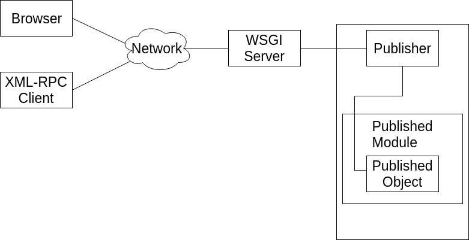

#################
Object Publishing
#################

Introduction
============

Zope puts your objects on the web. This is called **object
publishing**. One of Zope's unique characteristics is the way it
allows you to walk up to your objects and call methods on them with
simple URLs. In addition to HTTP, Zope makes your objects available
via XML-RPC.

In this chapter you'll find out exactly how Zope publishes objects.
You'll learn all you need to know in order to design your objects for
web publishing.

HTTP Publishing
===============

Zope 4 no longer ships with a builtin web server, so when you want
to interact with Zope via browser you have to setup a WSGI server.

.. note::

    For usage on a production server you will probably want to setup a
    reverse proxy in front of the WSGI server.

The WSGI server receives the request and hands it over to Zope, where
it is processed by *ZPublisher*, which is Zope's object publisher.
**ZPublisher** is a kind of light-weight ORB (Object Request
Broker). It takes the request and locates an object to handle the
request. The publisher uses the request URL as a map to locate the
published object. Finding an object to handle the request is called
**traversal**, since the publisher moves from object to object as it
looks for the right one. Once the published object is found, the
publisher calls a method on the published object, passing it
parameters as necessary. The publisher uses information in the
request to determine which method to call and what parameters to
pass. The process of extracting parameters from the request is called
**argument marshalling**. The published object then returns a response,
which is passed back to the WSGI server. Finally, the WSGI server
passes the response back to your web browser.

The publishing process is summarized in [2-1]

   2.1 Object publishing

Typically the published object is a persistent object that the
published module loads from the ZODB. See Chapter 6 for more
information on the ZODB.

This chapter will cover all the steps of object publishing in detail.

To summarize, object publishing consists of the main steps:

1. A request is sent to the publisher.

2. The publisher locates the published object using the request
   URL as a map.

3. The publisher calls the published object with arguments from
   the request.

4. The publisher interprets the results and passes them back.

The chapter will also cover all the technical details, special cases
and extra-steps that this list glosses over.

URL Traversal
-------------

Traversal is the process the publisher uses to locate the published
object. Typically the publisher locates the published object by
walking along the URL. Take for example a collection of objects::

      class Classification:
          ...

      class Animal:
          ...

          def screech(self, ...):
              ...

      vertebrates=Classification(...)
      vertebrates.mammals=Classification(...)
      vertebrates.reptiles=Classification(...)
      vertebrates.mammals.monkey=Animal(...)
      vertebrates.mammals.dog=Animal(...)
      vertebrates.reptiles.lizard=Animal(...)

This collection of objects forms an object hierarchy. Using Zope you
can publish objects with URLs. For example, the URL
http://zope/vertebrates/mammals/monkey/screech will traverse the
object hierarchy, find the *monkey* object and call its *screech*
method.

.. figure:: Figures/2-2.png

   2.2 Traversal path through an object hierarchy

The publisher starts from the root object and takes each step in the
URL as a key to locate the next object. It moves to the next object
and continues to move from object to object using the URL as a guide.

Typically the next object is a sub-object of the current object that
is named by the path segment. So in the example above, when the
publisher gets to the *vertebrates* object, the next path segment is
*mammals*, and this tells the publisher to look for a sub-object of
the current object with that name. Traversal stops when Zope comes to
the end of the URL. If the final object is found, then it is
published, otherwise an error is returned.

Now let's take a closer look at traversal.

Publishable Object Requirements
-------------------------------

Zope has few restrictions on publishable objects. The basic rule is
that the object must have been marked as zpublishable. This requirement goes for
methods, too.
An object or method is marked as zpublishable by decorating
its class (or a base class) or underlying function, respectively,
with the ``Zpublisher.zpublish`` decorator.
For backward compatibility, the existence of a docstring, too,
marks an object or method as zpublishable; but this will be removed in
the future.
If you decorate a method or class with ``zpublsh(False)``,
you explicitly mark it or its instances, respectively, as not
zpublishable.
If you decorate a method with ``zpublish(methods=...)``
where the `...` is either a single request method name
or a sequence of request method names,
you specify that the object is zpublishable only for the mentioned request
methods.

Another requirement is that a publishable object must not have a name
that begins with an underscore. These two restrictions are designed to
keep private objects from being published.

Finally, published objects cannot be Python modules.

Traversal Methods
-----------------

During traversal, *ZPublisher* cuts the URL into path elements
delimited by slashes, and uses each path element to traverse from the
current object to the next object. *ZPublisher* locates the next
object in one of three ways:

1. Using ``__bobo_traverse__``.

2. Using ``getattr``.

3. Using dictionary access.

First, the publisher attempts to call the traversal hook method
``__bobo_traverse__``. If the current object has this method it is
called with the request and the current path element. The method
should return the next object or ``None`` to indicate that a next
object can't be found. You can also return a tuple of objects from
``__bobo_traverse__`` indicating a sequence of sub-objects. This
allows you to add additional parent objects into the request. This is
almost never necessary.

Here's an example of how to use ``__bobo_traverse__``::

          def __bobo_traverse__(self, request, key):
              """Return subobjects depending on cookie contents."""
              if request.cookies.has_key('special'):
                  return self.special_subobjects.get(key, None)
              return self.normal_subobjects.get(key, None)

This example shows how you can examine the request during the
traversal process.

If the current object does not define a ``__bobo_traverse__`` method,
then the next object is searched for using ``getattr``. This locates
subobjects in the normal Python sense.

If the next object can't be found with ``getattr``, *ZPublisher* calls
on the current object as though it were a dictionary. Note: the path
element will be a string, not an integer, so you cannot traverse
sequences using index numbers in the URL.

For example, suppose ``a`` is the current object, and ``next`` is the
name of the path element. Here are the three things that *ZPublisher*
will try in order to find the next object:

  1. ``a.__bobo_traverse__("next")``

  2. ``a.next``

  3. ``a["next"]``

Publishing Methods
------------------

Once the published object is located with traversal, Zope *publishes*
it in one of three possible ways:

- Calling the published object -- If the published object is a
  function or method or other callable object, the publisher calls it.
  Later in the chapter you'll find out how the publisher figures out
  what arguments to pass when calling.

- Calling the default method -- If the published object is not
  callable, the publisher uses the default method. For HTTP *GET* and
  *POST* requests the default method is 'index_html'. For other HTTP
  requests such as *PUT* the publisher looks for a method named by the
  HTTP method. So for an HTTP *HEAD* request, the publisher would
  call the *HEAD* method on the published object.

- Stringifying the published object -- If the published object isn't
  callable, and doesn't have a default method, the publisher
  publishes it using the Python ``str`` function to turn it into a
  string.

After the response method has been determined and called, the
publisher must interpret the results.

Character Encodings for Responses
---------------------------------

If the published method returns an object of type *binary*, the
publisher will use it directly as the body of the response.

Things are different if the published method returns a unicode string,
because the publisher has to apply some character encoding. The
published method can choose which character encoding it uses by
setting a *Content-Type* response header which includes a *charset*
property (setting response headers is explained later in this
chapter). A common choice of character encoding is UTF-8, which is
also the default encoding.

If the *Content-Type* header does not include a charset or is not set
at all, the default encoding is set.

If you want to manually set a *Content-Type* header you have to set a
value like ``text/html; charset=UTF-8``.

HTTP Responses
--------------

Usually, the published method returns a string which is considered
the body of the HTTP response. The response headers can be controlled
by calling methods on the response object, which is described later in
the chapter.

.. note::

  When the return value is empty, e.g. an empty list, instead of
  returning an empty page, Zope issues a header with a 204 status code.

  Depending on the used client, it looks like nothing happens.

Controlling Base HREF
---------------------

When you publish an object that returns HTML relative links should
allow you to navigate between methods.

Consider this example::

  from ZPublisher import zpublish

  @zpublish
  class Example:
      """example class"""

      @zpublish
      def one(self):
          """render page one"""
          return """<html>
                    <head><title>one</title></head>
                    <body>
                    <a href="two">two</a>
                    </body>
                    </html>"""

      @zpublish
      def two(self):
          """render page two"""
          return """<html>
                    <head><title>two</title></head>
                    <body>
                    <a href="one">one</a>
                    </body>
                    </html>"""

However, the default method ``index_html`` presents a problem. Since
you can access ``index_html`` without specifying the method name in
the URL, relative links returned by ``index_html`` won't work right.

For example::

	    @zpublish
            class Example:
                """example class""""

		 @zpublish
                 def index_html(self):
                     """render default view"""
                    return """<html>
                              <head><title>one</title></head>
                              <body>
                              <a href="one">one</a> 
                              <a href="two">two</a>
                              </body>
                              </html>"""
                 ...

If you publish an instance of the *Example* class with the URL
'http://zope/example', then the relative link to method ``one`` will
be 'http://zope/one', instead of the correct link,
'http://zope/example/one'.

Zope solves this problem for you by inserting a *base* tag between the
*head* tags in the HTML output of ``index_html`` when it is accessed
as the default method. You will probably never notice this, but if you
see a mysterious *base* tag in your HTML output, you know where it
came from. You can avoid this behavior by manually setting your own
base with a *base* tag in your ``index_html`` method output.

Response Headers
----------------

The publisher and the web server take care of setting response headers
such as *Content-Length* and *Content-Type*. Later in the chapter
you'll find out how to control these headers and also how exceptions
are used to set the HTTP response code.

Pre-Traversal Hook
------------------

The pre-traversal hook allows your objects to take special action
before they are traversed. This is useful for doing things like
changing the request. Applications of this include special
authentication controls and virtual hosting support.

If your object has a method named ``__before_publishing_traverse__``,
the publisher will call it with the current object and the request
before traversing your object. Most often your method will change the
request. The publisher ignores anything you return from the
pre-traversal hook method.

The ``ZPublisher.BeforeTraverse`` module contains some functions that
help you register pre-traversal callbacks. This allows you to perform
fairly complex callbacks to multiple objects when a given object is
about to be traversed.

Traversal and Acquisition
-------------------------

.. note::

  Simply put, acquisition means that a Zope object can acquire any
  attribute of its parents.

  For detailed information about acquisition please refer to chapter 7.

Acquisition affects traversal in several ways. The most obvious
way is in locating the next object in a path. As we discussed earlier,
the next object during traversal is often found using ``getattr``.
Since acquisition affects ``getattr``, it will affect traversal. The
upshot is that when you are traversing objects that support implicit
acquisition, you can use traversal to walk over acquired objects.

Consider the the following object hierarchy::

        from Acquisition import Implicit
	from ZPublisher import zpublish

	@zpublish
        class Node(Implicit):
            ...

        fruit=Node()
        fruit.apple=Node()
        fruit.orange=Node()
        fruit.apple.strawberry=Node()
        fruit.orange.banana=Node()

When publishing these objects, acquisition can come into play. For
example, consider the URL */fruit/apple/orange*. The publisher would
traverse from *fruit*, to *apple*, and then using acquisition, it
would traverse to *orange*.

Mixing acquisition and traversal can get complex. In general you
should limit yourself to constructing URLs which use acquisition to
acquire along containment, rather than context lines.

It's reasonable to publish an object or method that you acquire from
your container, but it's probably a bad idea to publish an object or
method that your acquire from outside your container.

For example::

        from Acquisition import Implicit
	from ZPublisher import zpublish

	@zpublish
        class Basket(Implicit):
            ...
	    @zpublish
            def number_of_items(self):
                """Returns the number of contained items."""
                ...

	@zpublish
        class Vegetable(Implicit):
            ...
	    @zpublish
            def texture(self):
                """Returns the texture of the vegetable."""

	@zpublish
        class Fruit(Implicit):
            ...
	    @zpublish
            def color(self):
                """Returns the color of the fruit."""

         basket=Basket()
         basket.apple=Fruit()
         basket.carrot=Vegetable()

The URL */basket/apple/number_of_items* uses acquisition along
containment lines to publish the ``number_of_items`` method (assuming
that *apple* doesn't have a ``number_of_items`` attribute). However,
the URL */basket/carrot/apple/texture* uses acquisition to locate the
``texture`` method from the *apple* object's context, rather than from
its container. While this distinction may be obscure, the guiding
idea is to keep URLs as simple as possible. By keeping acquisition
simple and along containment lines your application increases in
clarity, and decreases in fragility.

A second usage of acquisition in traversal concerns the request. The
publisher tries to make the request available to the published object
via acquisition. It does this by wrapping the first object in an
acquisition wrapper that allows it to acquire the request with the
name 'REQUEST'.

This means that you can normally acquire the request
in the published object like so::

        request=self.REQUEST  # for implicit acquirers

or like so::

        request=self.aq_acquire('REQUEST')  # for explicit acquirers

Of course, this will not work if your objects do not support
acquisition, or if any traversed objects have an attribute named
'REQUEST'.

Finally, acquisition has a totally different role in object
publishing related to security which we'll examine next.

Traversal and Security
----------------------

As the publisher moves from object to object during traversal it makes
security checks. The current user must be authorized to access each
object along the traversal path. The publisher controls access in a
number of ways. For more information about Zope security, see chapter
8 "Security".

Basic Publisher Security
------------------------

The publisher imposes a few basic restrictions on traversable objects.
These restrictions are the same of those for publishable objects. As
previously stated, publishable objects must have doc strings and must
not have names beginning with underscore.

The following details are not important if you are using the Zope
framework. However, if your are publishing your own modules, the rest
of this section will be helpful.

The publisher checks authorization by examining the ``__roles__``
attribute of each object as it performs traversal. If present, the
``__roles__`` attribute should be ``None`` or a list of role names. If
it is ``None``, the object is considered public. Otherwise the access to
the object requires validation.

Some objects such as functions and methods historically did not support
creating attributes. Consequently, if the object has no ``__roles__``
attribute, the publisher will look for an attribute on the object's
parent with the name of the object followed by ``__roles__``.
For example, a function named ``getInfo`` would store its roles in its
parent's ``getInfo__roles__`` attribute.

If an object has a ``__roles__`` attribute that is not empty and not
``None``, the publisher tries to find a user database to authenticate
the user. It searches for user databases by looking for an
``__allow_groups__`` attribute, first in the published object, then in
the previously traversed object, and so on until a user database is
found.

When a user database is found, the publisher attempts to validate the
user against the user database. If validation fails, then the
publisher will continue searching for user databases until the user
can be validated or until no more user databases can be found.

The user database may be an object that provides a validate
method::

  validate(request, http_authorization, roles)

where ``request`` is a mapping object that contains request information,
``http_authorization`` is the value of the *HTTP Authorization* header
or ``None`` if no authorization header was provided, and ``roles`` is a
list of user role names.

The validate method returns a user object if succeeds, and ``None`` if
it cannot validate the user. See Chapter 8 for more information on
user objects. Normally, if the validate method returns ``'None``, the
publisher will try to use other user databases, however, a user
database can prevent this by raising an exception.

If validation fails, Zope will return an HTTP header that causes your
browser to display a user name and password dialog.

If validation succeeds the publisher assigns the user object to the
request variable ``AUTHENTICATED_USER``. The publisher places no
restrictions on user objects.

Zope Security
-------------

The publisher uses acquisition to locate user folders and perform
security checks.
The upshot of this is that your published objects must inherit from
``Acquisition.Implicit`` or ``Acquisition.Explicit``.

.. note::
  For more information on *Acquisition*, visit one of the following
  resources:

  - chapter 7 "Acquisition" of this Zope Developer's Guide
  - chapter 8
    `"Acquisition" <https://zope.readthedocs.io/en/latest/zopebook/Acquisition.html>`_
    of *The Zope Book*
  - the excellent
    `readme <https://github.com/zopefoundation/Acquisition>`__
    of the "Acquisition" package

Also, when traversing, each object must be returned in an acquisition
context.
This is done automatically when traversing via ``getattr``, but you
must wrap traversed objects manually when using ``__getitem__`` and
``__bobo_traverse__``.

For example::

          class Example(Acquisition.Explicit):
              ...

              def __bobo_traverse__(self, name, request):
                  ...
                  next_object=self._get_next_object(name)
                  return  next_object.__of__(self)

Finally, traversal security can be circumvented with the
``__allow_access_to_unprotected_subobjects__`` attribute as described
in Chapter 8, "Security".

Calling the Published Object
----------------------------

The publisher marshals arguments from the request and automatically
makes them available to the published object. This allows you to
accept parameters from web forms without having to parse the
forms. Your objects usually don't have to do anything special to be
called from the web.

Consider this function::

      @zpublish
      def greet(name):
          """Greet someone by name."""
          return "Hello, %s!" % name

You can provide the ``name`` argument to this function by calling it
with a **URL** like ``greet?name=World``. You can also call it with a **HTTP
POST request** which includes ``name`` as a form variable.

In the next sections we'll take a closer look at how the publisher
marshals arguments.

Marshalling Arguments from the Request
--------------------------------------

Zope responds to requests, specified via URL, request headers
and an optional request body. A URL consists of
various parts, among them a *path* and a *query*, see
`RFC 2396 <https://www.ietf.org/rfc/rfc2396.txt>`_ for details.

Zope uses the *path* to locate an object, method or view for
producing the response (this process is called *traversal*)
and *query* - if present - as a specification for
request parameters. Additionally, request parameters can come from
the optional request body.

Zope preprocesses the incoming request information and makes
the result available in the so called *request* object.
This way, the response generation code can access all relevant request
information in an easy and natural (pythonic) way.
Preprocessing transforms the request *parameters* into request (or form)
*variables*.
They are made available via the request object's ``form`` attribute
(a ``dict``) or directly via the request object itself, as long as they are
not hidden by other request information.

The request parameters coming from the *query* have the form
*name*\ ``=``\ *value* and are separated by ``&``;
request parameters from a request body can have different forms
and can be separated in different ways dependent on the
request ``Content-Type``, but they, too, have a *name* and a *value*.

All request parameter names and values are strings.
A parameter value, however, often designates a value of a specific type,
e.g. an integer or a datetime. The response generating code can
be simplified significantly when it does not need to make the
type conversion itself. In addition, in some cases the request parameters
are not independent from one another but related. In those
cases it can help if the related parameters
are aggregated into a single object. Zope supports both cases but it needs
directives to guide the process. It uses *name* suffixes of the form
``:``\ *directive* to specify such directives. For example,
the parameter ``i:int=1`` tells Zope to convert the value ``'1'`` to an
integer and use it as value for request variable ``i``; the parameter sequence
``x.name:record=Peter&x.age:int:record=10`` tells Zope to construct
a record ``x`` with attributes ``name`` and ``age`` and respective values
``'Peter'`` and ``10``.

The publisher also marshals arguments from CGI environment variables
and cookies. When locating arguments, the publisher first looks in
other (i.e. explicitly set or special) request variables,
then CGI environment variables, then form
variables, and finally cookies. Once a variable is found, no further
searching is done. So for example, if your published object expects
to be called with a form variable named ``SERVER_URL``, it will fail,
since this argument will be marshalled from the CGI environment first,
before the form data.

The publisher provides a number of additional special variables such
as ``URL``, ``URLn``, ``BASEn`` and others, which are derived from the
request.

Unfortunately, there is no current documentation for those variables.

Argument Conversion
~~~~~~~~~~~~~~~~~~~

The publisher supports argument conversion. For example consider this
function::

	@zpublish
        def one_third(number):
            """returns the number divided by three"""
            return number / 3.0

This function cannot be called from the web because by default the
publisher marshals arguments into strings, not numbers. This is why
the publisher provides a number of converters. To signal an argument
conversion you name your form variables with a colon followed by a
type conversion code.

For example, to call the above function with 66 as the argument you
can use this URL ``one_third?number:int=66``.

Some converters employ special logic for the conversion.
For example, both ``tokens`` as well as ``lines`` convert to
a list of strings but ``tokens`` splits the input at whitespace, ``lines``
at newlines.

The publisher supports many converters:

- **boolean** -- Converts a variable to ``True`` or ``False``.
  Variables that are  0, None, an empty string, or an empty sequence
  are ``False``, all others are ``True``.

- **int** -- Converts a variable to a Python integer. Also converts a
  list/tuple of variables to a list/tuple of integers.

- **long** -- Converts a variable to a Python integer. Strips the
  trailing "L" symbol at the end of the value. Also converts a
  list/tuple of variables to a list/tuple of integers.

- **float** -- Converts a variable to a Python floating point number.
  Also converts a list/tuple of variables to a list/tuple of floats.

- **string** -- Converts a variable to a native string. So the result
  is ``str``, no matter which Python version you are on.

- **ustring** -- Converts a variable to a Python unicode string.

- **bytes** -- Converts a variable to a Python bytes object/string.

- **required** -- Raises an exception if the variable is not present or
  is an empty string.

- **date** -- Converts a string to a **DateTime** object. The formats
  accepted are fairly flexible, for example ``10/16/2000``, ``12:01:13
  pm``.

- **date_international** -- Converts a string to a **DateTime** object,
  but especially treats ambiguous dates as "days before month before
  year". This useful if you need to parse non-US dates.

- **lines** -- Converts a variable to a Python list of native strings
  by splitting the string on line breaks. Also converts list/tuple of
  variables to list/tuple of native strings.

- **tokens** -- Converts a variable to a Python list of native strings
  by splitting the variable on whitespace.

- **text** -- Converts a variable to a native string with normalized line
  breaks. Different browsers on various platforms encode line
  endings differently, so this converter makes sure the line endings
  are consistent, regardless of how they were encoded by the browser.

- **ulines**, **utokens**, **utext** -- like **lines**, **tokens**,
  **text**, but always converts into unicode strings.

.. note::
  Please note that the above listed **unicode converters** are deprecated,
  and will be removed in Zope 6.

The full list of supported converters can be found
in ``ZPublisher.Converters.type_converters``.

If the publisher cannot coerce a request parameter into the type
required by the type converter it will raise an error. This is useful
for simple applications, but restricts your ability to tailor error
messages. If you wish to provide your own error messages, you should
convert arguments manually in your published objects rather than
relying on the publisher for coercion.

.. note::
  Client-side validation with HTML 5 and/or JavaScript may improve
  the usability of the application, but it is never a replacement for
  server side validation.

You can combine type converters to a limited extent. For example you
could create a list of integers like so::

        <input type="checkbox" name="numbers:list:int" value="1">
        <input type="checkbox" name="numbers:list:int" value="2">
        <input type="checkbox" name="numbers:list:int" value="3">

Create and register a custom converter
++++++++++++++++++++++++++++++++++++++

If you need a custom converter, you can create one on your own and register
it as follows::

        from ZPublisher.Converters import field2bytes, type_converters

        def field2bytelines(v)
            if isinstance(v, (list, tuple)):
                return [field2bytes(item) for item in v]
            return field2bytes(v).splitlines()

        type_converters['bytelines'] = field2bytelines

Aggregators
~~~~~~~~~~~

An aggregator directive tells Zope how to process parameters with the same or
a similar name.

Zope supports the following aggregators:

- **list** -- collect all values with this name into a list.
  If there are two or more parameters with the same name
  they are collected into a list by default.
  The ``list`` aggregator is mainly used to ensure that
  the parameter leads to a list value even in the case that
  there is only one of them.

- **tuple** -- collect all values with this name into a tuple.

- **default** -- use the value of this parameter as a default value; it
  can be overridden by a parameter of the same name without
  the ``default`` directive.

- **record** -- this directive assumes that the parameter name starts
  with *var*\ ``.``\ *attr*.
  It tells Zope to create a request variable *var* of type record
  (more precisely, a ``ZPublisher.HTTPRequest.record`` instance) and
  set its attribute *attr* to the parameter value.
  If such a request variable already exists,
  then only its attribute *attr* is updated.

- **records** -- this directive is similar to ``record``. However, *var*
  gets as value not a single record but a list of records.
  Zope starts a new record (and appends it to the list)
  when the current request parameter would override an attribute
  in the last record of the list constructed so far (or this list
  is empty).

- **ignore_empty** -- this directive causes Zope to ignore the parameter
  if its value is empty.

An aggregator in detail: the `record` argument
++++++++++++++++++++++++++++++++++++++++++++++

Sometimes you may wish to consolidate form data into a structure
rather than pass arguments individually. **Record arguments** allow you
to do this.

The ``record`` type converter allows you to combine multiple form
variables into a single input variable. For example::

  <input name="date.year:record:int">
  <input name="date.month:record:int">
  <input name="date.day:record:int">

This form will result in a single variable, ``date``, with the
attributes ``year``, ``month``, and ``day``.

You can skip empty record elements with the ``ignore_empty`` converter.
For example::

  <input type="text" name="person.email:record:ignore_empty">

When the email form field is left blank the publisher skips over the
variable rather than returning an empty string as its value. When the
record ``person`` is returned it will not have an ``email`` attribute
if the user did not enter one.

You can also provide default values for record elements with the
``default`` converter. For example::

  <input type="hidden"
         name="pizza.toppings:record:list:default"
         value="All">
  <select multiple name="pizza.toppings:record:list:ignore_empty">
    <option>Cheese</option>
    <option>Onions</option>
    <option>Anchovies</option>
    <option>Olives</option>
    <option>Garlic<option>
  </select>

The ``default`` type allows a specified value to be inserted when the
form field is left blank. In the above example, if the user does not
select values from the list of toppings, the default value will be
used. The record ``pizza`` will have the attribute ``toppings`` and its
value will be the list containing the word "All" (if the field is
empty) or a list containing the selected toppings.

You can even marshal large amounts of form data into multiple records
with the ``records`` type converter. Here's an example::

  <h2>Member One</h2>
  Name:
  <input type="text" name="members.name:records"> 
  Email:
  <input type="text" name="members.email:records"> 
  Age:
  <input type="text" name="members.age:int:records"> 

  <h2>Member Two</h2>
  Name:
  <input type="text" name="members.name:records"> 
  Email:
  <input type="text" name="members.email:records"> 
  Age:
  <input type="text" name="members.age:int:records"> 

This form data will be marshalled into a list of records named
``members``. Each record will have a ``name``, ``email``, and ``age``
attribute.

Record marshalling provides you with the ability to create complex
forms. However, it is a good idea to keep your web interfaces as
simple as possible.

.. note::

  Records do not work with input fields of type radio as you might
  expect, as all radio fields with the same name are considered as one
  group - even if they are in different records. That means, activating
  one radio button will also deactivate all other radio buttons from
  the other records.

.. attention::

    When using records please note that there is a known issue when
    you use a form, where checkboxes are used in the first "column".

    As browsers leave out empty checkboxes when sending a request, the
    **object publisher** may not be able to match checked checkboxes
    with the correct record.

    This behaviour cannot not be fixed.

    If you want a checkbox as the first form field, you can work
    around the problem by using a hidden input field.

    **Code example with applied workaround**::

      <form action="records_parse">
          

          <input type="hidden" name="index.dummy:records" value="dummy" />
          <input type="checkbox" name="index.enabled:records" value="1" checked="checked" />
          <input type="text" name="index.name:records" value="index 1" />
          

          <input type="hidden" name="index.dummy:records" value="dummy" />
          <input type="checkbox" name="index.enabled:records" value="2" />
          <input type="text" name="index.name:records" value="index 2" />
          

          <input type="submit" name="submit" value="send" />
      </form>

Specifying argument character encodings
~~~~~~~~~~~~~~~~~~~~~~~~~~~~~~~~~~~~~~~

An encoding directive tells the converting process the encoding
of the parameter value. Typical encodings are e.g. "utf8" or  "latin1".

An encoding directive is ignored if the parameter does not
have a converter directive as well.
If there is no encoding directive, the converter uses the
default encoding as specified by the Zope configuration option
``zpublisher-default-encoding``. The default value for this configuration
option in Zope 4 is ``utf-8``.

In principle, Zope supports any encoding known by the ``codecs``
module. However, the converter may impose restrictions.

**Special cases**

If your pages use a different encoding,
such as ``Windows-1252`` or ``ISO-8859-1``, which was the default
encoding for HTML 4, you have to add the encoding, eg ``:cp1252``, for
all argument type converts, such as follows::

    <input type="text" name="name:cp1252:ustring">
    <input type="checkbox" name="numbers:list:int:cp1252" value="1">
    <input type="checkbox" name="numbers:list:int:cp1252" value="1">

.. note::

    For a full list of supported encodings, please have a look at:

    https://docs.python.org/3/library/codecs.html#standard-encodings

If your pages all use a character encoding which has ASCII as a subset,
such as Latin-1, UTF-8, etc., then you do not need to specify any
character encoding for boolean, int, long, float and date types.

.. note::

    The **form submission encoding** can be overridden by the
    ``accept-charset`` attribute of the ``form`` tag:

    https://www.w3.org/TR/html5/sec-forms.html#selecting-a-form-submission-encoding

Method Arguments
~~~~~~~~~~~~~~~~

Normally, a request parameter is transformed into a request variable
and made available via the ``form`` attribute of the request object. The
*method* directive tells Zope to extend the path used for traversal.

You can use a `method` directive to control which object is published based on
form data. For example, you might want to have a form with a select
list that calls different methods depending on the item chosen.
Similarly, you might want to have multiple submit buttons which invoke
a different method for each button.

The publisher provides a way to select methods using form variables
through the use of the ``method`` argument type. The method type allows
the request variable ``PATH_INFO`` to be augmented using information
from a form item's name or value.

If the name of a form field is ``:method``, then the value of the field
is added to ``PATH_INFO``. For example, if the original ``PATH_INFO``
is ``foo/bar`` and the value of a ``:method`` field is ``x/y``, then
``PATH_INFO`` is transformed to ``foo/bar/x/y``. This is useful when
presenting a select list. Method names can be placed in the select
option values.

If the name of a form field **ends** in ``:method`` then the part of
the name before ``:method`` is added to ``PATH_INFO``. For example, if
the original ``PATH_INFO`` is ``foo/bar`` and there is a ``x/y:method``
field, then ``PATH_INFO`` is transformed to ``foo/bar/x/y``. In this
case, the form value is ignored. This is useful for mapping submit
buttons to methods, since submit button values are displayed and
should therefore not contain method names.

Zope supports the following method directives:
``method`` (synonym ``action``), and ``default_method``
(synonym ``default_action``). A path extension specified by a
``default_method`` directive is overridden by a ``method`` directive.

Processing model for request data marshaling
~~~~~~~~~~~~~~~~~~~~~~~~~~~~~~~~~~~~~~~~~~~~
Zope processes the request parameters in
``ZPublisher.HTTPRequest.HTTPRequest.processInputs``.

This section describes the complex processing model in some detail as its
various steps and peculiar logic may lead to surprises. If you are developing
`with` Zope as opposed to developing Zope itelf, you may skip over these
details.

In a preliminary step the request parameters are collected
from the potential sources, i.e. the "query" and
request body (if present), and normalized. The result is a sequence of
name/value pairs, each describing a single request parameter.

Zope then sets up some variables:

form
  as target for the collected form variables

defaults
  as target for the collected form variable defaults

tuple_items
  to remember which form variable should be tuples

method
  as target for the path extension from method directives.

It then loops over the request parameter sequence.

For each request parameter, the processing consists of the following steps:

1. Some variables are set up:

   isFileUpload
     does the parameter represent an uploaded file?

   converter_type
     the most recently seen converter from a converter directive

   character_encoding
     the most recently seen encoding from an encoding directive

   flags
     to indicate which processing types are requested via directives

     Processing types are "ignore", "aggregate as sequence",
     "aggregate as record", "aggregate as records", "use as default",
     "convert" (using ``converter_type`` and ``character_encoding``).

2. The parameter value is checked to see if it is a file upload.
   In this case, it is wrapped into a ``FileUpload``, and ``isFileUpload``
   is updated.

3. All directives in the paramter name are examined from right to left
   and the variables set up in step 1 are updated accordingly.
   ``:tuple`` directives update ``flags`` and ``tuple_items``, and method
   directives update ``flags`` and ``method``.

4. The actions stored in ``flags`` during step 3 are executed.

   If ``flags`` indicate the use as default, the step operates
   on ``defaults``, otherwise on ``form``.

After all request parameters have been processed
request variables from ``defaults`` are put into ``form`` as long as it
does not contain that variable already.
If a method directive has been encountered the traversal
path is extended accordingly.

As a security measure, mainly for DTML use, request variables
are not only made available in the request attribute ``form``.
A (somewhat) secured version of them is also stored in
the attribute ``taintedform``. In the *tainted* request variable
variant, strings potentially containing HTML fragments use
``TaintedString`` as data type rather than the normal ``str``.
DTML will automatically quote those values to give some
protection against cross site scripting attacks via HTML injection.
With the more modern page templates, all values (not only tainted ones)
are quoted by default. They typically do not use the tainted
form of the request variables.

Known issues and caveats
~~~~~~~~~~~~~~~~~~~~~~~~

1. There is almost no error handling:

   - unrecognized directives are silently ignored

   - if a request parameter contains several converter directives, the
     leftmost wins

   - if a request paramter contains several encoding directives, the
     leftmost wins

   - if a request parameter contains an encoding but no converter
     directive, the encoding directive is silently ignored

   - some directive combinations do not make sense (e.g. ``:record:records``);
     for them, some of the directives are silently ignored

2. Usually, the order of aggregator directives in a request parameter does
   not matter. However, this is not the case for the ``:tuple`` directive.
   To really produce a tuple request variable, it must be the left most
   directive; otherwise, it is equivalent to ``:list``.

   In addition, ``:tuple`` is always equivalent to ``:list`` for
   request variables aggregated as record or sequence of records.

3. The main use case for the ``:default`` directive is to provide a
   default value for form controls (e.g. checkboxes) for which the browser may
   or may not pass on a value when the form is submitted.
   Unfortunately, this only works at the top level.
   It does not work for subcomponents, e.g. an attribute of a "record".
   As a consequence, if a request parameter combines ``:default`` with
   another aggregator directive, the result may be unexpected.

4. The request preprocessing happens at a very early stage, before
   traversal has taken place. As a consequence,
   important configuration for application specific error handling
   may not yet have taken effect. Exceptions raised during this stage
   are reported and tracked only via "root level" error handling.
   For the reason it is typically better to use a form framework such as
   ``z3c.form`` or ``zope.formlib`` for form processing
   rather than the built-in features described in this document.

Exceptions
----------

When the object publisher catches an unhandled exception, it tries to
match it with a set of predefined exceptions coming from the
**zExceptions** package, such as **HTTPNoContent**, **HTTPNotFound**,
**HTTPUnauthorized**.

If there is a match, the exception gets upgraded to the matching
**zException**, which then results in a proper response returned to the
browser, including an appropriate HTTP status code.

.. note::

     For a full list of exceptions please directly refer to the
     implemented exception classes within the
     `zExceptions package
     <https://github.com/zopefoundation/zExceptions/blob/master/src/zExceptions/__init__.py>`_.

.. attention::

    When you create a custom exception, please make sure not to inherit
    from **BaseException**, but from **Exception** or one of its child
    classes, otherwise you'll run into an exception in waitress.

.. note::

    Beginning with Zope 4, a standard installation no longer comes with
    a ``standard_error_message``.

    There are two ways to catch and render an exception:

    - create a ``standard_error_message``, which can be a **DTML Method**, **DTML Document**, **Script (Python)** or **Page Template**
    - create an ``exception view``, see blog post `Catching and rendering exceptions <https://blog.gocept.com/2017/10/24/zope4-errorhandling/>`_

If the exception is not handled, it travels up the WSGI stack.

What happens then depends entirely on the possibly installed WSGI
middleware or the WSGI server. By default Zope uses **waitress**
and by default **waitress** returns an error message as follows::

  Internal Server Error

  The server encountered an unexpected internal server error

  (generated by waitress)

.. note:: **Further information:**

    `Debugging Zope applications under WSGI
    <https://zope.readthedocs.io/en/latest/operation.html#debugging-zope-applications-under-wsgi>`_

Exceptions and Transactions
~~~~~~~~~~~~~~~~~~~~~~~~~~~

When Zope receives a request it begins a transaction. Then it begins
the process of traversal. Zope automatically commits the transaction
after the published object is found and called. So normally each web
request constitutes one transaction which Zope takes care of for you.

If an unhandled exception is raised during the publishing process,
Zope aborts the transaction.
When a **ConflictError** occurs, Zope retries the request up to three
times by default. You can change that number in the **zope.conf** by
adding a ``max_conflict_retries`` directive.

.. note::

  For further information on transactions please refer to chapter 6
  `ZODB Persistent Components <https://zope.readthedocs.io/en/latest/zdgbook/ZODBPersistentComponents.html>`_.

Manual Access to Request and Response
-------------------------------------

Normally published objects access the request and response by listing
them in the signature of the published method. If this is not
possible you can usually use acquisition to get a reference to the
request. Once you have the request, you can always get the response
from the request like so::

  response=REQUEST.RESPONSE

The APIs of request and response can be looked up in the source code.

We'll look at a few common uses of the request and response. If you
need access to the complete API, please directly refer to the source
code.

One reason to access the request is to get more precise information
about form data. As we mentioned earlier, argument marshalling comes
from a number of places including cookies, form data, and the CGI
environment. For example, you can use the request to differentiate
between form and cookie data::

  cookies = REQUEST.cookies # a dictionary of cookie data
  form = REQUEST.form # a dictionary of form data

One common use of the response object is to set response headers.
Normally the publisher in concert with the web server will take care
of response headers for you. However, sometimes you may wish manually
control headers::

  RESPONSE.setHeader('Pragma', 'No-Cache')

Another reason to access the response is to stream response data. You
can do this with the ``write`` method::

  while 1:
      data=getMoreData() #this call may block for a while
      if not data:
          break
      RESPONSE.write(data)

Here's a final example that shows how to detect if your method is
being called from the web. Consider this function::

  def calculate(data, REQUEST=None):
      ...
      result = ...
      if REQUEST is not None:
          REQUEST.RESPONSE.setHeader("Content-Type", "text/html")
          return "<html>
Result: %s 
</html>" % result
      return result

The ``calculate`` function can be called from Python, and also from
the web. By including ``REQUEST=None`` in the signature you can
differentiate between being called from Python and being called form
the web.

Other Network Protocols
=======================

XML-RPC
-------

**XML-RPC** is a light-weight remote procedure call (RPC) protocol
that uses **XML** to encode its calls and **HTTP** as a transport
mechanism.

All objects in Zope support XML-RPC publishing. Generally you will
select a published object as the end-point and select one of its
methods as the method. For example you can call the ``getId`` method
on a Zope folder at ``http://example.com/myfolder`` like so::

  from xmlrpc.client import ServerProxy as proxy
  folder = proxy("http://example.com/myfolder")
  folder_id = folder.getId()

You can also do traversal via a dot notation.

For example::

  from xmlrpc.client import ServerProxy as proxy

  # traversal via dotted method name
  app = proxy("http://example.com/app")
  id1 = app.folderA.folderB.getId()

  # walking directly up to the published object
  folderB = proxy("http://example.com/app/folderA/folderB")
  id2 = folderB.getId()

  print(id1 == id2)

This example shows different routes to the same object publishing
call.

XML-RPC supports marshalling of basic Python types for both publishing
requests and responses. The upshot of this arrangement is that when
you are designing methods for use via XML-RPC you should limit your
arguments and return values to simple values such as Python strings,
lists, numbers and dictionaries. You should not accept or return Zope
objects from methods that will be called via XML-RPC.

.. note::

  **XML-RPC** does not support keyword arguments.

Summary
=======

Object publishing is a simple and powerful way to bring objects to the
web. Two of Zope's most appealing qualities is how it maps objects to
URLs, and you don't need to concern yourself with web plumbing. If
you wish, there are quite a few details that you can use to customize
how your objects are located and published.
