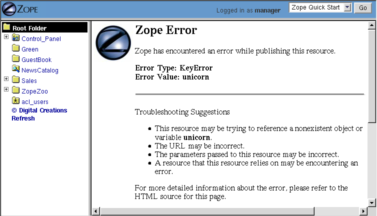
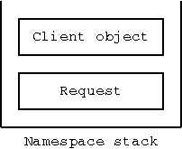
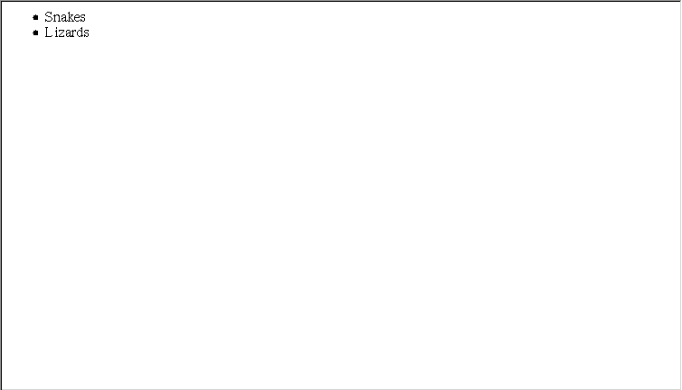
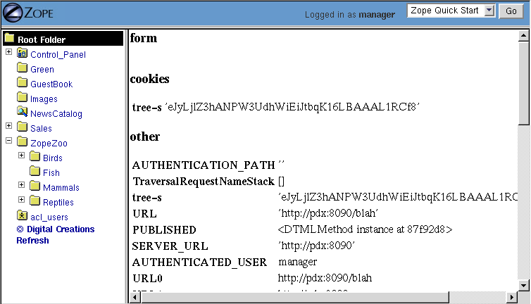
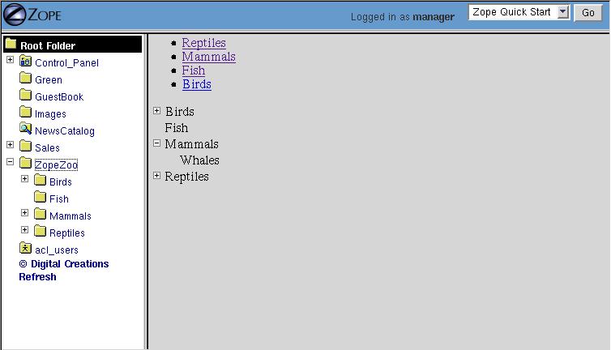
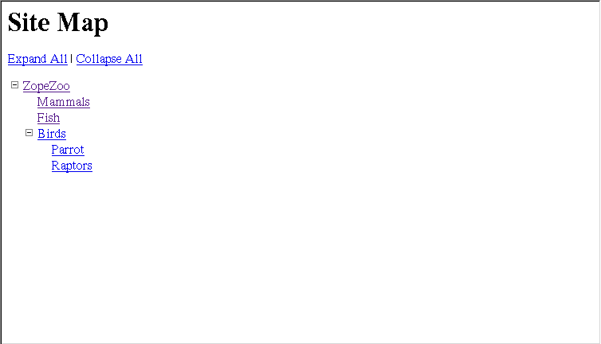

Advanced DTML
=============

.. include:: includes/zope2_notice.rst

DTML is the kind of language that appears to "do what you mean."
That is good when it does what you actually want it to do, but when
it does something you don't want to do, well, it's no fun at all.
This chapter tells you how to make DTML do what you *really* mean.
When you're done reading this chapter you will be able to write DTML
that will accomplish a number of complex tasks including:

- Inspect and Modify the REQUEST object

- Modify the current namespace

- Call other scripts from within DTML

- Send email with or without MIME attachments

- Handle exceptions within DTML    

A few of caveats before getting started:

- It's a good idea to know something about Python before diving into
  advanced DTML or any other advanced area of Zope.

- Understand the Zope acquisition model and how it works.

- If you are writing very complex functionality in DTML, consider
  using a Python Script.  This will ease maintenance, not to mention
  readability.

- Understand the difference between a DTML Document and a DTML
  Method before embarking on building a huge site. See the explanation
  included in this chapter.

It's no lie that DTML has a reputation for complexity.  While it is true
that DTML is really simple if all you want to do is simple layout,
using DTML for more advanced tasks requires an understanding of where 
DTML variables come from.

Here's a very tricky error that almost all newbies encounter.
Imagine you have a DTML Document called *zooName*.  This
document contains an HTML form like the following::

  <dtml-var standard_html_header>

    <dtml-if zooName>

      
<dtml-var zooName>

    <dtml-else>

      <form action="<dtml-var URL>" method="GET">
        <input name="zooName">
        <input type="submit" value="What is zooName?">
      </form>

    </dtml-if>  

  <dtml-var standard_html_footer>

This looks simple enough, the idea is, this is an HTML page that calls
itself.  This is because the HTML action is the *URL* variable, which
will become the URL of the DTML Document.  

If there is a 'zooName' variable, then the page will print it, if there
isn't, it shows a form that asks for it.  When you click submit, the data
you enter will make the "if" evaluate to true, and this code should print
what was entered in the form.

But unfortunately, this is one of those instances where DTML will not do
what you mean, because the name of the DTML Document that contains this
DTML is also named *zooName*, and it doesn't use the variable out of the
request, it uses itself, which causes it to call itself and call itself, ad
infinitum, until you get an "excessive recursion" error.  So instead of
doing what you really meant, you got an error. This is what confuses
beginners.  In the next couple of sections, we'll show you how to fix this
example to do what you mean.

How Variables are Looked up
---------------------------

There are actually two ways to fix the DTML error in the
*zooName* document.  The first is that you can rename the document
to something like *zopeNameFormOrReply* and always remember this
special exception and never do it; never knowing why it happens.
The second is to understand how names are looked up, and to be
explicit about where you want the name to come from in the
*namespace*.

The DTML namespace is a collection of objects arranged in a *stack*.  A
stack is a list of objects that can be manipulated by *pushing* and
*popping* objects on to and off of the stack. 

When a DTML Document or DTML Method is executed, Zope creates a
DTML namespace to resolve DTML variable names. It's important to
understand the workings of the DTML namespace so that you can
accurately predict how Zope will locate variables. Some of the
trickiest problems you will run into with DTML can be resolved by
understanding the DTML namespace.

When Zope looks for names in the DTML namespace stack it first looks at
the topmost object in the stack.  If the name can't be found
there, then the next item down is introspected.  Zope will work its way
down the stack, checking each object in turn until it finds the name
that it is looking for.

If Zope gets all the way down to the bottom of the stack and
can't find what it is looking for, then an error is generated.  For
example, try looking for the non-existent name, *unicorn*::

  <dtml-var unicorn>

As long as there is no variable named *unicorn* viewing this
DTML will return an error, as shown in the figure below.

   DTML error message indicating that it cannot find a variable

But the DTML stack is not all there is to names because DTML
doesn't start with an empty stack, before you even begin executing
DTML in Zope there are already a number of objects pushed on the
namespace stack.

DTML Namespaces
---------------

DTML namespaces are built dynamically for every request in Zope. When
you call a DTML Method or DTML Document through the web, the DTML
namespace starts with the same first two stack elements; the client
object and the request, as shown in the figure below.

   Initial DTML namespace stack

The client object is the first object on the top of the DTML namespace
stack when entering a transaction (note:  commands exist to push 
additional parameters onto the namespace stack during a thread of 
execution).  What the client object is depends on whether you are
executing a DTML Method or a DTML Document.  In our example above, this
means that the client object is named *zooName*.  Which is why it
breaks.  The form input that we really wanted comes from the web
request, but the client is looked at first.

The request namespace is always on the bottom of the DTML namespace
stack, and is therefore the last namespace to be looked in for names.
This means that we must be explicit in our example about which
namespace we want.  We can do this with the DTML 'with' tag::

  <dtml-var standard_html_header>

    <dtml-with REQUEST only>
      <dtml-if zooName>
        
<dtml-var zooName>

      <dtml-else>
        <form action="<dtml-var URL>" method="GET">
          <input name="zooName">
          <input type="submit" value="What is zooName?">
        </form>
      </dtml-if>
    </dtml-with>

  <dtml-var standard_html_footer>

Here, the with tag says to look in the 'REQUEST' namespace, and *only*
the 'REQUEST' namespace, for the name "zooName".

DTML Client Object  
~~~~~~~~~~~~~~~~~~

The client object in DTML depends on whether or not you are executing a
DTML Method or a DTML Document.  In the case of a Document, the client
object is always the document itself, or in other words, a DTML
Document is its own client object.

A DTML Method however can have different kinds of client objects
depending on how it is called.  For example, if you had a DTML Method
that displayed all of the contents of a folder then the client object
would be the folder that is being displayed.  This client object can
change depending on which folder the method in question is
displaying.  For example, consider the following DTML Method named
*list* in the root folder::

  <dtml-var standard_html_header>

  <ul>
  <dtml-in objectValues>
    <li><dtml-var title_or_id></li>
  </dtml-in>
  </ul>

  <dtml-var standard_html_footer>

Now, what this method displays depends upon how it is used.  If
you apply this method to the *Reptiles* folder with the URL
'http://localhost:8080/Reptiles/list', then you will get
something that looks like the figure below.

   Applying the *list* method to the *Reptiles* folder

But if you were to apply the method to the *Birds* folder with
the URL *http://localhost:8080/Birds/list* then you would get
something different, only two items in the list, *Parrot* and
*Raptors*.

Same DTML Method, different results. In the first example, the client
object of the *list* method was the *Reptiles* folder.  In the second
example, the client object was the *Birds* folder. When Zope looked
up the *objectValues* variable, in the first case it called the
*objectValues* method of the *Reptiles* folder, in the second case it
called the *objectValues* method of the *Birds* folder.

In other words, the client object is where variables such as
methods, and properties are looked up first.

As you saw in "Dynamic Content with DTML", if Zope
cannot find a variable in the client object, it searches through
the object's containers.  Zope uses acquisition to automatically
inherit variables from the client object's containers.  So when
Zope walks up the object hierarchy looking for variables it
always starts at the client object, and works its way up from
there.

DTML Method vs. DTML Document
~~~~~~~~~~~~~~~~~~~~~~~~~~~~~

One of the most potentially confusing choices to make for Zope
newbies is the choice between a DTML Method and a DTML Document.
Unfortunately, many Zope newbies develop entire sites using one 
type of object only to discover that they should have used the 
other type. In general, keep the following items in mind when 
deciding upon which type to use:

- **Does the object require properties of its own?** If so,
    use a DTML Document since DTML Methods have no inherent
    properties.

- **Does the object need to be called as a "page"?** If so,
    consider using a DTML Document since it will be easier
    to control such items as page title by using properties.

- **Does the object need transparency to its context?** If so, 
    you should probably use a DTML Method since these objects
    act as though they are directly attached to their calling, 
    or containing object.

DTML Request Object
~~~~~~~~~~~~~~~~~~~

The request object is the bottom object on the DTML
namespace stack.  The request contains all of the information
specific to the current web request.

Just as the client object uses acquisition to look in a number
of places for variables, so too the request looks up variables
in a number of places. When the request looks for a variable it
consults these sources in order:

1. Variables explicitly set on the request.

2. Special variables. The REQUEST namespace provides you
   with special information, such as the URL of
   the current object and all of its parents.

3. The CGI environment. The `Common Gateway Interface
   <https://www.w3.org/CGI/>`_, or CGI interface defines
   a standard set of environment variables to be used by
   dynamic web scripts.  These variables are provided by Zope
   in the REQUEST namespace.

4. Form data. If the current request is a form action, then
   any form input data that was submitted with the request can
   be found in the REQUEST object.

5. Cookies. If the client of the current request has any cookies
   these can be found in the current REQUEST object.

The request namespace is very useful in Zope since it is the
primary way that clients (in this case, web browsers)
communicate with Zope by providing form data, cookies and other
information about themselves. For more information about the
request object, see Appendix B.

A very simple and enlightening example is to simply render the REQUEST
object in a DTML Document or Method::

  <dtml-var standard_html_header>

  <dtml-var REQUEST>

  <dtml-var standard_html_footer>

Try this yourself, you should get something that looks like
the figure below.

   Displaying the request

Since the request comes after the client object, if there are names
that exist in both the request and the client object, DTML will
always find them first in the client object. This can be a
problem. Next, let's look at some ways to get around this problem by
controlling more directly how DTML looks up variables.

Rendering Variables
-------------------

When you insert a variable using the *var* tag, Zope first looks
up the variable using the DTML namespace, it then *renders* it
and inserts the results. Rendering means turning an object or
value into a string suitable for inserting into the output. Zope
renders simple variables by using Python's standard method for
coercing objects to strings. For complex objects such as DTML
Methods and SQL Methods, Zope will call the object instead of
just trying to turn it into a string. This allows you to insert
DTML Methods into other DTML Methods.

In general Zope renders variables in the way you would
expect. It's only when you start doing more advanced tricks that
you become aware of the rendering process. Later in this chapter
we'll look at some examples of how to control rendering using
the 'getitem' DTML utility function.

Modifying the DTML Namespace
----------------------------

Now that you know the DTML namespace is a stack, you may
be wondering how, or even why, new objects get pushed onto it.

Some DTML tags modify the DTML namespace while they are executing.
A tag may push some object onto the namespace stack during the
course of execution.  These tags include the *in* tag, the *with*
tag, and the *let* tag.

*In* Tag Namespace Modifications
~~~~~~~~~~~~~~~~~~~~~~~~~~~~~~~~

When the *in* tag iterates over a sequence it pushes the current
item in the sequence onto the top of the namespace stack::

  <dtml-var getId> <!-- This is the id of the client object -->

  <dtml-in objectValues>

    <dtml-var getId> <!-- this is the id of the current item in the 
                       objectValues sequence -->
  </dtml-in>

You've seen this many times throughout the examples in this
book.  While the *in* tag is iterating over a sequence, each item
is pushed onto the namespace stack for the duration of the
contents of the in tag block.  When the block is finished
executing, the current item in the sequence is popped off the
DTML namespace stack and the next item in the sequence is pushed
on.

Additional Notes
%%%%%%%%%%%%%%%%

To be more accurate, the *in* tag pushes a number of items
onto the namespace stack.  These include sequence variables,
grouping variables, and batch variables in addition to the
object itself.  Some of those variables are:

- sequence-item: The current item within the iteration.

- sequence-start: True if the current item is the first item
  in the sequence.

- sequence-end: True if the current item is the last item in
   the sequence.

- sequence-length: The length of the sequence. 

- previous-sequence: True on the first iteration if the
  current batch is not the first one. Batch size is set with the
  size attribute.

- next-sequence: True on the last iteration if the current
  batch is not the last batch.

There are many more variables available when using the *in*
tag.  See `Appendix A <AppendixA.html>`_ for more detail.

The *With* Tag
~~~~~~~~~~~~~~

The *with* tag pushes an object that you specify onto 
the namespace stack for the duration of the with block. This
allows you to specify where variables should be looked up first.
When the with block closes, the object is popped off the
namespace stack.

Consider a folder that contains a bunch of methods and
properties that you are interested in.  You could access those
names with Python expressions like this::

  <dtml-var standard_html_header>

  <dtml-var expr="Reptiles.getReptileInfo()">
  <dtml-var expr="Reptiles.reptileHouseMaintainer">

  <dtml-in expr="Reptiles.getReptiles()">
    <dtml-var species>
  </dtml-in>

  <dtml-var standard_html_footer>

Notice that a lot of complexity is added to the code just to get
things out of the *Reptiles* folder. Using the *with* tag you can
make this example much easier to read::

  <dtml-var standard_html_header>

  <dtml-with Reptiles>

    <dtml-var getReptileInfo>
    <dtml-var reptileHouseMaintainer>

    <dtml-in getReptiles>
      <dtml-var species>
    </dtml-in>

  </dtml-with>

  <dtml-var standard_html_footer>

Another reason you might want to use the *with* tag is to put the
request, or some part of the request on top of the namespace
stack. For example suppose you have a form that includes an input
named *id*. If you try to process this form by looking up the
*id* variable like so::

  <dtml-var id>

You will not get your form's id variable, but the client
object's id. One solution is to push the web request's form on
to the top of the DTML namespace stack using the *with* tag::

  <dtml-with expr="REQUEST.form">
    <dtml-var id>
  </dtml-with>

This will ensure that you get the form's id first. See Appendix
B for complete API documentation of the request object.

If you submit your form without supplying a value for the *id* input,
the form on top of the namespace stack will do you no good, since the
form doesn't contain an *id* variable. You'll still get the client
object's id since DTML will search the client object after failing to
find the *id* variable in the form. The *with* tag has an attribute
that lets you trim the DTML namespace to only include the object you
pushed onto the namespace stack::

  <dtml-with expr="REQUEST.form" only>
    <dtml-if id>
      <dtml-var id>
    <dtml-else>
      
The form didn't contain an "id" variable.

    </dtml-if>
  </dtml-with>

Using the *only* attribute allows you to be sure about where
your variables are being looked up.

The *Let* Tag
~~~~~~~~~~~~~

The *let* tag lets you push a new namespace onto the namespace stack.
This namespace is defined by the tag attributes to the *let* tag::

  <dtml-let person="'Bob'" relation="'uncle'">
    
<dtml-var person>'s your <dtml-var relation>.

  </dtml-let>

This would display::

  
Bob's your uncle.

The *let* tag accomplishes much of the same goals as the *with*
tag. The main advantage of the let tag is that you can use it to
define multiple variables to be used in a block. The *let* tag
creates one or more new name-value pairs and pushes a
namespace object containing those variables and their values on
to the top of the DTML namespace stack. In general the *with*
tag is more useful to push existing objects onto the namespace
stack, while the *let* tag is better suited for defining new
variables for a block.

When you find yourself writing complex DTML that requires things
like new variables, there's a good chance that you could do the
same thing better with Python or Perl. Advanced scripting is
covered in the chapter entitled `Advanced Zope Scripting
<ScriptingZope.html>`_ .

The DTML namespace is a complex place, and this complexity evolved
over a lot of time.  Although it helps to understand where names come
from, it is much more helpful to always be specific about where you
are looking for a name.  The 'with' and 'let' tags let you alter
the namespace in order to obtain references to the objects you
need.

DTML Namespace Utility Functions 
--------------------------------

Like all things in Zope, the DTML namespace is an object, and it can
be accessed directly in DTML with the *_* (underscore) object.  The
*_* namespace is often referred to as "the under namespace".

The under namespace provides you with many useful methods for certain
programming tasks.  Let's look at a few of them.

Say you wanted to print your name three times.  This can be done
with the *in* tag, but how do you explicitly tell the *in* tag to
loop three times?  Just pass it a sequence with three items::

  <dtml-var standard_html_header>

  <ul>
  <dtml-in expr="_.range(3)">
    <li><dtml-var sequence-item>: My name is Bob.</li>
  </dtml-in>
  </ul>

  <dtml-var standard_html_footer>

The '_.range(3)' Python expression will return a sequence of the
first three integers, 0, 1, and 2.  The *range* function is a
*standard Python built-in* and many of Python's built-in functions
can be accessed through the *_* namespace, including:

'range([start,], stop, [step])'
  Returns a list of integers
  from 'start' to 'stop' counting 'step' integers at a
  time. 'start' defaults to 0 and 'step' defaults to 1.  For example:

'_.range(3,10,2)'
    gives '[3,5,7,9]'.

'_.len(sequence)'
  'len' returns the size of *sequence* as an integer.

Many of these names come from the Python language, which contains
a set of special functions called 'built-ins'.  The Python
philosophy is to have a small number of built-in names.  The Zope
philosophy can be thought of as having a large, complex array of
built-in names.

The under namespace can also be used to explicitly control variable
look up.  There is a very common usage of this syntax.  As mentioned 
above the in tag defines a number of special variables, like
*sequence-item* and *sequence-key* that you can use inside a loop to
help you display and control it.  What if you wanted to use one of
these variables inside a Python expression?::

  <dtml-var standard_html_header>

  <h1>The squares of the first three integers:</h1>
  <ul>
  <dtml-in expr="_.range(3)">
    <li>The square of <dtml-var sequence-item> is: 
      <dtml-var expr="sequence-item * sequence-item">
    </li>
  </dtml-in>  
  </ul>  

  <dtml-var standard_html_footer>

Try this, does it work?  No!  Why not?  The problem lies in this
var tag::

  <dtml-var expr="sequence-item * sequence-item">

Remember, everything inside a Python expression attribute must be
a *valid Python expression*.  In DTML, *sequence-item* is the name
of a variable, but in Python this means "The object *sequence*
minus the object *item*".  This is not what you want.

What you really want is to look up the variable *sequence-item*.
One way to solve this problem is to use the *in* tag *prefix*
attribute. For example::

  <dtml-var standard_html_header>

  <h1>The squares of the first three integers:</h1>
  <ul>
  <dtml-in prefix="loop" expr="_.range(3)">
    <li>The square of <dtml-var loop_item> is: 
      <dtml-var expr="loop_item * loop_item">
    </li>
  </dtml-in>  
  </ul>  

  <dtml-var standard_html_footer>   

The *prefix* attribute causes *in* tag variables to be renamed
using the specified prefix and underscores, rather than using
"sequence" and dashes. So in this example, "sequence-item" becomes
"loop_item". See Appendix A for more information on the *prefix*
attribute.

Another way to look up the variable *sequence-item* in a DTML
expression is to use the *getitem* utility function to explicitly
look up a variable::

  The square of <dtml-var sequence-item> is:
  <dtml-var expr="_.getitem('sequence-item') * 
                  _.getitem('sequence-item')">

The *getitem* function takes the name to look up as its first
argument. Now, the DTML Method will correctly display the square of the
first three integers.  The *getitem* method takes an optional second
argument which specifies whether or not to render the variable. Recall
that rendering a DTML variable means turning it into a string. By
default the *getitem* function does not render a variable.

Here's how to insert a rendered variable named *myDoc*::

  <dtml-var expr="_.getitem('myDoc', 1)">

This example is in some ways rather pointless, since it's the
functional equivalent to::

  <dtml-var myDoc>

However, suppose you had a form in which a user got to select
which document they wanted to see from a list of choices. Suppose
the form had an input named *selectedDoc* which contained the name
of the document. You could then display the rendered document like
so::

  <dtml-var expr="_.getitem(selectedDoc, 1)">

Notice in the above example that *selectedDoc* is not in
quotes. We don't want to insert the text *selectedDoc*
we want to insert the value of the variable named *selectedDoc*. For
example, the value of *selectedDoc* might be 'chapterOne'. Using this
method, you can look up an item using a dynamic value instead of 
static text.

If you are a python programmer and you begin using the more
complex aspects of DTML, consider doing a lot of your work in
Python scripts that you call *from* DTML.  This is explained more
in the chapter entitled `Advanced Zope Scripting`_.
Using Python sidesteps many of the issues in DTML.

DTML Security
-------------

Zope can be used by many different kinds of users.  For example, the
old Zope site, preserved at `old.zope.dev <https://old.zope.dev/>`_,
had over 11,000
community members when it was active.  Each member was able to log into Zope,
add objects and news items, and manage their own personal area.

Because DTML is a scripting language, it is very flexible about
working with objects and their properties.  If there were no security
system that constrained DTML then a user could potentially create
malicious or privacy-invading DTML code.

DTML is restricted by standard Zope security settings. So if you
don't have permission to access an object by going to its URL you
also don't have permission to access it via DTML. You can't use
DTML to trick the Zope security system.

For example, suppose you have a DTML Document named *Diary* which
is private. Anonymous users can't access your diary via the
web. If an anonymous user views DTML that tries to access your
diary they will be denied::

  <dtml-var Diary>

DTML verifies that the current user is authorized to access all
DTML variables.  If the user does not have authorization, then the
security system will raise an *Unauthorized* error and the user
will be asked to present more privileged authentication
credentials.

In the chapter entitled `Users and Security <Security.html>`_ , you
read about security rules for executable content. There are ways
to tailor the roles of a DTML Document or Method to allow it to
access restricted variables regardless of the viewer's roles.

Safe Scripting Limits
---------------------

DTML will not let you gobble up memory or execute infinite loops
and recursions.  Because the restrictions on looping and memory
use are relatively tight, DTML is not the right language for
complex, expensive programming logic.  For example, you cannot
create huge lists with the *_.range* utility function. You also
have no way to access the filesystem directly in DTML.

Keep in mind however that these safety limits are simple and can
be outsmarted by a determined user.  It's generally not a good
idea to let anyone you don't trust write DTML code on your site.

Advanced DTML Tags
------------------

In the rest of this chapter we'll look at the many advanced DTML
tags. These tags are summarized in Appendix A.  DTML has a set of
built-in tags, as documented in this book, which can be counted on
to be present in all Zope installations and perform the most
common kinds of things. However, it is also possible to add new
tags to a Zope installation. Instructions for doing this are
provided at the Zope.org website, along with an interesting set
of contributed DTML tags.

This section covers what could be referred to as Zope
*miscellaneous* tags.  These tags don't really fit into any broad
categories except for one group of tags, the *exception handling*
DTML tags which are discussed at the end of this chapter.

The *Call* Tag
--------------

The *var* tag can call methods, but it also inserts the return
value. Using the *call* tag you can call methods without inserting
their return value into the output.  This is useful if you are
more interested in the effect of calling a method rather than its
return value.

For example, when you want to change the value of a property,
*animalName*, you are more interested in the effect of calling the
*manage_changeProperties* method than the return value the method
gives you.  Here's an example::

  <dtml-if expr="REQUEST.has_key('animalName')">
    <dtml-call expr="manage_changeProperties(animalName=REQUEST['animalName'])">
    <h1>The property 'animalName' has changed</h1>
  <dtml-else>
    <h1>No properties were changed</h1>
  </dtml-if>

In this example, the page will change a property depending on whether
a certain name exists.  The result of the *manage_changeProperties*
method is not important and does not need to be shown to the user.

Another common usage of the *call* tag is calling methods that affect
client behavior, like the 'RESPONSE.redirect' method.  In this
example, you make the client redirect to a different page, to
change the page that gets redirected, change the value for the
"target" variable defined in the *let* tag::

  <dtml-var standard_html_header>

  <dtml-let target="'http://example.com/new_location.html'">

    <h1>This page has moved, you will now be redirected to the
    correct location.  If your browser does not redirect, click <a
    href="<dtml-var target>"><dtml-var target></a>.</h1>

    <dtml-call expr="RESPONSE.redirect(target)">

  </dtml-let>

  <dtml-var standard_html_footer>  

In short, the *call* tag works exactly like the *var* tag with the
exception that it doesn't insert the results of calling the
variable.

Another possibility for use of the *call* tag would be to call a
ZSQL Method or or preprocess the REQUEST.  Two examples of calling
a ZSQL method::

  <dtml-call "insertLogEntry(REQUEST)">

or::

  <dtml-call "insertLogEntry(logInfo=REQUEST.get('URL0'), severity=1)">

To call a python script that might do any number of things,
including preprocessing the REQUEST::

  <dtml-call "preprocess(REQUEST)">

The *Comment* Tag
-----------------

DTML can be documented with comments using the *comment* tag::

  <dtml-var standard_html_header>

  <dtml-comment>

    This is a DTML comment and will be removed from the DTML code
    before it is returned to the client.  This is useful for
    documenting DTML code.  Unlike HTML comments, DTML comments
    are NEVER sent to the client.

  </dtml-comment>

  <!-- 

    This is an HTML comment, this is NOT DTML and will be treated
    as HTML and like any other HTML code will get sent to the
    client.  Although it is customary for an HTML browser to hide
    these comments from the end user, they still get sent to the
    client and can be easily seen by 'Viewing the Source' of a
    document.

  -->

  <dtml-var standard_html_footer>        

The *comment* block is removed from DTML output.

In addition to documenting DTML you can use the *comment* tag to
temporarily comment out other DTML tags. Later you can remove the
*comment* tags to re-enable the DTML.

The *Tree* Tag
--------------

The *tree* tag lets you easily build dynamic trees in HTML to
display hierarchical data.  A *tree* is a graphical representation
of data that starts with a "root" object that has objects
underneath it often referred to as "branches".  Branches can have
their own branches, just like a real tree.  This concept should be
familiar to anyone who has used a file manager program like
Microsoft Windows Explorer to navigate a file system.  And, in
fact, the left hand "navigation" view of the Zope management
interface is created using the tree tag.

For example here's a tree that represents a collection of folders
and sub-folders.

   HTML tree generated by the tree tag

Here's the DTML that generated this tree display::

  <dtml-var standard_html_header>

  <dtml-tree>

    <dtml-var getId>

  </dtml-tree>

  <dtml-var standard_html_footer>

The *tree* tag queries objects to find their sub-objects and takes
care of displaying the results as a tree. The *tree* tag block works
as a template to display nodes of the tree.

Now, since the basic protocol of the web, HTTP, is stateless, you
need to somehow remember what state the tree is in every time you
look at a page.  To do this, Zope stores the state of the tree in
a *cookie*.  Because this tree state is stored in a cookie, only
one tree can appear on a web page at a time, otherwise they will
confusingly use the same cookie.

You can tailor the behavior of the *tree* tag quite a bit with *tree*
tag attributes and special variables. Here is a sampling of *tree*
tag attributes.

branches
  The name of the method used to find sub-objects. This
  defaults to *tpValues*, which is a method defined by a number of
  standard Zope objects.

leaves
  The name of a method used to display objects that do
  not have sub-object branches.

nowrap
  Either 0 or 1. If 0, then branch text will wrap to fit in
  available space, otherwise, text may be truncated. The default
  value is 0.

sort
  Sort branches before text insertion is performed. The
  attribute value is the name of the attribute that items should be
  sorted on.

assume_children
  Either 0 or 1. If 1, then all objects are
  assumed to have sub-objects, and will therefore always have a
  plus sign in front of them when they are collapsed. Only when an
  item is expanded will sub-objects be looked for. This could be a
  good option when the retrieval of sub-objects is a costly
  process.  The defalt value is 0.

single
  Either 0 or 1. If 1, then only one branch of the tree can
  be expanded. Any expanded branches will collapse when a new branch
  is expanded.  The default value is 0.

skip_unauthorized
  Either 0 or 1. If 1, then no errors will be
  raised trying to display sub-objects for which the user does not
  have sufficient access. The protected sub-objects are not
  displayed.  The default value is 0.

Suppose you want to use the *tree* tag to create a dynamic site
map. You don't want every page to show up in the site map. Let's
say that you put a property on folders and documents that you want
to show up in the site map.

Let's first define a Script with the id of *publicObjects*
that returns public objects::

  ## Script (Python) "publicObjects"
  ##
  """
  Returns sub-folders and DTML documents that have a
  true 'siteMap' property.
  """
  results=[]
  for object in context.objectValues(['Folder', 'DTML Document']):
      if object.hasProperty('siteMap') and object.siteMap:
          results.append(object)
  return results

Now we can create a DTML Method that uses the *tree* tag and our
Scripts to draw a site map::

  <dtml-var standard_html_header>

  <h1>Site Map</h1>

  
<a href="&dtml-URL0;?expand_all=1">Expand All</a> |
     <a href="&dtml-URL0;?collapse_all=1">Collapse All</a>
  

  <dtml-tree branches="publicObjects" skip_unauthorized="1">
    <a href="&dtml-absolute_url;"><dtml-var title_or_id></a>
  </dtml-tree>

  <dtml-var standard_html_footer>

This DTML Method draws a link to all public resources and displays
them in a tree. Here's what the resulting site map looks like.

   Dynamic site map using the tree tag

For a summary of the *tree* tag arguments and special variables see
Appendix A.

The *Return* Tag
----------------

In general DTML creates textual output. You can however, make DTML
return other values besides text. Using the *return* tag you can
make a DTML Method return an arbitrary value just like a Python or
Perl-based Script.

Here's an example::

  
This text is ignored.

  <dtml-return expr="42">

This DTML Method returns the number 42.

Another upshot of using the *return* tag is that DTML execution
will stop after the *return* tag.

If you find yourself using the *return* tag, you almost certainly
should be using a Script instead. The *return* tag was developed
before Scripts, and is largely useless now that you can easily
write scripts in Python and Perl.

The *Sendmail* Tag
------------------

The *sendmail* tag formats and sends a mail messages. You can use
the *sendmail* tag to connect to an existing Mail Host, or you can
manually specify your SMTP host.

Here's an example of how to send an email message with the
*sendmail* tag::

  <dtml-sendmail>
  To: <dtml-var recipient>
  From: <dtml-var sender>
  Subject: Make Money Fast!!!!

  Take advantage of our exciting offer now! Using our exclusive method
  you can build unimaginable wealth very quickly. Act now!
  </dtml-sendmail>

Notice that there is an extra blank line separating the mail
headers from the body of the message.

A common use of the *sendmail* tag is to send an email message
generated by a feedback form. The *sendmail* tag can contain any
DTML tags you wish, so it's easy to tailor your message with form
data.

The *Mime* Tag
--------------

The *mime* tag allows you to format data using MIME (Multipurpose
Internet Mail Extensions). MIME is an Internet standard for
encoding data in email message. Using the *mime* tag you can use
Zope to send emails with attachments.

Suppose you'd like to upload your resume to Zope and then have Zope
email this file to a list of potential employers.

Here's the upload form::

  <dtml-var standard_html_header>

  
Send you resume to potential employers

  <form method=post action="sendresume" ENCTYPE="multipart/form-data">
  
Resume file: <input type="file" name="resume_file">

  
Send to:

  

  <input type="checkbox" name="send_to:list" value="jobs@yahoo.com">
    Yahoo 

  <input type="checkbox" name="send_to:list" value="jobs@microsoft.com">
    Microsoft 

  <input type="checkbox" name="send_to:list" value="jobs@mcdonalds.com">
    McDonalds

  <input type=submit value="Send Resume">
  </form>

  <dtml-var standard_html_footer>

Note:  The text *:list* added to the name of the input fields directs 
Zope to treat the received information as a list type. For example if 
the first two checkboxes were selected in the above upload form, the 
REQUEST variable send_to would have the value [jobs@yahoo.com, jobs@microsoft.com]

Create another DTML Method called *sendresume* to process the form
and send the resume file::

  <dtml-var standard_html_header>

  <dtml-if send_to>

    <dtml-in send_to> 

      <dtml-sendmail smtphost="my.mailserver.com">
      To: <dtml-var sequence-item>
      Subject: Resume
      <dtml-mime type=text/plain encode=7bit>

      Hi, please take a look at my resume.

      <dtml-boundary type=application/octet-stream disposition=attachment 
      encode=base64><dtml-var expr="resume_file.read()"></dtml-mime>
      </dtml-sendmail>

    </dtml-in>

    
Your resume was sent.

  <dtml-else>

    
You didn't select any recipients.

  </dtml-if>

  <dtml-var standard_html_footer>    

This method iterates over the *sendto* variable and sends one
email for each item.

Notice that there is no blank line between the 'To:' header and
the starting *mime* tag.  If a blank line is inserted between them
then the message will not be interpreted as a *multipart* message
by the receiving mail reader.

Also notice that there is no newline between the *boundary* tag
and the *var* tag, or the end of the *var* tag and the closing
*mime* tag.  This is important, if you break the tags up with
newlines then they will be encoded and included in the MIME part,
which is probably not what you're after.

As per the MIME spec, *mime* tags may be nested within *mime* tags
arbitrarily.

The *Unless* Tag
----------------

The *unless* tag executes a block of code unless the given condition is
true. The *unless* tag is the opposite of the *if* tag.  The DTML
code::

  <dtml-if expr="not butter">
    I can't believe it's not butter.
  </dtml-if>

is equivalent to::

  <dtml-unless expr="butter">
    I can't believe it's not butter.
  </dtml-unless>

What is the purpose of the *unless* tag? It is simply a convenience
tag. The *unless* tag is more limited than the *if* tag, since it
cannot contain an *else* or *elif* tag.

Like the *if* tag, calling the *unless* tag by name does existence
checking, so::

  <dtml-unless the_easter_bunny>
    The Easter Bunny does not exist or is not true.
  </dtml-unless>

Checks for the existence of *the_easter_bunny* as well as its
truth. While this example only checks for the truth of
*the_easter_bunny*::

  <dtml-unless expr="the_easter_bunny">
    The Easter Bunny is not true.
  </dtml-unless>

This example will raise an exception if *the_easter_bunny* does not
exist.

Anything that can be done by the *unless* tag can be done by the
*if* tag.  Thus, its use is totally optional and a matter of
style.

Batch Processing With The *In* Tag
----------------------------------

Often you want to present a large list of information but only
show it to the user one screen at a time.  For example, if a
user queried your database and got 120 results, you will probably
only want to show them to the user a small batch, say 10 or 20
results per page.  Breaking up large lists into parts is called
*batching*. Batching has a number of benefits.

  o The user only needs to download a reasonably sized document
  rather than a potentially huge document. This makes pages load
  faster since they are smaller.

  o Because smaller batches of results are being used, often less
  memory is consumed by Zope.

  o *Next* and *Previous* navigation interfaces makes scanning
  large batches relatively easy.

The *in* tag provides several variables to facilitate batch
processing.  Let's look at a complete example that shows how to
display 100 items in batches of 10 at a time::

  <dtml-var standard_html_header>

    <dtml-in expr="_.range(100)" size=10 start=query_start>

      <dtml-if sequence-start>

        <dtml-if previous-sequence>
          <a href="<dtml-var URL><dtml-var sequence-query
             >query_start=<dtml-var previous-sequence-start-number>">
             (Previous <dtml-var previous-sequence-size> results)
          </a>
        </dtml-if>

        <h1>These words are displayed at the top of a batch:</h1>
        <ul>

      </dtml-if>

        <li>Iteration number: <dtml-var sequence-item></li>

      <dtml-if sequence-end>

        </ul>
        <h4>These words are displayed at the bottom of a batch.</h4>

        <dtml-if next-sequence>
           <a href="<dtml-var URL><dtml-var sequence-query
              >query_start=<dtml-var
              next-sequence-start-number>">
           (Next <dtml-var next-sequence-size> results)
           </a>

        </dtml-if>

      </dtml-if>

    </dtml-in>

  <dtml-var standard_html_footer>

Let's take a look at the DTML to get an idea of what's going
on. First we have an *in* tag that iterates over 100 numbers that
are generated by the *range* utility function. The *size*
attribute tells the *in* tag to display only 10 items at a
time. The *start* attribute tells the *in* tag which item number
to display first.

Inside the *in* tag there are two main *if* tags. The first one
tests special variable 'sequence-start'. This variable is only
true on the first pass through the in block. So the contents of
this if tag will only be executed once at the beginning of the
loop. The second *if* tag tests for the special variable
'sequence-end'. This variable is only true on the last pass
through the *in* tag. So the second *if* block will only be
executed once at the end.  The paragraph between the *if* tags is
executed each time through the loop.

Inside each *if* tag there is another *if* tag that check for the
special variables 'previous-sequence' and 'next-sequence'. The
variables are true when the current batch has previous or further
batches respectively. In other words 'previous-sequence' is true
for all batches except the first, and 'next-sequence' is true for
all batches except the last. So the DTML tests to see if there are
additional batches available, and if so it draws navigation links.

The batch navigation consists of links back to the document with a
*query_start* variable set which indicates where the *in* tag should
start when displaying the batch. To better get a feel for how this
works, click the previous and next links a few times and watch how
the URLs for the navigation links change.

Finally some statistics about the previous and next batches are
displayed using the 'next-sequence-size' and
'previous-sequence-size' special variables.  All of this ends up
generating the following HTML code::

  <html>
  <head><title>Zope</title>
  </head>
  <body bgcolor="#FFFFFF">

    <h1>These words are displayed at the top of a batch:</h1>
    <ul>
      <li>Iteration number: 0</li>
      <li>Iteration number: 1</li>
      <li>Iteration number: 2</li>
      <li>Iteration number: 3</li>
      <li>Iteration number: 4</li>
      <li>Iteration number: 5</li>
      <li>Iteration number: 6</li>
      <li>Iteration number: 7</li>
      <li>Iteration number: 8</li>
      <li>Iteration number: 9</li>
    </ul>
    <h4>These words are displayed at the bottom of a batch.</h4>

       <a href="http://pdx:8090/batch?query_start=11">
         (Next 10 results)
       </a>

  </body>
  </html>

Another example utilizes the commonly accepted navigation scheme
of presenting the the user page numbers from which to select::

   <dtml-in "_.range(1,101) "size=10 start=start>
             <dtml-if sequence-start>
               
Pages: 
               <dtml-call "REQUEST.set('actual_page',1)">
               <dtml-in previous-batches mapping>   
                 <a href="<dtml-var URL><dtml-var sequence-query>query_start=<dtml-var "_['batch-start-index']+1">">
                 <dtml-var sequence-number></a>&nbsp;
                 <dtml-call "REQUEST.set('actual_page',_['sequence-number']+1)">     
               </dtml-in>
               <b><dtml-var "_['actual_page']"></b>  
             </dtml-if>
             <dtml-if sequence-end>
               <dtml-in next-batches mapping>&nbsp;
                  <a href="<dtml-var URL><dtml-var sequence-query>query_start=<dtml-var "_['batch-start-index']+1">">
                  <dtml-var "_['sequence-number']+_['actual_page']"></a>
                </dtml-in>
             </dtml-if>
    </dtml-in>

    <dtml-in "_.range(1,101) "size=10 start=start>
               <dtml-var sequence-item>
    </dtml-in>      

This quick and easy method to display pages is a nice navigational tool
for larger batches.  It does present the drawback of having to utilize
an additional *dtml-in* tag to iterate through the actual items, however.

Batch processing can be complex. A good way to work with batches
is to use the Searchable Interface object to create a batching
search report for you. You can then modify the DTML to fit your
needs.  This is explained more in the chapter entitled `Searching
and Categorizing Content <SearchingZCatalog.html>`_.

Other useful examples
---------------------

In this section are several useful examples of dtml code.  While
many of these are most often better done in Python scripts, there
are occasions when knowing how to accomplish this in dtml is
worthwhile.

Forwarding a REQUEST
~~~~~~~~~~~~~~~~~~~~

We have seen how to redirect the user's browser to another page
with the help of the *call* directive.  However, there are times
when a redirection is not necessary and a simple forwarding of a
REQUEST from one dtml-method to another would suffice.  In this
example, the dtml-method shown obtains a variable named *type*
from the REQUEST object.  A lookup table is reference to obtain
the name of the dtml-method to which the REQUEST should be
forwarded.  The code below accomplishes this::

  <dtml-let lookup="{'a' : 'form15', 'b' : 'form75', 'c' : 'form88'}">
        <dtml-return "_[lookup[REQUEST.get('type')]]">
  </dtml-let>

This code looks up the name of the desired dtml-method in the
lookup table (contained in the *let* statement) and in turn,
looks up the name of this dtml-method in the current namespace.
As long as the dtml-method exists, control will be passed to the
method directly.  This example could be made more complete with
the addition of exception handling which was discussed above.

Sorting with the '<dtml-in>' tag
~~~~~~~~~~~~~~~~~~~~~~~~~~~~~~~~

There are many times when sorting a result set is necessary.
The *dtml-in* tag has some very interesting sort capabilities
for both static and dynamic sorting.  In the example below, a
ZSQL method is called that returns results from a log table.
The columns returned are logTime, logType, and userName.  The
dtml-method or document that contains this code will generate
links back to itself to re-sort the query based upon certain
search criteria::

  <dtml-comment>

  The sorting is accomplished by looking up a sort type
  variable in the REQUEST that is comprised of two parts.  All
  but the last character indicate the name of the column on
  which to sort.  The last character of the sort type indicates
  whether the sort should be ascending or descending.

  </dtml-comment>

  <table>
    <tr>
      <td>Time&nbsp;<a href="<dtml-var URL>?st=logTimea">A</a>&nbsp;<a href="<dtml-var URL>?st=logTimed">D</a></td>
      <td>Type&nbsp;<a href="<dtml-var URL>?st=logTypea">A</a>&nbsp;<a href="<dtml-var URL>?st=logTyped">D</a></td>
      <td>User&nbsp;<a href="<dtml-var URL>?st=userNamea">A</a>&nbsp;<a href="<dtml-var URL>?st=userNamed">D</a></td>
    </tr>

    <dtml-comment>The line below sets the default sort</dtml-comment>
    <dtml-if "REQUEST.get('st')==None"><dtml-call "REQUEST.set('st', 'logTimed')"></dtml-if>
    <dtml-in getLogData sort_expr="REQUEST.get('st')[0:-1]" reverse_expr="REQUEST.get('st')[-1]=='d'">
      <tr>
        <td><dtml-var logTime></td>
        <td><dtml-var logType></td>
        <td><dtml-var userName></td>
      </tr>
    </dtml-in>
  </table>

Calling a DTML object from a Python Script
~~~~~~~~~~~~~~~~~~~~~~~~~~~~~~~~~~~~~~~~~~

Although calling a DTML method from a Python script isn't really
an advanced DTML technique, it deals with DTML, so it's being
included here.  To call a DTML Method or DTML Document from a
Python script, the following code is used::

  dtmlMethodName = 'index_html'
  return context[dtmlMethodName](container, container.REQUEST)

It's as simple as that.  Often this is very useful if you wish
to forward a request and significant processing is needed to
determine which dtml object is the target.

Explicit Lookups
~~~~~~~~~~~~~~~~

Occasionally it is useful to "turn off" acquisition when looking
up an attribute.  In this example, you have a folder which
contains sub-folders.  Each sub-folder contains Images.  The
top-level folder, each subfolder, and each image contain a
property named *desc*.

If you were to query the Image for its *desc* property it would
return the *desc* property of it's parent folder if the Image
did not have the property.  This could cause confusion as the
Image would appear to have the *desc* property when it really
belonged to the parent folder.  In most cases, this behavior is
desired.  However, in this case, the user would like to see
which images have the *desc* property and which don't.  This is
accomplished by utilizing *aq_explicit* in the call to the
object in question.

Given the following structure::

 Folder 
   |
   |- Folder1 (desc='Folder one')
   |- Folder2 (desc='Folder two')
        |- Image1 (desc='Photo one')
        |- Image2 
        |- Image3 (desc='Photo three')

when the second image is asked for its *desc* property it will
return 'Folder two' based on acquisition rules::

  <dtml-var "Image2.desc">

However, utilizing *aq_explicit* will cause Zope to look only
in the desired location for the property::

  <dtml-var "Image2.aq_explicit.desc">

This will, of course, raise an exception when the *desc*
property does not exist.  A safer way to do this is::

  <dtml-if "_.hasattr(Image2.aq_explicit, 'desc')">
    <dtml-var "Image2.aq_explicit.desc">
  <dtml-else>
    No desc property.
  </dtml-if>

As you can see, this can be very useful.

Conclusion
----------

DTML provides some very powerful functionality for designing web
applications.  In this chapter, we looked at the more advanced
DTML tags and some of their options.  A more complete reference
can be found in Appendix A.

The next chapter teaches you how to become a Page Template
wizard. While DTML is a powerful tool, Page Templates provide a
more elegant solution to HTML generation.
