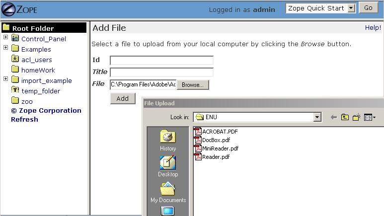
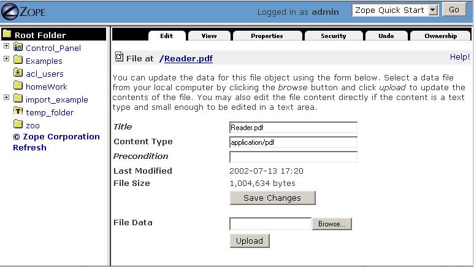
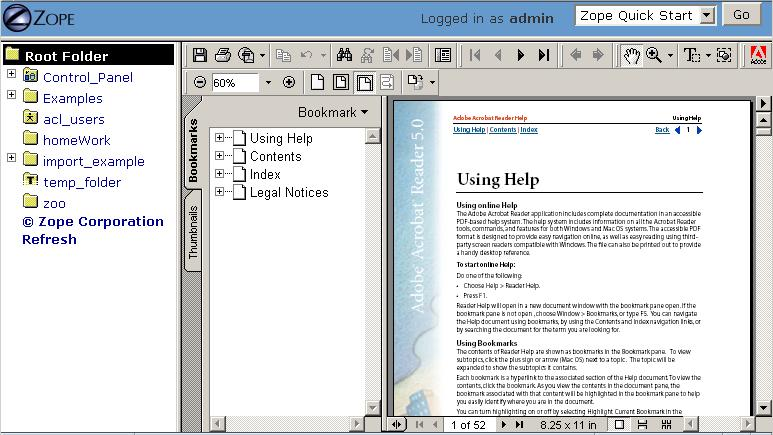
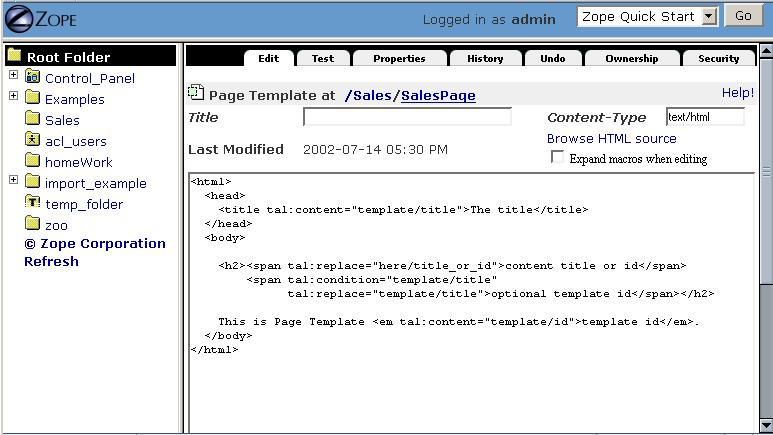
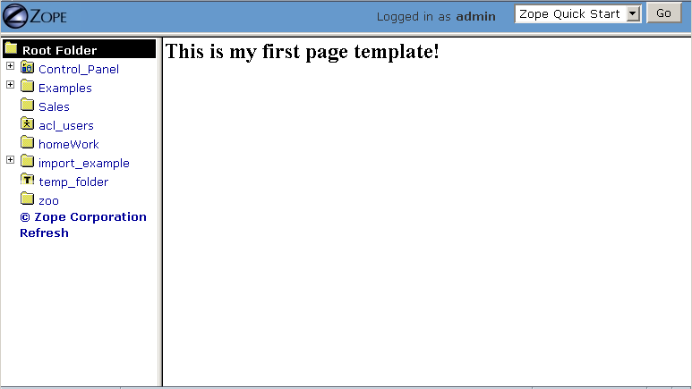
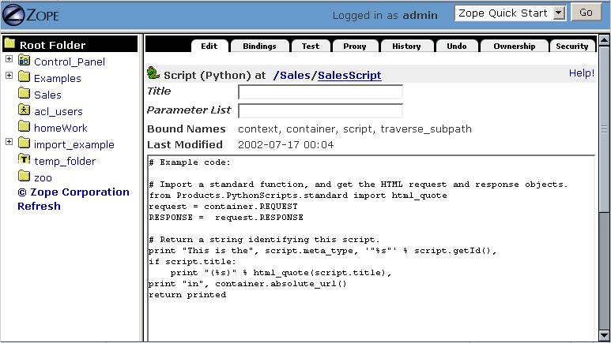
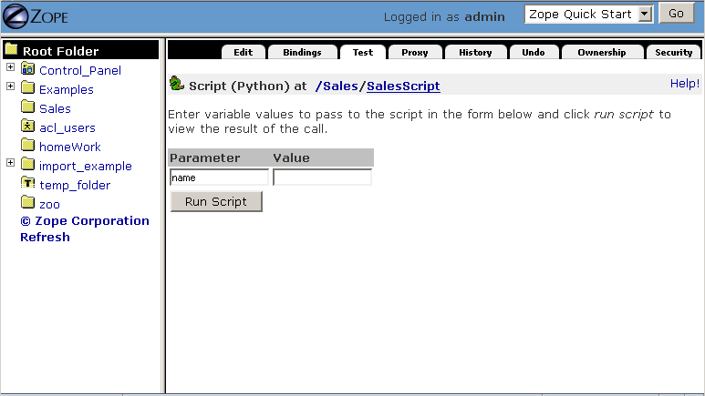
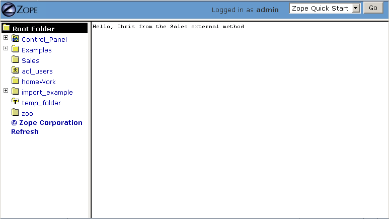
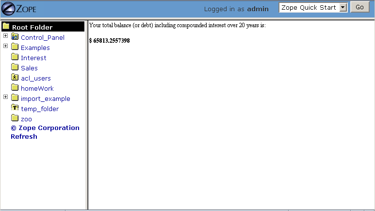

Using Basic Zope Objects
########################

.. include:: includes/zope2_notice.rst

When building a web application with Zope, you construct the application
with *objects*.  The most fundamental Zope objects are explained in this
chapter.

Basic Zope Objects
==================

Zope ships with objects that help you perform different tasks. By design,
different objects handle different parts of your application.  Some objects
hold your content data, such as word processor documents, spreadsheets, and
images.  Some objects handle your application's logic by accepting input
from a web form, or by executing a script.  Some objects control the way
your content is displayed, or *presented* to your viewer, for example, as a
web page or via email.

In general, basic Zope objects take on one of three types of roles:

Content
  Zope objects like documents, images, and files hold different kinds of
  textual and binary data.  In addition to objects in Zope containing
  content, Zope can work with content stored externally, such as
  information in a relational database.

Presentation
  You can control the look and feel of your site with Zope objects that act
  as web page "templates". Zope comes with two facilities to help you
  manage presentation: Zope Page Templates (ZPT) and Document Templates
  (DTML). In the first part of the book we will only cover page templates
  and later on expand on document templates. If you already know HTML, page
  templates are easier to work with and more limited in their options. For
  some of the more advanced tasks DTML can be a better option as explained
  later on.

Logic
  Scripting business logic in Zope is done using Python. "Logic" is any kind of
  programming that does not involve presentation, but rather involves the
  carrying out of tasks such as changing objects, sending messages, testing
  conditions, and responding to events.

Zope also has other kinds of objects that fit into none of these categories,
which are explored further in the chapter entitled `Zope Services
<ZopeServices.html>`_. You may also install "third party" Zope objects ,
defined in Python packages, to expand Zope's capabilities. You can browse a
list of packages specifically aimed at Zope at the
`Python Package Index <https://pypi.org/search/?q=&o=&c=Framework+%3A%3A+Zope>`_.

Content Objects: Folders, Files, and Images
===========================================

Folders
-------

You've already met one of the fundamental Zope objects: the *Folder*.
Folders are the basic building blocks of Zope. The purpose of a folder is
simple: a Folder's only job in life is to *contain* other objects.

Folders can contain any other kind of Zope object, including other folders.
You can nest folders inside each other to form a tree of folders.  This
kind of "folder within a folder" arrangement provides your Zope site with
*structure*.  Good structure is very important, as Zope security and
presentation is influenced by your site's folder structure.  Folder
structure should be very familiar to anyone who has worked with files and
folders on their computer using a file manager like Microsoft *Windows
Explorer*.

Files
-----

Zope Files contain raw data, just as the files on your computer do.
Software, audio, video and documents are typically transported around the
Internet and the world as files. A Zope File object is an analogue to these
kinds of files.  You can use Files to hold any kind of information that
Zope doesn't specifically support, such as Flash files, audio files,
"tarballs", etc. 

Files do not consider their contents to be of any special format, textual
or otherwise.  Files are good for holding any kind of *binary content*,
which is just raw computer information of some kind. Files are also good
for holding textual content if the content doesn't necessarily need to be
edited through the web.

Every File object has a particular *content type*, which is a standard
Internet MIME designation for different categories of content. Examples of
content types are "text/plain" (plain text content), "text/html" (html text
content), and "application/pdf" (an Adobe Portable Document Format file).
When you upload a file into Zope, Zope tries to guess the content type from
the name of the file.

Creating and Editing Files
~~~~~~~~~~~~~~~~~~~~~~~~~~

To create a File object in your Zope instance, visit the root folder in the
ZMI and choose *File* from Zope's Add list.  Before filling out the "id" or
"title" of the File object, click the *Browse* button from the resulting
"Add File" screen.  This should trigger your browser to display a dialog
box that allows you to choose a "real" file from your local computer, which
will be uploaded to Zope when the "Add" button on the "Add File" form is
selected.  Try choosing a file on your local computer, such as a Word file
(.doc) or a Portable Document Format (.pdf) file.

   Adding a PDF File Object

Zope attempts to use the filename of the file you choose to upload as the
File object's 'id' and 'title', thus you don't need to supply an 'id' or
'title' in the "Add File" form unless you want the File object to be named
differently than the filename of the file on your local computer.  After
you select a file to upload, click *Add*.  Depending on the size of the
file you want to upload, it may take a few minutes to add the file to Zope.

After you add the File, a File object with the name of the file on your
local computer will appear in the Workspace pane.  Look at its *Edit* view.
Here you will see that Zope has guessed the content type, as shown in the
figure below.

   Editing an Uploaded PDF File Object

If you add a Word document, the content type is *application/msword*.  If
you add a PDF file, the content type is *application/pdf*.  If Zope does
not recognize the file type, it chooses the default, generic content type
of *application/octet-stream*.  Zope doesn't always guess correctly, so the
ability to change the content type of a File object is provided in the
object editing interface.  To change the content type of a File object,
type the new content type into the *Content Type* field and click the *Save
Changes* button.

You can change the contents of an existing File object by selecting a new
file from your local filesystem in the *File Data* form element and
clicking *Upload*.

Editing Text File Contents
~~~~~~~~~~~~~~~~~~~~~~~~~~

If your File holds only text and is smaller than 64 kilobytes, Zope will
allow you to edit its contents in a textarea within the Edit view of the
ZMI. A text file is one that has a content-type that starts with *text/*,
such as *text/html*, or *text/plain*.

Viewing Files
~~~~~~~~~~~~~

You can view a file in the Workspace frame by clicking the *View* tab in a
File object's management screen. 

   Viewing an Uploaded PDF File Object

You can also view a File by visiting its Zope URL.  For example, if you
have a file in your Zope root folder called *Reader.pdf*, you can view that
file in your web browser via the URL *http://localhost:8080/Reader.pdf*.
Depending on the type of file and your web browser's configuration, your
web browser may choose to display or download the file.

Images 
------

Image objects contain the data from image files, such as GIF, JPEG, and PNG
files. In Zope, Images are very similar to File objects, except that they
include extra behavior for managing graphic content, such as an image's
width and height attributes.

Image objects use the same management interface as File objects.
Everything in the previous section about using file objects also applies to
images. In addition, Image objects display a preview of their images once
they have been uploaded to Zope.

Presentation Objects:  Zope Page Templates
==========================================

Zope encourages you to keep your presentation and logic separate by
providing different objects that are intended to be used expressly for
"presentation".  "Presentation" is defined as the task of dynamically
defining layout of web pages and other user-visible data.  Presentation
objects typically render HTML (and sometimes XML).

Zope has one "presentation" facility: *Zope Page Templates* (ZPT). Zope Page
Templates are objects that allow you to define dynamic presentation for a web
page. The HTML in your template is made dynamic by inserting special XML
namespace elements into your HTML that define the dynamic behavior for that
page.

ZPT has characteristics of a "server-side" scripting language, like SSI, PHP or
JSP. This means that ZPT commands are executed by Zope on the server, and the
result of that execution is sent to your web browser. By contrast, client-side
scripting languages, like Javascript, are not processed by the server, but are
rather sent to and executed by your web browser.

Zope also has an older version of a presentation facility included, which is
called *Document Template Markup Language* or short DTML.

ZPT vs. DTML: Same Purpose, Different Approach
----------------------------------------------

There is a major problem with many languages designed for the purpose of
creating dynamic HTML content: they don't allow for "separation of
presentation and logic" very well.  For example, "tag-based" scripting
languages, like DTML, SSI, PHP, and JSP, encourage programmers to embed
special tags into HTML that are, at best, mysterious to graphics designers
who "just want to make the page look good" and don't know (or want to
know!) a lot about creating an application around the HTML that they
generate.  Worse, these tags can sometimes cause the HTML on which the
designer has been working to become "invalid" HTML, unrecognizable by any
of his or her tools.

Typically, when using these kinds of technologies, an HTML designer will
"mock up" a page in a tool like Macromedia Dreamweaver or Adobe GoLive, and
then hand it off to a web programmer, who will decorate the page with
special tags to insert dynamic content.  However, using tag-based scripting
languages, this is a "one way" workflow: if the presentation ever needs to
change, the programmer cannot just hand back the page that has been
"decorated" with the special tags, because these tags will often be ignored
or stripped out by the designer's tools.  One of several things needs to
happen at this point to enact the presentation changes:

- the designer mocks up a new page and the programmer re-embeds the dynamic
  tags "from scratch", or

- the designer hand-edits the HTML, working around the dynamic tags, or

- the programmer does the presentation himself.

Clearly, none of these options are desirable, because neither the
programmer nor the designer are doing the things that they are best at in
the most efficient way.

Zope's original dynamic presentation language was DTML.  It soon became
apparent that DTML was great at allowing programmers to quickly generate
dynamic web pages, but it failed to allow programmers to work
effectively together with non-technical graphics designers.  Thus, ZPT was
born.  ZPT is an "attribute-based" presentation language that tries to
allow for the "round-tripping" of templates between programmers and
non-technical designers.

DTML is still fully supported in Zope. If you are familiar with PHP it might
fit your mind better then ZPT. For some of the advanced topics covered later
in the book, like relation database integration or more uncommon tasks like
dynamic generation of non-xml files, DTML can be easier to work with.

Zope Page Templates
-------------------

Zope Page Templates (ZPTs) are typically used to create dynamic HTML pages.

Creating a Page Template
~~~~~~~~~~~~~~~~~~~~~~~~

Create a Folder with the 'id' *Sales* in the root folder, and give it any
title you like.  Enter the Sales folder by clicking on it, then select
*Page Template* from the Add list.  The Add form for a page template will
be displayed.  Specify the 'id' "SalesPage" and click *Add*.  You have
successfully created a page template whose content is standard
"boilerplate" text at this point.

Editing a Page Template
~~~~~~~~~~~~~~~~~~~~~~~

The easiest way to edit a page template is by clicking on its name or icon
in the ZMI.  When you click on either one of those items, you are taken to
the *Edit* view of the page template, which displays a textarea in which
you can edit the template.  Click on the "SalesPage" template.  You will
see something like the following screen:

   Default Page Template Content

Replace the original, boilerplate content included in the page template
with the following HTML::

  <html>
    <body>
      <h1>This is my first page template!</h1>
    </body>
  </html>

Then click *Save Changes* at the bottom of the edit form.

Uploading a Page Template
~~~~~~~~~~~~~~~~~~~~~~~~~

If you'd prefer not to edit your HTML templates in a web browser, or you
have some existing HTML pages that you'd like to bring into Zope, Zope
allows you to upload your existing html files and convert them to page
templates.

Create a text file on your local computer named 'upload_pt.html'.  Populate
it with the following content::

  <html>
    <body>
      <h1>This is my second page template!</h1>
    </body>
  </html>

While in the Sales folder, choose *Page Template* from the add menu, which
will cause the page template Add form to be displayed.  The last form
element on the add form is the *Browse* button.  Click this button, and
your browser will display a file selection dialog.  CHoose the
'upload_pt.html' file, type in an 'id' of "upload_pt" for the new Page
Template, and click *Add and Edit*.  After uploading your file, you will be
taken back to the Edit form of your new page template.

Viewing a Page Template
~~~~~~~~~~~~~~~~~~~~~~~

You can view a Page Template in the Workspace frame by clicking the *Test*
tab from the template's management screen.  Click the *Test* tab of the
SalesPage template, and you will see something like the following figure:

   Viewing a Page Template

You can also view a Page Template by visiting its Zope URL directly.

Logic Objects:  Script (Python) Objects and External Methods
============================================================

"Logic" objects in Zope are objects that typically perform some sort of
"heavy lifting" or "number crunching" in support of presentation objects.
When they are executed, they need not return HTML or any other sort of
structured presentation text.  Instead, they might return values that are
easy for a presentation object to format for display.  For example, a logic
object may return a "list" of "strings".  Then, a presentation object may
"call in" to the logic object and format the results of the call into a
one-column HTML table, where the rows of the table are populated by the
strings.  Instead of embedding logic in a presentation object, you can (and
should) elect to move the logic into a logic object, using a presentation
object only to format the result for display.  In this manner, you can
change or replace the presentation object without needing to "re-code" or
replace the logic.

Note that logic objects, like presentation and content objects, are also
addressable directly via a URL, and *may* elect to return HTML, which can
be displayed meaningfully in a browser.  However, the return value of a
logic object can almost always be displayed in a browser, even if the logic
object does not return HTML.

There are two kinds of logic objects supported by stock Zope: *Script
(Python)* objects and *External Methods*.  These stock logic objects are
written in the syntax of the *Python* scripting language. Python is a
general-purpose programming language. You are encouraged
to read the `Python Tutorial <https://docs.python.org/tutorial/>`_
in order to understand the syntax and semantics of the example Script (Python)
objects shown throughout this chapter and throughout this book. And don't
panic: Python is very easy to learn and understand.

One important Python feature that must be mentioned here, however: Python uses
whitespace in the form of indentation to denote block structure. Where other
languages, such as C, Perl, and PHP might use "curly braces" -- "{" and "}" --
to express a block of code, Python determines code blocks by examining the
indentation of code text. If you're used to other programming languages, this
may take some "getting-used-to" (typically consisting of a few hours of
unsavory spoken language ;-) ). If you have problems saving or executing Script
objects, make sure to check your Script's indentation.

Script (Python) Objects
-----------------------

Script (Python) objects are one type of logic object.  Note that the
tortuous form of their name (as opposed to "Python Script") is unfortunate:
a legal issue prevents Zope Corporation from naming them "Python Scripts",
but most folks at Zope Corporation and in the Zope community refer to them
in conversation as just that.

Script (Python) objects are "security-constrained", web-editable pieces of
code that are written in a subset of the Python scripting language.  Not
all Python code is executable via a Script (Python) object.  Script
(Python) objects are constrained by Zope's *security policy*, which means,
for the most part, that they are unable to import all but a defined set of
restricted Python modules, and that they cannot directly access files on
your file system.  This is a security feature, as it allows site
administrators to safely delegate the ability to create logic in Python to
less knowledgeable users. The security restrictions aren't stringent enough
to prevent malicious users from damaging the system. They are only meant as
a safety belt beginners. For more information about Zope's security features,
see `Users and Security <Security.html>`_.

Creating a Script (Python)
~~~~~~~~~~~~~~~~~~~~~~~~~~

Enter the Sales folder you created earlier by clicking on it, then select
*Script (Python)* from the Add list.  The Add form for the object will be
displayed.  Specify the 'id' "SalesScript" and click *Add*.  You will see
an entry in the Sales folder Content view representing the "SalesScript"
Script (Python) object, whose content is standard, boilerplate text at this
point.

Editing a Script (Python)
~~~~~~~~~~~~~~~~~~~~~~~~~

The easiest way to edit a Script (Python) is by clicking on its name or
icon in the ZMI: when you click on either of these items, you are taken to
the *Edit* view of the Script (Python), which gives you a textarea in which
you can edit the template.  Click on the 'SalesScript' icon.  You will see
something like the following:

   Default Script Content

In the *Parameter List* form element, type 'name="Chris"'.

Replace the original content that comes in the "body" (the big TEXTAREA
below the 'Last Modified' line) of the Script (Python) object with the
following text::

   return 'Hello, %s from the SalesScript script' % name

Then click *Save Changes* at the bottom of the edit form. You can now
execute, or test, your Script (Python) object.

Testing a Script (Python)
~~~~~~~~~~~~~~~~~~~~~~~~~

You can test a Script (Python) in the Workspace frame by clicking the
*Test* tab from the Script's management screen.  When you test a script,
the output of the script will be displayed in your browser.  Script testing
may require that you provide values for the script's *parameters* before
you can view the results.  Click the *Test* tab of the SalesScript object,
and you will see something like the following figure:

   Testing a Script

In the Value box next to the 'name' parameter, enter your name, and then
click "Run Script".  You will be presented with output in the Workspace
frame not unlike::

   Hello, [yourname] from the SalesScript script

If a Script does not require parameters or has defaults for its parameters
(as does the example above), you may visit its URL directly to see its
output.  In our case, visiting the URL of SalesScript directly in your
browser will produce::

   Hello, Chris from the SalesScript script

If a Script *does* require or accept parameters, you may also influence its
execution by visiting its URL directly and including a "query string".  In
our case, visiting the URL
'http://localhost:8080/Sales/SalesScript?name=Fred' will produce the
following output::

   Hello, Fred from the SalesScript script

Zope maps query string argument values to their corresponding parameters
automatically, as you can see by this output.

Uploading a Script (Python)
~~~~~~~~~~~~~~~~~~~~~~~~~~~

Uploading the body of a Script (Python) object is much like uploading the
body of a Page Template.  One significant difference is that
Script (Python) objects interpret text that is offset by "double-pound"
('##') at the beginning of the text as data about their parameters, title,
and "bindings".  For example, if you entered the following in a text editor
and uploaded it, the lines that start with "double-pound" signs would be
interpreted as parameter data, and the only text in the "body" would be the
'return' line.  It would appear exactly as our SalesScript did::

  ## Script (Python) "SalesScript"
  ##bind container=container
  ##bind context=context
  ##bind namespace=
  ##bind script=script
  ##bind subpath=traverse_subpath
  ##parameters=name="Chris"
  ##title=
  ##
  return 'Hello, %s from the SalesScript script' % name

You may see this view of a Script (Python) object by clicking on the 'view
or download' link in the description beneath the "body" textarea.

You may also type the "double-pound" quoted text into the "body" textarea,
along with the actual script lines, and the "double-pound" quoted text will
be "auto-magically" turned into bindings and parameters for the Script
(Python) object.

External Methods
----------------

External Method objects are another type of logic object.  They are very
similar to Script (Python) objects; in fact, they are scripted in the
Python programming language, and they are used for the same purpose.  There
are a few important differences:

- External Methods are not editable using the Zope Management Interface.
  Instead, their "modules" need to be created on the file system of your
  Zope server in a special subdirectory of your Zope directory named
  'Extensions'.

- Because External Methods are not editable via the Zope Management
  Interface, their execution is not constrained by the Zope "security
  machinery".  This means that, unlike Script (Python) objects, External
  Methods can import and execute essentially arbitrary Python code and
  access files on your Zope server's file system.

- External Methods do not support the concept of "bindings" (which we have
  not discussed much yet, but please just make note for now).

External methods are often useful as an "escape hatch" when Zope's security
policy prevents you from using a Script (Python) object or DTML to do a
particular job that requires more access than is "safe" in
through-the-web-editable scripts.  For example, a Script (Python) object
cannot write to files on your server's filesystem that an External Method
may.

Testing an External Method Object
~~~~~~~~~~~~~~~~~~~~~~~~~~~~~~~~~

You can test an External Method in the Workspace frame by clicking the
*Test* tab from the External Method's management screen.  When you test an
External Method, its output is displayed in your browser.  Unlike Script
(Python) objects, External Methods provide no mechanism for specifying
parameter values during testing.  However, like Script (Python) objects,
their output is influenced by values in a query string when you visit them
directly.

Click the *Test* tab of the SalesEM object, and you will see something like
the following figure:

   Testing an External Method

If an External Method does not require parameters (or has defaults for its
parameters, as in the example above), you may visit its URL directly to see
its output.

Provide alternate values via a query string to influence the execution of
the External Method.  For example, visiting the SalesEM external Method via
'http://localhost:8080/Sales/SalesEM?name=Fred' will display the following
output::

    Hello, Fred from the Sales external method

Astute readers will note that the 'id' provided by the output is *not* the
'id' of the External Method ('SalesEM'), but is instead the 'id' of the
"containing" folder, which is named 'Sales'!  This is a demonstration of
the fact that External Methods (as well as Script (Python) objects) are
mostly meant to be used in the "context" of another object, which is often
a Folder.  This is why they are named `methods <ObjectOrientation.html>`_.
Typically, you don't often want to access information about the External
Method or Script itself; all the "interesting" information is usually kept
in other objects (like Folders).  An External Method or Script (Python)
object "knows about" its context and can display information about the
context without much fuss.

Creating and Editing an External Method File
~~~~~~~~~~~~~~~~~~~~~~~~~~~~~~~~~~~~~~~~~~~~

Minimize the browser you're using to access the ZMI.  In your Zope's
INSTANCE_HOME (the place where your Zope instance lives; see the
Installation chapter for details), locate the subfolder named 'Extensions'.
Navigate into this folder and create a text file with the name
'SalesEM.py'.  

Within this file, save the following content::

  def SalesEM(self, name="Chris"):
      id = self.id
      return 'Hello, %s from the %s external method' % (name, id)

Creating an External Method Object
~~~~~~~~~~~~~~~~~~~~~~~~~~~~~~~~~~

Before you can use an External Method from within Zope, you need to create
an External Method object in the ZMI that "refers to" the function in the
file that you just created.  Bring back your browser window and visit the
ZMI.  Navigate to the Sales folder and select *External Method* from the
Add list.  The Add form for an External Method will appear.  Provide an
'Id' of "SalesEM", a 'Title' of "Sales External Method", a 'Module Name' of
"SalesEM", and a 'Function Name' of "SalesEM".

Then click *Add* at the bottom of the Add form.

SQL Methods:  Another Kind of Logic Object
------------------------------------------

*SQL Methods* are logic objects used to store and execute database queries
that you can reuse in your web applications.  We don't explain them in this
chapter, because we haven't yet explained how to interface Zope with a
relational database.  SQL Methods are explained in the chapter entitled
`Relational Database Connectivity <RelationalDatabases.html>`_, where an
example of creating a web application using a relational database is given.

Creating a Basic Zope Application Using Page Templates and Scripts
==================================================================

Here is a simple example of using Zope's logic and content objects to build
an online web form to help your users calculate the amount of compound
interest on their debts.  This kind of calculation involves the following
procedure:

1. You need the following information: your current account balance (or
   debt), called the "principal"; the annual interest rate expressed as a
   decimal (like 0.095), called the "interest_rate"; the number of times
   during the year that interest is compounded (usually monthly), called
   the "periods"; and the number of years from now you want to calculate,
   called the "years".

2. Divide your "interest_rate" by "periods" (usually 12). We'll call this
   result "i".

3. Take "periods" and multiply it by "years".  We'll call this result "n".

4. Raise (1 + "i") to the power "n".

5. Multiply the result by your "principal". This is the new balance (or
   debt).

We will use Page Template and Script (Python) objects to construct an
application to perform this task.

For this example, you will need two Page Templates with the 'ids'
*interestRateForm* and *interestRateDisplay*, respectively, to collect and
display information from the user.  You will also need a Script (Python)
object with an 'id' of *calculateCompoundingInterest* that will do the
actual calculation.

The first step is to create a folder in which to hold the application.  In
your Zope's root folder, create a folder with the 'id' "Interest".  You
will create all of the objects that follow within this folder.

Creating a Data Collection Form
-------------------------------

Visit the 'Interest' folder by clicking on it within the Zope Management
Interface.  Within the 'Interest' folder, create a Page Template with the
'id' *interestRateForm* that collects "principal", "interest_rate",
"periods", and "years" from your users.  Use this text as the body of your
*interestRateForm* page template::

  <html>
    <body>

    <form action="interestRateDisplay" method="POST">
    
Please enter the following information:

    Your current balance (or debt): <input name="principal:float"> 
    Your annual interest rate: <input name="interest_rate:float"> 
    Number of periods in a year: <input name="periods:int"> 
    Number of years: <input name="years:int"> 
    <input type="submit" value=" Calculate "> 
    </form>

    </body>
  </html>

This form collects information and, when it is submitted, calls the
*interestRateDisplay* template (which we have not yet created).

Creating a Script To Calculate Interest Rates
---------------------------------------------

Now, revisit the Contents view of the *Interest* folder and create a Script
(Python) object with the id *calculateCompoundingInterest* that accepts
four parameters: 'principal', 'interest_rate', 'periods', and 'years'.
Provide it with the following "body"::

  """ 
  Calculate compounding interest.
  """
  i = interest_rate / periods
  n = periods * years
  return ((1 + i) ** n) * principal 

Remember: you enter the parameter names, separated by commas, into the
*Parameters List* field, and the body into the body text area.  Remember
also that when you're creating a Script (Python) object, you're actually
programming in the Python programming language, which is
indentation-sensitive.  Make sure each of the lines above line up along the
left side of the text area, or you may get an error when you attempt to
save it.

Creating a Page Template To Display Results
-------------------------------------------

Next, go back to the Contents view of the *Interest* folder and create a
Page Template with the id *interestRateDisplay*.  This Page Template is
**called by** *interestRateForm* and **calls**
*calculateCompoundingInterest*.  It also renders and returns the results::

  <html>
    <body>
    Your total balance (or debt) including compounded interest over
    
      2 years is:  
      <b>$
      1.00
      </b>
    
    </body>
  </html>

Dealing With Errors
-------------------

As in any programming venue, you will need to deal with errors.  Nobody's
perfect!  You may have already encountered some errors as you entered these
scripts.  Let's explore errors a bit by way of an example.  In our case, we
cannot use the Page Template *Test* tab to test the *interestRateDisplay*
without receiving an error, because it depends on the *interestRateForm* to
supply it with the variables "years, "principal", "interest_rate", and
"periods".  Thus, it is not directly "testable".  For the sake of "seeing
the problem before it happens for real", click the *Test* tab.  Zope will
present an error page with text not unlike the following text::

    Site Error

    An error was encountered while publishing this resource.

    Error Type: KeyError
    Error Value: years

This error message is telling you that your Page Template makes a reference
to a variable "years" that it can't find.  You can view the full error by
visiting the *error_log* object and clicking the top-most error log entry,
which will be named *KeyError: years* in the *Log* tab.  The error log
entry contains information about the error, including the time, the user
who received the error, the URL that caused the error to happen, the
exception type, the exception value, and a "Traceback", which typically
gives you enough technical information to understand what happened.  In our
case, the part of the traceback that is interesting to us is::

   * Module Products.PageTemplates.TALES, line 217, in evaluate
     URL: /Interest/interestRateDisplay
     Line 4, Column 8
     Expression: standard:'request/years'

This tells us that the failure occurred when the Page Template attempted to
access the variable 'request/years'.  We know why: there is no variable
'request/years', because that variable is only "filled in" as a result of
posting via our *interestRateForm*, which calls in to our
*interestRateDisplay* Page Template, which has the effect of inserting the
variables 'principal', 'interest_rate', 'periods', and 'years' into the
'request' "namespace".  We'll cover Page Template namespaces in a
succeeding chapter.

Using The Application
---------------------

Let's use the application you've just created.  Visit the
*interestRateForm* Page Template and click the *Test* tab.

Type in '20000' for balance or debt, '.06' for interest rate, '4' for
periods in a year, and '20' for number of years, and then click
*Calculate*.  This will cause *interestRateForm* to submit the collect
information to *interestRateDisplay*, which calls the Script (Python)
object named *calculateCompoundingInterest*.  The display method uses the
value returned by the script in the resulting display.  You will see the
following result:

   Result of the Interest Application

If you see something close to this, it calls for congratulations, because
you've just built your first Zope application successfully!  If you are
having trouble, try to troubleshoot the application by using the tips in
the section "Dealing With Errors."  If you're stuck entirely, it's
advisable that you send a message to the `Zope mailing list
<mailto:zope@zope.dev>`_ detailing the problem that you're having as
concisely and clearly as possible.  It is likely that someone there will be
able to help you, and it is polite to subscribe to the Zope mailing list
itself if you want to receive replies.  See
https://mail.zope.dev/mailman/listinfo/zope for
information about how to subscribe to the Zope (zope@zope.dev) mailing
list.
