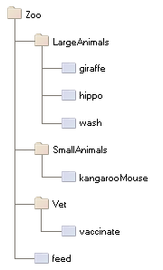
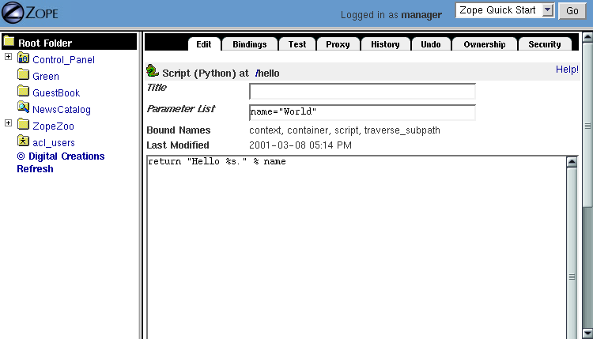
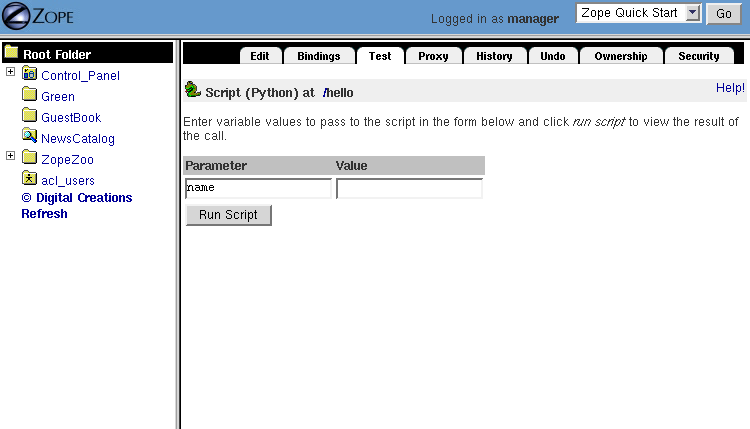
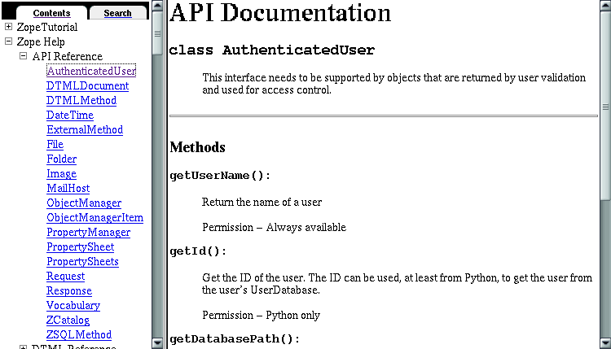

Basic Zope Scripting
####################

.. include:: includes/zope2_notice.rst

So far, you've learned about some basic Zope objects and how to manage them
through the *Zope Management Interface*. This chapter shows you how to manage
Zope objects programmatically.

Calling Methods From the Web
============================

Since Zope is a web application server, the easiest way to communicate with
Zope is through a web browser. Any URL your browser requests from the server is
mapped to both an object and a method. The method is executed *on* the object,
and a response is sent to your browser.

As you might already know, visiting the URL :: 

  http://localhost:8080/

returns the *Zope Quick Start* page. In this case, we only specify an object --
the *root* object -- but no method. This just works because there is a default
method defined for *Folders*: *index_html*. Visiting the URL::

  http://localhost:8080/index_html

returns (almost) exactly the same page.

You can also specify the root object as:: 

  http://localhost:8080/manage_main

but in this case the *manage_main* method is called, and the workspace frame
displays the root content of your Zope site, without the navigator frame.

The same method can be called *on* other objects: when you visit the URL::

  http://localhost:8080/Control_Panel/manage_main

the *manage_main* method is called *on* the *Control Panel* object.

Sometimes a query string is added to the URL, e.g.:: 

  http://localhost:8080/manage_main?skey=meta_type

The query string is used for passing arguments to the method. In this case, the
argument ``skey`` specifies the sort key with the value *meta_type*. Based on
this argument, the *manage_main* method returns a modified version of the basic
page: the sub-objects are sorted by *Type*, not by *Name* as they are without 
that query string.

While the *manage_main* method is defined in the class of the object,
*index_html* is (by default) a DTML Method object in the root folder that can
be modified through the web. *index_html* itself is a presentation object, but
when called *on* a folder, it behaves as a method that returns the default view
of the folder.

Method Objects and Context Objects
++++++++++++++++++++++++++++++++++

When you call a method, you usually want to single out some object that is
central to the method's task, either because that object provides information
that the method needs, or because the method will modify that object. In
`object-oriented <ObjectOrientation.stx>`_ terms, we want to call the method
*on* this particular object. But in conventional object-oriented programming,
each object can perform the methods that are defined in (or inherited by) its
class. How is it that one Zope object can be used as a method for (potentially)
many other objects, without its being defined by the classes that define these
objects?

Recall that in the chapter entitled `Acquisition <Acquisition.stx>`_, we
learned that Zope can find objects in different places by *acquiring* them from
parent containers. Acquisition allows us to treat an object as a method that
can be called *in the context of* any suitable object, just by constructing an
appropriate URL. The object *on* which we call a method gives it a context in
which to execute. Or, to put it another way: the context is the environment in
which the method executes, from which the method may get information that it
needs in order to do its job.

Another way to understand the context of a method is to think of the method as
a function in a procedural programming language, and its context as an implicit
argument to that function.

While the Zope way to call methods *in the context of* objects **works**
differently than the normal object-oriented way to call class-defined methods
*on* objects, they are **used** the same way, and it is simpler to say that you
are calling the method *on* the object.

There are two general ways to call methods *on* objects: by visiting an URL,
and by calling the method from another method.

URL Traversal and Acquisition
+++++++++++++++++++++++++++++

The concept of calling methods *in the context of* objects is a powerful
feature that enables you to apply logic to objects, like documents or folders,
without having to embed any actual code within the object.

For example, suppose you have a collection of objects and methods, as shown in
the figure below.

  A collection of objects and methods

To call the *feed* method on the *hippo* object, you would visit the URL:: 

  Zoo/LargeAnimals/hippo/feed

To call the *feed* method on the *kangarooMouse* object you would visit the
URL:: 

  Zoo/SmallAnimals/kangarooMouse/feed

These URLs place the *feed* method in the context of the *hippo* and
*kangarooMouse* objects, respectively.

Zope breaks apart the URL and compares it to the object hierarchy,
working backwards until it finds a match for each part.  This process is
called *URL traversal*.  For example, when you give Zope the URL:: 

  Zoo/LargeAnimals/hippo/feed

it starts at the root folder and looks for an object named *Zoo*. It then moves
to the *Zoo* folder and looks for an object named *LargeAnimals*. It moves to
the *LargeAnimals* folder and looks for an object named *hippo*. It moves to
the *hippo* object and looks for an object named *feed*. The *feed* method
cannot be found in the *hippo* object and is located in the *Zoo* folder by
using acquisition. Zope always starts looking for an object in the last object
it traversed, in this case: *hippo*. Since *hippo* does not contain anything,
Zope backs up to *hippo's* immediate container *LargeAnimals*. The *feed*
method is not there, so Zope backs up to *LargeAnimals* container, *Zoo*, where
*feed* is finally found.

Now Zope has reached the end of the URL and has matched objects to every name
in the URL. Zope recognizes that the last object found, *feed*, is callable,
and calls it *in the context of* the second-to-last object found: the *hippo*
object. This is how the *feed* method is called *on* the *hippo* object.

Likewise, you can call the *wash* method on the *hippo* by visiting the URL::

  Zoo/LargeAnimals/hippo/wash

In this case, Zope acquires the *wash* method from the *LargeAnimals* folder.

Note that *Script (Python)* and *Page Template* objects are always method
objects. You can't call another method *in the context* of one of them. Given
*wash* is such a method object, visiting the URL ::

  Zoo/LargeAnimals/hippo/wash/feed

would also call the *wash* method on the *hippo* object. Instead of traversing
to *feed*, everything after the method ``wash`` is cut off of the URL and 
stored in the variable ``traverse_subpath``.

The Special Folder Object *index_html*
+++++++++++++++++++++++++++++++++++++++

As already mentioned at the beginning of this chapter, Zope uses the default
method if no other method is specified. The default method for Folders is
*index_html*, which does not necessarily need to be a method itself. If it
isn't a callable, the default method of the object *index_html* is called on
*index_html*. This is analogous to how an *index.html* file provides a default
view for a directory in Apache and other web servers. Instead of explicitly
including the name *index_html* in your URL to show default content for a
Folder, you can omit it and still gain the same effect.

For example, if you create an *index_html* object in your *Zoo* Folder, and
view the folder by clicking the View tab or by visiting the URL::

  http://localhost:8080/Zoo/

Zope will call the *index_html* object in the *Zoo* folder and display its
results. You could instead use the more explicit URL::

  http://localhost:8080/Zoo/index_html

and it will display the same content.

A Folder can also *acquire* an *index_html* object from its parent Folders. You
can use this behavior to create a default view for a set of Folders. To do so,
create an *index_html* object in a Folder that contains another set of Folders.
This default view will be used for all the Folders in the set. This behavior is
already evident in Zope: if you create a set of empty Folders in the Zope root
Folder, you may notice that when you view any of the Folders via a URL, the
content of the "root" Folder's *index_html* method is displayed. The
*index_html* in the root Folder is acquired. Furthermore, if you create more
empty Folders inside the Folders you've just created in the root Folder, a
visit to these Folders' URLs will also display the root Folder's *index_html*.
This is acquisition at work.

If you want a different default view of a given Folder, just create a custom
*index_html* object in that particular Folder. This allows you to override the
default view of a particular Folder on a case-by-case basis, while allowing
other Folders defined at the same level to acquire a common default view.

The *index_html* object may be a *Page Template*, a *Script (Python)* object, a
*DTML Method* or any other Zope object that is URL-accessible and that returns
browser-renderable content. The content is typically HTML, but Zope doesn't
care. You can return XML, or text, or anything you like.

Using Python-based Scripts
==========================

Now let us take a look at a basic method object: *Script (Python)*.

The Python Language
+++++++++++++++++++

`Python <https://www.python.org/>`_ is a high-level, object oriented scripting
language. Most of Zope is written in Python. Many folks like Python because of
its clarity, simplicity, and ability to scale to large projects.

There are many resources available for learning Python. The python.org website
has lots of Python documentation including a `tutorial
<https://docs.python.org/tutorial/index.html>`_ by Python's creator, Guido
van Rossum.

Python comes with a rich set of modules and packages. You can find out more
about the `Python standard library
<https://docs.python.org/library/index.html>`_ at the python.org website.

Creating Python-based Scripts
+++++++++++++++++++++++++++++

To create a Python-based Script, select *Script (Python)* from the Add
drop-down list. Name the script *hello*, and click the *Add and Edit* button.
You should now see the *Edit* view of your script.

This screen allows you to control the parameters and body of your script. You
can enter your script's parameters in the *parameter list* field. Type the body
of your script in the text area at the bottom of the screen.

Enter:: 

  name="World"

into the *parameter list* field, and in the body of the script, type::

  return "Hello %s." % name

Our script is now equivalent to the following function definition in standard
Python syntax::

  def hello(name="World"):
      return "Hello %s." % name

The script should return a result similar to the following image:

  Script editing view

You can now test the script by going to the *Test* tab, as shown in the
following figure.

  Testing a script

Leave the *name* field blank, and click the *Run Script* button. Zope should
return "Hello World." Now go back and try entering your name in the *Value*
field, and clicking the *Run Script* button. Zope should now say "hello" to
you.

Since scripts are called on Zope objects, you can get access to Zope objects
via the *context* variable. For example, this script returns the number of
objects contained by a given Zope object::

  ## Script (Python) "numberOfObjects"
  ##
  return len( context.objectIds() )

Note that the lines at the top starting with a double hash (##) are generated
by Zope when you view the script outside the *Edit* tab of the ZMI, e.g., by
clicking the *view or download* link at the bottom of the *Edit* tab. We'll use
this format for our examples.

The script calls ``context.objectIds()``, a method in the Zope API, to get a 
list of the contained objects. *objectIds* is a method of *Folders*, so the 
context object should be a Folder-like object. The script then calls ``len()``
to find the number of items in that list. When you call this script on a given
Zope object, the *context* variable is bound to the context object. So, if you
called this script by visiting the URL::

  FolderA/FolderB/numberOfObjects

the *context* parameter would refer to the `FolderB` object.

When writing your logic in Python, you'll typically want to query Zope objects,
call other scripts, and return reports. Suppose you want to implement a simple
workflow system, in which various Zope objects are tagged with properties that
indicate their status. You might want to produce reports that summarize which
objects are in which state. You can use Python to query objects and test their
properties. For example, here is a script named ``objectsForStatus`` with one
parameter, 'status'::

  ## Script (Python) "objectsForStatus"
  ##parameters=status
  ##
  """ Returns all sub-objects that have a given status property.
  """
  results=[]
  for object in context.objectValues():
      if object.getProperty('status') == status:
          results.append(object)
  return results

This script loops through an object's sub-objects, and returns all the
sub-objects that have a::

  status

property with a given value.

Accessing the HTTP Request
++++++++++++++++++++++++++

What if we need to get user input, e.g., values from a form? We can find the
REQUEST object, which represents a Zope web request, in the context. For
example, if we visited our *feed* script via the URL::

  Zoo/LargeAnimals/hippo/feed?food_type=spam

we could access the ``food_type`` variable as::

  context.REQUEST.food_type

This same technique works with variables passed from forms.

Another way to get the REQUEST is to pass it as a parameter to the script. If
REQUEST is one of the script's parameters, Zope will automatically pass the
HTTP request and assign it to this parameter. We could then access the
``food_type`` variable as::

  REQUEST.food_type

String Processing in Python
+++++++++++++++++++++++++++

One common use for scripts is to do string processing. Python has a number of
standard modules for string processing. Due to security restrictions, you
cannot do regular expression processing within Python-based Scripts. If you
really need regular expressions, you can easily use them in External Methods,
described in a subsequent chapter. However, in a Script (Python) object, you do
have access to string methods.

Suppose you want to change all the occurrences of a given word in a text file.
Here is a script, *replaceWord*, that accepts two arguments: *word* and
*replacement*. This will change all the occurrences of a given word in a
File::

  ## Script (Python) "replaceWord"
  ##parameters=word, replacement
  ##
  """ Replaces all the occurrences of a word with a replacement word in
  the source text of a text file. Call this script on a text file to use
  it.

  Note: you will need permission to edit the file in order to call this
  script on the *File* object.  This script assumes that the context is
  a *File* object, which provides 'data', 'title', 'content_type' and
  the manage_edit() method.
  """
  text = context.data
  text = text.replace(word, replacement)
  context.manage_edit(context.title, context.content_type, filedata=text)

You can call this script from the web on a text *File* in order to change the
text. For example, the URL::

  Swamp/replaceWord?word=Alligator&replacement=Crocodile

would call the *replaceWord* script on the text *File* named::

  Swamp

and would replace all occurrences of the word::

  Alligator

with::

  Crocodile

See the Python documentation for more information about manipulating strings
from Python.

One thing that you might be tempted to do with scripts is to use Python to
search for objects that contain a given word within their text or as a
property. You can do this, but Zope has a much better facility for this kind of
work: the *Catalog*. See the chapter entitled `Searching and Categorizing
Content <SearchingZCatalog.stx>`_ for more information on searching with
Catalogs.

Print Statement Support
+++++++++++++++++++++++

Python-based Scripts have a special facility to help you print information.
Normally, printed data is sent to standard output and is displayed on the
console. This is not practical for a server application like Zope, since the
service does not always have access to the server's console. Scripts allow you
to use print anyway, and to retrieve what you printed with the special variable
*printed*. For example::

  ## Script (Python) "printExample"
  ##
  for word in ('Zope', 'on', 'a', 'rope'):
      print word
  return printed

This script will return::

  Zope
  on
  a
  rope

The reason that there is a line break in between each word is that Python adds
a new line after every string that is printed.

You might want to use the ``print`` statement to perform simple debugging in
your scripts. For more complex output control, you probably should manage
things yourself by accumulating data, modifying it, and returning it manually,
rather than relying on the ``print`` statement. And for controlling
presentation, you should return the script output to a Page Template or DTML
page, which then displays the return value appropriately.

Built-in Functions
++++++++++++++++++

Python-based Scripts give you a slightly different menu of built-ins than you'd
find in normal Python. Most of the changes are designed to keep you from
performing unsafe actions. For example, the *open* function is not available,
which keeps you from being able to access the file system. To partially make up
for some missing built-ins, a few extra functions are available.

The following restricted built-ins work the same as standard Python built-ins:
*None*, *abs*, *apply*, *callable*, *chr*, *cmp*, *complex*, *delattr*,
*divmod*, *filter*, *float*, *getattr*, *hash*, *hex*, *int*, *isinstance*,
*issubclass*, *list*, *len*, *long*, *map*, *max*, *min*, *oct*, *ord*, *repr*,
*round*, *setattr*, *str*, and *tuple*. For more information on what these
built-ins do, see the online `Python Documentation
<https://docs.python.org/>`_.

The *range* and *pow* functions are available and work the same way they do in
standard Python; however, they are limited to keep them from generating very
large numbers and sequences. This limitation helps to avoid accidental long
execution times.

In addition, these DTML utility functions are available: *DateTime* and *test*.
See Appendix A, `DTML Reference <AppendixA.stx>`_ for more information on these
functions.

Finally, to make up for the lack of a *type* function, there is a *same_type*
function that compares the type of two or more objects, returning *true* if
they are of the same type. So, instead of saying::

  if type(foo) == type([]):
      return "foo is a list"

... to check if ``foo`` is a list, you would instead use the *same_type*
function::

  if same_type(foo, []):
      return "foo is a list"

Calling ZPT from Scripts
========================

Often, you would want to call a *Page Template* from a Script. For instance, a
common pattern is to call a Script from an HTML form. The Script would process
user input, and return an output page with feedback messages - telling the user
her request executed correctly, or signalling an error as appropriate.

Scripts are good at logic and general computational tasks but ill-suited for
generating HTML. Therefore, it makes sense to delegate the user feedback output
to a *Page Template* and call it from the Script. Assume we have this Page
Template with the *id* 'hello_world_pt'::

  
Hello World!

You will learn more about *Page Templates* in the next chapter. For now, just
understand that this *Page Template* generates an HTML page based on the value
*name*. Calling this template from a Script and returning the result could be
done with the following line::

  return context.hello_world_pt(name="John Doe")

The *name* parameter to the Page Template ends up in the::

  options/name

path expression. So the returned HTML will be::

  
Hello John Doe!

Note that::

  context.hello_world_pt

works because there is no dot in the id of the template. In Python, dots are
used to separate ids. This is the reason why Zope often uses ids like
*index_html* instead of the more common ``index.html`` and why this example 
uses *hello_world_pt* instead of ``hello_world.pt``.

However, if desired, you can use dots within object ids. Using *getattr* to
access the dotted id, the modified line would look like this::

  return getattr(context, 'hello_world.pt')(name="John Doe")

Returning Values from Scripts
=============================

Scripts have their own variable scope. In this respect, scripts in Zope behave
just like functions, procedures, or methods in most programming languages. If
you name a script *updateInfo*, for example, and *updateInfo* assigns a value
to a variable *status*, then *status* is local to your script: it gets cleared
once the script returns. To get at the value of a script variable, we must pass
it back to the caller with a *return* statement.

Scripts can only return a single object. If you need to return more than one
value, put them in a dictionary and pass that back.

Suppose you have a Python script *compute_diets*, out of which you want to get
values::

  ## Script (Python) "compute_diets"
  d = {'fat': 10,
       'protein': 20,
       'carbohydrate': 40,
  }
  return d

The values would, of course, be calculated in a real application; in this
simple example, we've simply hard-coded some numbers.

You could call this script from ZPT like this::

  

      This animal needs
      kg fat,
      kg protein, and
      kg carbohydrates.
  

More on ZPT in the next chapter.

The Zope API
============

One of the main reasons to script in Zope is to get convenient access to the
Zope Application Programmer Interface (API). The Zope API describes built-in
actions that can be called on Zope objects. You can examine the Zope API in the
help system, as shown in the figure below.

  Zope API Documentation

Suppose you would like a script that takes a file you upload from a form, and
creates a Zope File object in a Folder. To do this, you'd need to know a number
of Zope API actions. It's easy enough to read files in Python, but once you
have the file, you must know which actions to call in order to create a new
File object in a Folder.

There are many other things that you might like to script using the Zope API:
any management task that you can perform through the web can be scripted using
the Zope API, including creating, modifying, and deleting Zope objects. You can
even perform maintenance tasks, like restarting Zope and packing the Zope
database.

The Zope API is documented in Appendix B, `API Reference <AppendixB.stx>`_, as
well as in the Zope online help. The API documentation shows you which classes
inherit from which other classes. For example, *Folder* inherits from
*ObjectManager*, which means that Folder objects have all the methods listed in
the *ObjectManager* section of the API reference.

To get you started and whet your appetite, we will go through some example
Python scripts that demonstrate how you can use the Zope API:

Get all objects in a Folder
+++++++++++++++++++++++++++

The ``objectValues()`` method returns a list of objects contained in a Folder.
If the context happens not to be a Folder, nothing is returned::

  objs = context.objectValues()

Get the id of an object
+++++++++++++++++++++++

The id is the "handle" to access an object, and is set at object creation::

  id = context.getId()

Note that there is no *setId()* method: you have to either use the ZMI to
rename them, set their ``id`` attribute via security-unrestricted code, or use
the `` manage_renameObject`` or ``manage_renameObjects`` API methods exposed
upon the container of the object you want to rename.

Get the Zope root Folder
++++++++++++++++++++++++

The root Folder is the top level element in the Zope object database::

  root = context.getPhysicalRoot()

Get the physical path to an object
++++++++++++++++++++++++++++++++++

The ``getPhysicalPath()`` method returns a list containing the ids of the
object's containment hierarchy::

  path_list = context.getPhysicalPath()
  path_string = "/".join(path_list)

Get an object by path
+++++++++++++++++++++

``restrictedTraverse()`` is the complement to ``getPhysicalPath()``.

The path can be absolute -- starting at the Zope root -- or relative to the
context::

  path = "/Zoo/LargeAnimals/hippo"
  hippo_obj = context.restrictedTraverse(path)

Get a property
++++++++++++++

getProperty()

returns a property of an object. Many objects support properties (those that
are derived from the PropertyManager class), the most notable exception being
DTML Methods, which do not::

  pattern = context.getProperty('pattern')
  return pattern

Change properties of an object
++++++++++++++++++++++++++++++

The object has to support properties, and the property must exist::

  values = {'pattern' : 'spotted'}
  context.manage_changeProperties(values)

Traverse to an object and add a new property
++++++++++++++++++++++++++++++++++++++++++++

We get an object by its absolute path, add a property ``weight`` and set it to
some value. Again, the object must support properties in order for this to
work::

  path = "/Zoo/LargeAnimals/hippo"
  hippo_obj = context.restrictedTraverse(path)
  hippo_obj.manage_addProperty('weight', 500, 'int')
