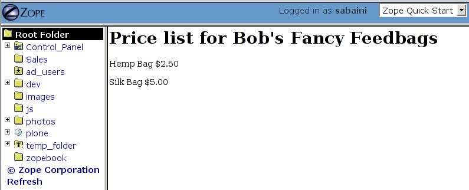
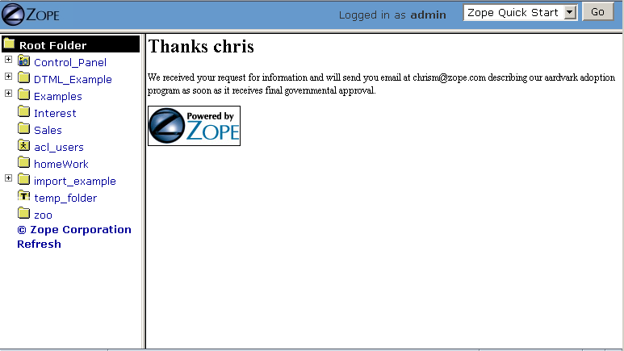
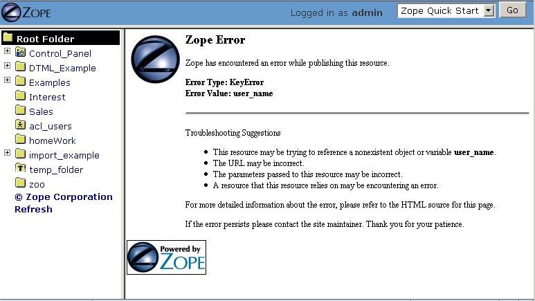
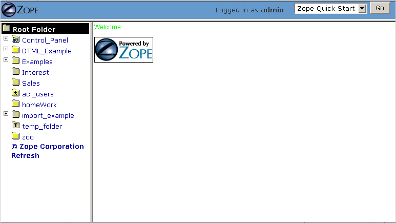
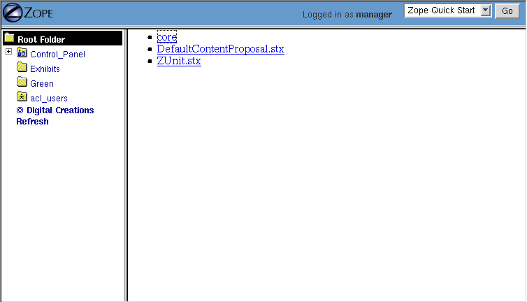
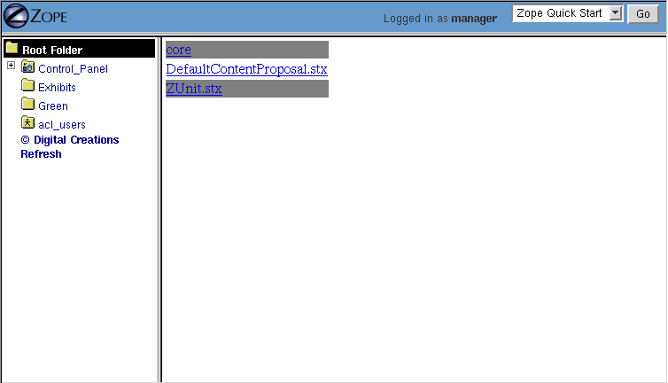

Basic DTML
==========

.. include:: includes/zope2_notice.rst

.. note::
    DTML has been the primary markup language within Zope for a long time.  However
    the *recommended* primary markup language within Zope is nowadays ZPT (Zope
    Page Templates). ZPT is your choice for generating markupish output like HTML
    or XML. The usage of DTML should be limited where you have to generate
    non-markupish output like text files or other formats. Since DTML is pretty old
    it really does not support features like internationalization or unicode very
    well.  In addition the syntax of DTML is not always very easy to understand.
    You have to learn DTML to some point if you intend to use ZSQL methods (for
    RDBMS integration with Zope) - but even for the RDBMS integration we have
    better solutions like Object-Relational-Mappers (check with the chapter about
    relational database connectivity).

DTML (Document Template Markup Language) is a templating facility which
supports the creation of dynamic HTML and text. In Zope it is most often used
when you want to generate non-HTML or non-XML content, like parts of SQL
queries, dynamic CSS and JavaScript files or email templates. Generating HTML
and XML is usually done with page templates inside Zope.

DTML is a *tag-based* presentation and scripting language.  This
means that *tags* (e.g. '<dtml-var name>') embedded in your text
cause parts of your text to be replaced with "computed" content.

DTML is a "server-side" scripting language.  This means that DTML
commands are executed by Zope at the server, and the result of that
execution is sent to your web browser. By contrast, "client-side"
scripting languages like JavaScript are not processed by the server,
but are rather sent to and executed by your web browser.

How DTML Relates to Similar Languages and Templating Facilities
---------------------------------------------------------------

DTML is similar in function to "HTML-embedded" scripting languages
such as JSP, PHP, or mod_perl.  It differs from these facilities
inasmuch as it will not allow you to create "inline" Python
*statements* (if... then.. else..)  in the way that JSP, mod_perl
or PHP will allow you to embed a block of their respective
language's code into a page. DTML does allow you to embed
Python *expressions* (a == 1) into tags.  It provides
flow control and conditional logic by way of "special" tags.
It is more similar to Perl's 'HTML::Template' package than it is
to mod_perl in this way.  It can also be compared to the web
server facility of Server Side Includes (SSI), but with far more
features and flexibility.

When To Use DTML
----------------

If you don't want to use page templates for whatever reason DTML might work
well. Likewise, if you want to dynamically create non-HTML text (like CSS
stylesheets or email messages), DTML can help.

When Not To Use DTML
--------------------

If you want code which expresses a set of complex algorithms to be
maintainable (as "logic" programming should be), you shouldn't
write it in DTML.  DTML is not a general purpose programming
language, it instead is a special language designed for formatting
and displaying content.  While it may be possible to implement
complex algorithms in DTML, it is often painful.

For example, let's suppose you want to output some text which
displays a representation of the famous `Fibonacci sequence
<https://www.mathsisfun.com/numbers/fibonacci-sequence.html>`_.
You would not want to write the program that actually makes the
calculation of the Fibonacci numbers by writing DTML.  It could be
done in DTML, but the result would be difficult to understand and
maintain.  However, DTML is perfect for describing the output that
the results of the Fibonnacci calculations are inserted into.  You
can "call out" from DTML to Script (Python) objects as necessary
and process the results of the call in DTML.  For example, it is
`trivial in Python <https://docs.python.org/tutorial/introduction.html>`_
(search for the word Fibonacci on this page) to implement a Fibonacci
sequence generator, and trivial in DTML to create some dynamic 
output which shows these numbers in a readable format.  If you find
yourself creating complex and hard-to-understand logic in DTML,
it's likely time to explore the the Zope features which allow you
to script "logic" in Python, while letting DTML do the
presentation "dirty work".

String processing is another area where DTML is likely not the
best choice.  If you want to manipulate input from a user in a
complex way, by using functions that manipulate strings, you are
better off doing it in Python, which has more powerful string
processing capabilities than DTML.

The Difference Between DTML Documents and DTML Methods
------------------------------------------------------

You can use DTML scripting commands in two types of Zope objects,
*DTML Documents* and *DTML Methods*.  These two types of DTML
objects are subtly different from one another, and their
differences cause many would-be DTML programmers to become
confused when deciding to use one versus the other.  So what is
the difference?

DTML Methods are used to carry out actions. They are
*presentation* objects (as used in the vernacular of the
`Using Basic Zope Objects <BasicObjects.html>`_ chapter).  If you want
to render the properties or attributes of another object like a DTML
Document or a Folder, you will use a DTML Method.  DTML Methods do
not have their own properties.

DTML Documents are *content* objects (in the vernacular used in
the chapter entitled `Using Basic Zope Objects <BasicObjects.html>`_).
If you want to create a "stand-alone" text document, you
might create a DTML Document object to hold the text.
DTML Document objects have their own *properties* (attributes),
unlike DTML Methods.

In almost all cases, you will want to use a DTML Method object to
perform DTML scripting.  DTML Document objects are an artifact of
Zope's history that is somewhat unfortunate.  In Zope's earlier
days, a consensus came about that it was important to have objects
in Zope that could perform DTML commands but have properties of
their own.  At the time, the other content objects in Zope, such
as Files and Images were either nonexistent or had limitations in
functionality that made the concept of a DTML Document attractive.
That attraction has waned as Zope's other built-in content objects
have become more functional.  DTML Documents remain in Zope almost
solely as a backwards-compatibility measure.  If you never use a
DTML Document in your work with Zope, you won't miss out on
much!

Details
-------

DTML Methods are method objects.  The chapter named `Object
Orientation <ObjectOrientation.html>`_ discusses the concept of a
"method".  DTML Methods are *methods* of the folder that
contains them, and thus they do not have regard for their own
identity as a Zope object when they are used. For example, if
you had a folder called Folder and a DTML method in that folder
called Method::

  AFolder/
          AMethod

AMethod is a *method* of AFolder. This means that AMethod does not
have any of it's own attributes or properties.  Instead it uses
those of AFolder. Suppose you put the following DTML string in
AMethod::

  <dtml-var id>

When you view the AMethod DTML Method, you will see the string
'AFolder', which is the 'id' of AMethod's containing Folder
(AFolder). When this DTML method is viewed, it resolves the name
'id' to the string which is the value of AFolder's 'id' property.

DTML Documents, on the other hand, are not methods.  They are
"aware" of their own identity as Zope objects. For example, if
you created a DTML Document in the folder AFolder called
ADocument, and you put the above DTML string into ADocument and
viewed it, it would render to the string 'ADocument'.  It
resolves the name 'id' to the string which is the value of
its *own* id, not the id of its containing folder.

.. important::
   
   For this chapter, unless stated otherwise, use DTML Methods to
   hold the example DTML text, as opposed to DTML Documents!**

DTML Tag Syntax
---------------

DTML contains two kinds of tags, *singleton* and *block* tags.
Singleton tags consist of one tag enclosed by less-than (&lt;) and
greater-than (&gt;) symbols.  The *var* tag is an example of a
singleton tag::

  <dtml-var parrot>

There's no need to close the *var* tag with a '</dtml-var>' tag
because it is a singleton tag.

Block tags consist of two tags, one that opens the block and one that
closes the block, and content that goes between them::

  <dtml-in mySequence>

    this is a text inside the dtml-in tag block

  </dtml-in>

The opening tag starts the block and the closing tag ends it. The
closing tag has the same name as the opening tag with a slash
preceding it. This is the same convention that HTML and XML use.

DTML Tag Names, Targets, and Attributes
---------------------------------------

All DTML tags have *names*.  The name is simply the word which
follows 'dtml-'.  For instance, the name of the DTML tag
'dtml-var' is 'var', and the name of the DTML tag 'dtml-in' is
'in'.

Most DTML tags have *targets*.  The target of a DTML tag is just
the word or expression that, after a space, follows the tag
name.  For example, the target of the DTML tag '<dtml-var
standard_html_header>' is 'standard_html_header'.  The target of
the DTML tag '<dtml-in foo>' is 'foo'.  The target of the DTML
tag '<dtml-var "objectIds()"> is the expression "objectIds()".
The target typically refers to the name of an object (or a
Python expression that resolves to an object) that you wish the
tag to operate upon.

All DTML tags have *attributes*. An attribute provides
information about how the tag is supposed to work. Some
attributes are optional. For example, the *var* tag inserts the
value of its target. It has an optional *missing* attribute that
specifies a default value in case the variable can't be found::

  <dtml-var wingspan missing="unknown wingspan">

If the *wingspan* variable is not found then 'unknown wingspan'
is inserted instead.

Some attributes don't have values. For example, you can convert
an inserted variable to upper case with the *upper* attribute::

  <dtml-var exclamation upper>

Here we are referencing the *exclamation* target, modifying it
with the attribute *upper*.  Notice that the *upper* attribute,
unlike the *missing* attribute doesn't need a value.

See the `DTML Reference <AppendixA.html>`_ appendix for more
information on the syntax of different DTML tags.

Creating a "Sandbox" for the Examples in This Chapter
-----------------------------------------------------

You should create a Folder in your Zope's root folder named
"DTML_Examples" if you intend on creating objects from examples in
this chapter.  Create the example objects within this "sandbox".
This prevents you from littering your Zope root folder with DTML
examples.

Examples of Using DTML for Common Tasks
---------------------------------------

Below, we show how to use DTML to complete three common tasks:
inserting text into a web page, displaying results by iterating
over a sequence, and processing form results.

Inserting Text into HTML with DTML
~~~~~~~~~~~~~~~~~~~~~~~~~~~~~~~~~~

DTML commands are written as tags that begin with *dtml-*.  You
create dynamic content in DTML by mixing content and DTML tags
together.  Inserting the value of a variable (a variable is also
known as a "target") into HTML is the most basic task that you can
perform with DTML.  Many DTML tags insert variable values, and
they all do it in a similar way.  Let's look more closely at how
Zope inserts variable values.

Create a folder in your sandbox with the id "Feedbags" and the
title "Bob's Fancy Feedbags". While inside the 'Feedbags' folder,
create a DTML Method with an id of "pricelist". Note: an
'id' is how you refer to an object such as a DTML Method
or a Folder later on; titles are for informational
purposes only. 

Change the contents of the DTML Method to the following::

  <dtml-var standard_html_header>

  <h1>Price list for <dtml-var title></h1>

  
Hemp Bag $2.50

  
Silk Bag $5.00

  <dtml-var standard_html_footer>

Now view the DTML Method by clicking the *View* tab. When you view
the DTML method this way, it will be *rendered*, which means that
you will not necessarily see a straight representation of the HTML
that you typed in to the form.  Instead you will see the
*rendered* version of the page, which will include the extra text
provided by DTML by way of the tags you've inserted.  You should
see something like the figure below:

   Viewing the pricelist method

If you tell your browser to view the HTML source of the Workspace
frame, you will see something not unlike the below::

  <html>
    <head><title>Bob's Fancy Feedbags</title>
    </head>
    <body bgcolor="#FFFFFF">
      <h1>Price list for Bob's Fancy Feedbags</h1>
      
Hemp Bag $2.50

      
Silk Bag $5.00

    </body>

  </html>

That's certainly not what you typed in, is it?

DTML makes the reuse of content and layout possible.  In the
example above, we've made use of the 'standard_html_header' DTML
Method and the 'standard_html_footer' DTML Method, both of which
live in the root folder, to insert HTML text into our page.  These
DTML methods (and any other DTML method) can be used by other DTML
methods to insert text into our rendered output.

We've seen that DTML inserts an HTML header, an HTML footer, and a
title into the web page.  But how does the "var" tag *find* the
values that it inserts in place of "standard_html_header", "title"
and "standard_html_footer"?

DTML name lookup is somewhat "magical", because you don't need to
explicitly tell DTML *where* to find a variable.  Instead, it
tries to guess what you mean by following a preordained set of
search rules.  DTML gets the values for variable names by
searching an environment which includes the current object, the
containment path, and request variables like values submitted by a
form and cookies.  The `DTML Name Lookup Rules <AppendixE.html>`_
represent the namespaces searched and their relative precedence.
As an example, let's follow the 'pricelist' DTML code
step-by-step.  In our 'pricelist' method, we've asked DTML to look
up three names: "standard_html_header", "title", and
"standard_html_footer".  It searches for these variables in the
order that they are mentioned in the page.

DTML looks first for "standard_html_header".  It looks in the
"current object" first, which is its container, the 'Feedbags'
folder. The 'Feedbags' folder doesn't have any methods or
properties or sub-objects by that name. Next Zope tries to
`acquire <Acquisition.html>`_ the object from its containers.  It
examines the 'Feedbags' folder's container (your sandbox folder,
likely named "DTML_Examples"), which also doesn't turn up
anything.  It continues searching through any intermediate
containters, which also don't have a method or property named
"standard_html_header" unless you've put one there.  It keeps
going until it gets to the root folder.  The root folder *does*
have a sub-object named "standard_html_header", which comes as a
default object in every Zope. The 'standard_html_header' object is
a DTML Method. So Zope *calls* the 'standard_html_header' method
in the root folder and inserts the results into the page.  Note
that once DTML *finds* a property or variable, if it is callable
(as in the case of a DTML Method, an External Method, a SQL
Method, or a Script (Python) object), it is called and the results
of the call are inserted into the page.

Next DTML looks for the name "title". Here, the search is 
shorter.  On its first try, DTML finds the 'Feedbags' folder's
'title' property and inserts it.  The 'title' property is not a
method or a script, so DTML doesn't need to *call* it.  It just
renders it into the output.

Finally DTML looks for the name *standard_html_footer*. It has to
search all the way up to the root folder to find it, just like it
looked for *standard_html_header*.  It calls the
*standard_html_footer* in the root and inserts the text result.

The resulting page is fully assembled (rendered) at this point,
and is sent to your browser.

Understanding how DTML looks up variables is important.  We will
explore the DTML name lookup mechanism further in the chapter
entitled `Variables and Advanced DTML <AdvDTML.html>`_.
It is also documented in `Appendix E <AppendixE.html>`_.

Formatting and Displaying Sequences
~~~~~~~~~~~~~~~~~~~~~~~~~~~~~~~~~~~

It is common that people want to use DTML to format and display
*sequences*.  A sequence is just a list of items, like "Fred, Joe,
Jim".  Often, you want to create an HTML table or a bulleted list
that contains elements in a sequence.  Let's use DTML to call out
to an object which returns a sequence and render its result.

Create a Script (Python) object named "actors" in your
sandbox folder. Give the script the following body and
save it::

  ## Script (Python) "actors"
  ##bind container=container
  ##bind context=context
  ##bind namespace=
  ##bind script=script
  ##bind subpath=traverse_subpath
  ##parameters=
  ##title=
  ##
  return ['Jack Lemmon', 'Ed Harris','Al Pacino', 'Kevin Spacey', 'Alan Arkin']

Make sure that all of the lines of this script line up along the
left-hand side of the textarea to avoid receiving an error when
you attempt to save the script, since Python is sensitive to
indentation.  Don't worry about the '##'s for now, we will
explain these later.  

This Script (Python) object returns a Python data
structure which is a *list* of *strings*.  A list is a kind of
*sequence*, which means that DTML can *iterate* over it using the
*dtml-in* tag.  Now create a DTML Method named "showActors" in
your sandbox, give it this body, and save it::

  <html>
  <body>
  <h1>Actors in the movie Glengarry Glen Ross</h1>
  <table border="1">
    <th>Name</th>
  <dtml-in actors>
    <tr>
    <td><dtml-var sequence-item></td>
    </tr>
  </dtml-in>
  </table>
  </body>
  </html>

The DTML *in* tag iterates over the results of the *actors* script
and inserts a table row into a table for each of the actors
mentioned in the script.  Note that inside the table cell, we use
a special name *sequence-item*.  *sequence-item* is a special name
that is meaningful within a *dtml-in* tag.  It refers to the
"current item" (in this case, the actor name string) during
processing.  The HTML source of the Workspace frame when you click
the *View* tab on the 'showActors' method will look something
like::

  <html>
  <body>
  <h1>Actors in the movie Glengarry Glen Ross</h1>
  <table border="1">
    <th>Name</th>
          <tr>
    <td>Jack Lemmon</td>

    </tr>
          <tr>
    <td>Ed Harris</td>
    </tr>
          <tr>
    <td>Al Pacino</td>
    </tr>
          <tr>

    <td>Kevin Spacey</td>
    </tr>
          <tr>
    <td>Alan Arkin</td>
    </tr>
        </table>
  </body>
  </html>

Note that you didn't have to specifically tell DTML that you are
querying a Script (Python) object.  You just tell it the name of
the object to call (in this case 'actors'), and it does the work
of figuring out how to call the object and pass it appropriate
arguments. If you replace the 'actors' Script with some other kind
of object that does exactly the same thing, like another DTML
Method, you won't have to change your 'showActors' DTML Method.
It will "just work".

Processing Input from Forms
~~~~~~~~~~~~~~~~~~~~~~~~~~~

You can use DTML to perform actions based on the information
contained in the submission of an HTML form.

Create a DTML Method named "infoForm" with the following body::

  <dtml-var standard_html_header>

  
Please send me information on your aardvark adoption
  program.

  <form action="infoAction">
  name: <input type="text" name="user_name"> 
  email: <input type="text" name="email_addr"> 
  <input type="submit" name="submit" value=" Submit ">
  </form>

  <dtml-var standard_html_footer>

This is a web form that asks the user for information,
specifically his user name and email address.  Note that you refer
to the name "infoAction" as the *action* of the HTML form.  This
really has nothing to do with DTML, it's an attribute of the HTML
*form* tag.  But the name specified in the form action tag can
name another Zope object which will receive and process the
results of the form when it is submitted.

Create a DTML Method named *infoAction* in the same folder as the
'infoForm' method.  This is the *target* of the 'infoForm' form
action.  This method will display a bland "thanks" message which
includes the name and email information that was gathered from the
web form.  Provide the *infoAction* method with the following body
and save it::

  <dtml-var standard_html_header>

  <h1>Thanks <dtml-var user_name></h1>

  
We received your request for information and will send you
  email at <dtml-var email_addr> describing our aardvark adoption
  program as soon as it receives final governmental approval.
  

  <dtml-var standard_html_footer>

Navigate back to the 'infoForm' method and use the *View* tab to
execute it.  Fill out the form and click the *Submit* button. If
all goes well you should see a thank you message that includes
your name and email address, much like the figure below:

   Result of submitting the infoForm method

The Zope object named *REQUEST* contains information about the
current web request.  This object is in the DTML name lookup path.
The 'infoAction' method found the form information from the web
request that happened when you clicked the submit button on the
rendering of 'infoForm'.  DTML looks for variables in the current
web request, so you can just refer to the form variable names in
the target method by name.  In our case, we were able to display
the values of the form elements *user_name* and *email_addr* in
the 'infoAction' method just by referring to them by name in their
respective *dtml-var* tags.  DTML used its `lookup
rules <AppendixE.html>`_ to search for the variable names.  It found
the names in the "REQUEST.form" namespace and displayed them.  If
it had found an object with either name *email_addr* or
*user_name* earlier in the lookup (if perhaps there was a Zope
object in your acquisition path named 'user_name') it would have
found this object first and rendered its results.  But, mostly by
chance, it didn't, and found the name in REQUEST instead.

Let's examine the contents of the Zope REQUEST object in order to
shed more light on the situation.  Create a new DTML Method object
named 'show_request' in your sandbox folder.  Give it the the
following body::

  <dtml-var REQUEST>

The 'show_request' method will render a human-readable
representation of Zope's REQUEST object when you click submit on
the 'infoForm' rendering.  Visit the 'infoForm' method, and change
it to the following::

  <dtml-var standard_html_header>

  
Please send me information on your aardvark adoption
  program.

  <form action="show_request">
  name: <input type="text" name="user_name"> 
  email: <input type="text" name="email_addr"> 
  <input type="submit" name="submit" value=" Submit ">
  </form>

  <dtml-var standard_html_footer>

We changed the form action of the 'infoForm' method to
*show_request*.  Now click the *View* tab of the new 'infoForm'
method.  Fill in some information in the form elements, and click
*Submit*.  You will see something like the following::

  form
   submit ' Submit '
   email_addr 'chrism@zope.com'
   user_name 'Chris'

  cookies
   tree-s 'eJzTiFZ3hANPW/VYHU0ALlYElA'

  lazy items
   SESSION <bound method SessionDataManager.getSessionData of <SessionDataManager instance at 897d020>

  other
   AUTHENTICATION_PATH ''
   user_name 'Chris'
   PUBLISHED <DTMLMethod instance at 8a62670>
   submit ' Submit '
   SERVER_URL 'http://localsaints:8084'
   email_addr 'chrism@zope.com'
   tree-s 'eJzTiFZ3hANPW/VYHU0ALlYElA'
   URL 'http://localsaints:8084/DTML_Example/show_request'
   AUTHENTICATED_USER admin
   TraversalRequestNameStack []
   URL0 http://localsaints:8084/DTML_Example/show_request
   URL1 http://localsaints:8084/DTML_Example
   URL2 http://localsaints:8084
   BASE0 http://localsaints:8084
   BASE1 http://localsaints:8084
   BASE2 http://localsaints:8084/DTML_Example
   BASE3 http://localsaints:8084/DTML_Example/show_request

  environ
   SCRIPT_NAME ''
   HTTP_ACCEPT_ENCODING 'gzip, deflate, compress;q=0.9'
   SERVER_PORT '8084'
   PATH_TRANSLATED '/DTML_Example/show_request'
   HTTP_ACCEPT 'text/xml...'
   GATEWAY_INTERFACE 'CGI/1.1'
   HTTP_COOKIE 'tree-s="eJzTiFZ3hANPW/VYHU0ALlYElA"'
   HTTP_ACCEPT_LANGUAGE 'en-us, en;q=0.50'
   REMOTE_ADDR '192.168.1.3'
   SERVER_NAME 'saints'
   HTTP_USER_AGENT 'Mozilla/5.0 (Windows; U; Windows NT 5.0; en-US; rv:1.1a+)'
   HTTP_ACCEPT_CHARSET 'ISO-8859-1, utf-8;q=0.66, *;q=0.66'
   CONNECTION_TYPE 'keep-alive'
   channel.creation_time 1027876407
   QUERY_STRING 'user_name=Chris&email_addr=chrism%40zope.com&submit=+Submit+'
   SERVER_PROTOCOL 'HTTP/1.1'
   HTTP_KEEP_ALIVE '300'
   HTTP_HOST 'localsaints:8084'
   REQUEST_METHOD 'GET'
   PATH_INFO '/DTML_Example/show_request'
   HTTP_REFERER 'http://localsaints:8084/DTML_Example/infoForm'

You have instructed the 'show_request' method to render the
contents of the web request initiated by the 'infoForm' method.
Note that each section (form, cookies, lazy items, other, and
environ) represents a *namespace* inside the REQUEST.  DTML
searches all of these namespaces for the names you refer to in
your 'infoForm' form.  Note that *email_addr* and *user_name* are
in the "form" namespace of the REQUEST.  There is lots of
information in the rendering of the REQUEST, but for us, this is
the most pertinent.  For more information on the REQUEST object,
visit the Zope Help system, and choose Zope Help -> API Reference
-> Request.

Dealing With Errors
~~~~~~~~~~~~~~~~~~~

Let's perform an experiment. What happens if you try to view the
'infoAction' method you created in the last section directly, as
opposed to getting to it by submitting the 'infoForm' method?
Click on the 'infoAction' method and then click the *View* tab.
You will see results not unlike those in the figure below.

   DTML error resulting from a failed variable lookup

Zope couldn't find the *user_name* variable since it was not in
the current object, its containers or the web request. This is an
error that you're likely to see frequently as you learn
Zope. Don't fear, it just means that you've tried to insert a
variable that Zope can't find.  You can examine the error by
visiting the *error_log* object in your root folder.  In this
case, we know why the error occurred, so visiting the error in the
*error_log* isn't really necessary.  In this example, you need to
either insert a variable that Zope can find, or use the 'missing'
attribute on the var tag as described above::

  <h1>Thanks <dtml-var user_name missing="Anonymous User"></h1>

Understanding where DTML looks for variables will help you figure
out how to fix this kind of problem.  In this case, you have
viewed a method that needs to be called from an HTML form like
*infoForm* in order to provide variables to be inserted in the
output.

Dynamically Acquiring Content
~~~~~~~~~~~~~~~~~~~~~~~~~~~~~

Zope looks for DTML variables in the current object's containers
(its parent folders) if it can't find the variable first in the
current object. This behavior allows your objects to find and use
content and behavior defined in their parents.  Zope uses the term
*acquisition* to refer to this dynamic use of content and
behavior.

An example of acquisition that you've already seen is how web
pages use standard headers and footers. To acquire the standard
header just ask Zope to insert it with the *var* tag::

  <dtml-var standard_html_header>

It doesn't matter where the 'standard_html_method' object or
property is located. Zope will search upwards in the object
database until it finds the 'standard_html_header' that is defined
in the root folder.

You can take advantage of how Zope looks up variables to customize
your header in different parts of your site. Just create a new
'standard_html_header' in a folder and it will override global
header for all web pages in your folder and below it.

Create a new folder in your "sandbox" folder with an id of
"Green". Enter the 'Green' folder and create a DTML Method with an
id of "welcome". Edit the 'welcome' DTML Method to have these
contents::

  <dtml-var standard_html_header>

  
Welcome

  <dtml-var standard_html_footer>

Now view the 'welcome' method. It should look like a simple web
page with the word *welcome*, as shown in the figure below.

   Welcome method

Now let's customize the header for the *Green* folder. Create a
DTML Method in the *Green* folder with an id of
"standard_html_header". Give it the following body::

  <html>
  <head>
    
  </head>
  <body>

Notice that this is not a complete web page. For example, it does
not have an ending '</html>' tag.  This is just a fragment of HTML
that will be used as a header, meant to be included into other
pages. This header uses `CSS <https://www.w3.org/Style/CSS>`_
(Cascading Style Sheets) to make some changes to the look and feel
of web pages.

Now revisit the 'welcome' method and click its *View* tab again.
You will see something like the figure below:

   Welcome method with custom header

The rendering now looks quite different. This is because it is now
using the new header we introduced in the 'Green' folder. This
header will be used by all web pages in the 'Green' folder and its
sub-folders.

You can continue this process of overriding default content by
creating another folder inside the 'Green' folder and creating a
'standard_html_header' DTML Method there. Now web pages in the
sub-folder will use their local header rather than the 'Green'
folder's header.  You can of course also create a
'standard_html_footer', providing it with local content as well.

Using this pattern you can quickly change the look and feel of
different parts of your website. If you later decide that an area
of the site needs a different header, just create one. You don't
have to change the DTML in any of the web pages; they'll
automatically find the closest header and use it.

Using Python Expressions from DTML
~~~~~~~~~~~~~~~~~~~~~~~~~~~~~~~~~~

So far we've looked at simple DTML tags. Here's an example::

  <dtml-var getHippo>

This will insert the value of the variable named *getHippo*,
whatever that may be.  DTML will automatically take care of the
details, like finding the object which represents the variable and
calling it if necessary. We call this basic tag syntax *name*
syntax to differentiate it from *expression* syntax.

When you use DTML name syntax, DTML tries to do the right thing to
insert the results of the object looked up by the variable name,
no matter what that object may be. In general this means that if
the variable is another DTML Method or DTML Document, it will be
called with appropriate arguments.  However, if the variable is
*not* another DTML Method or DTML Document, and it requires
parameters, you need to explicitly pass the arguments along using
an expression.

*Expressions* used in DTML allow you to be more explicit about how
to find and call variables. Expressions are tag attributes that
contain small snippets of code in the Python programming language.
These are typically referred to as *Python expressions*.

A Python expression is essentially any bit of code that *is not* a
Python *statement*.  For example, the Python statement 'a = 1'
assigns "1" to the "a" variable. You cannot use this statement in
DTML expressions.  Likewise, you cannot use the statement 'print
"x"' in DTML.  It is not an expression.  Essentially, an
expression must be a combination of values, variables, and Python
*operators*.  To find out more about Python's expression syntax,
see the `Python Tutorial <https://docs.python.org/tutorial/>`_
at the Python.org website.

An expression always results in a return value.  For example, the
Python expression "a == 5" returns the integer 1 if "a" is equal
to the integer 5 or the integer 0 if "a" is not equal to the
integer 5.  The return value of an expression is used by DTML as
the *target* of the DTML command.

The primary difference in DTML between using *expressions* as
targets and *names* as targets is that DTML does some magic after
it locates a *named* targets that it does not do after it finds an
expression targets.  For example, after finding object with the
name 'standard_html_header' in the root folder via the name-syntax
DTML command '<dtml-var standard_html_header>', DTML *calls* the
'standard_html_header' object, inserting the results into the
page.  However, when you use an expression-syntax DTML command,
like '<dtml-var expr="standard_html_header">', DTML *will not*
call the 'standard_html_header' object.  Instead it will return a
representation of the object as a string.  In order to *call* the
'standard_html_header' object in an expression-syntax DTML tag,
you need to do it explicitly by passing along arguments.  When you
delve into the realm of DTML expression syntax, DTML "magic" goes
away, and you need to become aware of the arguments accepted by
the target (if any) and pass them along.

Let's create a Script (Python) object named 'getHippo' that *must*
be called in DTML with expression syntax, because it takes a
non-optional argument that *named* DTML syntax cannot provide.

Create a Script (Python) in your sandbox folder named *getHippo*.
Provide it with the following body::

  ## Script (Python) "getHippo"
  ##bind container=container
  ##bind context=context
  ##bind namespace=
  ##bind script=script
  ##bind subpath=traverse_subpath
  ##parameters=trap
  ##title=
  ##
  return 'The hippo was captured with a %s.' % trap

Note that this Script (Python) object takes a single parameter
named "trap".  It is not an optional parameter, so we need to pass
a value in to this script for it to do anything useful.

Now let's make a DTML method to call 'getHippo'.  Instead of
letting DTML find and call *getHippo*, we can use an expression to
explicitly pass arguments.  Create a DTML method named *showHippo*
and give it the following body::

  <dtml-var expr="getHippo('large net')">

Here we've used a Python expression to explicitly call the
'getHippo' method with the string argument, 'large net'.  View the
'showHippo' DTML Method.  It will return a result not unlike the
following::

    The hippo was captured with a large net.

To see why we need to use expression syntax to call this script,
let's modify the 'showHippo' method to use DTML name syntax::

  <dtml-var getHippo>

View the method.  You will receive an error not unlike the
following::

  Error Type: TypeError
  Error Value: getHippo() takes exactly 1 argument (0 given)

The 'getHippo' method requires that you pass in an argument,
'trap', that cannot be provided using DTML name syntax.  Thus, you
receive an error when you try to view the 'showHippo' method.

Expressions make DTML pretty powerful. For example, using Python
expressions, you can easily test conditions::

    <dtml-if expr="foo < bar">
      Foo is less than bar.
    </dtml-if>

Without expressions, this very simple task would have to be broken
out into a separate method and would add a lot of overhead for
something this trivial.

Before you get carried away with expressions, take
care. Expressions can make your DTML hard to understand. Code that
is hard to understand is more likely to contain errors and is
harder to maintain. Expressions can also lead to mixing logic in
your presentation. If you find yourself staring blankly at an
expression for more than five seconds, stop. Rewrite the DTML
without the expression and use a Script to do your logic. Just
because you can do complex things with DTML doesn't mean you
should.

DTML Expression Gotchas
%%%%%%%%%%%%%%%%%%%%%%%

Using Python expressions can be tricky. One common mistake is
to confuse expressions with basic tag syntax. For example::

  <dtml-var objectValues>

and::

  <dtml-var expr="objectValues">

These two examples if you are to put them in a DTML Method will
end up giving you two completely different results. The first
example of the DTML *var* tag will automatically *call* the
object which is represented by *objectValues*. 

In an expression, you have complete control over the variable
rendering.  In the case of our example, *objectValues* is a
method implemented in Python which returns the values of the
objects in the current folder.  It has no required arguments.
So::

  <dtml-var objectValues>

will call the method. However::

  <dtml-var expr="objectValues">

will *not* call the method, it will just try to insert
it. The result will be not a list of objects but a string such
as '<Python Method object at 8681298>'. If you ever see results
like this, there is a good chance that you're returning a
method, rather than calling it.

To call a Python method which requires no arguments from an
expression, you must use standard Python calling syntax by using
parenthesis::

  <dtml-var expr="objectValues()">

The lesson is that if you use Python expressions you must know
what kind of variable you are inserting and must use the proper
Python syntax to appropriately render the variable.

Before we leave the subject of variable expressions we should
mention that there is a deprecated form of the expression
syntax. You can leave out the "expr=" part on a variable
expression tag.  But *please* don't do this.  It is far too easy
to confuse::

  <dtml-var aName>

with::

  <dtml-var "aName">

and get two completely different results.  These "shortcuts" were
built into DTML long ago, but we do not encourage you to use them now
unless you are prepared to accept the confusion and debugging
problems that come from this subtle difference in syntax.

Common DTML Tags
----------------

Below, we discuss the most common DTML tags: the *var* tag, the
*if* tag, the *else* tag, the *elif* tag, and the *in* tag,
providing examples for the usage of each.

The *Var* Tag
~~~~~~~~~~~~~

The *var* tag inserts variables into DTML Methods and Documents.  We've
already seen many examples of how the *var* tag can be used to insert
strings into web pages.

As you've seen, the *var* tag looks up variables first in the
current object, then in its containers and finally in the web
request.

The *var* tag can also use Python expressions to provide more
control in locating and calling variables.

*Var* Tag Attributes
%%%%%%%%%%%%%%%%%%%%

You can control the behavior of the *var* tag using its
attributes. The *var* tag has many attributes that help you in
common formatting situations. The attributes are summarized in
Appendix A. Here's a sampling of *var* tag attributes.

html_quote
  This attribute causes the inserted values to be HTML quoted. This means that
  '<', '>' and '&' are escaped. Note that all string values which are retrieved
  from the REQUEST namespace are HTML-quoted by default. This helps to prevent
  "cross-site scripting" security holes, where a user could insert some clever
  JavaScript into a page in order to possibly make you divulge information to
  him which could be private. For more information, see the `CERT advisory
  <https://vuls.cert.org/confluence/display/historical/CERT+Advisory+CA-2000-02+Malicious+HTML+Tags+Embedded+in+Client+Web+Requests>`_ on the topic.

missing
  The missing attribute allows you to specify a default value to use in
  case Zope can't find the variable. For example::

    <dtml-var bananas missing="We have no bananas">

fmt
  The fmt attribute allows you to control the format of the *var* tags
  output. There are many possible formats which are detailed in `Appendix
  A <AppendixA.html>`_.

  One use of the *fmt* attribute is to format monetary
  values. For example, create a *float* property in your root
  folder called *adult_rate*.  This property will represent
  the cost for one adult to visit the Zoo.  Give this property
  the value '2.2'.

  You can display this cost in a DTML Document or Method like so::

    One Adult pass: <dtml-var adult_rate fmt=dollars-and-cents>

  This will correctly print "$2.20". It will round more
  precise decimal numbers to the nearest penny.

*Var* Tag Entity Syntax
%%%%%%%%%%%%%%%%%%%%%%%

Zope provides a shortcut DTML syntax just for the simple *var*
tag.  Because the *var* tag is a singleton, it can be represented
with an *HTML entity* like syntax::

  &dtml-cockatiel;

This is equivalent to::

  <dtml-var name="cockatiel" html_quote>

Entity-syntax-based DTML tags always "html quote" their
renderings.  The main reason to use the entity syntax is to
avoid putting DTML tags inside HTML tags. For example, instead
of writing::

  <input type="text" value="<dtml-var name="defaultValue" html_quote>">

You can use the entity syntax to make things more readable for
you and your text editor::

  <input type="text" value="&dtml-defaultValue;">

The *var* tag entity syntax is very limited. You can't use
Python expressions within entity-based DTML syntax and many DTML
attributes won't work with it. See `Appendix A`_
for more information on *var* tag entity syntax.

The *If* Tag
~~~~~~~~~~~~

One of DTML's important benefits is to let you customize your web
pages. Often customization means testing conditions and responding
appropriately.  This *if* tag lets you evaluate a condition and
carry out different actions based on the result.

What is a condition?  A condition is either a true or false
value. In general all objects are considered true unless they are
0, None, an empty sequence or an empty string.

Here's an example condition:

objectValues
  True if the variable *objectValues* exists and
  is true. That is to say, when found and rendered *objectValues*
  is not 0, None, an empty sequence, or an empty string.

As with the *var* tag, you can use both name syntax and expression
syntax. Here are some conditions expressed as DTML expressions.

expr="1"
  Always true.

expr="rhino"
  True if the rhino variable is true.

expr="x < 5"
  True if x is less than 5.

expr="objectValues('File')"
  True if calling the *objectValues* method with an argument of *File*
  returns a true value.  This method is explained in more detail in this
  chapter.

The *if* tag is a block tag. The block inside the *if* tag is executed
if the condition is true.

Here's how you might use a variable expression with the *if* tag to
test a condition::

  
How many monkeys are there?

  <dtml-if expr="monkeys > monkey_limit">
    
There are too many monkeys!

  </dtml-if>

In the above example, if the Python expression 'monkeys > monkey_limit'
is true then you will see the first and the second paragraphs of
HTML. If the condition is false, you will only see the first.

*If* tags can be nested to any depth, for example, you
could have::

  
Are there too many blue monkeys?

  <dtml-if "monkeys.color == 'blue'">
    <dtml-if expr="monkeys > monkey_limit">
      
There are too many blue monkeys!

    </dtml-if>
  </dtml-if>

Nested *if* tags work by evaluating the first condition, and if that
condition is true, then they evaluate the second
condition.  In general, DTML *if* tags work very much like
Python *if* statements...

Name and Expression Syntax Differences
%%%%%%%%%%%%%%%%%%%%%%%%%%%%%%%%%%%%%%

The name syntax checks for the *existence* of a name, as well as
its value. For example::

  <dtml-if monkey_house>
    
There <em>is</em> a monkey house, Mom!

  </dtml-if>  

If the *monkey_house* variable does not exist, then this condition
is false. If there is a *monkey_house* variable but it is false,
then this condition is also false. The condition is only true is
there is a *monkey_house* variable and it is not 0, None, an empty
sequence or an empty string.

The Python expression syntax does not check for variable
existence. This is because the expression must be valid
Python. For example::

  <dtml-if expr="monkey_house">
    
There <em>is</em> a monkey house, Mom!

  </dtml-if>

This will work as expected as long as *monkey_house* exists.  If
the *monkey_house* variable does not exist, Zope will raise a
*KeyError* exception when it tries to find the variable.

*Else* and *Elif* Tags
%%%%%%%%%%%%%%%%%%%%%%

The *if* tag only lets you take an action if a condition is
true. You may also want to take a different action if the
condition is false.  This can be done with the DTML *else* tag.
The *if* block can also contain an *else* singleton tag. For
example::

  <dtml-if expr="monkeys > monkey_limit">
    
There are too many monkeys!

  <dtml-else>
    
The monkeys are happy!

  </dtml-if>

The *else* tag splits the *if* tag block into two blocks, the first
is executed if the condition is true, the second is executed if
the condition is not true.

A *if* tag block can also contain a *elif* singleton tag. The *elif*
tag specifies another condition just like an addition *if* tag.
This lets you specify multiple conditions in one block::

  <dtml-if expr="monkeys > monkey_limit">
    
There are too many monkeys!

  <dtml-elif expr="monkeys < minimum_monkeys">
    
There aren't enough monkeys!

  <dtml-else>
    
There are just enough monkeys.

  </dtml-if>

An *if* tag block can contain any number of *elif* tags but only
one *else* tag. The *else* tag must always come after the *elif*
tags.  *Elif* tags can test for condition using either the name
or expression syntax.

Using Cookies with the *If* Tag
%%%%%%%%%%%%%%%%%%%%%%%%%%%%%%%

Let's look at a more meaty *if* tag example.  Often when you have
visitors to your site you want to give them a cookie to identify
them with some kind of special value.  Cookies are used frequently
all over the Internet, and when they are used properly they are
quite useful.

Suppose we want to differentiate new visitors from folks who have
already been to our site. When a user visits the site we can set a
cookie. Then we can test for the cookie when displaying pages. If
the user has already been to the site they will have the
cookie. If they don't have the cookie yet, it means that they're
new.

Suppose we're running a special. First time zoo visitors get in
for half price. Here's a DTML fragment that tests for a cookie
using the *hasVisitedZoo* variable and displays the price
according to whether a user is new or a repeat visitor::

  <dtml-if hasVisitedZoo>
    
Zoo admission <dtml-var adult_rate fmt="dollars-and-cents">.

  <dtml-else>
    
Zoo admission for first time visitors
         <dtml-var expr="adult_rate/2" fmt="dollars-and-cents">

  </dtml-if>  

This fragment tests for the *hasVisitedZoo* variable. If the user
has visited the zoo before it displays the normal price for
admission. If the visitor is here for the first time they get in
for half-price.

Just for completeness sake, here's an implementation of the
*hasVisitedZoo* method as a Python-based Script that has no
parameters.::

  ## Script(Python) "hasVisitedZoo"
  ##
  """
  Returns true if the user has previously visited
  the Zoo. Uses cookies to keep track of zoo visits.
  """
  request = context.REQUEST
  response = request.RESPONSE
  if request.has_key('zooVisitCookie'):
      return 1
  else:
      response.setCookie('zooVisitCookie', '1')
      return 0

In the chapter entitled `Advanced Zope Scripting <ScriptingZope.html>`_,
we'll look more closely at how to script business logic with Python.  For
now it is sufficient to see that the method looks for a cookie and returns
a true or false value depending on whether the cookie is found or not.
Notice how Python uses if and else statements just like DTML uses if and
*else* tags. DTML's *if* and *else* tags are based on Python's. In fact
Python also has an elif statement, just like DTML.

The *In* Tag
~~~~~~~~~~~~

The DTML *in* tag iterates over a sequence of objects, carrying out
one block of execution for each item in the sequence.  In
programming, this is often called *iteration*, or *looping*.

The *in* tag is a block tag like the *if* tag.  The content of the *in*
tag block is executed once for every iteration in the *in* tag
loop. For example::

  <dtml-in todo_list>
    
<dtml-var description>

  </dtml-in>

This example loops over a list of objects named *todo_list*. For
each item, it inserts an HTML paragraph with a description of
the to do item.

Iteration is very useful in many web tasks.  Consider a site that
display houses for sale.  Users will search your site for houses
that match certain criteria.  You will want to format all of those
results in a consistent way on the page, therefore, you will need
to iterate over each result one at a time and render a similar
block of HTML for each result.

In a way, the contents of an *in* tag block is a kind of *template*
that is applied once for each item in a sequence.

Iterating over Folder Contents
%%%%%%%%%%%%%%%%%%%%%%%%%%%%%%

Here's an example of how to iterate over the contents of a
folder. This DTML will loop over all the files in a folder and
display a link to each one.  This example shows you how to
display all the "File" objects in a folder, so in order to run
this example you will need to upload some files into Zope as
explained in the chapter entitled `Basic Zope Objects <BasicObject.rst>`_.
Create a DTML Method with the following body::

  <dtml-var standard_html_header>
  <ul>
  <dtml-in expr="objectValues('File')">
    <li><a href="&dtml-absolute_url;"><dtml-var title_or_id></a></li>
  </dtml-in>
  </ul>
  <dtml-var standard_html_footer>

This code displayed the following file listing, as shown in the
figure below.

   Iterating over a list of files

Let's look at this DTML example step by step.  First, the *var*
tag is used to insert your common header into the method.  Next,
to indicate that you want the browser to draw an HTML bulleted
list, you have the *ul* HTML tag.

Then there is the *in* tag.  The tag has an expression that is
calling the Zope API method called *objectValues*.  This method
returns a sequence of objects in the current folder that match a
given criteria.  In this case, the objects must be files.  This
method call will return a list of files in the current folder.

The *in* tag will loop over every item in this sequence.  If there are
four file objects in the current folder, then the *in* tag will execute
the code in its block four times; once for each object in the
sequence.

During each iteration, the *in* tag looks for variables in the
current object, first. In the chapter entitled `Variables and
Advanced DTML`_ we'll look more closely at how DTML
looks up variables.

For example, this *in* tag iterates over a collection of File
objects and uses the *var* tag to look up variables in each
file::

  <dtml-in expr="objectValues('File')">
    <li><a href="&dtml-absolute_url;"><dtml-var title_or_id></a></li>
  </dtml-in>

The first *var* tag is an entity and the second is a normal DTML
*var* tag.  When the *in* tag loops over the first object its
*absolute_url* and *title_or_id* variables will be inserted in
the first bulleted list item::

  <ul>
    <li><a href="http://localhost:8080/FirstFile">FirstFile</a></li>

During the second iteration the second object's *absolute_url*
and *title_or_id* variables are inserted in the output::

  <ul>
    <li><a href="http://localhost:8080/FirstFile">FirstFile</a></li>
    <li><a href="http://localhost:8080/SecondFile">SecondFile</a></li>

This process will continue until the *in* tag has iterated over
every file in the current folder.  After the *in* tag you
finally close your HTML bulleted list with a closing *ul* HTML
tag and the *standard_html_footer* is inserted.

*In* Tag Special Variables
%%%%%%%%%%%%%%%%%%%%%%%%%%

The *in* tag provides you with some useful information that
lets you customize your HTML while you are iterating over a
sequence.  For example, you can make your file library easier to
read by putting it in an HTML table and making every other table
row an alternating color, like this, as shown in the figure below.

   File listing with alternating row colors

The *in* tag makes this easy.  Change your file library method a
bit to look like this::

  <dtml-var standard_html_header>

  <table>
  <dtml-in expr="objectValues('File')">
    <dtml-if sequence-even>
      <tr bgcolor="grey">
    <dtml-else>
      <tr>
    </dtml-if>    
    <td>
    <a href="&dtml-absolute_url;"><dtml-var title_or_id></a>
    </td></tr>
  </dtml-in>
  </table>

  <dtml-var standard_html_footer>

Here an *if* tag is used to test for a special variable called
'sequence-even'.  The *in* tag sets this variable to a true or false
value each time through the loop.  If the current iteration number is
even, then the value is true, if the iteration number is odd, it is
false.

The result of this test is that a *tr* tag with either a gray
background or no background is inserted for every other object in
the sequence.  As you might expect, there is a 'sequence-odd' that
always has the opposite value of 'sequence-even'.

There are many special variables that the *in* tag defines for you.  Here
are the most common and useful:

sequence-item
  This special variable is the current item in the
  iteration.

  In the case of the file library example, each time through the loop
  the current file of the iteration is assigned to sequence-item.  It
  is often useful to have a reference to the current object in the
  iteration.

sequence-index
  the current number, starting from 0, of iterations
  completed so far.  If this number is even, 'sequence-even' is true and
  'sequence-odd' is false.

sequence-number
  The current number, starting from 1, of iterations
  completed so far.  This can be thought of as the cardinal position
  (first, second, third, etc.) of the current object in the loop.
  If this number is even, 'sequence-even' is false and 'sequence-odd'
  is true.

sequence-start
  This variable is true for the very first iteration.

sequence-end
  This variable is true for the very last iteration.

These special variables are detailed more thoroughly in `Appendix A`_.

Summary
-------

DTML is a powerful tool for creating dynamic content. It allows you to
perform fairly complex calculations. In the chapter entitled `Variables and
Advanced DTML`_, you'll find out about many more DTML tags, and more
powerful ways to use the tags you already have seen. Despite its power, you
should resist the temptation to use DTML for complex scripting. In the
chapter entitled `Advanced Zope Scripting`_ you'll find out about how to
use Python for scripting business logic.
