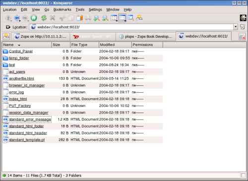
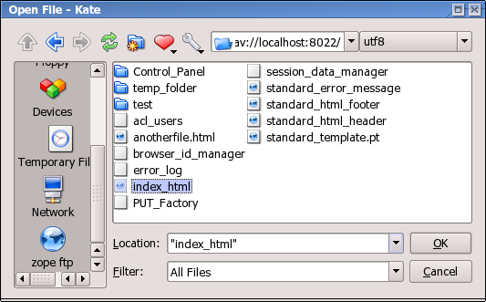

Managing Zope Objects Using External Tools
##########################################

.. include:: includes/zope2_notice.rst

So far, you've been working with Zope objects in your web browser via the Zope
Management Interface. This chapter details how to use common non-browser-based
common to access and modify your Zope content.

Editing Zope content and code in the Zope Management Interface is sometimes
painful, especially when dealing with Python code, DTML, ZPT, or even just
HTML. The standard TEXTAREA text manipulation widget provided by most browsers
has an extremely limited feature set: no syntax highlighting, no auto-indent, no
key re-bindings, no WYSIWYG HTML editing, and sometimes not even a search and
replace function!

In short, people want to use their own tools, or at least more feature-rich
tools, to work with Zope content.

It is possible under most operating systems to use the text "cut and paste"
facility (Ctrl-C, Ctrl-V under Windows, for example) to move text between
traditional text/HTML editors and your browser, copying data back and forth
between the Zope Management interface and your other tools. This is, at best,
cumbersome.

Luckily, Zope provides features that may allow you to interface Zope directly
with your existing tools. This chapter describes these features, as well as the
caveats for working with them.

General Caveats
===============

Most external tools expect to deal with "file-like" content. Zope objects are
not really files in the strict sense of the word so there are caveats to using
external tools with Zope:

- Zope data is not stored in files in the filesystem. Thus, tools which only
  work on files will not work with Zope without providing a "bridge" between
  the tool and Zope's file-like representation of its object database. This
  "bridge" is typically accomplished using Zope's WebDAV features.

- Zope doesn't enforce any file extension rules when creating objects. Some
  tools don't deal well with objects that don't have file extensions in their
  names (notably Macromedia Dreamweaver). To avoid this issue, you may name
  your objects with file extensions according to their type (e.g. name all of
  your ZPT objects with an `.html` file extension), or use a tool that
  understands extension-less "files". However, this approach has numerous
  drawbacks.

- External tools don't know about Zope object properties. If you modify an
  object in an external tool, it may forget its property list.

- Some external tools have semantics that can drive Zope crazy. For instance,
  some like to create backup files with an id that is invalid for Zope. Also,
  some tools will do a move-then-copy when saving, which creates a new Zope
  object that is divorced from the history of the original object.

- There is nowhere to send meaningful error messages. These integration
  features expect a finite set of errors defined by the protocol. Thus, the
  actual problem reported by Zope, such as a syntax error in a page template,
  cannot be displayed to the user.

- The interactions between the tools and Zope can vary widely. On the client
  side, different versions of software have different bugs and features.
  Also, Microsoft has many different implementations
  of DAV in Windows and Office, each with changes that make life difficult.

- Finally, the semantics of Zope can interfere with the experience. The same
  file on your hard drive, when copied into your local copy of
  Zope, will have different results. In the case of the CMF, Zope will actually
  alter what you saved (to add metadata).

These caveats aside, you may use traditional file manipulation tools to manage
most kinds of Zope objects.

WebDAV
======

Most Zope "file-like" objects like DTML Methods, DTML Documents, Zope Page
Templates, Script (Python) objects and others can be edited with
WebDAV. Many HTML and text editors support this protocol for editing
documents on remote servers. This protocol has advantages and
disadvantages:

`WebDAV <http://www.webdav.org/>`_ is a new Internet protocol based on the
Web's underlying protocol, HTTP. DAV stands for Distributed Authoring and
Versioning.

Editing Zope Objects with WebDAV
~~~~~~~~~~~~~~~~~~~~~~~~~~~~~~~~

WebDAV is an extension to the HTTP protocol that provides features that allow
users to concurrently author and edit content on websites. WebDAV offers
features like locking, revision control, and the tagging of objects with
properties. Because WebDAV's goals of through the web editing match some of the
goals of Zope, Zope has supported the WebDAV protocol for a fairly long time.

WebDAV is a newer Internet protocol compared to HTTP, so there are fewer
clients that support it. There is, however, growing momentum behind the WebDAV
movement and more clients are being developed rapidly.

The WebDAV protocol is evolving quickly, and new features are being added all
the time. You can use any WebDAV client to edit your Zope objects by simply
pointing the client at your object's URL and editing it. For most clients,
however, this will cause them to try to edit the *result* of rendering the
document, not the *source*>. For DTML or ZPT objects, this can be a problem.

Until clients catch up to the latest WebDAV standard and understand the
difference between the source of a document and its result, Zope offers a
special HTTP server you can enable. To enable Zope's WebDAV source server,
enter the following in zope.conf::

  <webdav-source-server>
    # valid keys are "address" and "force-connection-close"
    address 8022
    force-connection-close off
  </webdav-source-server>

This server listens on a different port than your normal HTTP server and
returns different, special source content for WebDAV requests that come in on
that port.

For more information about starting Zope with a WebDAV source port turned on,
see the chapter entitled `Installing and Starting Zope <InstallingZope.stx>`_.
The "standard" WebDAV source port number (according to IANA) is 9800.

Unfortunately, this entire discussion of source vs. rendered requests is too
esoteric for most users, who will try the regular port. Instead of breaking, it
will work in very unexpected ways, leading to confusion. Until DAV clients
support the standard's provision for discovering the source URL, this
distinction will have to be confronted.

Note
----

Zope has optional support for returning the source version of a resource on the
normal HTTP port. It does this by inspecting the user agent header of the HTTP
request. If the user agent matches a string you have configured into your
server settings, the source is returned.

This is quite useful, as there are few cases in which authoring tools such as
cadaver or Dreamweaver will want the rendered version. For more information on
this optional support, read the section "Environment Variables That Affect Zope
At Runtime" in `Installing and Starting Zope <InstallingZope.stx>`_.

Editing Zope objects with cadaver
~~~~~~~~~~~~~~~~~~~~~~~~~~~~~~~~~

One program that supports WebDAV is a command-line tool named `cadaver`. It is
available for most UNIX systems (and Cygwin under Windows) from `WebDAV.org
<http://www.webdav.org/cadaver/>`_.

It is typically invoked from a command-line using the command `cadaver` against
Zope's WebDAV "source port"::

  $ cadaver
  dav:!> open http://localhost:9800/
  Looking up hostname... Connecting to server... connected.
  Connecting to server... connected.
  dav:/> ls
  Listing collection `/': (reconnecting...done) succeeded.
  Coll:  Control_Panel                           0  Jun  14:03
  Coll:  ZopeBook                                0  Jul  22:57
  Coll:  temp_folder                             0  Jul  19:47
  Coll:  tutorial                                0  Jun  00:42
  acl_users                               0  Dec   2009
  browser_id_manager                      0  Jun  14:01
  index_html                             93  Jul  01:01
  session_data_manager                    0  Jun  14:01
  standard_error_message               1365  Jan   2009
  dav:/>

Cadaver allows you to invoke an editor against files while inside the
command-line facility::

  dav:/> edit index_html
  Connecting to server... connected.
  Locking `index_html': Authentication required for Zope on server `saints.homeunix.com':
  Username: admin
  Password:
  Retrying: succeeded.
  Downloading `/index_html' to /tmp/cadaver-edit-001320
  Progress: [=============================>] 100.0% of 93 bytes succeeded.
  Running editor: `vi /tmp/cadaver-edit-001320'...

In this case, the `index_html` object was pulled up for editing inside of the
`vi` text editor. You can specify your editor of choice on most UNIX-like
systems by changing the EDITOR environment variable.

You can also use cadaver to transfer files between your local directory and
remote Zope. For more advanced synchronization
of data, the `sitecopy` program can inspect your local and remote data and only
transfer the changes.

Editing Zope objects with KDE applications
~~~~~~~~~~~~~~~~~~~~~~~~~~~~~~~~~~~~~~~~~~

KDE applications are WebDAV aware. Therefore, we can actually edit Zope objects
from any of the KDE applications, such as konqueror, quanta, kate, et cetera.

Using konqueror:

- enter::

    webdav://your.server:port/ in the konqueror location.

- enter the username and password when prompted.

- start editing when konqueror presents the Zope workspace.

  Viewing the Zope object hierarchy with konquerorWebDAV

Using Kate:

- Open Kate

- Click File > Open

- Enter::

    webdav://your.server:port/

  in "Open File dialog" "Location"

- Browse for your file or start editing.

  Kate Open File dialog box WebDAV

Other Integration Facilities
============================

This chapter focused on WebDAV. This is the most popular and mature
approach for integration. However, other choices are available.

For instance, Zope has long supported the use of HTTP PUT, originally
implemented by Netscape as "Netscape Publishing". This allows Netscape
Composer, Mozilla Composer, and Amaya to edit and create new pages, along with
associated elements such as images and stylesheets.
