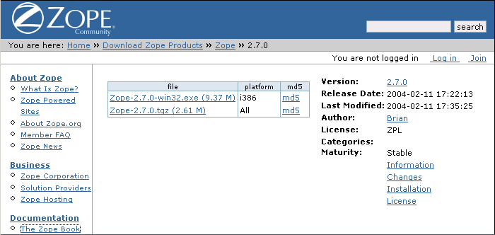
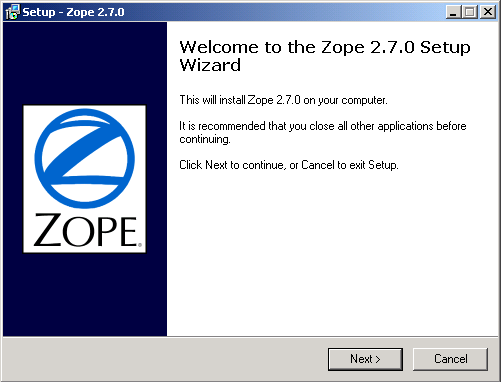
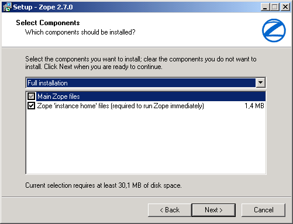
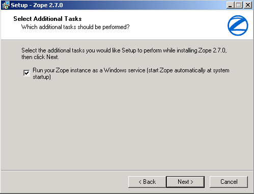
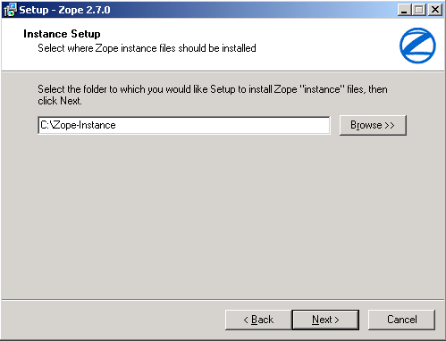
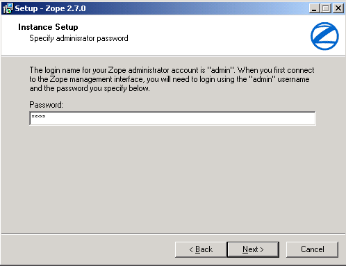
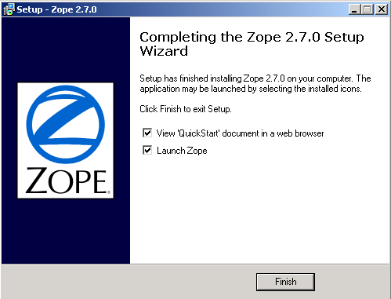
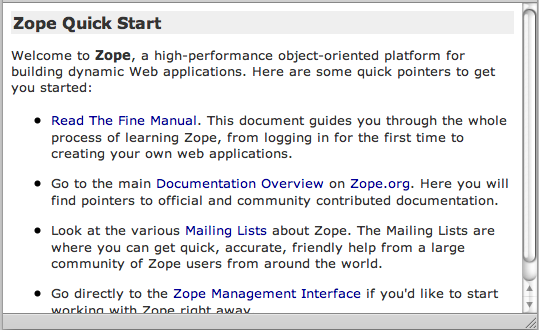
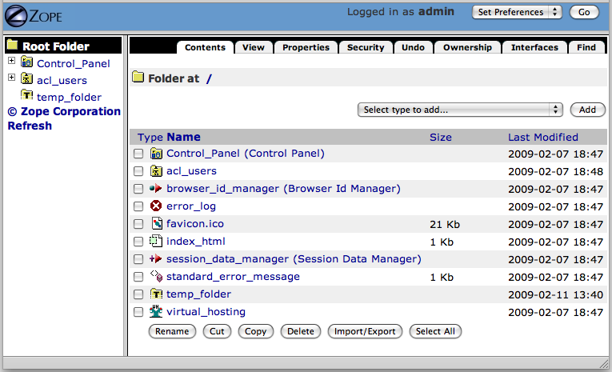
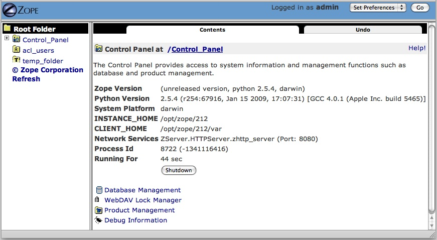

Installing and Starting Zope
============================

.. include:: includes/zope2_notice.rst

By the end of this chapter, you should be able to install and start
Zope.  It is fairly easy to install Zope on most platforms, and it
typically takes no longer than ten minutes to complete an installation.

Downloading Zope
----------------

There are typically two types of Zope releases: a "stable" release
and a "development" release.  If you are new to Zope, you almost
certainly want to use the "stable" Zope release.

Zope is published on the official Python package repository at
https://pypi.org/project/Zope/.

Zope comes as a "binary" release for the Windows platform, and in source
format for UNIX-like operating systems. Zope may be compiled on almost any
UNIX-like operating system.  Zope has reportedly been successfully compiled
on Linux, FreeBSD, NetBSD, OpenBSD, Mac OS X, HPUX, IRIX, DEC OFS/1, and
even Cygwin (the UNIX emulation platform for Windows).

As a general rule of thumb: if `Python <https://www.python.org/>`_ is
available for your operating system, and if you have a C compiler and
associated development utilities, then it is highly likely that you will be
able to compile Zope.  A notable exception is Mac OS between versions 7
through 9, as Zope does not run at all on these platforms.

Installing Zope
---------------

Zope's installation steps vary somewhat, depending on your operating system
platform.  The sections below detail installing the binary version of Zope
on Windows on Intel platforms, and a source installation on Linux.

Installing Zope for Windows With Binaries from Zope.org
~~~~~~~~~~~~~~~~~~~~~~~~~~~~~~~~~~~~~~~~~~~~~~~~~~~~~~~

The "Win32" version of Zope works under Windows 95, Windows 98, Windows ME,
Windows NT, Windows 2000, Windows XP, and Windows Server 2003.  Zope for
Windows comes as a self-installing *.exe* file.  To install Zope, first,
download the Win32 executable installer from the
Download area on Zope.org.  It is
typically named something like "Zope-2.X.X-win32-x86.exe" where the "X"'s
refer to the current Zope version number.

   Current stable Zope release for Windows

Download the current stable release installer for Windows from
Zope.org using your web browser.  Place the file in a temporary
directory on your hard disk or on your Desktop.  Once the
installer file has been downloaded, navigate to the folder into
which you downloaded the file, and double-click on the file's
icon.  The installer then begins to walk you through the
installation process.

   Zope installer

   Beginning the installer

Click *Next*. The installer asks for an installation path. The default is
usually acceptable, though you are, of course, free to choose another path.
Then click *Next*. You then can choose which components to install.

   Select components

You should select "Full installation" unless you have previously installed
Zope and know what you are doing. On the next screen, you may customize the
entry placed in your *Start Menu* folder. Click *Next* again. The installer
now asks you whether you would like to run Zope as a *service*, unless you
are running Windows 98 or ME, on which such services are not available. If
you are only running Zope for personal use, there is no need to run it as a
service.

   Server options

Upon clicking *Next*, the installer takes you to the "Instance Setup"
Screen.

   Instance setup

You can have more than one Zope running on your PC, but each has to have
its own *Instance Home*, which is the path to specify here.  This path is
where Zope will later place its database files. Make sure that you have
enough disk space left on the specified drive and that you can make backups
easily.

The *Next* screen asks you for a password for an initial administrative
account. You use this account to log in for the first time and create more
users. Note that the installer does not ask you to verify your password, so
be careful not to mis-type it.

   Administrative password

Click *Next* after entering a password. The installer presents an overview,
form which you can commence installation by clicking *Install*. After a few
moments, the Zope installer will present you with a "Completion" screen.

   Installation completion

Let the installer start Zope for you, or start Zope manually by navigating
to the Zope folder in the Start Menu and selecting "Run Zope in Console".
See the section below entitled `Starting Zope`_.

Compiling and Installing Zope from Source Code
~~~~~~~~~~~~~~~~~~~~~~~~~~~~~~~~~~~~~~~~~~~~~~

If binaries aren't available for your platform, chances are good that you
will be able to compile Zope from its source code.  To do this, however,
you first must:

- ensure that you have a "C" compiler on your system (*GNU gcc* is
  preferred);

- ensure that you have a recent "make" on your system (*GNU make* is
  preferred);

- install the `Python <https://www.python.org/>`_ language on your
  system from source, or install a binary Python package, including
  development headers.

Zope is written primarily in the Python language, and Zope requires Python
in order to be able to run at all.  While binary versions of Zope ship with
a recent Python version, the source Zope distribution does not.  Zope
developers try to use the most recent Python for Zope, but often the latest
Python version is more recent than the officially-supported Zope version.
Zope 2.12 requires Python 2.5.4 or later, and Zope versions 2.11 and 2.10
require a Python 2.4.*x* version equal to or greater than 2.4.3.  For the
most recent information on which version of Python is required for
compiling Zope, see the release notes on the release Web page.

You can obtain detailed instructions for downloading, compiling, and
installing Python from source at the `Python.org <https://www.python.org/>`_
website.  Most Linux distributions ship with a pre-installed Python 2.5,
but care is required when attempting to use a vendor-installed Python to
compile Zope: some of these vendor-supplied Python distributions do not
ship the necessary Python development files needed to compile Zope from
source.  Sometimes these development files are included in a separate
"python-devel" package that may be installed separately, but sometimes they
are not.  The binary packages that ship with Debian have been used with
some level of success, but it is generally advisable to compile and install
Python from source if you wish to also compile and install Zope from
source.

After downloading, compiling, and installing Python from source, download
the current Zope source distribution.  See the Zope.org `Downloads
<https://old.zope.dev/Products/>`_ area for the latest Zope source release.

Download the source to your home, or some other directory, 'cd' to that
directory, and unpack it with something similar to::

  $ mkdir ~/myzope
  $ cd ~/myzope
  $ gunzip -c /tmp/Zope-*.tgz | tar xvf -

where * represents the Zope release version of the source tarball.

Zope now uses the conventional UNIX build sequence:
``configure``, ``make``, ``make install``.

To configure Zope, 'cd' to the Zope directory and issue the configure
command::

  $ cd Zope-*
  $ ./configure --prefix=/where/to/install/zope

Replace */where/to/install/zope* above with an appropriate path, such as
``~/myzope/zope2``.  This path is referred to as the *ZOPE_HOME*.  If you
want to install Zope in a system directory instead of your user home,
replace ``~/myzope/zope2`` with an appropriate path, e.g.,
``/usr/local/zope2``, and make sure that you have suitable privileges for
installing and starting Zope ('sudo' or 'root').

If the configure script is unable to find your Python installation, it will
report an error not unlike this one::

  $ ./configure --prefix=~/myzope/zope2

  Configuring Zope installation
  Testing for an acceptable Python interpreter...

  No suitable Python version found. You should install
  Python version 2.5.4 before continuing. Versions
  2.6.1 2.6.0 also work, but not as optimally.

In this case, you must point the installer to your Python interpreter,
which you should have installed previously, either from a binary package or
compiled from source.

Use the ``--with-python`` option to the configure script, e.g,. for a python
living under ``/usr/local`` ::

  $ ./configure --prefix=~/myzope/zope2 \
  --with-python=/usr/local/bin/python

Replace ``/usr/local/bin/python`` with the path to your Python executable.

Zope is now ready to be built. From within the source directory, issue::

  $ make
  [ lots of output snipped ]
  Zope built. Next, do 'make install' (or 'make instance'
  to run a Zope instance directly from the build directory).

You are now ready to install Zope. To do this, you will have to execute
'make install' ::

  $ make install
  [ lots of output snipped ]
  Zope binaries installed successfully.
  Now run '~/myzope/zope2/bin/mkzopeinstance.py'

With the Zope binaries installed, you are now ready to create a *Zope
instance*, which holds configuration and runtime data for a single Zope
server process.  This helps keep your own or third-party software separate
from the main Zope source.

Assuming that you want to install a Zope instance in the directory
``~/myzope/instance``, in order to create a Zope instance, you would run
the following command::

  $ ~/myzope/zope2/bin/mkzopeinstance.py

You will need to provide the following values:

- The directory where your instance should be located, or the *INSTANCE_HOME*.
  The instance home will hold your database files, log files, configuration
  files, and scripts to start and stop the instance. For our example, we assume
  the instance home to be located at ``~/myzope/instance``.

- Username and Password for an initial Zope user. You will log in with
  this username and password to create your own Zope users.  To change the
  username or password for your initial Zope user, run::

  $ cd ~/myzope/instance
  $ ~/myzope/zope2/bin/zpasswd.py inituser

You will have to provide the username and password you wish to set;
optionally, you can specify the hashing method and an additional domain
restriction.

Zope installation is now complete. Read on to see how to
start your brand-new Zope.

Starting Zope
-------------

Zope is managed via a web browser, and Zope contains its own web server
(called ``ZServer``).  A successful Zope startup implies that Zope's web
server starts, which allows you to access the Zope management interface
(ZMI) via your web browser.  You can access the ZMI from the same machine
on which Zope runs, or you can access it from a remote machine that is
connected to the same network as your Zope server.

Zope's ZServer will "listen" for HTTP requests on TCP port 8080.  If your
Zope instance fails to start, make sure that another application isn't
already running on the same TCP port (8080).

Zope also has the capability to listen on other TCP ports.  Zope supports
separate TCP ports for "monitor" (internal
debugging), WebDAV (Web Distributed Authoring and Versioning), and ICP
(Internet Cache Protocol) access.  If you see messages that indicate that
Zope is listening on ports other than the default 8080 HTTP, don't panic:
it's likely just one of these additional ports.

Using Zope With a Web Server
----------------------------

Zope works with **NGINX**, **Apache** and other popular web servers.

The `Virtual Hosting Services <VirtualHosting.html>`_ chapter of this book
provides rudimentary setup information for configuring Zope behind Apache.

If you are just getting started with Zope, note that it is not necessary
to configure a web server to serve your Zope pages,
as the standard Zope setup comes with the WSGI server **Waitress**.

You typically only need to configure a web server if you want to use it
to serve Zope pages in a production environment.

Starting Zope on Windows
------------------------

If you've installed Zope to "run manually" (as opposed to installing Zope
as a "service"), navigate to the Zope folder in your Start Menu and click
on *Run Zope in Console*. A console window with process startup information
will be displayed.

If you chose to run Zope as a "service" on Windows NT/2000/XP, you can
start Zope via the standard Windows "Services" control panel application.
A Zope instance started as a service writes events to the standard Windows
Event Log; you can keep track of the Zope service's start and stop events
by reviewing the Event Log.  A Zope instance which has been installed as a
"service" can also be run manually by invoking the *Run Zope in Console*
menu entry as described earlier. Take care not to run Zope manually *and*
as a service at one time: make sure to stop the Zope service first before
starting it manually.

Starting Zope on UNIX
---------------------

.. Important:
   If you installed Zope from an RPM or a another "vendor distribution"
   instead of installing a Zope Foundation-distributed source release,
   the instructions below may be not be applicable.  Under these
   circumstances, please read the documentation supplied by the vendor to
   determine how to start your Zope instance instead of relying on these
   instructions.

To start your Zope instance (which we assume lives in ``~/myzope/instance``),
issue the command::

  $ ~/myzope/instance/bin/zopectl start

This will start the instance in the background. Alternatively, you can
start it in the foreground and watch its progress by issuing the command::

  $ ~/myzope/instance/bin/zopectl fg

Run the ``zopectl`` script with a parameter of ``help`` to get a
list of additional commands::

  $ ~/myzope/instance/bin/zopectl help

Starting Zope as the Root User
~~~~~~~~~~~~~~~~~~~~~~~~~~~~~~

``ZServer`` (Zope's server) supports ``setuid()`` on POSIX systems in order
to be able to listen on low-numbered ports, such as 80 (HTTP),
but drop root privileges when running; on most POSIX systems, only the
``root`` user can do this.

The most important thing to remember about this support is that you don't
*have* to start ZServer as root, unless you want to listen for requests on
"low" ports.  In fact, if you don't have this need, you are much better off
just starting ZServer as a user account dedicated to running Zope.
'nobody' is not a good idea for this user account, because if any other
daemon on a system that ran as ``nobody`` were to be compromised, this would
open up your Zope object data to vulnerability.

If you do need to have ZServer listening on low ports, you will need to
start ``zopectl`` as the ``root`` user, and to specify what user ZServer
should ``setuid()`` to.  This can be done by setting the *effective-user*
parameter in your Zope instances configuration file, residing in
``$INSTANCE_HOME/etc/zope.conf``, and by making sure that the log and
database files are writeable by this user.

Your Zope Installation
----------------------

To use and manage Zope, you will need a web browser. Start a web browser on the
same machine on which you installed Zope, and browse to the URL
`http://localhost:8080/ <http://localhost:8080/>`_.

If your Zope instance has been properly installed, and you're visiting the
correct URL, you will be presented with the Zope "QuickStart" screen.

   Zope QuickStart

If you see this screen, congratulations!  You've installed Zope
successfully.  If you don't, see the `Troubleshooting and Caveats`_ section
below.

Logging In
----------

For some of the tasks you want to do with Zope, you need to use its management
interface: the *ZMI*. To log into the ZMI, use your web browser to navigate to
Zope's management URL. Assuming you have Zope installed on the same machine
from which you are running your web browser, the Zope management URL will be
`http://localhost:8080/manage <http://localhost:8080/manage>`_.

Successful contact with Zope via this URL will result in an authentication
dialog, into which you can enter the "initial" username and password you
chose when you installed Zope.  You will then be presented with the ZMI.

   The Zope Management Interface (ZMI)

If you do not see an authentication dialog and the ZMI, refer to the
`Troubleshooting and Caveats`_ section of this chapter.

Controlling the Zope Process with the Control Panel
---------------------------------------------------

When you are using the ZMI, you can use the Zope *Control Panel* to control
the Zope process.  Find and click the **Control_Panel** object in ZMI.

   The Control Panel

The Control Panel displays information about your Zope, such as the Zope
version you are running, the Python version that Zope is using, the system
platform, the INSTANCE_HOME, the CLIENT_HOME, Zope's process id, the network
services that have been started, how long Zope has been running for, and
other installation specifics.  Several buttons and links will also be
shown.

If you are running Zope on UNIX or as a service on Windows, you will see a
*Restart* button in the Control Panel.  Clicking *Restart* will cause Zope
to shut down and then immediately start back up again.  It may take Zope a
few seconds to come back up and start handling requests.  You don't need to
shut your web browser down and restart it to resume using Zope after
pressing *Restart*, as the page refreshes automatically; just wait for the
Control Panel display to reappear.

To shut Zope down from the ZMI, click *Shutdown*.  Shutting Zope down will
cause the server to stop handling requests and exit. You will have to
manually start Zope to resume using it. Shut Zope down only if you are
finished using it and you have the ability to access the server on which
Zope is running, so that you can manually restart it later as needed.

Controlling the Zope Process from the Command Line
--------------------------------------------------

- If you started Zope in the foreground, press "Ctrl+C" in the terminal
  window from which you started Zope.

* If you started Zope in the background, use the ``zopectl`` script::

  $ ~/myzope/instance/bin/zopectl stop

* On Unix use the "kill" command against the process id in the
  "var/Z2.pid" file inside the Zope instance directory::

  $ kill `cat var/Z2.pid`

Customizing your Zope instance
------------------------------

Zope's configuration is done via the file '$INSTANCE_HOME/etc/zope.conf'.
This contains numerous configuration directives for customization.

The ``zope.conf`` file features extensive inline documentation, which we
will not reproduce here.  Instead, we will give an overview and some
additional hints for the most-widely used directives:

Server stanzas and ``port-base``
~~~~~~~~~~~~~~~~~~~~~~~~~~~~~~~~

The ``port-base`` directive, together with stanzas for the individual
servers, determine the ports on which specific servers listen for incoming
Zope requests. The stanzas are formed with XML-like constructs::

 <http-server>
   # valid keys are "address" and "force-connection-close"
   address 8080
 </http-server>

 <webdav-source-server>
   ...
 </webdav-source-server>

The ``address`` directive determines the port on which the respective server
listens.  The HTTP Server in this example listens on port 8080.

The ``port-base`` directive comes in handy if you want to run several Zope
instances on one machine.  ``port-base`` specifies an offset to the port on
which **all** servers listen.  Let us assume that our HTTP Server's
'address' directive is set to 8080, as in our example above, and
'port-base' is specified as 1000. The port on which the HTTP server will
listen, will be the ``address`` value of 8080, plus the ``port-base`` offset
value of 1000, or 9080.

The ``debug-mode`` directive
~~~~~~~~~~~~~~~~~~~~~~~~~~~~

This directive is a switch, specified as either ``on`` or ``off``.  When
set to ``on`` (the default), Zope runs in *debug mode*, which causes Zope
to reload file system-based templates, and several other settings suitable
for development, in real time.  In a production environment, to reduce
unnecessary overhead, you should ensure that this directive is set to
``off`` unless you are actively troubleshooting a problem.

Switch the User the Zope process runs as: ``effective-user``
~~~~~~~~~~~~~~~~~~~~~~~~~~~~~~~~~~~~~~~~~~~~~~~~~~~~~~~~~~~~

This directive causes Zope to ``setuid(2)`` to the specified user when run
as root on a UNIX system.  This method boosts system security, as a
compromised Zope instance would not enable a compromised user to damage
easily an entire system.  One motivation for running Zope as root in the
first place is to be able to bind to *privileged* ports, or ports with
values below 1024.

Logging
~~~~~~~

Three log facilities are provided:

- *Access logging* logs individual HTTP Requests in a common format,
  by default to the file ``log/Z2.log`` in your instance home.

- *Event logging* logs Zope events, such as start and stop
  information and debugging messages.

- *Trace logging* logs detailed Zope debugging information.

Each log message has an associated severity level, ranging from
``CRITICAL``, ``ERROR``, ``WARN``, and ``INFO``, to ``DEBUG`` and ``ALL``.
You can specify a filter for log messages with the ``level`` directive
inside a logger stanza.  Set the level to ``ALL`` to get all log messages,
or to ``ERROR`` or ``CRITICAL`` to see only the most serious messages.

Although the default is to write the messages to a log file, you can
instead arrange for log messages to be mailed to you, or to go to
``syslog(3)`` (on UNIX) or the event log (on MS Windows)

For further documentation, see the inline comments in ``zope.conf``.

Troubleshooting and Caveats
---------------------------

Browser cannot connect to port 8080
~~~~~~~~~~~~~~~~~~~~~~~~~~~~~~~~~~~

If your browser fails to connect with anything on TCP port 8080, your Zope
instance may be running on a non-standard TCP port (for example, some
versions of Debian Linux ship with Zope's default TCP port as 9673).  To
find out exactly which URL to use, look at the logging information Zope
prints as it starts up when started in the foreground, i.e., when started
with ``./runzope`` or ``./zopectl fg``.

As mentioned previously, Zope only prints to the console when started in
the foreground, with ``./runzope`` or ``runzope.bat``. This logging
information can be found in the ``log/event.log`` file in your
``INSTANCE_HOME`` directory.

Forgot administrative password
~~~~~~~~~~~~~~~~~~~~~~~~~~~~~~

If you forget or lose your initial Zope user name and password, shut Zope
down, change the initial user password with the *zpasswd.py* script, and
restart Zope. See the chapter entitled `Users and Security
<Security.html>`_ for more information about configuring the initial user
account.

When All Else Fails
~~~~~~~~~~~~~~~~~~~

If there's a problem with your installation that you just cannot solve, do
not despair.  You have many places to turn for help, including the Zope
mailing lists and the ``#zope`` IRC channel.

If you are new to open-source software, please realize that, for the most
part, participants in the various "free" Zope support forums are
volunteers.  Though they are typically friendly and helpful, they are not
obligated to answer your questions.  Therefore, it's in your own
self-interest to exercise your best manners in these forums in order to get
your problem resolved quickly.

The most reliable way to get installation help is to send a message to the
general Zope mailing list detailing your installation problem.  For more
information on the available Zope mailing lists, see the
`Resources <https://old.zope.dev/Resources/>`_ section of Zope.org.  Typically,
someone on the "zope@zope.dev" list will be willing and able to help you
solve the problem.

Another resource is the Zope section on the Plone community discussion server
at https://community.plone.org/c/zope because Plone is running on top of Zope,
so you will find many knowledgeable people there.

For even more immediate help, you may choose to visit the 
`#zope <irc://irc.freenode.net/#zope>`_ channel on
the  IRC (Internet Relay Chat) network.  See the `Freenode
website <https://freenode.net>`_ for more information on how to connect
to the FreeNode IRC network.
