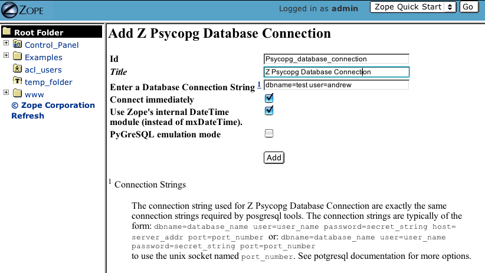
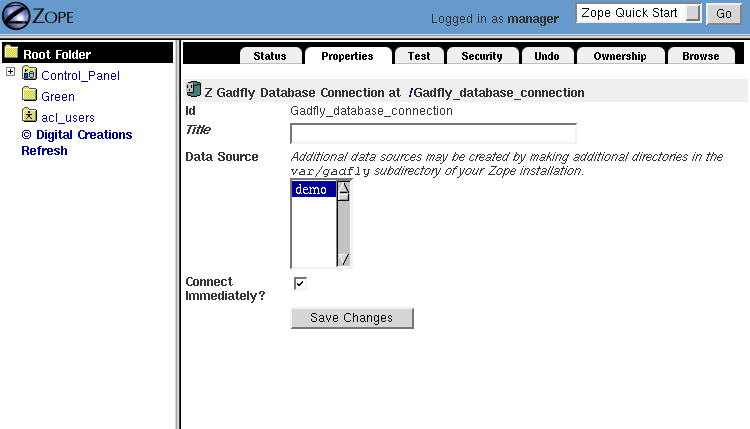
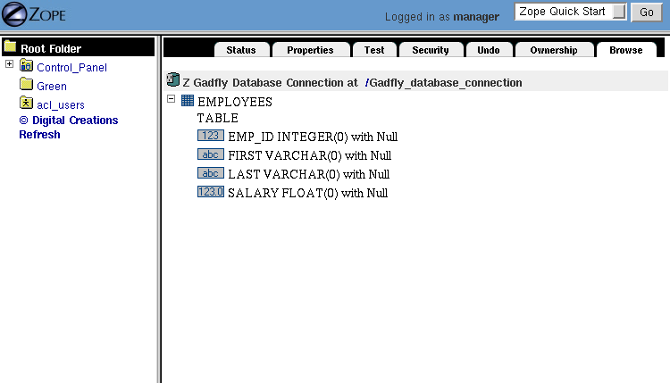
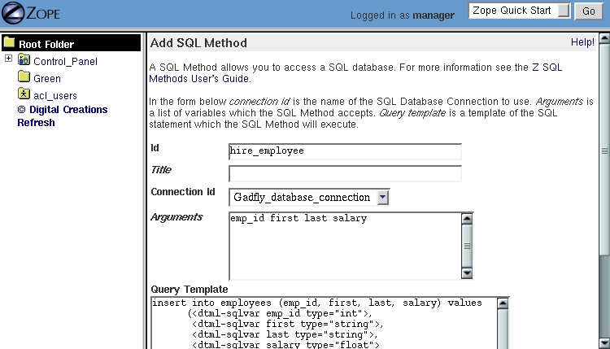
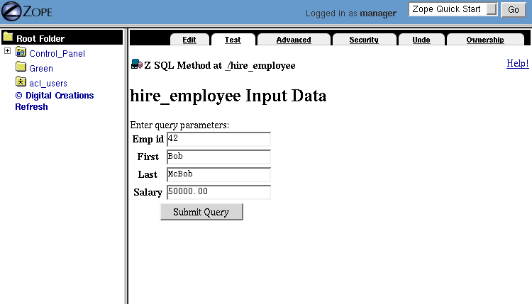
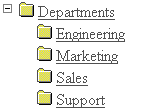
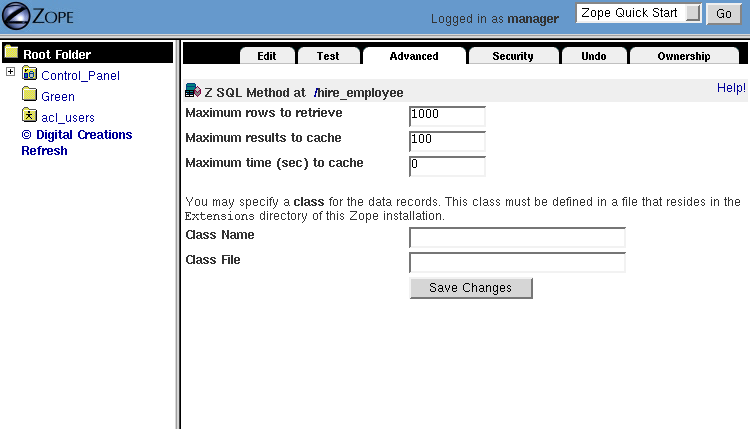

Relational Database Connectivity
================================

.. include:: includes/zope2_notice.rst

.. note::

    This chapter explains you how to access a relational databases directly through
    SQL. The alternative and modern way integrating a RDBMS with Zope is using an
    Object-Relational-Mapper (ORM). An ORM abstracts the SQL layer and allows you
    to deal with database tables, rows etc. like standard Python objects.

    The most common and most flexible ORM in the
    Python world is `SQLAlchemy <https://www.sqlalchemy.org>`_ . You can not use
    SQLAlchemy directly within Zope because the transaction system of the RDBMS
    must participate with Zope transaction. This integration layer is implemented
    through the `zope.sqlalchemy <https://pypi.org/project/zope.sqlalchemy/>`_
    module.

The Zope Object Database (ZODB) is used to store all the pages,
files and other objects you create. It is fast and requires almost
no setting up or maintenance.  Like a filesystem, it is especially
good at storing moderately-sized binary objects such as graphics.

Relational Databases work in a very different way. They are based on
tables of data such as this::

  Row   First Name   Last Name  Age
  ===   ==========   =========  ===
  1     Bob          McBob      42
  2     John         Johnson    24
  3     Steve        Smith      38

Information in the table is stored in rows. The table's column
layout is called the *schema*.  A standard language, called the
Structured Query Language (SQL) is used to query and change tables
in relational databases. This chapter assumes a basic knowledge of SQL,
if you do not know SQL there are many books and tutorials on the web.

Relational databases and object databases are very different and
each possesses its own strengths and weaknesses. Zope allows you to
use either, providing the flexibility to choose the storage
mechanism which is best for your data. The most common reasons to
use relational databases are to access an existing database or to
share data with other applications.  Most programming languages and
thousands of software products work with relational
databases. Although it is possible to access the ZODB from other
applications and languages, it will often require more effort than
using a relational database.

By using your relational data with Zope you retain all of Zope's
benefits including security, dynamic presentation, and
networking. You can use Zope to dynamically tailor your data access,
data presentation and data management.

Common Relational Databases
---------------------------

There are many relational database systems. The following is a brief
list of some of the more popular database systems:

Oracle
  Oracle is arguably the most powerful and popular
  commercial relational database. It is, however, relatively
  expensive and complex. Oracle can be purchased or evaluated from
  the `Oracle Website <https://www.oracle.com>`_.

PostgreSQL
  PostgreSQL is a leading open source relational
  database with good support for SQL standards.  You can
  find more information about PostgreSQL at the `PostgreSQL web
  site <https://www.postgresql.org/>`_.

MySQL/MariaDB
  MySQL is a fast open source relational database. You
  can find more information about MySQL at the `MySQL web
  site <https://www.mysql.com/>`_ and the Open Source fork
  MariaDB at https://mariadb.org/.

SQL Server
  Microsoft's full featured SQL Server for the
  Windows operating systems. For any serious use on Windows, it is
  preferable to Microsoft Access.

The mechanics of setting up relational database is different for
each database and is thus beyond the scope of this book.  All of the
relational databases mentioned have their own installation and
configuration documentation that you should consult for specific
details.

Zope can connect to all the above-listed database systems; however,
you should be satisfied that the database is running and operating
in a satisfactory way on its own before attempting to connect it to
Zope.  An exception to this policy is Gadfly, which is included with
Zope and requires no setup.

Database Adapters
-----------------

A database can only be used if a Zope Database Adapter is available,
though a Database Adapter is fairly easy to write if the database has
Python support. Database adapters can be found in the
`Zope Framework category of the Python Package Index
<https://pypi.org/search/?q=&o=&c=Framework+%3A%3A+Zope>`_.

At the time of writing the following adapters were available, but this
list constantly changes as more adapters are added.

Oracle
  `DCOracle2 <https://old.zope.dev/Members/matt/dco2/>`_ package
  from Zope Corporation includes the ZoracleDA

PostgreSQL
  The newest and prefered DA is
  `ZPsycopgDA <https://pypi.org/project/ZPsycopgDA/>`_.

MySQL
  `ZMySQLDA <https://pypi.org/project/Products.ZMySQLDA/>`_
  Available as source and a Linux binary package.

SQLServer
  `mxODBC <https://pypi.org/project/egenix-mxodbc/>`_ is written by Egenix
  and very well maintained.

If you will need to connect to more than one database or wish to connect
as to the same database as different users then you may use multiple
database connection objects.

Setting up a Database Connection
--------------------------------

Once the database adapter has been downloaded and installed you may
create a new *Database Connection* from the *Add* menu on the Zope
management pages. All database connection management interfaces are
fairly similar.

The database connection object is used to establish and manage the
connection to the database. Because the database runs externally to
Zope, they may require you to specify information necessary to
connect successfully to the database. This specification, called a
*connection string*, is different for each kind of database. For
example, the figure below shows the PostgreSQL database connection
add form.

   PostgreSQL Database Connection

We'll be using the Gadfly database for the examples in this chapter,
as it requires the least amount of configuration.  If you happen to
be using a different database while "playing along", note that
Database Connections work slightly differently depending on which
database is being used, however most have a "Test" tab for issuing a
test SQL query to the database and a "Browse" tab which will show
the table structure. It is good practice to use these tabs to test
the database connection before going any further.

Select the *Z Gadfly Database Connection* from the add list.  This
will take you to the add form for a Gadfly database connection.
Select and add a Gadlfy connection to Zope. Note that because Gadfly
runs inside Zope you do not need to specify a "connection string".

Select the *Demo* data source, specify *Gadfly_database_connection* for
the id, and click the *Add* button.  This will create a new Gadfly
Database Connection. Select the new connection by clicking on it.

You are looking at the *Status* view of the Gadfly Database
Connection.  This view tells you if you are connected to the
database, and it exposes a button to connect or disconnect from the
database.  In general Zope will manage the connection to your
database for you, so in practice there is little reason to manually
control the connection.  For Gadfly, the action of connecting and
disconnecting is meaningless, but for external databases you may
wish to connect or disconnect manually to do database maintenance.

The next view is the *Properties* view.  This view shows you the data
source and other properties of the Database Connection.  This is useful
if you want to move your Database Connection from one data source to
another. The figure below shows the *Properties* view.

   The Properties view

You can test your connection to a database by going to the *Test*
view.  This view lets you type SQL code directly and run it on your
database.  This view is used for testing your database and issuing
"one-time" SQL commands (like statements for creating tables).  This
is *not* the place where you will enter most of your SQL code. SQL
commands typically reside in *Z SQL Methods* which will be discussed
in detail later in this chapter.

Let's create a table in your database for use in this chapter's
examples.  The *Test* view of the Database Connection allows you to
send SQL statements directly to your database. You can create tables
by typing SQL code directly into the *Test* view; there is no need
to use a SQL Method to create tables.  Create a table called
*employees* with the following SQL code by entering it into the
*Test* tab::

  CREATE TABLE employees
  (
  emp_id integer,
  first varchar,
  last varchar,
  salary float
  )

Click the *Submit Query* button of the *Test* tab to run the SQL
command. Zope should return a confirmation screen that confirms that
the SQL code was run.  It will additionally display the results, if
any.

The SQL used here works under Gadfly but may differ depending on
your database.  For the exact details of creating tables with your
database, check the user documentation from your specific database
vendor.

This SQL will create a new table in your Gadfly database called
*employees*.  This table will have four columns, *emp_id*, *first*,
*last* and *salary*.  The first column is the "employee id", which
is a unique number that identifies the employee.  The next two
columns have the type *varchar* which is similar to a string.  The
*salary* column has the type *float* which holds a floating point
number.  Every database supports different kinds of types, so you
will need to consult your documentation to find out what kind of
types your database supports.

To examine your table, go to the *Browse* view.  This lets you view
your database's tables and the schema of each table. Here, you can
see that there is an *employees* table, and if you click on the
*plus symbol*, the table expands to show four columns, *emp_id*,
*first*, *last* and *salary* as shown in [10-3].

   Browsing the Database Connection

This information is very useful when creating complex SQL
applications with lots of large tables, as it lets you discover the
schemas of your tables. However, not all databases support browsing
of tables.

Now that you've created a database connection and have defined a
table, you can create Z SQL Methods to operate on your database.

Z SQL Methods
-------------

*Z SQL Methods* are Zope objects that execute SQL code through a
Database Connection.  All Z SQL Methods must be associated with a
Database Connection. Z SQL Methods can both query and change
database data.  Z SQL Methods can also contain more than one SQL
command. In detail a Z SQL method may contain multiple INSERT
or UPDATE statements but at most one SELECT statement.

A ZSQL Method has two functions: it generates SQL to send to the
database and it converts the response from the database into an
object. This has the following benefits:

- Generated SQL will take care of special characters that may need to be
  quoted or removed from the query. This speeds up code development.

- If the underlying database is changed (for example, from Postgres
  to Oracle), then the generated SQL will, in some cases,
  automatically change too, making the application more portable.

- Results from the query are packaged into an easy to use object which
  will make display or processing of the response very simple.

- Transactions are mediated. Transactions are discussed in more
  detail later in this chapter.

Examples of ZSQL Methods
-------------------------

Create a new Z SQL Method called *hire_employee* that inserts a new
employee in the *employees* table.  When a new employee is hired,
this method is called and a new record is inserted in the
*employees* table that contains the information about the new
employee.  Select *Z SQL Method* from the *Add List*.  This will
take you to the add form for Z SQL Methods, as shown in the figure
below.

   The Add form for Z SQL Methods

As usual, you must specify an *id* and *title* for the Z SQL Method. In
addition you need to select a Database Connection to use with this Z SQL
Methods. Give this new method the id *hire_employee* and select the
*Gadfly_database_connection* that you created in the last section.

Next, you can specify *arguments* to the Z SQL Method. Just like
Scripts, Z SQL Methods can take arguments. Arguments are used to
construct SQL statements.  In this case your method needs four
arguments, the employee id number, the first name, the last name and
the employee's salary. Type "emp_id first last salary" into the
*Arguments* field. You can put each argument on its own line, or you
can put more than one argument on the same line separated by
spaces. You can also provide default values for argument just like
with Python Scripts. For example, 'emp_id=100' gives the 'emp_id'
argument a default value of 100.

The last form field is the *Query template*.  This field contains
the SQL code that is executed when the Z SQL Method is called.  In
this field, enter the following code::

  insert into employees (emp_id, first, last, salary) values
  (<dtml-sqlvar emp_id type="int">, 
   <dtml-sqlvar first type="string">, 
   <dtml-sqlvar last type="string">,
   <dtml-sqlvar salary type="float">
  )

Notice that this SQL code also contains DTML.  The DTML code in this
template is used to insert the values of the arguments into the SQL
code that gets executed on your database.  If the *emp_id* argument
had the value *42*, the *first* argument had the value *Bob* your
*last* argument had the value *Uncle* and the *salary* argument had
the value *50000.00* then the query template would create the
following SQL code::

  insert into employees (emp_id, first, last, salary) values
  (42,
   'Bob',
   'Uncle',
   50000.00
  )

The query template and SQL-specific DTML tags are explained further
in the next section of this chapter.

You have your choice of three buttons to click to add your new Z SQL
Method.  The *Add* button will create the method and take you back
to the folder containing the new method.  The *Add and Edit* button
will create the method and make it the currently selected object in
the *Workspace*.  The *Add and Test* button will create the method
and take you to the method's *Test* view so you can test the new
method.  To add your new Z SQL Method, click the *Add* button.

Now you have a Z SQL Method that inserts new employees in the
*employees* table.  You'll need another Z SQL Method to query the
table for employees.  Create a new Z SQL Method with the id
*list_all_employees*.  It should have no arguments and contain the
following SQL code::

  select * from employees

This simple SQL code selects all the rows from the *employees*
table.  Now you have two Z SQL Methods, one to insert new employees
and one to view all of the employees in the database.  Let's test
your two new methods by inserting some new employees in the
*employees* table and then listing them.  To do this, click on the
*hire_employee* Method and click the *Test* tab.  This will take you
to the *Test* view of the Method, as shown in the figure below.

   The hire_employee Test view

Here, you see a form with four input boxes, one for each argument to
the *hire_employee* Z SQL Method.  Zope automatically generates this
form for you based on the arguments of your Z SQL Method.  Because
the *hire_employee* Method has four arguments, Zope creates this
form with four input boxes. You can test the method by entering an
employee number, a first name, a last name, and a salary for your
new employee.  Enter the employee id "42", "Bob" for the first name,
"McBob" for the last name and a salary of "50000.00". Then click the
*Submit Query* button. You will then see the results of your test.

The screen says *This statement returned no results*.  This is
because the *hire_employee* method only inserts new information in
the table, it does not select any information out of the table, so
no records were returned.  The screen also shows you how the query
template get rendered into SQL.  As expected, the *sqlvar* DTML tags
rendered the four arguments into valid SQL code that your database
executed.  You can add as many employees as you'd like by repeatedly
testing this method.

To verify that the information you added is being inserted into the
table, select the *list_all_employees* Z SQL Method and click on its
*Test* tab.  

This view says *This query requires no input*, indicating the
*list_all_employees* does not have any argument and thus, requires
no input to execute.  Click on the *Submit Query* button to test the
method.

The *list_all_employees* method returns the contents of your
*employees* table.  You can see all the new employees that you
added. Zope automatically generates this tabular report screen for
you. Next we'll show how you can create your own user interface to
your Z SQL Methods to integrate them into your website.

Displaying Results from Z SQL Methods
-------------------------------------

Querying a relational database returns a sequence of results. The items
in the sequence are called *result rows*.  SQL query results are always a
sequence. Even if the SQL query returns only one row, that row is the
only item contained in a list of results.

Somewhat predictably, as Zope is `object oriented
<ObjectOrientation.html>`_, a Z SQL method returns a *Result object*. All
the result rows are packaged up into one object. For all practical
purposes, the result object can be thought of as rows in the database table
that have been turned into Zope objects.  These objects have attributes
that match the schema of the database result.

Result objects can be used from DTML to display the results of calling
a Z SQL Method.  For example, add a new DTML Method to your site called
*listEmployees* with the following DTML content::

  <dtml-var standard_html_header>

    <ul>
    <dtml-in list_all_employees>
      <li><dtml-var emp_id>: <dtml-var last>, <dtml-var first> 
        makes <dtml-var salary> Euro a year.
      </li>
    </dtml-in>
    </ul>

  <dtml-var standard_html_footer>

and the ZPT version::

  

    <ul>
      <li tal:repeat="row context/list_all_employees">
        
    </ul>
  

This method calls the *list_all_employees* Z SQL Method from
DTML. The *in* tag is used to iterate over each Result object
returned by the *list_all_employees* Z SQL Method.  Z SQL Methods
always return a list of objects, so you will almost certainly use
them from the DTML *in* tag unless you are not interested in the
results or if the SQL code will never return any results, like
*hire_employee*.

The body of the *in* tag is a template that defines what gets rendered
for each Result object in the sequence returned by *list_all_employees*.
In the case of a table with three employees in it, *listEmployees* might
return HTML that looks like this::

  <html>
    <body>

    <ul>
      <li>42: Roberts, Bob 
        makes $50,000 a year.
      </li>
      <li>101: leCat, Cheeta 
        makes $100,000 a year.
      </li>
      <li>99: Junglewoman, Jane 
        makes $100,001 a year.
      </li>
    </ul>

    </body>
  </html>

The *in* tag rendered an HTML list item for each Result object returned
by *list_all_employees*.

Zope Database Adapters behave slightly differently regarding how
they handle different types of data. However the more modern ones
will return the Python type that is closest to the SQL type - as
there are far more types in SQL than in Python there cannot be a
complete match. For example, a date will usually be returned as a
Zope DateTime object; char, varchar and text will all be returned as
strings.

An important difference between result objects and other Zope
objects is that result objects do not get created and permanently
added to Zope.  Result objects are not persistent. They exist for
only a short period of time; just long enough for you to use them in
a result page or to use their data for some other purpose.  As soon
as you are done with a request that uses result objects they go
away, and the next time you call a Z SQL Method you get a new set of
fresh result objects.

Next we'll look at how to create user interfaces in order to
collect data and pass it to Z SQL Methods.

Providing Arguments to Z SQL Methods
------------------------------------

So far, you have the ability to display employees with the
*listEmployees* DTML Method which calls the *list_all_employees* Z
SQL Method.  Now let's look at how to build a user interface for the
*hire_employee* Z SQL Method. Recall that the *hire_employee*
accepts four arguments, *emp_id*, *first*, *last*, and *salary*.
The *Test* tab on the *hire_employee* method lets you call this
method, but this is not very useful for integrating into a web
application. You need to create your own input form for your Z SQL
Method or call it manually from your application.

The Z Search Interface can create an input form for you
automatically.  In the chapter entitled `Searching and Categorizing
Content <SearchingZCatalog.html>`_, you used the Z Search Interface to
build a form/action pair of methods that automatically generated an
HTML search form and report screen that queried the Catalog and
returned results.  The Z Search Interface also works with Z SQL
Methods to build a similar set of search/result screens.

Select *Z Search Interface* from the add list and specify
*hire_employee* as the *Searchable object*. Enter the value
"hireEmployeeReport" for the *Report Id*, "hireEmployeeForm" for the
*Search Id* and check the "Generate DTML Methods" button then click
*Add*.

Click on the newly created *hireEmployeeForm* and click the *View*
tab.  Enter an employee_id, a first name, a last name, and salary
for a new employee and click *Submit*.  Zope returns a screen that
says "There was no data matching this query".  Because the report
form generated by the Z Search Interface is meant to display the
result of a Z SQL Method, and the *hire_employee* Z SQL Method does
not return any results; it just inserts a new row in the table.
Edit the *hireEmployeeReport* DTML Method a little to make it more
informative.  Select the *hireEmployeeReport* Method.  It should
contain the following long stretch of DTML::

  <dtml-var standard_html_header>

  <dtml-in hire_employee size=50 start=query_start>

     <dtml-if sequence-start>

        <dtml-if previous-sequence>

          <a href="<dtml-var URL><dtml-var sequence-query
                   >query_start=<dtml-var
                   previous-sequence-start-number>">
          (Previous <dtml-var previous-sequence-size> results)
          </a>

        </dtml-if previous-sequence>

        <table border>
          <tr>
          </tr>

     </dtml-if sequence-start>

          <tr>
          </tr>

     <dtml-if sequence-end>

        </table>
        <dtml-if next-sequence>

           <a href="<dtml-var URL><dtml-var sequence-query
             >query_start=<dtml-var
              next-sequence-start-number>">
           (Next <dtml-var next-sequence-size> results)
           </a>

        </dtml-if next-sequence>

     </dtml-if sequence-end>

  <dtml-else>

    There was no data matching this <dtml-var title_or_id> query.

  </dtml-in>

  <dtml-var standard_html_footer>

This is a pretty big piece of DTML!  All of this DTML is meant to
dynamically build a batch-oriented tabular result form.  Since we
don't need this, let's change the generated *hireEmployeeReport*
method to be much simpler::

  <dtml-var standard_html_header>

  <dtml-call hire_employee>

  <h1>Employee <dtml-var first> <dtml-var last> was Hired!</h1>

  
<a href="listEmployees">List Employees</a>

  
<a href="hireEmployeeForm">Back to hiring</a>

  <dtml-var standard_html_footer>

Now view *hireEmployeeForm* and hire another new employee.  Notice
how the *hire_employee* method is called from the DTML *call* tag.
This is because we know there is no output from the *hire_employee*
method. Since there are no results to iterate over, the method does not
need to be called with the *in* tag. It can be called simply with the
*call* tag.  

You now have a complete user interface for hiring new employees.
Using Zope's security system, you can now restrict access to this
method to only a certain group of users whom you want to have
permission to hire new employees.  Keep in mind, the search and
report screens generated by the Z Search Interface are just
guidelines that you can easily customize to suite your needs.

Next we'll take a closer look at precisely controlling SQL queries.
You've already seen how Z SQL Methods allow you to create basic SQL
query templates. In the next section you'll learn how to make the
most of your query templates.

Dynamic SQL Queries
-------------------

A Z SQL Method query template can contain DTML that is evaluated when the
method is called.  This DTML can be used to modify the SQL code that is
executed by the relational database.  Several SQL specific DTML tags
exist to assist you in the construction of complex SQL queries. In the
next sections you'll learn about the *sqlvar*, *sqltest* and *sqlgroup*
tags.

Inserting Arguments with the *Sqlvar* Tag
~~~~~~~~~~~~~~~~~~~~~~~~~~~~~~~~~~~~~~~~~

It's pretty important to make sure you insert the right kind of data
into a column in a database.  You database will complain if you try to
use the string "12" where the integer 12 is expected. SQL requires that
different types be quoted differently. To make matters worse, different
databases have different quoting rules.

In addition to avoiding errors, SQL quoting is important for security.
Suppose you had a query that makes a select::

  select * from employees 
    where emp_id=<dtml-var emp_id>

This query is unsafe since someone could slip SQL code into your
query by entering something like *12; drop table employees* as
an *emp_id*. To avoid this problem you need to make sure that your
variables are properly quoted. The *sqlvar* tag does this for you. Here
is a safe version of the above query that uses *sqlvar*::

    select * from employees 
      where emp_id=<dtml-sqlvar emp_id type=int>

The *sqlvar* tag operates similarly to the regular DTML *var* tag in
that it inserts values. However it has some tag attributes targeted at
SQL type quoting, and dealing with null values. The *sqlvar* tag
accepts a number of arguments:

*name*
  The *name* argument is identical to the name argument for
  the *var* tag.  This is the name of a Zope variable or Z SQL Method
  argument. The value of the variable or argument is inserted into the
  SQL Query Template.  A *name* argument is required, but the
  "name=" prefix may be omitted.

*type*
  The *type* argument determines the way the *sqlvar*
  tag should format the value of the variable or argument being
  inserted in the query template.  Valid values for type are
  *string*, *int*, *float*, or *nb*.  *nb* stands for non-blank
  and means a string with at least one character in it. The *sqlvar*
  tag *type* argument is required.

*optional*
  The *optional* argument tells the *sqlvar* tag
  that the variable or argument can be absent or be a null
  value.  If the variable or argument does not exist or is a
  null value, the *sqlvar* tag does not try to render it.  The
  *sqlvar* tag *optional* argument is optional.

The *type* argument is the key feature of the *sqlvar* tag. It
is responsible for correctly quoting the inserted variable.  See
Appendix A for complete coverage of the *sqlvar* tag.

You should always use the *sqlvar* tag instead of the *var* tag
when inserting variables into a SQL code since it correctly
quotes variables and keeps your SQL safe.

Equality Comparisons with the *sqltest* Tag
~~~~~~~~~~~~~~~~~~~~~~~~~~~~~~~~~~~~~~~~~~~

Many SQL queries involve equality comparison operations.  These
are queries that ask for all values from the table that are in
some kind of equality relationship with the input.  For example,
you may wish to query the *employees* table for all employees
with a salary *greater than* a certain value.

To see how this is done, create a new Z SQL Method named
*employees_paid_more_than*.  Give it one argument, *salary*,
and the following SQL template::

  select * from employees 
    where <dtml-sqltest salary op=gt type=float>

Now click *Add and Test*.  The *op* tag attribute is set to *gt*,
which stands for *greater than*.  This Z SQL Method will only return
records of employees that have a higher salary than what you enter in
this input form.  The *sqltest* builds the SQL syntax necessary to
safely compare the input to the table column. Type "10000" into the
*salary* input and click the *Test* button. As you can see the
*sqltest* tag renders this SQL code::

  select * from employees
    where salary > 10000

The *sqltest* tag renders these comparisons to SQL taking into
account the type of the variable and the particularities of the
database.  The *sqltest* tag accepts the following tag parameters:

*name*
  The name of the variable to insert.

*type*
  The data type of the value to be inserted. This
  attribute is required and may be one of *string*, *int*,
  *float*, or *nb*. The nb data type stands for "not blank" and
  indicates a string that must have a length that is greater
  than 0. When using the nb type, the *sqltest* tag will not
  render if the variable is an empty string.

*column*
  The name of the SQL column, if different than the *name*
  attribute.

*multiple*
  A flag indicating whether multiple values may be
  provided. This lets you test if a column is in a set of
  variables. For example when *name* is a list of strings "Bob" ,
  "Billy" , '<dtml-sqltest name type="string" multiple>' renders to
  this SQL: 'name in ("Bob", "Billy")'.

*optional*
  A flag indicating if the test is optional. If
  the test is optional and no value is provided for a variable
  then no text is inserted. If the value is an empty string,
  then no text will be inserted only if the type is *nb*.

*op*
  A parameter used to choose the comparison operator
  that is rendered. The comparisons are: *eq* (equal to), *gt*
  (greater than), *lt* (less than), *ge* (greater than or equal
  to), *le* (less than or equal to), and  *ne* (not equal to).

See `Appendix A <AppendixA.html>`_ for more information on the
*sqltest* tag.  If your database supports additional comparison
operators such as *like* you can use them with *sqlvar*. For
example if *name* is the string "Mc%", the SQL code::

  <dtml-sqltest name type="string" op="like">

would render to::

  name like 'Mc%'

The *sqltest* tag helps you build correct SQL queries. In
general your queries will be more flexible and work better with
different types of input and different database if you use
*sqltest* rather than hand coding comparisons.

Creating Complex Queries with the *sqlgroup* Tag
~~~~~~~~~~~~~~~~~~~~~~~~~~~~~~~~~~~~~~~~~~~~~~~~

The *sqlgroup* tag lets you create SQL queries that support a
variable number of arguments.  Based on the arguments specified, SQL
queries can be made more specific by providing more arguments, or
less specific by providing less or no arguments.

Here is an example of an unqualified SQL query::

  select * from employees

Here is an example of a SQL query qualified by salary::

  select * from employees
  where(
    salary > 100000.00
  )

Here is an example of a SQL query qualified by salary and first name::

  select * from employees 
  where(
    salary > 100000.00
    and
    first in ('Jane', 'Cheetah', 'Guido')    
  )

Here is an example of a SQL query qualified by a first and a
last name::

  select * from employees 
  where(
    first = 'Old'
    and
    last = 'McDonald'     
  )

All three of these queries can be accomplished with one Z SQL
Method that creates more specific SQL queries as more arguments
are specified.  The following SQL template can build all three
of the above queries::

  select * from employees 
  <dtml-sqlgroup where>
    <dtml-sqltest salary op=gt type=float optional>
  <dtml-and>
    <dtml-sqltest first op="eq" type="nb" multiple optional>
  <dtml-and>
    <dtml-sqltest last  op="eq" type="nb" multiple optional>
  </dtml-sqlgroup>  

The *sqlgroup* tag renders the string *where* if the contents of
the tag body contain any text and builds the qualifying
statements into the query.  This *sqlgroup* tag will not render
the *where* clause if no arguments are present.

The *sqlgroup* tag consists of three blocks separated by *and*
tags.  These tags insert the string *and* if the enclosing
blocks render a value.  This way the correct number of *ands*
are included in the query.  As more arguments are specified,
more qualifying statements are added to the query.  In this
example, qualifying statements restricted the search with *and*
tags, but *or* tags can also be used to expand the search.

This example also illustrates *multiple* attribute on *sqltest*
tags.  If the value for *first* or *last* is a list, then the
right SQL is rendered to specify a group of values instead of a
single value.

You can also nest *sqlgroup* tags.
For example::

  select * from employees
  <dtml-sqlgroup where>
    <dtml-sqlgroup>
       <dtml-sqltest first op="like" type="nb">
    <dtml-and>
       <dtml-sqltest last op="like" type="nb">
    </dtml-sqlgroup>
  <dtml-or>
    <dtml-sqltest salary op="gt" type="float">
  </dtml-sqlgroup>

Given sample arguments, this template renders to SQL like so::

  select * from employees
  where
  ( (first like 'A%'
     and
     last like 'Smith'
    )
    or
    salary > 20000.0
  )

You can construct very complex SQL statements with the
*sqlgroup* tag. For simple SQL code you won't need to use the
*sqlgroup* tag. However, if you find yourself creating a number
of different but related Z SQL Methods you should see if you
can't accomplish the same thing with one method that uses the
*sqlgroup* tag.

Advanced Techniques
-------------------

So far you've seen how to connect to a relational database, send
it queries and commands, and create a user interface. These are
the basics of relational database connectivity in Zope.

In the following sections you'll see how to integrate your relational
queries more closely with Zope and enhance performance. We'll start by
looking at how to pass arguments to Z SQL Methods both explicitly and
by acquisition.  Then you'll find out how you can call Z SQL Methods
directly from URLs using traversal to result objects. Next you'll find
out how to make results objects more powerful by binding them to 
classes. Finally we'll look at caching to improve performance and how
Zope handles database transactions.

Calling Z SQL Methods with Explicit Arguments
~~~~~~~~~~~~~~~~~~~~~~~~~~~~~~~~~~~~~~~~~~~~~

If you call a Z SQL Method without argument from DTML, the arguments
are automatically collected from the REQUEST. This is the technique 
that we have used so far in this chapter. It works well when you want
to query a database from a search form, but sometimes you want to 
manually or programmatically query a database. Z SQL Methods can be
called with explicit arguments from DTML or Python.  For example, to
query the *employee_by_id* Z SQL Method manually, the following DTML
can be used::

  <dtml-var standard_html_header>

    <dtml-in expr="employee_by_id(emp_id=42)">
      <h1><dtml-var last>, <dtml-var first></h1>

      
<dtml-var first>'s employee id is <dtml-var emp_id>.  <dtml-var
      first> makes <dtml-var salary> Euro per year.

    </dtml-in>

  <dtml-var standard_html_footer>

and the ZPT version::

  

    <tal:div  tal:repeat="row python: context.employee_by_id(emp_id=42)">
      <h1 tal:content="string: ${row/last}, ${row/first}" />
      

       
  

Remember, the *employee_by_id* method returns only one record, so the
body of the *in* tag in this method will execute only once. In the
example you were calling the Z SQL Method like any other method and
passing it a keyword argument for *emp_id*.  The same can be done
easily from Python::

  ## Script (Python) "join_name"
  ##parameters=id
  ##
  for result in context.employee_by_id(emp_id=id):
      return result.last + ', ' + result.first

This script accepts an *id* argument and passes it to *employee_by_id*
as the *emp_id* argument.  It then iterates over the single result and
joins the last name and the first name with a comma.

You can provide more control over your relational data by calling Z SQL
Methods with explicit arguments. It's also worth noting that from DTML
and Python Z SQL Methods can be called with explicit arguments just
like you call other Zope methods.

Acquiring Arguments from other Objects
~~~~~~~~~~~~~~~~~~~~~~~~~~~~~~~~~~~~~~

Z SQL can acquire information from other objects and be used to
modify the SQL query.  Consider the below figure, which shows a
collection of Folders in a organization's website.

   Folder structure of an organizational website

Suppose each department folder has a *department_id* string
property that identifies the accounting ledger id for that
department. This property could be used by a shared Z SQL Method to
query information for just that department.  To illustrate,
create various nested folders with different *department_id*
string properties and then create a Z SQL Method with the id
*requisition_something* in the root folder that takes four
arguments, *department_id*, *description*, *quantity*, and *unit_cost*. and the
following query template::

  INSERT INTO requisitions 
    (
      department_id, description, quantity, unit_cost
    )
  VALUES
    (
      <dtml-sqlvar department_id type="string">,
      <dtml-sqlvar description type="string">,
      <dtml-sqlvar quantity type="int">,
      <dtml-sqlvar unit_cost type="float">
    )

Now, create a Z Search Interface with a *Search Id* of
"requisitionSomethingForm" and the *Report id* of
"requisitionSomething".  Select the *requisition_something* Z
SQL Method as the *Searchable Object* and click *Add*.

Edit the *requisitionSomethingForm* and remove the first input box for
the *department_id* field.  We don't want the value of *department_id*
to come from the form, we want it to come from a property that is
acquired.

Now, you should be able to go to a URL like::

  http://example.org/Departments/Support/requisitionSomethingForm

and requisition some punching bags for the Support department.
Alternatively, you could go to::

  http://example.org/Departments/Sales/requisitionSomethingForm

and requisition some tacky rubber key-chains with your logo on
them for the Sales department.  Using Zope's security system as
described in the chapter entitled `Users and
Security <Security.html>`_, you can now restrict access to these forms
so personnel from departments can requisition items just for their
department and not any other.

The interesting thing about this example is that *department_id*
was not one of the arguments provided to the query.  Instead of
obtaining the value of this variable from an argument, it
*acquires* the value from the folder where the Z SQL Method is
accessed.  In the case of the above URLs, the
*requisition_something* Z SQL Method acquires the value from the
*Sales* and *Support* folders. This allows you to tailor SQL
queries for different purposes. All the departments can share a
query but it is customized for each department.

By using acquisition and explicit argument passing you can
tailor your SQL queries to your web application.

Traversing to Result Objects
~~~~~~~~~~~~~~~~~~~~~~~~~~~~

So far you've provided arguments to Z SQL Methods from web forms,
explicit argument, and acquisition.  You can also provide
arguments to Z SQL Methods by calling them from the web with
special URLs. This is called *traversing* to results
objects. Using this technique you can "walk directly up to" result
objects using URLs.

In order to traverse to result objects with URLs, you must be
able to ensure that the SQL Method will return only one result
object given one argument.  For example, create a new Z SQL Method
named *employee_by_id*, with *emp_id* in the 'Arguments' field and the
following in the SQL Template::

  select * from employees where
    <dtml-sqltest emp_id op="eq" type="int">

This method selects one employee out of the *employees* table based on
their employee id.  Since each employee has a unique id, only one
record will be returned. Relational databases can provide these kinds
of uniqueness guarantees.

Zope provides a special URL syntax to access ZSQL Methods that always
return a single result. The URL consists of the URL of the ZSQL Method
followed by the argument name followed by the argument value. For
example, *http://localhost:8080/employee_by_id/emp_id/42*. Note, this 
URL will return a single result object as if you queried the ZSQL
Method from DTML and passed it a single argument it would return
a list of results that happend to only have one item in it.

Unfortunately the result object you get with this URL is not
very interesting to look at. It has no way to display itself in
HTML. You still need to display the result object.  To do this,
you can call a DTML Method on the result object.  This can be
done using the normal URL acquisition rules described in Chapter
10, "Advanced Zope Scripting".  For example, consider the
following URL::

  http://localhost:8080/employee_by_id/emp_id/42/viewEmployee

Here we see the *employee_by_id* Z SQL Method being passed the *emp_id*
argument by URL. The *viewEmployee* method is then called on the
result object. Let's create a *viewEmployee* DTML Method and try
it out. Create a new DTML Method named *viewEmployee* and give
it the following content::

  <dtml-var standard_html_header>

    <h1><dtml-var last>, <dtml-var first></h1>

    
<dtml-var first>'s employee id is <dtml-var emp_id>.  <dtml-var
    first> makes <dtml-var salary fmt="dollars-and-cents"> per year.

  <dtml-var standard_html_footer>

Now when you go to the URL
*http://localhost:8080/employee_by_id/emp_id/42/viewEmployee*
the *viewEmployee* DTML Method is bound the result object that
is returned by *employee_by_id*.  The *viewEmployee* method can
be used as a generic template used by many different Z SQL
Methods that all return employee records.

Since the *employee_by_id* method only accepts one argument, it
isn't even necessary to specify *emp_id* in the URL to qualify
the numeric argument.  If your Z SQL Method has one argument,
then you can configure the Z SQL Method to accept only one extra
path element argument instead of a pair of arguments.  This
example can be simplified even more by selecting the
*employee_by_id* Z SQL Method and clicking on the *Advanced*
tab.  Here, you can see a check box called *Allow "Simple" Direct
Traversal*.  Check this box and click *Change*.  Now, you can
browse employee records with simpler URLs like
*http://localhost:8080/employee_by_id/42/viewEmployee*.  Notice
how no *emp_id* qualifier is declared in the URL.

Traversal gives you an easy way to provide arguments and bind
methods to Z SQL Methods and their results.  Next we'll show you
how to bind whole classes to result objects to make them even
more powerful.

Other Result Object Methods
~~~~~~~~~~~~~~~~~~~~~~~~~~~

Up to now we have just been iterating through the attributes of
the Result object in DTML. The result object does however provide
other methods which can be easier in some situations. These
methods can be accessed from Scripts (Python) and page templates.
For example in Python we could write::

  result=context.list_all_employees()
  return len(result)

and in ZPT::

  

Assuming that we have set 'result' to being a result object we can
use the following methods:

'len(result)'
  this will show the number rows returned (which would be 3 in the example
  above).

'result.names()'
  a list of all the column headings, returning a list containing 'emp_id',
  'first', 'last' and 'salary'

'result.tuples()'
  returns a list of tuples in our example::

      [(43, 'Bob', 'Roberts', 50000),
       (101, 'Cheeta', 'leCat', 100000),
       (99, 'Jane', 'Junglewoman', 100001)]

'result.dictionaries()'
  will return a list of dictionaries, with one dictionary for each row::

        [{'emp_id': 42, 'first': 'Bob','last': 'Roberts', 'salary': 50000},
         {'emp_id': 101, 'first: 'Cheeta', 'last': 'leCat', 'salary': 100000},
         {'emp_id': 99, 'first': 'Jane', 'last': 'Junglewoman', 'salary': 100001}]

'result.data_dictionary()'
  returns a dictionary describing the structure of the results table. The
  dictionary has the key 'name', 'type', 'null' and 'width'. Name and type
  are self explanatory, 'null' is true if that field may contain a null
  value and width is the width in characters of the field. Note that 'null'
  and 'width' may not be set by some Database Adapters.

'result.asRDB()'
  displays the result in a similar way to a relational database. The DTML
  below displays the result below::

    <pre>
      <dtml-var "list_all_employees().asRDB()">
    </pre>

    ... displays ...

    emp_id first last salary
    42 Bob Roberts 50000
    101 Cheeta leCat 100000
    99 Jane Junglewoman 100001

'result[0][1]'
  return row 0, column 1 of the result, 'bob' in this example. Be careful
  using this method as changes in the schema will cause unexpected results.

Binding Classes to Result Objects
~~~~~~~~~~~~~~~~~~~~~~~~~~~~~~~~~

A Result object has an attribute for each column in a results row.
As we have seen there are some basic methods for processing these
attributes to produce some more useful output. However we can go
further by writing our own custom methods and adding them into the
Result object.

There are two ways to bind a method to a Result object.  As you
saw previously, you can bind DTML and other methods to Z SQL
Method Result objects using traversal to the results object
coupled with the normal URL based acquisition binding mechanism
described in the chapter entitled `Advanced Zope
Scripting <ScriptingZope.html>`_.  You can also bind methods to Result
objects by defining a Python class that gets *mixed in* with the
normal, simple Result object class.  These classes are defined in
the same location as External Methods in the filesystem, in Zope's
*Extensions* directory.  Python classes are collections of methods
and attributes.  By associating a class with a Result object, you
can make the Result object have a rich API and user interface.

Classes used to bind methods and other class attributes to
Result classes are called *Pluggable Brains*, or just *Brains*.
Consider the example Python class::

  class Employee:

    def fullName(self):
      """ The full name in the form 'John Doe' """
      return self.first + ' ' + self.last

When result objects with this Brains class are created as the
result of a Z SQL Method query, the Results objects will have
*Employee* as a base class. This means that the record objects
will have all the methods defined in the *Employee* class,
giving them behavior, as well as data.

To use this class, create the above class in the *Employee.py*
file in the *Extensions* directory. Go the *Advanced* tab of the
*employee_by_id* Z SQL Method and enter *Employee* in the *Class
Name* field, and *Employee* in the *Class File* field and click
*Save Changes*.  Now you can edit the *viewEmployee* DTML Method
to contain::

  <dtml-var standard_html_header>

    <h1><dtml-var fullName></h1>

    
<dtml-var first>'s employee id is <dtml-var emp_id>.  <dtml-var
    first> makes <dtml-var salary fmt="dollars-and-cents"> per year.

  <dtml-var standard_html_footer>

Now when you go to the URL
*http://localhost:8080/employee_by_id/42/viewEmployee* the
*fullName* method is called by the *viewEmployee* DTML Method.
The *fullName* method is defined in the *Employee* class of the
*Employee* module and is bound to the result object returned by
*employee_by_id*

*Brains* provide a very powerful facility which allows you to
treat your relational data in a more object-centric way. For
example, not only can you access the *fullName* method using
direct traversal, but you can use it anywhere you handle result
objects. For example::

  <dtml-in employee_by_id>
    <dtml-var fullName>
  </dtml-in>

For all practical purposes your Z SQL Method returns a sequence
of smart objects, not just data.

This example only "scratches the surface" of what can be done with
Brains classes. With a bit of Python, you could create brains
classes that accessed network resources, called other Z SQL
Methods, or performed all kinds of business logic.  Since advanced
Python programming is not within the scope of this book, we
regrettably cannot provide a great number of examples of this sort
of functionality, but we will at least provide one below.

Here's a more powerful example of brains. Suppose that you have
an *managers* table to go with the *employees* table that you've
used so far. Suppose also that you have a *manager_by_id* Z SQL
Method that returns a manager id manager given an *emp_id* argument::

  select manager_id from managers where
    <dtml-sqltest emp_id type="int" op="eq">        

You could use this Z SQL Method in your brains class like so::

  class Employee:

      def manager(self):
          """
          Returns this employee's manager or None if the
          employee does not have a manager.
          """
          # Calls the manager_by_id Z SQL Method.
          records=self.manager_by_id(emp_id=self.emp_id)
          if records:
              manager_id=records[0].manager_id
              # Return an employee object by calling the
              # employee_by_id Z SQL Method with the manager's emp_id
              return self.employee_by_id(emp_id=manager_id)[0]

This 'Employee' class shows how methods can use other Zope
objects to weave together relational data to make it seem like a
collection of objects. The 'manager' method calls two Z SQL
Methods, one to figure out the emp_id of the employee's manager,
and another to return a new Result object representing the
manager. You can now treat employee objects as though they have
simple references to their manager objects. For example you
could add something like this to the *viewEmployee* DTML Method::

  <dtml-if manager>
    <dtml-with manager>
      
 My manager is <dtml-var first> <dtml-var last>.

    </dtml-with>
  </dtml-if>

As you can see brains can be both complex and powerful. When
designing relational database applications you should try to
keep things simple and add complexity slowly. It's important to make
sure that your brains classes don't add lots of unneeded overhead. 

Caching Results
~~~~~~~~~~~~~~~

You can increase the performance of your SQL queries with
caching. Caching stores Z SQL Method results so that if you call
the same method with the same arguments frequently, you won't
have to connect to the database every time. Depending on your
application, caching can dramatically improve performance.

To control caching, go to the *Advanced* tab of a SQL Method. You have
three different cache controls as shown in the figure below.

   Caching controls for Z SQL Methods

The *Maximum number of rows received* field controls how much
data to cache for each query. The *Maximum number of results to
cache* field controls how many queries to cache. The *Maximum
time (in seconds) to cache results* controls how long cached
queries are saved for.  In general, the larger you set these
values the greater your performance increase, but the more
memory Zope will consume. As with any performance tuning, you
should experiment to find the optimum settings for your application.

In general you will want to set the maximum results to cache to
just high enough and the maximum time to cache to be just long
enough for your application. For site with few hits you should
cache results for longer, and for sites with lots of hits you
should cache results for a shorter period of time. For machines
with lots of memory you should increase the number of cached
results. To disable caching set the cache time to zero
seconds. For most queries, the default value of 1000 for the
maximum number of rows retrieved will be adequate. For extremely
large queries you may have to increase this number in order to
retrieve all your results.

Transactions
~~~~~~~~~~~~

A transaction is a group of operations that can be undone all at
once.  As was mentioned in the chapter entitled `Zope Concepts and
Architecture <ZopeArchitecture.html>`_, all changes done to Zope are
done within transactions.  Transactions ensure data integrity.
When using a system that is not transactional and one of your web
actions changes ten objects, and then fails to change the
eleventh, then your data is now inconsistent.  Transactions allow
you to revert all the changes you made during a request if an
error occurs.

Imagine the case where you have a web page that bills a customer
for goods received.  This page first deducts the goods from the
inventory, and then deducts the amount from the customers
account.  If the second operation fails for some reason you
want to make sure the change to the inventory doesn't take effect.

Most commercial and open source relational databases support
transactions. If your relational database supports transactions,
Zope will make sure that they are tied to Zope transactions. This
ensures data integrity across both Zope and your relational
database.

In our example, the transaction would start with the customer
submitting the form from the web page and would end when the page
is displayed. It is guaranteed that operations in this transaction
are either all performed or none are performed even if these
operations use a mix of Zope Object Database and external
relational database.

Further help
------------

The zope-db@zope.dev is the place to ask questions about relational
databases. You can subscribe or browse the archive of previous postings
at https://mail.zope.dev/mailman/listinfo/zope-db

Summary
-------

Zope allows you to build web applications with relational
databases. Unlike many web application servers, Zope has its own
object database and does not require the use of relational
databases to store information.

Zope lets you use relational data just like you use other Zope
objects. You can connect your relational data to business logic
with scripts and brains, you can query your relational data with Z
SQL Methods and presentation tools like DTML, and your can even
use advanced Zope features like URL traversal, acquisition, undo
and security while working with relational data.
