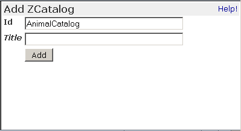
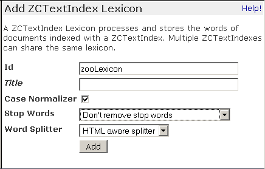
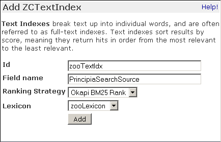
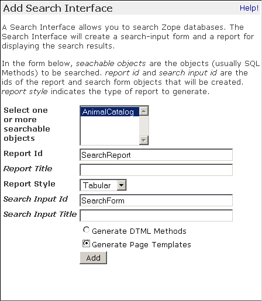
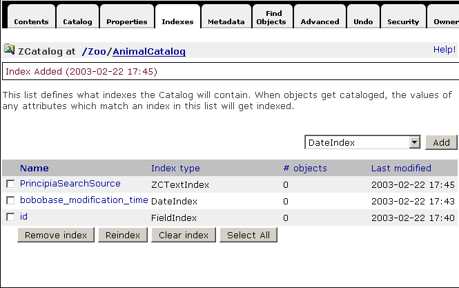
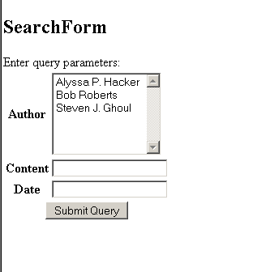

Searching and Categorizing Content
==================================

.. include:: includes/zope2_notice.rst

The **ZCatalog** is Zope's built in search engine. It allows you to
categorize and search all kinds of Zope objects. You can also use it
to search external data such as relational data, files, and remote
web pages.  In addition to searching you can use the ZCatalog to
organize collections of objects.

The **ZCatalog** supports a rich query interface. You can perform full text
searching, search multiple indexes at once and even specify
weighing for different fields in your results. In addition, the
**ZCatalog** keeps track of meta-data about indexed objects.

The two most common ZCatalog usage patterns are:

Mass Cataloging
  Cataloging a large collection of objects all at once.

Automatic Cataloging
  Cataloging objects as they are created and tracking changes made to them.

Getting started with Mass Cataloging
------------------------------------

Let's take a look at how to use the **ZCatalog** to search documents.
Cataloging a bunch of objects all at once is called *mass cataloging*.

Mass cataloging involves four steps:

- Creating a **ZCatalog**

- Creating indexes

- Finding objects and cataloging them

- Creating a web interface to search the **ZCatalog**

Creating a ZCatalog
-------------------

Choose ``ZCatalog`` from the product add list to create a **ZCatalog**
object within a subfolder named ``Zoo``.  This takes you to the
**Add ZCatalog** form, as shown in the figure below.

   Add ZCatalog form

The Add form asks you for an **Id** and a **Title**.  Give your
**ZCatalog** the **Id** ``AnimalCatalog`` and click **Add** to create your new
**ZCatalog**.  The **ZCatalog** icon looks like a folder with a small
magnifying glass on it.  Select the ``AnimalCatalog`` icon to see
the **Contents** view of the **ZCatalog**.

A **ZCatalog** looks a lot like a folder, but it has a few more
tabs.  Six tabs on the **ZCatalog** are the exact same six tabs you
find on a standard folder.

A **ZCatalog** has the following views: ``Contents``, ``Catalog``,
``Properties``, ``Indexes``, ``Metadata``, ``Find Objects``,
``Advanced``, ``Undo``, ``Security``, and ``Ownership``.

When you click on a **ZCatalog**, you are on the **Contents**
view. Here, you can add new objects and the **ZCatalog** will
contain them just as any folder does. Although a **ZCatalog** is
like a normal Zope folder, this does not imply that the objects
contained within it are automatically searchable.  A **ZCatalog**
can catalog objects at any level of your site, and it needs to
be told exactly which ones to index.

Creating Indexes
~~~~~~~~~~~~~~~~

In order to tell Zope what to catalog and where to store the
information, we need to create a **Lexicon** and an **Index**.  A
**Lexicon** is necessary to provide word storage services for
full-text searching, and an **Index** is the object which stores
the data necessary to perform fast searching.

In the contents view of the **AnimalCatalog ZCatalog**, choose
**ZCTextIndex Lexicon**, and give it an **Id** of ``zooLexicon``.

   Add ZCTextIndex Lexicon form

Now we can create an index that will record the information we
want to have in the **ZCatalog**.  Click on the **Indexes** tab of the
**ZCatalog**.  A drop down menu lists the available indexes.  Choose
**ZCTextIndex**; in the add form fill in the **Id** ``zooTextIdx``.
Fill in ``PrincipiaSearchSource`` in the **Field name** input.  This
tells the **ZCTextIndex** to index the body text of the DTML
Documents (``PrincipiaSearchSource`` is an API method of all DTML
Document and Method objects).  Note that ``zooLexicon`` is
preselected in the **Lexicon** menu.

   Add ZCTextIndex form

.. note::

   When you want the **TextIndex** to work on other types of objects,
   they have to provide a method named ``PrincipiaSearchSource`` which
   returns the data of the object which has to be searched.

To keep this example short we will skip over some of the options
presented here.  In the section on indexes below, we will
discuss this more thoroughly.

Additionally, we will have to tell the **ZCatalog** which attributes
of each cataloged object that it should store directly.  These
attributes are called **Metadata**, however they should not be
confused with the idea of metadata in Zope CMF, Plone, or other
content management systems. Here, this just means that these are
attributes that will be stored directly in the catalog for
performance benefits.  For now, just go to the
**Metadata** tab of the **ZCatalog** and add ``id`` and ``title``.

Finding and Cataloging Objects
~~~~~~~~~~~~~~~~~~~~~~~~~~~~~~

Now that you have created a **ZCatalog** and an **Index**, you can move
onto the next step: finding objects and cataloging them.

Suppose you have a zoo site with information about animals.  To
work with these examples, create two DTML Documents along-side
the ``AnimalCatalog`` object (within the same folder that contains
the **AnimalCatalog ZCatalog**) that contain information about
reptiles and amphibians.

The first should have an **Id** of ``chilean_frog``, a **Title** ``Chilean
four-eyed frog`` and its body text should read something like
this::

  The Chilean four-eyed frog has a bright
  pair of spots on its rump that look like enormous eyes. When
  seated, the frog's thighs conceal these eyespots. When
  predators approach, the frog lowers its head and lifts its
  rump, creating a much larger and more intimidating head.
  Frogs are amphibians.

For the second, fill in an **Id** of ``carpet_python`` and a **Title** of
``Carpet Python``; its body text could be::

  *Morelia spilotes variegata* averages 2.4 meters in length.  It
  is a medium-sized python with black-to-gray patterns of
  blotches, crossbands, stripes, or a combination of these
  markings on a light yellowish-to-dark brown background.  Snakes
  are reptiles.

Visitors to your Zoo want to be able to search for information on
the Zoo's animals.  Eager herpetologists want to know if you have
their favorite snake, so you should provide them with the ability
to search for certain words and show all the documents that
contain those words.  Searching is one of the most useful and
common web activities.

The **AnimalCatalog ZCatalog** you created can catalog all of the
documents in your Zope site and let your users search for specific
words.  To catalog your documents, go to the **AnimalCatalog
ZCatalog** and click on the **Find Objects** tab.

In this view, you tell the **ZCatalog** what kind of objects you are
interested in.  You want to catalog all DTML Documents so select
``DTML Document`` from the **Find objects of type** multiple selection
and click **Find and Catalog**.

The **ZCatalog** will now start from the folder where it is located
and search for all DTML Documents.  It will search the folder and
then descend down into all of the sub-folders and their
sub-folders.  For example, if your ZCatalog is located at
``/Zoo/AnimalCatalog``, then the ``/Zoo`` folder and all its
subfolders will get searched. 

If you have lots and lots of objects, this may take a long time
to complete, so be patient.

After a period of time, the **ZCatalog** will take you to the **Catalog**
view automatically, with a status message telling you what it just
did.

Below the status information is a list of objects that are
cataloged, they are all DTML Documents.  To confirm that these are
the objects you are interested in, you can click on them to visit
them.  Viewing an object in the catalog shows you what was indexed
for the object, and what metadata items are stored for it.

You have completed the first step of searching your objects,
cataloging them into a **ZCatalog**. Now your documents are in the
**ZCatalog**'s database. Now you can move onto the fourth step,
creating a web page and result form to query the **ZCatalog**.

Search and Report Forms
~~~~~~~~~~~~~~~~~~~~~~~

To create search and report forms, make sure you are inside the
**AnimalCatalog ZCatalog** and select ``Z Search Interface`` from the
add list.  Select ``AnimalCatalog`` as the searchable
object, as shown in the figure below.

   Creating a search form for a ZCatalog

Name the **Report Id** ``SearchResults``, the **Search Input Id**
``SearchForm``, select ``Generate Page Templates`` and click **Add**.
This will create two new Page Templates in the ``AnimalCatalog``
**ZCatalog** named ``SearchForm`` and ``SearchResults``.

These objects are *contained in* the **ZCatalog**, but they are not
*cataloged by* the **ZCatalog**.  The **AnimalCatalog** has only
cataloged DTML Documents.  The search form and report templates
are just a user interface to search the animal documents in the
**ZCatalog**. You can verify this by noting that the search and
report forms are not listed in the **Cataloged Objects** tab.

To search the **AnimalCatalog**, select the ``SearchForm``
template and click on its **Test** tab.  

By typing words into the ``ZooTextIdx`` form element you can
search all of the documents cataloged by the **AnimalCatalog**.
For example, type in the word ``Reptiles``.  The
**AnimalCatalog** will be searched and return a simple
table of objects that have the word **Reptiles** in them.  The
search results should include the carpet python.  You can also
try specifying multiple search terms like ``reptiles OR
amphibians``.  Search results for this query should include both
the Chilean four-eyed Frog and the carpet python.

Congratulations, you have successfully created a **ZCatalog**,
cataloged content into it and searched it through the web.

Configuring ZCatalogs
---------------------

The **ZCatalog** is capable of much more powerful and complex searches
than the one you just performed. Let's take a look at how the
**ZCatalog** stores information. This will help you tailor your
**ZCatalogs** to provide the sort of searching you want.

Defining Indexes
~~~~~~~~~~~~~~~~

**ZCatalogs** store information about objects and their contents in
fast databases called **indexes**.  Indexes can store and retrieve
large volumes of information very quickly.  You can create
different kinds of indexes that remember different kinds of
information about your objects.  For example, you could have one
index that remembers the text content of DTML Documents, and
another index that remembers any objects that have a specific
property.

When you search a **ZCatalog** you are not searching through your
objects one by one. That would take far too much time if you had
a lot of objects.  Before you search a **ZCatalog**, it looks at
your objects and remembers whatever you tell it to remember
about them.  This process is called **indexing**.  From then on,
you can search for certain criteria and the **ZCatalog** will return
objects that match the criteria you provide.

A good way to think of an index in a **ZCatalog** is just like an
index in a book.  For example, in a book's index you can look up
the word **Python**::

  Python: 23, 67, 227

The word **Python** appears on three pages.  Zope indexes work
like this except that they map the search term, in this case the
word **Python**, to a list of all the objects that contain it,
instead of a list of pages in a book.

Indexes can be added and removed from a **ZCatalog**
using the "pluggable" index interface as shown in the figure below:

   Managing indexes

Each index has a name, like ``PrincipiaSearchSource``,
and a type, like ``ZCTextIndex``.

When you catalog an object the **ZCatalog** uses each index to
examine the object. The **ZCatalog** consults attributes and methods
to find an object's value for each index. For example, in the
case of the DTML Documents cataloged with a
``PrincipiaSearchSource`` index, the **ZCatalog** calls each document's
``PrincipiaSearchSource`` method and records the results in its
``PrincipiaSearchSource`` index. If the **ZCatalog** cannot find an
attribute or method for an index, then it ignores it. In other
words it's fine if an object does not support a given
index.

Among others, the **ZCatalog** comes with following indexes:

ZCTextIndex
  Searches text. Use this kind of index when you
  want a full-text search.

FieldIndex
  Searches objects for specific values. Use this
  kind of index when you want to search objects, numbers, or
  specific strings.

KeywordIndex
  Searches collections of specific values. This
  index is like a FieldIndex, but it allows you to search
  collections rather than single values.

PathIndex
  Searches for all objects that contain certain URL
  path elements.  For example, you could search for all the
  objects whose paths begin with ``/Zoo/Animals``.

TopicIndex
  Searches among FilteredSets;  each set contains
  the document IDs of documents which match the set's filter
  expression.  Use this kind of index to optimize
  frequently-accessed searches. 

DateIndex
  A subclass of FieldIndex, optimized for DateTime
  values.  Use this index for any field known to be a date or a
  DateTime. 

DateRangeIndex
  Searches objects based on a pair of
  DateTime objects.  Use this index to search for objects which are
  **current** or **in effect** at a given time. 

We'll examine these different indexes more closely later in the
chapter. New indexes can be created from the **Indexes** view of a
**ZCatalog**.  There, you can enter the **name** and select a **type**
for your new index.  This creates a new empty index in the
**ZCatalog**.  To populate this index with information, you need to
go to the **Advanced** view and click the the **Update Catalog**
button.  Recataloging your content may take a while if you have
lots of cataloged objects.  For a ZCTextIndex, you will also
need a **ZCTextIndex Lexicon** object in your **ZCatalog** - see below
for details. 

To remove an index from a **ZCatalog**, select the index and click
on the **Delete** button.  This will delete the index and all of
its indexed content.

Defining Meta Data
~~~~~~~~~~~~~~~~~~

The **ZCatalog** can not only index information about your object,
but it can also store information about your object in a
**tabular database** called the **Metadata Table**.  The **Metadata
Table** works similarly to a relational database table, it
consists of one or more **columns** that define the **schema** of
the table.  The table is filled with **rows** of information about
cataloged objects.  These rows can contain information about
cataloged objects that you want to store in the table. Your meta
data columns don't need to match your **ZCatalog's** indexes. Indexes
allow you to search; meta data allows you to report search
results.

The **Metadata Table** is useful for generating search reports. It
keeps track of information about objects that goes on your
report forms.  For example, if you create a **Metadata Table**
column called **Title**, then your report forms can use this
information to show the titles of your objects that are returned
in search results instead of requiring that you actually obtain
the object to show its title.

To add a new **Metadata Table** column, type in the name of the column
on the **Metadata Table** view and click **Add**.  To remove a column
from the **Metadata Table**, select the column check box and click on
the **Delete** button.  This will delete the column and all of its
content for each row.

While meta data columns are useful, there are performance tradeoffs
from using too many.  As more meta data columns are added, the
catalog itself becomes larger (and slower), and getting the
result objects becomes more memory- and performance-intensive.
Therefore, you should choose meta data columns only for those
fields that you'll want to show on common search results. 
Consider carefully before adding a field that returns a large
result (like the full text of a document) to meta data.

Next let's look more closely at how to search a **ZCatalog**.

Searching ZCatalogs
-------------------

You can search a **ZCatalog** by passing it search terms. These search
terms describe what you are looking for in one or more indexes. The
**ZCatalog** can extract this information from the web request, or you
can pass this information explicitly from DTML or Python. In
response to a search request, a **ZCatalog** will return a list of
records corresponding to the cataloged objects that match the
search terms.

Searching with Forms
~~~~~~~~~~~~~~~~~~~~

In this chapter you used the **Z Search Interface** to
automatically build a Form/Action pair to query a **ZCatalog** (the
Form/Action pattern is discussed in the chapter entitled
`Advanced Page Templates <AdvZPT.html>`_ ).  The **Z Search
Interface** builds a very simple form and a very simple
report. These two methods are a good place to start
understanding how **ZCatalogs** are queried and how you can
customize and extend your search interface.

Suppose you have a **ZCatalog** that holds news items named
**NewsCatalog**.  Each news item has ``content``, an ``author`` and a
``date`` attribute.  Your **ZCatalog** has three indexes that
correspond to these attributes, namely ``contentTextIdx``,
``author`` and ``date``.  The contents index is a ZCTextIndex, and
the author and date indexes are a FieldIndex and a DateIndex.
For the ZCTextIndex you will need a ZCTextIndexLexicon, and to
display the search results in the **Report** template, you should
add the ``author``, ``date`` and ``absolute_url`` attributes as
meta data.  Here is a search form that would allow you to query
such a **ZCatalog**::

  <html><body>
  <form action="Report" method="get">
  <h2 tal:content="template/title_or_id">Title</h2>
  Enter query parameters: <table>
  <tr><th>Author</th>
  <td><input name="author" width=30 value=""></td></tr>
  <tr><th>Content</th>
  <td><input name="contentTextIdx" width=30 value=""></td></tr>
  <tr><th>Date</th>
  <td><input name="date" width=30 value=""></td></tr>
  <tr><td colspan=2 align=center>
  <input type="submit" name="SUBMIT" value="Submit Query">
  </td></tr>
  </table>
  </form>
  </body></html>

This form consists of three input boxes named ``contentTextIdx``,
``author``, and ``date``.  These names must match the names of the
**ZCatalog's** indexes for the **ZCatalog** to find the search terms.
Here is a report form that works with the search form::

  <html>
  <body tal:define="searchResults context/NewsCatalog;">
  <table border>
    <tr>
      <th>Item no.</th>
      <th>Author</th>
      <th>Absolute url</th>
      <th>Date</th>
    </tr>
    

    <tr>
      <td>
        <a href="link to object" tal:attributes="href item/absolute_url">
          #
            search item number goes here
          
        </a>
      </td>
      <td>author goes here</td>
      <td>date goes here</td>
    </tr>
    

  </table>
  </body></html>

There are a few things going on here which merit closer
examination.  The heart of the whole thing is in the definition
of the ``searchResults`` variable::

  <body tal:define="searchResults context/NewsCatalog;">

This calls the ``NewsCatalog`` ZCatalog.  Notice how the form
parameters from the search form (``contentTextIdx``,
``author``, ``date``) are not mentioned here at all.
Zope automatically makes sure that the query parameters from the
search form are given to the **ZCatalog**.  All you have to do is
make sure the report form calls the **ZCatalog**.  Zope locates the
search terms in the web request and passes them to the **ZCatalog**.

The **ZCatalog** returns a sequence of **Record Objects** (just like
ZSQL Methods).  These record objects correspond to **search
hits**, which are objects that match the search criteria you
typed in. For a record to match a search, it must match all
criteria for each specified index. So if you enter an author and
some search terms for the contents, the **ZCatalog** will only return
records that match both the author and the contents.

ZSQL Record objects have an attribute for every column in the
database table.  Record objects for **ZCatalogs** work very
similarly, except that a **ZCatalog** Record object has an attribute
for every column in the **Metadata Table**.  In fact, the purpose of
the **Metadata Table** is to define the schema for the Record
objects that **ZCatalog** queries return.

Searching from Python
~~~~~~~~~~~~~~~~~~~~~

Page Templates make querying a **ZCatalog** from a form very simple.
For the most part, Page Templates will automatically make sure
your search parameters are passed properly to the **ZCatalog**.

Sometimes though you may not want to search a **ZCatalog** from a web
form; some other part of your application may want to query a
**ZCatalog**.  For example, suppose you want to add a sidebar to the
Zope Zoo that shows news items that only relate to the animals
in the section of the site that you are currently looking at.
As you've seen, the Zope Zoo site is built up from folders that
organize all the sections according to animal.  Each folder's id
is a name that specifies the group or animal the folder
contains.  Suppose you want your sidebar to show you all the
news items that contain the id of the current section.  Here is
a script called ``relevantSectionNews`` that queries the news
**ZCatalog** with the current folder's id::

  ## Script (Python) "relevantSectionNews"
  ##
  """ Returns news relevant to the current folder's id """
  id=context.getId()
  return context.NewsCatalog({'contentTextIdx' : id})

This script queries the ``NewsCatalog`` by calling it like a
method.  **ZCatalogs** expect a **mapping** as the first argument when
they are called.  The argument maps the name of an index to the
search terms you are looking for.  In this case, the
``contentTextIdx`` index will be queried for all news items that
contain the name of the current folder.  To use this in your
sidebar place you could insert this snippet where appropriate in
the main Zope Zoo Page Template::

  ...
  <ul>
    <li tal:repeat="item context/relevantSectionNews">
      <a href="news link" tal:attributes="href item/absolute_url">
        news title
      </a>
    </li>
  </ul>
  ...     

This template assumes that you have defined ``absolute_url`` and
``title`` as meta data columns in the ``NewsCatalog``. Now, when you
are in a particular section, the sidebar will show a simple list
of links to news items that contain the id of the current animal
section you are viewing.

.. note::

   In reality, you shouldn't use an index called ``absolute_url``,
   but should rely instead on the ``getURL()`` method call below,
   as that works even in virtual hosting settings.

Methods of Search Results
~~~~~~~~~~~~~~~~~~~~~~~~~

The list of results you get for a catalog search is actually
a list of **Catalog Brain** objects.  In addition to having an
attribute for each item of your meta data, they also have
several useful methods:

has_key(key)
  Returns true if the result object has a meta data element 
  named key.

getPath()
  Returns the physical path of the result object.  This can be
  used to uniquely identify each object if some kind of
  post-processing is performed.

getURL()
  Returns the URL of the result object.  You should use this
  instead of creating a meta data element for ``absolute_url``.
  This can differ from ``getPath()`` if you are using virtual hosting.

getObject()
  Returns the actual Zope object from the result object.  This
  is useful if you want to examine or show an attribute or
  method of the object that isn't in the meta data. Once we have
  the actual object, we can get any normal attribute or method
  of it.  However, be careful not to use this instead of defining
  meta data.  Meta data, being stored in the catalog, is 
  pre-calculated and quickly accessed; getting the same type of
  information by using ``getObject().attribute_name`` requires
  actually pulling your real object from the ZODB and may be
  a good deal slower.  On the other hand, stuffing everything
  you might ever need into meta data will slow down all querying
  of your catalog, so you'll want to strike a balance. A good
  idea is to list in meta data those things that would normally
  appear on a tabular search results form; other things that
  might be needed less commonly (and for fewer result objects
  at a time) can be retrieved with getObject.

getRID()
  Returns the Catalog's record id for the result object.  This
  is an implementation detail, and is not useful except for
  advanced uses.

Searching and Indexing Details
------------------------------

Earlier you saw that the **ZCatalog** includes several types of
indexes.  Let's examine these indexes more closely, and look
at some of the additional available indexes, to understand
what they are good for and how to search them.

Searching ZCTextIndexes
~~~~~~~~~~~~~~~~~~~~~~~

A **ZCTextIndex** is used to index text.  After indexing, you can
search the index for objects that contain certain words.
ZCTextIndexes support a rich search grammar for doing more
advanced searches than just looking for a word.

Boolean expressions
%%%%%%%%%%%%%%%%%%%

  Search for **Boolean expressions** like::

    word1 AND word2

  This will search for all objects that contain **both** ``word1``
  and ``word2``.  Valid boolean operators include ``AND``, ``OR``, and
  ``NOT``.  A synonym for ``NOT`` is a leading hyphen::

    word1 -word2

  which would search for occurrences of ``word1`` but would
  exclude documents which contain ``word2``.  A sequence of words
  without operators implies ``AND``. A search for ``carpet python
  snakes`` translates to ``carpet AND python AND snakes``.

Parentheses
%%%%%%%%%%%

  Control search order with parenthetical expressions::

    (word1 AND word2) OR word3)

  This will return objects containing ``word1`` and ``word2`` **or**
  just objects that contain the term ``word3``.

Wild cards
%%%%%%%%%%

  Search for wild cards like::

    Z*

  which returns all words that begin with **Z**, or::

     Zop?

  which returns all words that begin with **Zop** and have one
  more character - just like in a Unix shell.  Note though that
  wild cards cannot be at the beginning of a search phrase.
  ``?ope`` is an illegal search term and will be ignored.

Phrase search
%%%%%%%%%%%%%

  Double-quoted text implies phrase search,  for example::

    "carpet python" OR frogs 

  will search for all occurrences of the phrase ``carpet python``
  or of the word ``frogs``

All of these advanced features can be mixed together.  For
example::

  ((bob AND uncle) AND NOT Zoo*)

will return all objects that contain the terms ``bob`` and ``uncle``
but will not include any objects that contain words that start
with ``Zoo`` like **Zoologist**, **Zoology**, or **Zoo** itself.

Similarly, a search for::

  snakes OR frogs -"carpet python"

will return all objects which contain the word ``snakes`` or
``frogs`` but do not contain the phrase ``carpet python``.

Querying a **ZCTextIndex** with these advanced features works just
like querying it with the original simple features.  In the HTML
search form for DTML Documents, for example, you could enter
``Koala AND Lion`` and get all documents about Koalas and Lions.
Querying a **ZCTextIndex** from Python with advanced features works
much the same; suppose you want to change your
``relevantSectionNews`` script to not include any news items that
contain the word ``catastrophic``::

  ## Script (Python) "relevantSectionNews"
  ##
  """ Returns relevant, non-catastrophic news """
  id=context.getId()
  return context.NewsCatalog(
           {'contentTextIdx' : id + ' -catastrophic'}
          )

**ZCTextIndexes** are very powerful.  When mixed with the automatic
cataloging pattern described later in the chapter, they give you
the ability to automatically full-text search all of your
objects as you create and edit them.

Lexicons
~~~~~~~~

**Lexicons** are used by ZCTextIndexes.  Lexicons process and store
the words from the text and help in processing queries.

Lexicons can:

Normalize Case
  Often you want search terms to be case insensitive, eg. a search for
  "python", "Python" and "pYTHON" should return the same results.  The
  lexicons' **Case Normalizer** does exactly that.

Remove stop words
  Stop words are words that are very common in a given language and should
  be removed from the index.  They would only cause bloat in the index and
  add little information.  In addition, stop words, being common words,
  would appear in almost every page, without this option turned on, a user
  searching for ``the python house`` would get back practically every single
  document on the site (since they would all likely contain **the**), taking
  longer and adding no quality to their results.

Split text into words
  A splitter parses text into words.  Different texts have different needs
  of word splitting - if you are going to process HTML documents, you might
  want to use the HTML aware splitter which effectively removes HTML tags.
  On the other hand, if you are going to index plain text documents **about**
  HTML, you don't want to remove HTML tags - people might want to look them
  up.  Also, an eg. chinese language document has a different concept of
  words and you might want to use a different splitter. 

The **Lexicon** uses a pipeline architecture. This makes it possible
to mix and match pipeline components.  For instance, you could
implement a different splitting strategy for your language and
use this pipeline element in conjunction with the standard text
processing elements.  Implementing a pipeline element is out of
the scope of this book; for examples of implementing and
registering a pipeline element see
eg. ``Products.ZCTextIndex.Lexicon.py``.  A pipeline
element should conform to the ``IPipelineElement`` interface.

To create a **ZCTextIndex**, you first have to create a Lexicon
object.  Multiple ZCTextIndexes can share the same lexicon. 

Searching Field Indexes
~~~~~~~~~~~~~~~~~~~~~~~

**FieldIndexes** have different aims than ZCTextIndexes.  A ZCTextIndex
will treat the value it finds in your object, for example the
contents of a news item, like text.  This means that it breaks
the text up into words and indexes all the individual words.

A FieldIndex does not break up the value it finds.  Instead, it
indexes the entire value it finds.  This is very useful for
tracking object attributes that contain simple values, such as
numbers or short string identifiers.

In the news item example, you created a FieldIndex
``author``.  With the existing search form, this field is
not very useful.  Unless you know exactly the name of the author
you are looking for, you will not get any results.  It would be
better to be able to select from a list of all the **unique**
authors indexed by the author index.

There is a special method on the **ZCatalog** that does exactly this
called ``uniqueValuesFor``.  The ``uniqueValuesFor`` method returns
a list of unique values for a certain index.  Let's change your
search form and replace the original ``author`` input box
with something a little more useful::

  <html><body>
  <form action="Report" method="get">
  <h2 tal:content="template/title_or_id">Title</h2>
  Enter query parameters: <table>
  <tr><th>Author</th>
  <td>
    <select name="author:list" size="6" multiple>             
      <option 
        tal:repeat="item python:context.NewsCatalog.uniqueValuesFor('author')" 
        tal:content="item"
        value="opt value">
      </option>
    </select>
  </td></tr>
  <tr><th>Content</th>
  <td><input name="content_index" width=30 value=""></td></tr>
  <tr><th>Date</th>
  <td><input name="date_index" width=30 value=""></td></tr>
  <tr><td colspan=2 align=center>
  <input type="submit" name="SUBMIT" value="Submit Query">
  </td></tr>
  </table>
  </form>
  </body></html>

The new, important bit of code added to the search form is::

    <select name="author:list" size="6" multiple>             
      <option 
        tal:repeat="item python:context.NewsCatalog.uniqueValuesFor('author')" 
        tal:content="item"
        value="opt value">
      </option>
    </select>

In this example, you are changing the form element ``author`` from
just a simple text box to an HTML multiple select box.  This box
contains a unique list of all the authors that are indexed in
the ``author`` FieldIndex.  When the form gets submitted, the
select box will contain the exact value of an authors name, and
thus match against one or more of the news objects.  Your search
form should look now like the figure below.

   Unique Authors

Be careful if you catalog objects with many different values; you
can easily end up with a form with a thousand items in the drop-down
menu. Also, items must match **exactly**, so strings that differ
in capitalization will be considered different.

That's it.  You can continue to extend this search form using HTML
form elements to be as complex as you'd like.  In the next section,
we'll show you how to use the next kind of index, keyword indexes.

Searching KeywordIndexes
~~~~~~~~~~~~~~~~~~~~~~~~

A **KeywordIndex** indexes a sequence of keywords for objects and
can be queried for any objects that have one or more of those
keywords.

Suppose that you have a number of image objects that have a
**keywords** property. The **keywords** property is a lines property
that lists the relevant keywords for a given image, for example,
``Portraits``, ``19th Century``, and ``Women`` for a picture of Queen
Victoria.  

The keywords provide a way of categorizing images. Each image can
belong in one or more categories depending on its **keywords**
property. For example, the portrait of Queen Victoria belongs to
three categories and can thus be found by searching for any of the
three terms. 

You can use a **Keyword** index to search the **keywords** property. Define
a **Keyword** index with the name ``keywords`` on your **ZCatalog**. Then
catalog your images. Now you should be able to find all the images
that are portraits by creating a search form and searching for
``Portraits`` in the **keywords** field. You can also find all pictures
that represent 19th Century subjects by searching for ``19th
Century``. 

It's important to realize that the same image can be in more
than one category. This gives you much more flexibility in
searching and categorizing your objects than you get with a
FieldIndex. Using a FieldIndex your portrait of Queen Victoria
can only be categorized one way.  Using a KeywordIndex it can be
categorized a couple different ways.

Often you will use a small list of terms with **KeywordIndexes**.
In this case you may want to use the ``uniqueValuesFor`` method to
create a custom search form. For example here's a snippet of a
Page Template that will create a multiple select box for all the
values in the **keywords** index::

  <select name="keywords:list" multiple>
    <option 
      tal:repeat="item python:context.uniqueValuesFor('keywords')"
      tal:content="item">
        opt value goes here
    </option>
  </select>

Using this search form you can provide users with a range of
valid search terms. You can select as many keywords as you want and
Zope will find all the images that match one or more of your
selected keywords. Not only can each object have several indexed
terms, but you can provide several search terms and find all
objects that have one or more of those values.

Searching Path Indexes
~~~~~~~~~~~~~~~~~~~~~~

Path indexes allow you to search for objects based on their
location in Zope. Suppose you have an object whose path is
``/zoo/animals/Africa/tiger.doc``. You can find this object with
the path queries: ``/zoo``, or ``/zoo/animals``, or
``/zoo/animals/Africa``. In other words, a path index allows you
to find objects within a given folder (and below).

If you place related objects within the same folders, you can
use path indexes to quickly locate these objects. For example::

  <h2>Lizard Pictures</h2>
  

    <a href="url" tal:attributes="href item/getURL" tal:content="item/title">
      document title
    </a>
  
    

This query searches a **ZCatalog** for all images that are located
within the ``/Zoo/Lizards`` folder and below. It creates a link to
each image.  To make this work, you will have to create a
FieldIndex ``meta_type`` and a meta data entry for ``title``.

Depending on how you choose to arrange objects in your site, you
may find that a path indexes are more or less effective.  If you
locate objects without regard to their subject (for example, if
objects are mostly located in user **home folders**) then path
indexes may be of limited value.  In these cases, key word and
field indexes will be more useful.

Searching DateIndexes
~~~~~~~~~~~~~~~~~~~~~

**DateIndexes** work like FieldIndexes, but are optimized for
DateTime values.  To minimize resource usage, DateIndexes have a
resolution of one minute, which is considerably lower than the
resolution of DateTime values.

**DateIndexes** are used just like FieldIndexes; below in the
section on **Advanced Searching with Records** we present an
example of searching them.

Searching DateRangeIndexes
~~~~~~~~~~~~~~~~~~~~~~~~~~

**DateRangeIndexes** are specialized for searching for ranges of
DateTime values.  An example application would be NewsItems
which have two DateTime attributes ``effective`` and ``expiration``,
and which should only be published if the current date would
fall somewhere in between these two date values.  Like
DateIndexes, **DateRangeIndexes** have a resolution of one minute. 

**DateRangeIndexes** are widely used in CMF and Plone, where
content is compared to an effective date and an expiration
date.

**DateRangeIndexes** also allow one or both of the boundary dates of
the indexed objects to be left open which greatly simplifies
application logic when querying for **active** content where expiration
and effective dates are optional.

Searching TopicIndexes
~~~~~~~~~~~~~~~~~~~~~~

A **TopicIndex** is a container for so-called FilteredSets. A
FilteredSet consists of an expression and a set of internal
**ZCatalog** document identifiers that represent a pre-calculated
result list for performance reasons. Instead of executing the
same query on a **ZCatalog** multiple times it is much faster to use
a TopicIndex instead.

**TopicIndexes** are also useful for indexing boolean attributes or
attributes where only one value is queried for. They can do this more
efficiently then a field index.

Building up FilteredSets happens on the fly when objects are
cataloged and uncatalogued. Every indexed object is evaluated
against the expressions of every FilteredSet. An object is added
to a FilteredSet if the expression with the object evaluates to
True. Uncatalogued objects are removed from the FilteredSet.

A built-in type of FilteredSet is the PythonFilteredSet - it
would be possible to construct custom types though.

A PythonFilteredSet evaluates using the ``eval()`` function inside the
context of the FilteredSet class. The object to be indexed must
be referenced inside the expression using ``o``.  Below are some
examples of expressions.

This would index all DTML Methods::

  o.meta_type=='DTML Method'

This would index all folderish objects which have a non-empty
title::

  o.isPrincipiaFolderish and o.title

Querying of **TopicIndexes** is done much in the same way as with
other Indexes.  Eg., if we named the last FilteredSet above
``folders_with_titles``, we could query our TopicIndex with a
Python snippet like::

  zcat = context.AnimalCatalog
  results = zcat(topicindex='folders_with_titles')

Provided our **AnimalCatalog** contains a TopicIndex ``topicindex``,
this would return all folderish objects in **AnimalCatalog** which
had a non-empty title.  

**TopicIndexes** also support the ``operator`` parameter with Records.
More on Records below.

Advanced Searching with Records
-------------------------------

A more advanced feature is the ability to query indexes more
precisely using record objects.  Record objects contain
information about how to query an index.  Records are Python
objects with attributes, or mappings.  Different indexes support
different record attributes.

Note that you don't have to use record-style queries unless you
need the features introduced by them: you can continue to use
traditional queries, as demonstrated above.

A record style query involves passing a record (or dictionary)
to the catalog instead of a simple query string.

KeywordIndex Record Attributes
~~~~~~~~~~~~~~~~~~~~~~~~~~~~~~

query
  Either a sequence of words or a single word (mandatory)

operator
  Specifies whether all keywords or only one need
  to match. Allowed values: ``and``, ``or`` (optional, default:
  ``or``)

For example::

  # big or shiny
  results=ZCatalog(categories=['big', 'shiny'])

  # big and shiny
  results=ZCatalog(categories={'query':['big','shiny'], 
                                       'operator':'and'})

The second query matches objects that have both the keywords
``big`` and ``shiny``. Without using the record syntax you can
only match objects that are big or shiny.

FieldIndex Record Attributes
~~~~~~~~~~~~~~~~~~~~~~~~~~~~

query
  Either a sequence of objects or a single value to be
  passed as query to the index (mandatory)

range
  Defines a range search on a FieldIndex (optional, default: not set)

  Allowed values:

    min
      Searches for all objects with values larger than
      the minimum of the values passed in the ``query`` parameter.

    max
      Searches for all objects with values smaller than
      the maximum of the values passed in the ``query`` parameter.

    min:max
      Searches for all objects with values smaller than the maximum of the
      values passed in the ``query`` parameter and larger than the minimum of
      the values passed in the ``query`` parameter. 

For example, here is a PythonScript snippet using a range 
search::

  # animals with population count greater than 5
  zcat = context.AnimalCatalog
  results=zcat(population_count={
                   'query' : 5,
                   'range': 'min'}
              )

This query matches all objects in the **AnimalCatalog** which have a
population count greater than 5 (provided that there is a
FieldIndex ``population_count`` and an attribute ``population_count``
present).

Or::

  # animals with population count between 5 and 10
  zcat = context.AnimalCatalog
  results=zcat(population_count={
                   'query': [ 5, 10 ],
                   'range': 'min:max'}
              )

This query matches all animals with population count
between 5 and 10 (provided that the same FieldIndex
``population_count`` indexing the attribute ``population_count``.)

Path Index Record Attributes
~~~~~~~~~~~~~~~~~~~~~~~~~~~~

query
  Path to search for either as a string (e.g. ``/Zoo/Birds``) or list (e.g.
  ``["Zoo", "Birds"]``) (mandatory)

level
  The path level to begin searching at.  Level defaults to ``0``, which means
  searching from the root.  A level of ``-1`` means start from anywhere in the
  path. 

Suppose you have a collection of objects with these paths:

- ``'/aa/bb/aa'``

- ``'/aa/bb/bb'``

- ``'/aa/bb/cc'``

- ``'/bb/bb/aa'``

- ``'/bb/bb/bb'``

- ``'/bb/bb/cc'``

- ``'/cc/bb/aa'``

- ``'/cc/bb/bb'``

- ``'/cc/bb/cc'``

Here are some examples queries and their results to show how the
**level** attribute works:

``query="/aa/bb", level=0``
  This gives the same behavior as our previous examples, ie. searching
  absolute from the root, and results in:

  - ``'/aa/bb/aa'``

  - ``'/aa/bb/bb'``

  - ``'/aa/bb/cc'``

``query="/bb/bb", level=0``
  Again, this returns the default: 

  - ``'/bb/bb/aa'``

  - ``'/bb/bb/bb'``

  - ``'/bb/bb/cc'``

``query="/bb/bb", level=1``
  This searches for all objects which have ``'/bb/bb'`` one level down from
  the root:

  - ``'/aa/bb/bb'``

  - ``'/bb/bb/bb'``

  - ``'/cc/bb/bb'``

``query="/bb/bb", level=-1``
  Gives all objects which have ``/bb/bb`` anywhere in their path:

  - ``'/aa/bb/bb'``

  - ``'/bb/bb/aa'``

  - ``'/bb/bb/bb'``

  - ``'/bb/bb/cc'``

  - ``'/cc/bb/bb'``

``query="/xx", level=-1``
  Returns ``None``

You can use the level attribute to flexibly search different
parts of the path.

You can also include level information in a search without using a record.
Simply use a tuple containing the query and the level.
Here's an example tuple: ``("/aa/bb", 1)``.

DateIndex Record Attributes
~~~~~~~~~~~~~~~~~~~~~~~~~~~

The supported Record Attributes are the same as those of the
FieldIndex:

query
  Either a sequence of objects or a single value to be
  passed as query to the index (mandatory)

range
  Defines a range search on a DateIndex (optional, default: not set)

  Allowed values:

    min
      Searches for all objects with values larger than
      the minimum of the values passed in the ``query`` parameter.

    max
      Searches for all objects with values smaller than
      the maximum of the values passed in the ``query`` parameter.

    min:max
      Searches for all objects with values smaller
      than the maximum of the values passed in the ``query``
      parameter and larger than the minimum of the values passed
      in the ``query`` parameter. 

As an example, we go back to the NewsItems we created in the
Section **Searching with Forms**.  For this example, we created
news items with attributes ``content``, ``author``, and ``date``.
Additionally, we created a search form and a report template for
viewing search results.  

Searching for dates of NewsItems was not very comfortable
though - we had to type in exact dates to match a document.

With a ``range`` query we are now able to search for ranges of
dates.  Take a look at this PythonScript snippet::

  # return NewsItems newer than a week
  zcat = context.NewsCatalog
  results = zcat( date={'query' : context.ZopeTime() - 7,
                        'range' : 'min'
                })

DateRangeIndex Record Attributes
~~~~~~~~~~~~~~~~~~~~~~~~~~~~~~~~

**DateRangeIndexes** only support the ``query`` attribute on Record
objects.  The ``query`` attribute results in the same
functionality as querying directly; returning matches where
the date supplied to the query falls between the start and
end dates from the indexed object.

TopicIndex Record Attributes
~~~~~~~~~~~~~~~~~~~~~~~~~~~~

Like KeywordIndexes, **TopicIndexes** support the ``operator``
attribute:

operator
  Specifies whether all FieldSets or only one need to match.
  Allowed values: ``and``, ``or`` (optional, default: ``or``)

ZCTextIndex Record Attributes
~~~~~~~~~~~~~~~~~~~~~~~~~~~~~

Because **ZCTextIndex** operators are embedded in the query string,
there are no additional Record Attributes for ZCTextIndexes.

Creating Records in HTML
~~~~~~~~~~~~~~~~~~~~~~~~

You can also perform record queries using HTML forms. Here's an
example showing how to create a search form using records::

  <form action="Report" method="get">
  <table>
  <tr><th>Search Terms (must match all terms)</th>
      <td><input name="content.query:record" width=30 value=""></td></tr>
      <input type="hidden" name="content.operator:record" value="and">
  <tr><td colspan=2 align=center>
  <input type="SUBMIT" value="Submit Query">
  </td></tr>
  </table>
  </form>

For more information on creating records in HTML see the section
**Passing Parameters to Scripts** in Chapter 14, Advanced Zope
Scripting.

Automatic Cataloging
--------------------

**Automatic Cataloging** is an advanced **ZCatalog** usage pattern that
keeps objects up to date as they are changed. It requires that as
objects are created, changed, and destroyed, they are
automatically tracked by a **ZCatalog**. This usually involves the
objects notifying the **ZCatalog** when they are created, changed, or
deleted.

This usage pattern has a number of advantages in comparison to
mass cataloging. Mass cataloging is simple but has drawbacks.  The
total amount of content you can index in one transaction is
equivalent to the amount of free virtual memory available to the
Zope process, plus the amount of temporary storage the system has.
In other words, the more content you want to index all at once,
the better your computer hardware has to be.  Mass cataloging
works well for indexing up to a few thousand objects, but beyond
that automatic indexing works much better.

If you can trade off memory for time, you can enable
**Subtransactions** in the **Advanced** tab of the catalog. This
commits the work in chunks, reducing memory requirements, but
taking longer. It is a good solution for mass cataloging with a
very large number of records.

Another major advantage of automatic cataloging is that it can
handle objects that change. As objects evolve and change, the
index information is always current, even for rapidly changing
information sources like message boards.

On the other hand, cataloging a complex object when it changes may be too time
consuming during operation (especially if the catalog index attempts to
translate the information). Some sites may benefit from mass cataloging,
and having a cron job or other scheduled job initiate the mass cataloging every
night.

In standard (non-CMF, non-Plone) Zope, none of the built-in
object types attempt to automatically catalog themselves. In
CMF and Plone, the "contentish" object (Documents, News Item,
Event, etc.) all use automatic cataloging to add themselves
to the standard CMF catalog, **portal_catalog**.  CMF
and especially Plone offer many advantages; if you're interested
in building a content-oriented site, you should consider
these technologies.

Advanced Catalog Topics
-----------------------

Sorting
~~~~~~~

When you execute a **ZCatalog** call, your result set may or may not
be returned in a particular order:

- If your query contains no text index fields, your results will
  not be sorted in any particular order.  For example, with a
  query based off a **KeywordIndex**, or query based off both
  a **KeywordIndex** and a **DateIndex**, you will get a indeterminate
  ordering.

- For results that include a text index, your results will be
  returned in order of relevance of the text search.  That is,
  the result set will be sorted based how often
  search words appear in the indexes.  A search for the word
  ``frog`` against a text index will give priority toward an object
  that uses that word many times compared with
  an object that uses that fewer.  This is
  a simplified version of the way that many web search engines
  work: the more **relevant** your keywords are to an item, the
  higher its ordering in the results. In particular, with
  the **ZCTextIndex**, you have a choice between two algorithms
  for how to weight the sorting:

  - Okapi: is the best general choice. It does very well
    when comparing an ordinary **human query** against a longer
    text field. For example, querying a long description field
    for a short query like ``indoor OR mammal`` would work very
    well.

  - Cosine: is better suited for when the length of the
    query comes close to matching the length of the field
    itself.

You, of course, may want to force a particular order onto your
results.  You can do this after you get a result set using
normal Python syntax::

  # get ordered results from search
  zcat=context.AnimalCatalog
  results=zcat({'title':'frog'})
  results=[(row.title, row) for row in results]
  results.sort()

This can be, however, very inefficient.

When results are returned by the **ZCatalog**, they are in a special
form called a ``LazyResults`` set.  This means that Zope hasn't
gone to the trouble of actually creating the entire list, but
has just sketched out the list and will fill it in at the exact
point that you ask for each item.  This is helpful, since it lets
you query the catalog for a result set with 10,000 items without
Zope having to really construct a 10,000 item long list of results.
However, when we try to sort this, Zope will have to actually
create this list since it can't rely on it's lazy, just-in-time
method.

Normally, you'll only show the first 20 or 50 or so of a result
set, so sorting 10,000 items just to show the first 20 is a waste
of time and memory.  Instead, we can ask the catalog to do the
sorting for us, saving both time and space.

To do this, we'll pass along several additional keywords in our
search method call or query:

sort_on
  The field name to sort the results on

sort_order
  ``ascending`` or ``descending``, with the default
  being ``ascending``. Note that you can also use ``reverse``
  as a synonym for ``descending``

sort_limit
  Since you're likely to only want to use the
  first 20 or 50 or so items, we can give a hint to the 
  **ZCatalog** not to bother to sort beyond this by passing along
  a ``sort_limit`` parameter, which is the number of records
  to sort.

For example, assuming we have a ``latin_name`` FieldIndex on our
animals, we can sort them by name in a PythonScript with::

  zcat=context.AnimalCatalog
  zcat({'sort_on':'latin_name'})

or::

  zcat=context.AnimalCatalog
  zcat({'sort_on':'latin_name', 'sort_order':'descending'})

or, if we know we'll only want to show the first 20 records::

  zcat=context.AnimalCatalog
  zcat({'sort_on':'latin_name',
        'sort_order':'descending',
        'sort_limit':20})

or, combining this with a query restriction::

  zcat=context.AnimalCatalog
  zcat({'title':'frog',
        'sort_on':'latin_name',
        'sort_order':'descending',
        'sort_limit':20})

This gives us all records with the **title** ``frog``, sorted
by ``latin_name``, and doesn't bother to sort after the first
20 records.

Note that using **sort_limit** does not guarantee that we'll get
exactly that number of records - we may get fewer if they're
aren't that many matching or query, and we may get more. 
**sort_limit** is merely a request for optimization. To
ensure that we get no more than 20 records, we'll want to 
truncate our result set::

  zcat=context.AnimalCatalog
  zcat({'sort_on':'latin_name',
        'sort_order':'descending',
        'sort_limit':20})[:20]

Unsortable Fields
%%%%%%%%%%%%%%%%%

In order to sort on an index, we have to actually keep the
full attribute or method value in that index.  For many
index types, such as DateIndex or FieldIndex, this is
normally done.  However, for text indexes, such as
ZCTextIndex, the index doesn't keep the actual
attribute or method results in the index.  Instead, it
cleans up the input (often removing **stop words**,
normalizing input, lowercasing it, removing duplicates,
etc., depending on the options chosen.  So a term paper
with an attribute value of::

  "A Critique of 'Tora! Tora! Tora!'"

could actually be indexed as :

  ( 'critique', 'tora' )

once the common stop words ("a", "of") are removed,
it is lowercased and deduplicated.  In reality,
the indexed information is much richer, as it keeps
track of things like how often words appear, and which
words appear earlier in the stream, but this gives
you an idea of what is stored.

This is a necessary and positive step to make the index
use less storage and less memory, and increases search
results, as your site user doesn't have to worry about
getting incidental words ("the", "a", etc.) correct,
nor about capitalization, etc.

However, this process means that the index no longer knows
the actual value, and, therefore, can't sort on it.
Due to this, it is not possible to use the **sort_on**
feature with text indexes types.

To work around this, you can either sort the results of
the query using the normal python ``sort()`` feature
(shown above), or you can create an additional non-text
index on the field, described below, in the section
**Indexing a Field with Two Index Types**.

Similarly, the API call ``uniqueValuesFor``, described above,
cannot be used on text-type indexes, since the exact
values are not kept.

Searching in More Than One Index Using "OR"
~~~~~~~~~~~~~~~~~~~~~~~~~~~~~~~~~~~~~~~~~~~

As mentioned, if you search in more than one index,
you must meet your criteria for each index you search
in, i.e., there is an implied ``AND`` between each of the
searches::

  # find sunset art by Van Gogh
  zcat=context.ArtCatalog
  results=zcat({'keyword':'sunsets', 'artist':'Van Gogh'})

This query finds all sunset art by Van Gogh: both of
these conditions must be true.

There is no way to directly search in more than one
index without this ``AND`` condition; instead, you can
perform two catalog searches and concatenate their
results. For example::

  # find sunset art OR art by Van Gogh
  zcat=context.ArtCatalog
  results=zcat({'keyword':'sunsets'}) + \
          zcat({'artist':'Van Gogh'})

This method, however, does not remove duplicates, so
a painting of a sunset by VanGogh would appear twice.

For an alternate strategy about searching in two places,
see **PrincipiaSearchSource** below.

Indexing a Field With Two Index Types
~~~~~~~~~~~~~~~~~~~~~~~~~~~~~~~~~~~~~

Since the different indexes act differently, it can be advantageous
to have the same attribute indexed by more than one index.  For
example, our animals have a **latin_name** attribute that gives their
formal genus/species latin name.  A user should be able to search
that trying to match a name **exactly**, and we should be able to
sort results based on that, both of which suggest a **FieldIndex**.  In
addition, though, users may want to search that like a text field,
where they can match parts of words, in which case we would a
**ZCTextIndex**.

In a case like this, a good strategy is to create one index for the
FieldIndex on **latin_name**.  Let's call that index ``latin_name``.
Then, you can create a **ZCTextIndex** that uses a new feature: the
ability to have the indexed attribute be different than the index
name itself.

When you create the second index, the **ZCTextIndex**, you can give it
the id ``latin_name_text``, and have the **Indexed attributes** field
be ``latin_name``.  Now, when we catalog our animals, their
``latin_name`` attribute is indexed in two ways: once, as a
**FieldIndex**, that we can sort against and match exactly, and once as
a **ZCTextIndex**, that we can search like a text field with full text
search.

The second index has a different name, so when we make our catalog
call, we'll need to be sure to use that name if we want to search
it like a text field::

  # search latin_name
  zcat=context.AnimalCatalog
  exact_results=zcat({'latin_name':'homo sapiens'})
  fuzzy=zcat({'latin_name_text':'sap*'})

Note that a good strategy is to have the search be against the
**ZCTextIndex**, but sort it by the **FieldIndex**::

  # free text search, sorted
  zcat=context.AnimalCatalog
  results=zcat({'latin_name_text':'sap*',
                'sort_on':'latin_name'})

PrincipiaSearchSource
~~~~~~~~~~~~~~~~~~~~~

You can choose to create indexes on any attribute or method that
you would find useful to search on; however, one that is
generally helpful is **PrincipiaSearchSource**.  Several of the
built-in Zope objects, such as DTMLDocuments, and many add-on
objects to Zope have a **PrincipiaSearchSource** attribute or
method that returns a value that is meant to be used for general
purpose searching.  Traditionally, **PrincipiaSearchSource**
would include the text in an object's title, it's body, and
anywhere else you'd want to be able to search. 

For example, if you downloaded a Zope product that managed
our zoo, and it had an animal type that you could add to your
site, this animal type would probably expose a 
**PrincipiaSearchSource** that looked something like this::

  def PrincipiaSearchSource(self):
      """used for general searching for animal"""
    return self.title + ' ' + self.latin_name + ' ' \
         + self.description + ' ' + self.environment

So that, if you create a **PrincipiaSearchSource** index and
search again that, you can find this animal by using words
that are in it's ``title``, ``latin_name``, ``description``, or
``environment``, without having to worry about which field,
exactly, they're in.  This is similar to searching with a
web search engine, in that you use can use a single text string
to find the **right** information, without needing to know about
the type of object you're looking for.  It is especially
helpful in allowing you to create a site-wide search: searching
animals specifically by their ``latin_name`` or ``environment``
might be useful for a biologist in the right section of your
site, but for a general purpose visitor, they might like
to search using the phrase ``jungle`` and find results without
having to know to search for that in the ``environment`` field
of a search form.

If you create custom types by using more advanced techniques described
elsewhere, you should create a **PrincipiaSearchSource** method that returns
appropriate object-wide text searching capabilities.

ZCatalogs and CMF/Plone
~~~~~~~~~~~~~~~~~~~~~~~

The CMF was built from the ground up to understand the
difference between things that are **content**, such as a news item
or press release, and those things that are not, such as
a **DTMLMethod** used to show a press release, or a **ZCatalog**
object.  In addition, the CMF includes several stock items
that are intended to be used for content, including:
Document, Event, NewsItem, and others.  These content items
are already set up for automatic cataloging, so that any changes
made will appear in the catalog.

In non-CMF Zope, the traditional name for a general-purpose
catalog is **Catalog**. Though you can always create your own
catalog with any id you want; we've used the example
**AnimalCatalog** in this chapter for a special-purpose catalog
for searching animal-specific info in our zoo.  Even though
**Catalog** is the traditional name, Zope does not come with
such a catalog in the ZODB already, you have to create it.

In CMF (and Plone, an out-of-the-box portal system built
on top of the CMF), there is always a catalog created, called
**portal_catalog**, at the root of the CMF site.  All of the
built-in content objects (and almost every add-on content
object for the CMF/Plone) are set to automatically catalog to this
**portal_catalog**.  This is required, since many of the features
of the CMF and Plone, such as listing current content, finding
content of correct types, etc., rely on the **portal_catalog**
and the searching techniques shown here to function.

In CMF and Plone, the index name **PrincipiaSearchSource** is
not traditionally used.  Instead, an index is created called
**SearchableText**, and used in the same manner as
**PrincipiaSearchSource**.  All of the standard "contentish"
objects have a **SearchableText** method that returns things
like title, description, body, etc., so that they can be
general-text searched.

Conclusion
----------

The cataloging features of **ZCatalog** allow you to search your objects
for certain attributes very quickly.  This can be very useful for sites
with lots of content that many people need to be able to search in an
efficient manner.

Searching the **ZCatalog** works a lot like searching a relational
database, except that the searching is more object-oriented.  Not all
data models are object-oriented however, so in some cases you will want
to use the **ZCatalog**, but in other cases you may want to use a
relational database.  The next chapter goes into more details about how
Zope works with relational databases, and how you can use relational
data as objects in Zope.
