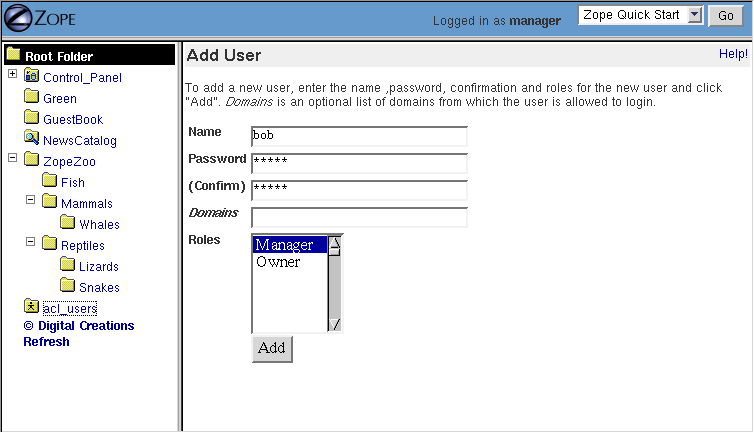
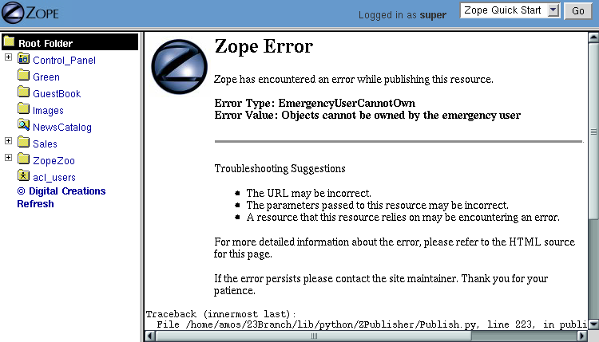
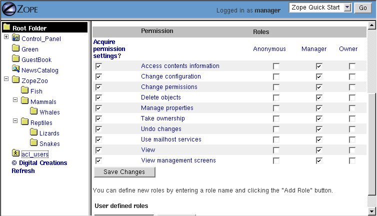
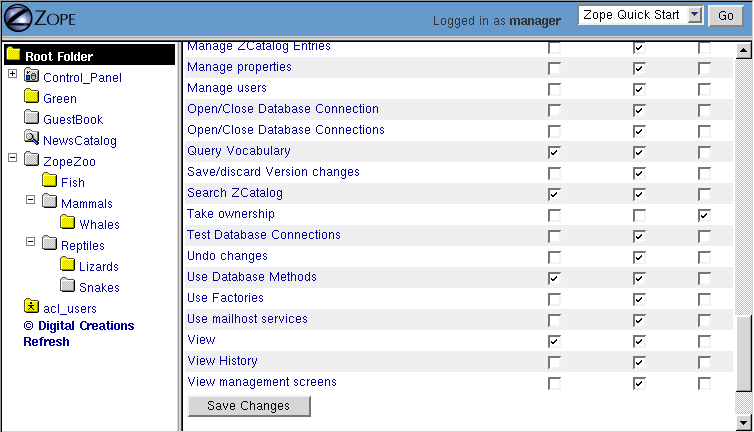
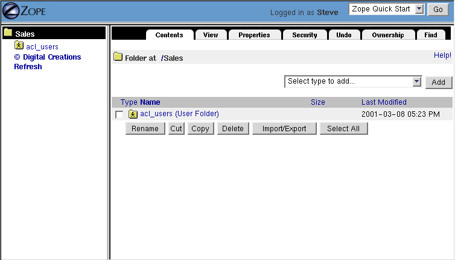
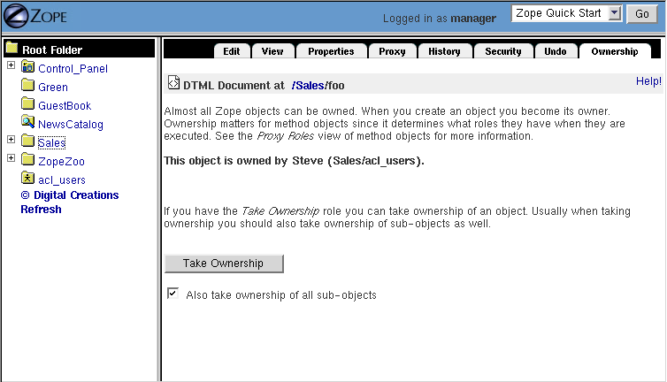
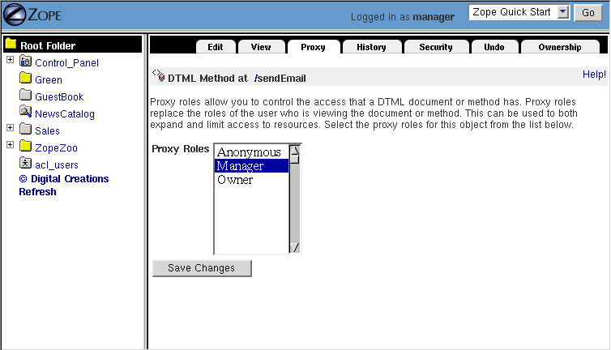

Users and Security
==================

.. include:: includes/zope2_notice.rst

Introduction to Zope Security
-----------------------------

Zope is a multi-user system. However, instead of relying upon the
user accounts provided by the operating system under which it runs,
Zope maintains one or more of its own user databases.  It is not
necessary to create a user account on the operating system under
which Zope runs in order to grant someone a user account which they
may use to access your Zope application or manage Zope via its
management interface.

It is important to note that Zope users do not have any of the
privileges of a "normal" user on your computer's operating system.
For instance, they do not possess the privilege to change arbitrary
files on your computer's filesystem.  Typically, a Zope user may
influence the content of databases that are connected to Zope may
execute scripts (or other "logic" objects) based on Zope's
security-restricted execution environment.  It is also possible to
allow users to create their own scripts and content "through the
web" by giving them access to the Zope Management Interface.
However, you can restrict the capability of a user or a class of
users to whatever suits your goals.  The important concept to absorb
is that Zope's security is entirely divorced from the operating
system upon which it runs.

In Zope, users have only the capabilities granted to them by a Zope
*security policy*.  As the administrator of a Zope system, you have
the power to change your Zope system's security policies to whatever
suits your business requirements.

Furthermore, using security policies you can provide the capability
to "safely" *delegate* capabilities to users defined within
different parts of a Zope site.  "Safe delegation" is one of the
important and differentiating features of Zope.  It is possible to
grant users the capability in a Zope site to administer users and
create scripts and content via the Zope Management Interface.  This
is called "safe" delegation because it is relatively "safe" to grant
users these kinds of capabilities within a particular portion of a
Zope site, as it does not compromise operating system security nor
Zope security in other portions of the site.  Caveats to safe
delegation pertain to denial of service and resource exhaustion (it
is not possible to control a user's resource consumption with any
true measure of success within Zope), but it is possible to delegate
these capabilities to "semi-trusted" users in order to decentralize
control of a website, allowing it to grow faster and require less
oversight from a central source.

In this chapter we will look more closely at administering users,
building roles, mapping roles to permissions, and creating a
security policy for your Zope site.

Review:  Logging In and Logging Out of the Zope Management Interface
--------------------------------------------------------------------

As we first saw in the chapter entitled `Installing Zope
<InstallingZope.html>`_ , you may log into the Zope Management
Interface by visiting a "management" URL in your web browser,
entering a username and password when prompted. We also pointed
out in `Using the Zope Management Interface <UsingZope.html>`_ that
due to the way many web browsers work, you often must perform an
extra step when an authentication dialog is raised or you must
quit your browser to log out of Zope.  Review these chapters for
more information about the basics of logging in and out of the
Zope Management Interface.

Zope's "Stock" Security Setup
-----------------------------

"Out of the box", a vanilla Zope site has two different classes of
users: *Managers* and *Anonymous* users.  You have already seen
via the `Installing Zope`_ chapter how you can
log into the Zope management interface with the "initial" user
called "admin".  The initial "admin" user is a user with the
*Manager* role, which allows him to perform almost any duty that
can be performed within a Zope instance.

By default, in the "stock" Zope setup, Managers have the rights to
alter Zope content and logic objects and view the management
interface, while the Anonymous users are only permitted to view
rendered content. This may be sufficient for many simple websites
and applications, especially "public-facing" sites which have no
requirement for users to "log in" or compose their own content.

Identification and Authentication
---------------------------------

When a user accesses a protected resource (for example, by attempting to view a
"protected" Page Template) Zope will ask the user to log in by presenting an
authentication dialog. Once the dialog has been "filled out" and submitted,
Zope will look for the user account represented by this set of credentials. By
default Zope uses HTTP basic authentication. A cookie-based authentication can
be implemented by adding a CookieCrumbler to the site's base folder.

Zope *identifies* a user by examining the username and password
provided during the entry into the authentication dialog.  If Zope
finds a user within one of its user databases with the username
provided, the user is identified.

Once a user has been identified, *authentication* may or may not
happen.  Authentication succeeds if the password provided by the
user in the dialog matches the password registered for that user
in the database.

Zope will only attempt to identify and authenticate a user if he
attempts to perform an action against Zope which an anonymous user
has not been permitted the capability to perform; if a user never
attempts to access a protected resource, Zope will continue to
treat the user as an anonymous user.

Zope prompts a user for authentication if the user attempts to
access a "protected" resource without an adequate set of
credentials, as determined by the resource's security policy.  For
example, if a user attempts to access a method of an object which
has a restrictive security policy (like all of Zope's management
interface methods) the user will be prompted for authentication if
he is not logged in.  You've seen this behavior already if you've
ever attempted to log in to Zope and have been asked for a
username and password to access the ZMI.  The ZMI is an example of
a Zope application.  Zope's security machinery performs security
checks on behalf of the ZMI; it "pops up" an authentication dialog
requesting that the user enter a username and password.

Different things can happen with respect to being prompted for
authentication credentials in response to a request for a protected
resource depending on the current state of a login session.  If
the user has not not yet logged in, Zope will prompt the user for
a username and password.  If the user is logged in but the account
under which he is logged in does not have sufficient privilege to
perform the action he has requested, Zope will prompt him for a
*different* username and password.  If he is logged in and the
account under which he has logged in *does* have sufficient
privileges to perform the requested action, the action will be
performed.  If a user cannot be authenticated because he provides
a nonexistent username or an incorrect password to an existing
authentication dialog, Zope re-prompts the user for authentication
information as necessary until the user either "gets it right" or
gives up.

In general, there is no need for a user to log in to Zope if he
only wishes to use public resources.  For example, to view the
parts of your Zope website that are publically available, a user
should not need to log in.

Authorization, Roles, and Permissions
-------------------------------------

Once a user has been authenticated, Zope determines whether or not
he has access to the resource which is being protected. This
process is called *authorization*.  Remember that the only reason
that Zope asked for credentials is because the user was attempting
to view a resource which was not viewable by an anonymous user.
The "resource which is being protected" referred to above is the
object which the user requested to perform an action against,
which caused the authentication process to begin.

The process of authorization involves two intermediary layers
between the user and the protected resource: *roles* and
*permissions*.

Users have *roles* which describe "what they can do" such as
"Author", "Manager", and "Editor".  These roles are controlled by
the Zope system administrator.  Users may have more than one role,
and may have a different set of roles in different contexts.  Zope
objects have permissions which describe "what can be done with
them" such as "View", "Delete objects", and "Manage properties".
These permissions are defined either within Zope itself or by Zope
*Products*, each of which may define its own set of permissions.

A *context* in Zope is a "place" within the Zope object hierarchy.
In relation to security, a context is an object that has a
location within the Zope Object Database.  For example, a
description of a context could be expressed as "a folder object named zoo'
within the Zope root object". In essence, a context can be thought of as an
object's "location" within the Zope Object Database, described by
its "path".  Each object that exists in the Zope Object Database
which has a web-manageable interface can be associated with its
own security policy.  Objects can also "acquire" security policies
from containing objects in order to ease the burden of creating a
security policy.  In fact, most Zope objects acquire their
security policies from their containers because it makes a given
security policy easier to maintain.  Only when there are
exceptions to the "master" security policy in a context are
individual objects associated with a differing policy.

In essence, *security policies map roles to permissions in a
context*; in other words they say "who" can do "what", and
"where". For example, the security policy for a Folder (the
context) may associate the "Manager" role (the roles) with the
"Delete objects" permission (the permissions). Thus, this security
policy allows managers to delete objects in this folder.  If
objects created within this folder do not override their parents'
security policy, they acquire this policy.  So, for example, if a
Page Template is created within this folder, it may also be deleted
by users with the Manager role.  Subobjects within subfolders of
the original folder have the same policy unless they override it
themselves, ad infinitum.

Managing Users
--------------

In the chapter entitled `Installing Zope`_, you
were provided with an "initial" account named 'admin', which
possesses the 'Manager' role, allowing you to manage the objects
in your Zope instance.  To allow other people to log into Zope,
and to further understand Zope security, you should create user
accounts under which different users may authenticate.

Creating Users in User Folders
~~~~~~~~~~~~~~~~~~~~~~~~~~~~~~

A Zope *User* object defines a user account. A Zope *User* has a
name, a password, one or more *roles*, and various other
properties.  Roles are granted to a user in order to make it
easier to control the scope of what he or she may do within a
Zope site.

To create user accounts in Zope, you create users within *User
Folders*.  A user folder contains user objects that define Zope
user accounts.  User Folder objects always have a Zope "id" of
'acl_users'.  More than one user folder can exist within a Zope
instance, but more than one user folder may not exist within the
*same* Zope Folder.

To create a new account, visit the root Zope folder. Click on
the object named *acl_users*.  Click the *Add* button to create
a new user.

   Adding a user to a user folder

The form shown above lets you define the user. Type a username
in the *Name* field (for example, "bob").  The username can
contain letters, spaces, and numbers. The username is case
sensitive.  Choose a password for your new user and enter it in
the *Password* and *(Confirm)* fields.  In the next section, we
will provide information about allowing a user to change his or
her own password.

The *Domains* field lets you restrict Internet domains from
which the user can log in. This allows you to add another safety
control to your account. For example if you always want your a
user to log in from work you could enter your work's Internet
domain name, for example "myjob.com", in the Domains field. You
can specify multiple domains separated by spaces to allow the
user to log in from multiple domains. For example if you decide
that your coworker should be able to manage Zope from their home
account too, you could set the domains to "myjob.com
myhome.net". You can also use IP numbers with asterisks to
indicate wildcard names instead of domain names to specify
domains. For example, "209.67.167.*" will match all IP addresses
that start with "209.67.167".

The *Roles* multiple select list indicates which roles the user
should have.  The Zope default roles include *Manager* and
*Owner*.  In general users who need to perform management tasks
using the Zope Management Interface should be given the
*Manager* role.  The *Owner* role is not appropriate to grant in
most cases because a user normally only has the Owner role in
the context of a specific object. Granting the Owner role to a
user in the User Folder management interface grants that user
ownership of all objects within the folder in which the user
folder is placed as well as all subfolders and subobjects of
that folder.  It is unfortunate that the Owner role is present
in the list of roles to choose from in the User Folder
management interface, as it is confusing, little-used, and only
now exists to service backwards compatibility.  In most cases it
can be ignored completely.

You may define your own roles such as *Editor* and *Reviewer*.
In the section later in this chapter named "Defining Roles", we
will create a new set of roles.  For now, we will work with the
"stock" Zope roles.

To create the new user click the *Add* button. You should see a
new user object in the user folder.

Zope User accounts defined in the "stock" user folder
implementation do not support additional properties like
email addresses and phone numbers.  For support of properties
like these, you will have to use external User products like the
`Pluggable Auth Service
<https://pypi.org/project/Products.PluggableAuthService/>`_

Users can not be copied and pasted between User Folders.  The
facility does not exist to perform this.

Editing Users
~~~~~~~~~~~~~

You can edit existing users by clicking on their name within the
User Folder management interface screen. Performing this action
causes a form to be displayed which is very similar to the form
you used to create a user. In fact, you may control most of the
same settings that we detailed in the "Adding Users" section
from within this form.  It is possible to visit this management
screen and change a user's password, his roles, and his domain
settings.  In the "stock" user folder implementation, you cannot
change a user's name, however, so you will need to delete and
recreate a user if you need to change his name.

It is not possible for someone to find out a user's password by
using the management interface.  Another manager may have access
to *change* another user's password, but he may not find out
what the current password is from within the management
interface.  If a user's password is lost, it is lost forever.

Like all Zope management functions, editing users is protected
by the security policy. Users can only change their password if
they have the *Manage Users* permission in the context of their
own user folder, which managers have by default.  It is often
desirable to allow users to change their own passwords.  One
problem is that by giving a user the *Manage Users* permission,
they are also able to edit other user accounts and add/delete
users.  This may or may not be what you want.  

To grant the capability for users to change their own passwords
without being able to influence other users' information, set up
a script with *Proxy Roles* to do the work for you after reading
the section within this chapter entitled "Proxy Roles".

In general, user folders work like normal Zope folders; you can
create, edit and delete contained objects. However, user folders
are not as capable as normal folders. You cannot cut and paste
users in a user folder, and you can't create anything besides a
user in a user folder.

To delete an existing user from a user folder, select the user and
click the *Delete* button. 

Defining a User's Location
~~~~~~~~~~~~~~~~~~~~~~~~~~

Zope can contain multiple user folders at different locations in
the object database hierarchy. A Zope user cannot access
protected resources above the user folder in which their account
is defined.  The location of a user's account information
determines the scope of the user's access.

If an account is defined in a user folder within the root
folder, the user may access protected objects defined within the
root folder. This is probably where the account you are using
right now is defined.  You can however, create user folders
within any Zope folder.  If a user folder is defined in a
subfolder, the user may only access protected resources within
that subfolder and within subfolders of that subfolder, and so
on.  

Consider the case of a user folder at
*/BeautySchool/Hair/acl_users*. Suppose the user *Ralph
Scissorhands* is defined in this user folder.  Ralph cannot
access protected Zope resources above the folder at
*/BeautySchool/Hair*. Effectively Ralph's view of protected
resources in the Zope site is limited to things in the
*BeautySchool/Hair* folder and below. Regardless of the roles
assigned to Ralph, he cannot access protected resources "above"
his location.  If Ralph was defined as having the 'Manager'
role, he would be able to go directly to
/BeautySchool/Hair/manage to manage his resources, but could not
access /BeautySchool/manage at all.

To access the Zope Management Interface as Manager user who is
*not* defined in the "root" user folder, use the URL to the
folder which contains his user folder plus 'manage'.  For
example, if Ralph Scissorhands above has the Manager role as
defined within a user folder in the *BeautySchool/Hair* folder,
he would be able to access the Zope Management Interface by
visiting 'http://zopeserver/BeautySchool/Hair/manage'.

Of course, any user may access any resource which is *not*
protected, so a user's creation location is not at all relevant
with respect to unprotected resources.  The user's location only
matters when he attempts to use objects in a way that requires
authentication and authorization, such as the objects which
compose the Zope Management Interface.

It is straightforward to delegate responsibilities to site
managers using this technique. One of the most common Zope
management patterns is to place related objects in a folder
together and then create a user folder in that folder to define
people who are responsible for those objects.  By doing so, you
"safely" *delegate* the responsibility for these objects to
these users.

For example, suppose people in your organization wear
uniforms. You are creating an intranet that provides information
about your organization, including information about
uniforms. You might create a 'uniforms' folder somewhere in the
intranet Zope site. In that folder you could put objects such as
pictures of uniforms and descriptions for how to wear and clean
them.  Then you could create a user folder in the 'uniforms'
folder and create an account for the head tailor. When a new
style of uniform comes out the tailor doesn't have to ask the
web master to update the site, he or she can update their own
section of the site without bothering anyone else.
Additionally, the head tailor cannot log into any folder above
the 'uniforms' folder, which means the head tailor cannot manage
any objects other than those in the 'uniforms' folder.

*Delegation* is a very common pattern in Zope applications. By
delegating different areas of your Zope site to different users,
you can take the burden of site administration off of a small
group of managers and spread that burden around to different
specific groups of users.

Working with Alternative User Folders  
~~~~~~~~~~~~~~~~~~~~~~~~~~~~~~~~~~~~~

It may be that you don't want to manage your user account through the web using
Zope's "stock" user folder implementation. Perhaps you already have a user
database, or perhaps you want to use other tools to maintain your account
information. Zope allows you to use alternate sources of data as user
information repositories. The most popular user folder implementation is called
`PluggableAuthService`_ which allows you to mix-in and combine a vast number of
different authentication schemes and backends, like LDAP or MySQL.

.. _PluggableAuthService: https://pypi.org/project/Products.PluggableAuthService/

Some user folders provide alternate login and logout controls in
the form of web pages, rather than relying on Basic HTTP
Authentication controls. Despite this variety, all user folders
use the same general log in procedure of prompting you for
credentials when you access a protected resource.

While most users are managed with user folders of one kind or
another, Zope has a few special user accounts that are not
managed with user folder.

Special User Accounts
~~~~~~~~~~~~~~~~~~~~~

Zope provides three special user accounts which are not defined
with user folders, the *anonymous user*, the *emergency user*,
and the *initial manager*. The anonymous user is used
frequently, while the emergency user and initial manager
accounts are rarely used but are important to know about.

Zope Anonymous User
%%%%%%%%%%%%%%%%%%%

Zope has a built-in user account for "guests" who possess no
credentials.  This is the 'Anonymous' user. If you don't have
a user account on Zope, you'll be considered to be the
'Anonymous' user.

The 'Anonymous' *user* additionally possesses the 'Anonymous'
*role*. The "stock" Zope security policy restricts users which
possess the 'Anonymous' role from accessing nonpublic
resources. You can tailor this policy, but most of the time
you'll find the default anonymous security settings adequate.

As we mentioned earlier in the chapter, you must try to access
a protected resource in order for Zope to attempt
authentication.  Even if you've got a user account on the
system, Zope will consider you the 'Anonymous' user until you
been prompted for login and you've successfully logged in.

Zope Emergency User
%%%%%%%%%%%%%%%%%%%

Zope has a special user account for emergency use known as the
*emergency user*. The emergency user is not restricted
by normal security settings. However, the emergency user
cannot create any new objects with the exception of new user
objects.

The emergency user is typically only useful for two things:
fixing broken permissions, and creating and changing user
accounts.

You may use the emergency user account to create or change
other user accounts.  Typically, you use the emergency user
account to define accounts with the 'Manager' role or change
the password of an existing account which already possesses
the 'Manager' role.  This is useful in case you lose your
management user password or username.  Typically, after you
create or change an existing a manager account you will log
out as the emergency user and log back in as the manager.

Another reason to use the emergency user account is to "fix"
broken permissions.  If you lock yourself out of Zope by
removing permissions you need to manage Zope, you can use the
emergency user account to repair the permissions. In this case
log in as the emergency user and make sure that your manager
account has the 'View management screens' and 'Change
permissions' permissions with respect to the object you're
attempting to view. Then log out and log back with your
manager account and you should have enough access to fix
anything else that is broken.

The emergency user cannot create new "content", "logic" or
"presentation" objects.  A common error message seen by users
attempting to use the emergency user account in trying to
create a new object is shown below.

   Error caused by trying to create a new object when logged in
   as the emergency user

The error above lets you know that the emergency user cannot
create new objects. This is "by design", and the reasoning
behind this policy may become clearer later in the chapter
when we cover ownership.  

Creating an Emergency User
%%%%%%%%%%%%%%%%%%%%%%%%%%

Unlike normal user accounts that are defined through the Zope
Management Interface, the emergency user account is defined
through a file in the filesystem. You can change the emergency
user account by editing or generating the file named 'access'
in the Zope home directory (the main Zope directory). Zope
comes with a command line utility in the Zope home directory
named 'zpasswd.py' to manage the emergency user account.  On
UNIX, run 'zpasswd.py' by passing it the 'access' file path as
its only argument::

  $ cd (... where your ZOPE_HOME is... )
  $ python zpasswd.py access

  Username: superuser
  Password:
  Verify password:

  Please choose a format from:

  SHA - SHA-1 hashed password
  CRYPT - UNIX-style crypt password
  CLEARTEXT - no protection.

  Encoding: SHA
  Domain restrictions:         

Due to pathing differences, Windows users usually need to
enter this into a command prompt to invoke zpasswd::

  > cd (... where your ZOPE_HOME is ...)
  > cd bin
  > python ..\zpasswd.py ..\access

The 'zpasswd.py' script steps you through the process of
creating an emergency user account. Note that when you type in
your password it is not echoed to the screen. You can also run
'zpasswd.py' with no arguments to get a list of command line
options.  When setting up or changing the emergency user's
details, you need to restart the Zope process for your changes
to come into effect.

Zope Initial Manager
%%%%%%%%%%%%%%%%%%%%

The initial manager account is created by the Zope installer
so you can log into Zope the first time. When you first
install Zope you should see a message like this::

  creating default inituser file
  Note:
          The initial user name and password are 'admin'
          and 'IVX3kAwU'.

          You can change the name and password through the web
          interface or using the 'zpasswd.py' script.

This lets you know the initial manager's name and
password. You can use this information to log in to Zope for
the first time as a manager. 

Initial users are defined in a similar way to the emergency
user; they are defined in a file on the filesystem named
'inituser'.  On UNIX, the 'zpasswd.py' program can be used to
edit or generate this file the same way it is used to edit or
generate the emergency user 'access' file::

  $ cd ( ... were your ZOPE_HOME is ... )
  $ python zpasswd.py inituser

  Username: bob
  Password:
  Verify password:

  Please choose a format from:

  SHA - SHA-1 hashed password
  CRYPT - UNIX-style crypt password
  CLEARTEXT - no protection.

  Encoding: SHA
  Domain restrictions:    

This will create an 'inituser' file which contains a user
named "bob" and will set its password.  The password is not
echoed back to you when you type it in.  The effect of
creating an 'inituser' file depends on the state of the
existing Zope database.

When Zope starts up, if there are *no* users in the root user
folder (such as when you start Zope with a "fresh" ZODB
database), and an 'inituser' file exists, the user defined
within 'inituser' will be created within the root user folder.
If any users already exist within the root user folder, the
existence of the 'inituser' file has no effect.  Normally,
initial users are created by the Zope installer for you, and
you shouldn't have to worry about changing them.  Only in
cases where you start a new Zope database (for example, if you
delete the 'var/Data.fs' file) should you need to worry about
creating an 'inituser' file.  Note that if Zope is being used
in an INSTANCE_HOME setup, the created "inituser" file must be
copied to the INSTANCE_HOME directory. Most Zope setups are
not INSTANCE_HOME setups (unless you've explicitly made it
so), so you typically don't need to worry about this.  The
'inituser' feature is a convenience and is rarely used in
practice except by the installer.

Protecting Against Password Snooping
------------------------------------

The HTTP Basic Authentication protocol that Zope uses as part of
its "stock" user folder implementation passes login information
"over the wire" in an easily decryptable way.  It is employed,
however, because it has the widest browser support of any
available authentication mechanism.

If you're worried about someone "snooping" your username/password
combinations, or you wish to manage your Zope site ultra-securely,
you should manage your Zope site via an SSL (Secured Sockets
Layer) connection.  The easiest way to do this is to use Apache or
another webserver which comes with SSL support and put it "in
front" of Zope. The chapter of this book entitled
`Virtual Hosting <VirtualHosting.html>`_ provides some background that may be
helpful to set up an SSL server in front of Zope.

Managing Custom Security Policies
---------------------------------

Zope security policies control authorization; they define *who*
can do *what* and *where* they can do it. Security policies
describe how roles are associated with permissions in the context
of a particular object. Roles label classes of users, and
permissions protect objects. Thus, security policies define which
classes of users (roles) can take what kinds of actions
(permissions) in a given part of the site.

Rather than stating which specific user can take which specific
action on which specific object, Zope allows you to define which
kinds of users can take which kinds of action in which areas of
the site. This sort of generalization makes your security policies
simple and more powerful. Of course, you can make exceptions to
your policy for specific users, actions, and objects.

Working with Roles
~~~~~~~~~~~~~~~~~~

Zope users have *roles* that define what kinds of actions they
can take. Roles define classes of users such as *Manager*,
*Anonymous*, and *Authenticated*.

Roles are similar to UNIX groups in that they abstract groups of
users. And like UNIX groups, each Zope user can have one or more
roles.

Roles make it easier for administrators to manage
security. Instead of forcing an administrator to specifically
define the actions allowed by each user in a context, the
administrator can define different security policies for
different user roles in a context.  Since roles are classes of
users, he needn't associate the policy directly with a user.
Instead, he may associate the policy with one of the user's
roles.

Zope comes with four built-in roles:

Manager
  This role is used for users who perform standard Zope
  management functions such as creating and edit Zope folders and
  documents.

Anonymous
  The Zope 'Anonymous' user has this role. This
  role should be authorized to view public resources. In general
  this role should not be allowed to change Zope objects.

Owner
  This role is assigned automatically to users in the
  context of objects they create. We'll cover ownership later in
  this chapter.

Authenticated
  This role is assigned automatically to users
  whom have provided valid authentication credentials.  This
  role means that Zope "knows" who a particular user is. When
  Users are logged in they are considered to also have the
  Authenticated role, regardless of other roles.

For basic Zope sites you can typically "get by" with only having
'Manager' and 'Anonymous' roles. For more complex sites you may
want to create your own roles to classify your users into
different categories.

Defining Global Roles
~~~~~~~~~~~~~~~~~~~~~

A "global" role is one that shows up in the "roles" column of
the 'Security' tab of your Zope objects.  To create a new
"global" role go to the *Security* tab of your root Zope object
(or any other 'folderish' Zope object) and scroll down to the
bottom of the screen. Type the name of the new role in the *User
defined role* field, and click *Add Role*. Role names should be
short one or two word descriptions of a type of user such as
"Author", "Site Architect", or "Designer". You should pick role
names that are relevant to your application.

You can verify that your role was created, noticing that there
is now a role column for your new role at the top of the screen.
You can delete a role by selecting the role from the select list
at the bottom of the security screen and clicking the *Delete
Role* button.  You can only delete your own custom roles, you
cannot delete any of the "stock" roles that come with Zope.

You should notice that roles can be used at the level at which
they are defined and "below" in the object hierarchy.  For
example, if you create a role in a 'myfolder' folder that
exists in the Zope root folder, that role cannot be used outside
of the 'myfolder' folder and any of its subfolders and
subobjects.  If you want to create a role that is appropriate
for your entire site, create it in the root folder.

In general, roles should be applicable for large sections of
your site. If you find yourself creating roles to *limit* access
to parts of your site, chances are there are better ways to
accomplish the same thing. For example you could simply change
the security settings for existing roles on the folder you want
to protect, or you could define users deeper in the object
hierarchy to limit their access. 

Understanding Local Roles
~~~~~~~~~~~~~~~~~~~~~~~~~

*Local roles* are an advanced feature of Zope security.
Specific *users* can be granted extra roles when working within
the context of a certain object by using a local role.  If an
object has local roles associated with a user then that user
gets those additional roles while working with that object,
without needing to reauthenticate.

For example, if a user creates an object using the Zope
Management Interface, they are always given the additional local
role of *Owner* in the context of that object. A user might not
have the ability to edit Page Templates in general if he does not
possess a set of global roles which allow him to do so, but for
Page Templates he owns, the user may edit the Page Template by
virtue of possessing the *Owner* local role.

Local roles are a fairly advanced security control. Zope's
automatic control of the *Owner* local role is likely the only
place you'll encounter local roles unless you create an
application which makes use of them.  The main reason you might
want to manually control local roles is to give a specific user
special access to an object. In general you should avoid setting
security for specific users if possible. It is easier to manage
security settings that control groups of users instead of
individuals.

Understanding Permissions
~~~~~~~~~~~~~~~~~~~~~~~~~

A permission defines a single action which can be taken upon a
Zope object. Just as roles abstract users, permissions abstract
objects. For example, many Zope objects, including Page Templates
and Folders, can be viewed. This action is protected by
the *View* permission.  Permissions are defined by Zope
developers in Python packages and the Zope "core" itself. Packages are
responsible for creating a set of permissions which are relevant
to the types of objects they expose.

Some permissions are only relevant for one type of object.
Other permissions protect many types of objects, such
as the *WebDAV access* permission which
controls whether objects are available via WebDAV.

You can find out what permissions are available on a given object
by going to the *Security* management tab.

The default Zope permissions are described in `appendix A
<https://zope.readthedocs.io/en/latest/zdgbook/AppendixA.html>`_
of the Zope Developer's Guide.

   Security settings for a mail host object

As you can see in the figure above, a mail host has a limited
palette of permissions available. Contrast this to the many
permissions that you see when setting security on a folder.

Defining Security Policies
~~~~~~~~~~~~~~~~~~~~~~~~~~

Security policies are where roles meet permissions. Security
policies define "who" can do "what" in a given part of the site.

You can set a security policy on almost any Zope object. To set
a security policy on an object, go the object's *Security* tab.
For example, click on the security tab of the root folder.

   Security policy for the root folder

In the figure above, the center of the screen displays a grid of
check boxes. The vertical columns of the grid represent roles,
and the horizontal rows of the grid represent permissions.
Checking the box at the intersection of a permission and a role
grants users with that role the ability to take actions
protected by that permission in the context of the object being
managed.  In this case, the context is the root folder.

Many Zope Products add custom security permissions to your site
when you install them.  This can make the permissions list grow
quite large, and unwieldy.  Product authors should take care to
re-use suitable existing permissions if possible, but many times
it's not possible, so the permission list grows with each new
Product that is installed.

You'll notice by virtue of visiting the Security tab of the root
folder that Zope comes with a default security policy that
allows users which possess the 'Manager' role to perform most
tasks, and that allows anonymous users to perform only a few
restricted tasks.  The simplest (and most effective) way to
tailor this policy to suit your needs is to change the security
settings in the root folder.

For example, you can make your site almost completely "private"
by disallowing anonymous users the ability to view objects. To
do this deny all anonymous users View access by unchecking the
*View* Permission where it intersects the *Anonymous* role.  You
can make your entire site private by making this security policy
change in the root folder. If you want to make one part of your
site private, you could make this change in the folder you want
to make private.

This example points out a very important point about security
policies: they control security for a given part of the site
only. The only global security policy is the one on the root
folder.

Security Policy Acquisition
~~~~~~~~~~~~~~~~~~~~~~~~~~~

How do different security policies interact? We've seen that you
can create security policies on different objects, but what
determines which policies control which objects? The answer is
that objects use their own policy if they have one, additionally
they acquire their parents' security policies through a process
called *acquisition*.  We explored acquisition in the
`Acquisition <Acquisition.html>`_ chapter.  Zope security makes
extensive use of acquisition.

Acquisition is a mechanism in Zope for sharing information among
objects contained in a folder and its subfolders. The Zope
security system uses acquisition to share security policies so
that access can be controlled from high-level folders.

You can control security policy acquisition from the
*Security* tab.  Notice that there is a column of check boxes
to the left of the screen labeled *Acquire permission
settings*. Every check box in this column is checked by
default. This means that security policy will acquire its
parent's setting for each permission to role setting in
addition to any settings specified on this screen.  Keep in mind
that for the root folder (which has no parent to acquire from)
this left most check box column does not exist.

Suppose you want to make a folder private. As we saw before this
merely requires denying the *Anonymous* role the *View*
permission in the context of this object. But even though the
"View" permission's box may be unchecked the folder might not be
private. Why is this?  The answer is that the *Acquire
permission settings* option is checked for the View
permission. This means that the current settings are augmented
by the security policies of this folder's parents. Somewhere
above this folder the *Anonymous* role must be assigned to the
*View* permission. You can verify this by examining the security
policies of this folder's parents. To make the folder private we
must uncheck the *Acquire permission settings* option. This will
ensure that only the settings explicitly in this security policy
are in effect.

Each checked checkbox gives a role permission to do an action or
a set of actions. With 'Acquire permission settings' checked,
these permissions are *added* to the actions allowed in the
parent folder.  If 'Acquire permission settings' is unchecked on
the other hand, checkboxes must be explicitly set, and the
security setting of the parent folder will have no influence.

In general, you should always acquire security settings unless
you have a specific reason to not do so. This will make managing
your security settings much easier as much of the work can be
done from the root folder.

Security Usage Patterns
-----------------------

The basic concepts of Zope security are simple: roles and
permissions are mapped to one another to create security policies.
Users are granted roles (either global roles or local roles).
User actions are restricted by the roles they possess in the
context of an object.  These simple tools can be put together in
many different ways. This can make managing security
complex. Let's look at some basic patterns for managing security
that provide good examples of how to create an effective and easy
to manage security architecture.

Security Rules of Thumb
~~~~~~~~~~~~~~~~~~~~~~~

Here are a few simple guidelines for Zope security
management. The security patterns that follow offer more
specific recipes, but these guidelines give you some guidance
when you face uncharted territory.

1. Define users at their highest level of control, but no higher.

2. Group objects that should be managed by the same people
   together in folders.

3. Keep it simple.

Rules one and two are closely related. Both are part of a more
general rule for Zope site architecture. In general you should
refactor your site to locate related resources and users near
each other. Granted, it's almost never possible to force
resources and users into a strict hierarchy. However, a well
considered arrangement of resources and users into folders and
sub-folders helps tremendously.

Regardless of your site architecture, try to keep things
simple. The more you complicate your security settings the
harder time you'll have understanding it, managing it and making
sure that it's effective. For example, limit the number of new
roles you create, and try to use security policy acquisition to
limit the number of places you have to explicitly define
security settings. If you find that your security policies,
users, and roles are growing into a complex thicket, you should
rethink what you're doing; there's probably a simpler way.

Global and Local Policies
~~~~~~~~~~~~~~~~~~~~~~~~~

The most basic Zope security pattern is to define a global
security policy on the root folder and acquire this policy
everywhere. Then as needed you can add additional policies
deeper in the object hierarchy to augment the global policy. Try
to limit the number of places that you override the global
policy. If you find that you have to make changes in a number of
places, consider consolidating the objects in those separate
locations into the same folder so that you can make the security
settings in one place.

You should choose to acquire permission settings in your
sub-policies unless your sub-policy is more restrictive than the
global policy. In this case you should uncheck this option for
the permission that you want to restrict.

This simple pattern will take care of much of your security
needs. Its advantages are that it is easy to manage and easy to
understand. These are extremely important characteristics for
any security architecture.

Delegating Control to Local Managers
~~~~~~~~~~~~~~~~~~~~~~~~~~~~~~~~~~~~

The pattern of *delegation* is very central to Zope. Zope
encourages you to collect like resources in folders together and
then to create user accounts in these folders to manage their
contents.

Lets say you want to delegate the management of the *Sales*
folder in your Zope site over to the new sales web manager,
Steve.  First, you don't want Steve changing any objects which
live outside the Sales folder, so you don't need to add him to
the acl_users folder in the root folder.  Instead, you would
create a new user folder in the *Sales* folder.

Now you can add Steve to the user folder in *Sales* and give him the
Role *Manager*.  Steve can now log directly into the Sales folder to
manage his area of control by pointing his browser to
*http://www.zopezoo.org/Sales/manage*.

   Managing the Sales folder

Notice in the figure above that the navigation tree on the left
shows that *Sales* is the root folder.  The local manager
defined in this folder will never have the ability to log into
any folders above *Sales*, so it is shown as the top folder.

This pattern is very powerful since it can be applied
recursively. For example, Steve can create a sub-folder for
multi-level marketing sales. Then he can create a user folder in
the multi-level marketing sales folder to delegate control of
this folder to the multi-level marketing sales manager. And so
on. This allows you to create websites managed by thousands of
people without centralized control.  Higher level managers need
not concern themselves too much with what their underlings
do. If they choose they can pay close attention, but they can
safely ignore the details since they know that their delegates
cannot make any changes outside their area of control, and they
know that their security settings will be acquired.

Different Levels of Access with Roles
-------------------------------------

The local manager pattern is powerful and scalable, but it takes
a rather coarse view of security. Either you have access or you
don't. Sometimes you need to have more fine grained
control. Many times you will have resources that need to be used
by more than one type of person. Roles provides you with a
solution to this problem. Roles allow you to define classes of
users and set security policies for them.

Before creating new roles make sure that you really need
them. Suppose that you have a website that publishes
articles. The public reads articles and managers edit and publish
articles, but there is a third class of user who can author
articles, but not publish or edit them.

One solution would be to create an authors folder where author
accounts are created and given the *Manager* role. This folder
would be private so it could only be viewed by
managers. Articles could be written in this folder and then
managers could move the articles out of this folder to publish
them. This is a reasonable solution, but it requires that
authors work only in one part of the site and it requires extra
work by managers to move articles out of the authors
folder. Also, consider that problems that result when an author
wants to update an article that has been moved out of the
authors folder.

A better solution is to add an *Author* role.  Adding a role
helps us because it allows access controls not based on
location. So in our example, by adding an author role we make it
possible for articles to be written, edited, and published
anywhere in the site. We can set a global security policy that
gives authors the ability to create and write articles, but
doesn't grant them permissions to publish or edit articles.

Roles allow you to control access based on who a user is, not
just where they are defined.

Controlling Access to Locations with Roles
~~~~~~~~~~~~~~~~~~~~~~~~~~~~~~~~~~~~~~~~~~

Roles can help you overcome a problem with the
local manager pattern. The problem is that the local manager
pattern requires a strict hierarchy of control.  There is no
provision to allow two different groups of people to access the
same resources without one group being the manager of the other
group. Put another way, there is no way for users defined in one
part of the site to manage resources in another part of the
site.

Let's take an example to illustrate the second limitation of the
local manager pattern. Suppose you run a large site for a
pharmaceutical company. You have two classes of users,
scientists and salespeople. In general the scientists and the
salespeople manage different web resources.  However, suppose
that there are some things that both types of people need to
manage, such as advertisements that have to contain complex
scientific warnings. If we define our scientists in the *Science*
folder and the salespeople in the *Sales* folder, where should we
put the *AdsWithComplexWarnings* folder? Unless the Science folder
is inside the Sales folder or vice versa there is no place that
we can put the *AdsWithComplexWarnings* folder so that both
scientists and salespeople can manage it. It is not a good
political or practical solution to have the salespeople manage
the scientists or vice versa; what can be done?

The solution is to use roles. You should create two roles at a
level above both the Science and Sales folders, say *Scientist*,
and *SalesPerson*. Then instead of defining the scientists and
salespeople in their own folders define them higher in the
object hierarchy so that they have access to the
*AdsWithComplexWarnings* folder.

When you create users at this higher level, you should not give them
the *Manager* role, but instead give them Scientist or SalesPerson as
appropriate. Then you should set the security policies using the 
checkboxes in the Security panel.  On the
*Science* folder the *Scientist* role should have the equivalent of
*Manager* control. On the *Sales* folder, the *Salesperson* role
should have the same permissions as *Manager*. Finally on the
*AdsWithComplexWarnings* folder you should give both *Scientist* and
*Salesperson* roles adequate permissions. This way roles are used not
to provide different levels of access, but to provide access to
different locations based on who you are.

Another common situation when you might want to employ this
pattern is when you cannot define your managers locally. For
example, you may be using an alternate user folder that requires
all users to be defined in the root folder. In this case you
would want to make extensive use of roles to limit access to
different locations based on roles.

This wraps up our discussion of security patterns. By now you
should have a reasonable grasp of how to use user folders,
roles, and security policies, to shape a reasonable security
architecture for your application.  Next we'll cover two
advanced security issues, how to perform security checks, and
securing executable content.

Performing Security Checks
--------------------------

Most of the time when developing a Zope application, you needn't
perform any "manual" security checks. The term for this type of
security which does not require manual effort on the part of the
application developer is "declarative".  Zope security is
typically declarative.  If a user attempts to perform a secured
operation, Zope will prompt them to log in. If the user doesn't
have adequate permissions to access a protected resource, Zope
will deny them access.

However, sometimes you may wish to manually perform security
checks. The main reason to do this is to limit the choices you
offer a user to those for which they are authorized. This doesn't
prevent a sneaky user from trying to access secured actions, but
it does reduce user frustration, by not giving to user the option
to try something that will not work.

The most common security query asks whether the current user has a
given permission. We use Zope's 'checkPermission' API to do this.
For example, suppose your application allows some users to upload
files. This action may be protected by the "Add Documents, Images,
and Files" standard Zope permission. You can test to see if the
current user has this permission in a Page Template::

  <form action="upload" 
    tal:condition="python:
      modules['AccessControl'].getSecurityManager().checkPermission(
         'Add / Documents, Images, and Files', context)">
  ...
  </form>

A Python Script can be employed to perform the same task on behalf
of a Page Template.  In the below example, we move the security
check out of the Page Template and into a Python Script named
'check_security', which we call from the Page Template.  Here is
the Page template::

  <form action="upload"
        tal:condition="python: context.check_security(
           'Add Documents, Images and Files', here)">

Here is the 'check_security' Python Script which is referenced
within the Page Template::

  ## Script (Python) "check_security"
  ##bind container=container
  ##bind context=context
  ##bind namespace=
  ##bind script=script
  ##bind subpath=traverse_subpath
  ##parameters=permission, object
  ##title=Checks security on behalf of a caller

  from AccessControl import getSecurityManager
  sec_mgr = getSecurityManager()
  return sec_mgr.checkPermission(permission, object)

You can see that permission checking may take place manually in
any of Zope's logic objects.  Other functions exist in the Zope
API for manually performing security checks, but 'checkPermission'
is arguably the most useful.

By passing the current object to 'checkPermission', we make sure
that local roles are taken into account when testing whether the
current user has a given permission.

You can find out about the current user by accessing the user object. 
The current user is a Zope object like any other and you can
perform actions on it using methods defined in the API
documentation.

Suppose you wish to display the current user name on a web page to
personalize the page. You can do this easily in Page Template::

  
username

The Zope security API for Scripts is explained in
`Appendix B: API Reference <AppendixB.html>`_. The Zope security API for Page
Templates is explained in
`Appendix C: Zope Page Templates Reference <AppendixC.html>`_.

Advanced Security Issues: Ownership and Executable Content
----------------------------------------------------------

You've now covered all the basics of Zope security. What remains
are the advanced concepts of *ownership* and *executable
content*. Zope uses ownership to associate objects with users who
create them, and executable content refers to objects such as
Scripts, which execute user code.

For small sites with trusted users you can safely ignore these
advanced issues. However for large sites where you allow untrusted
users to create and manage Zope objects, it's important to
understand ownership and securing executable content.

The Problem: Trojan Horse Attacks
~~~~~~~~~~~~~~~~~~~~~~~~~~~~~~~~~

The basic scenario that motivates both ownership and executable
content controls is a *Trojan horse* attack. A Trojan horse is
an attack on a system that operates by tricking a user into
taking a potentially harmful action. A typical Trojan horse
masquerades as a benign program that causes harm when you
unwittingly run it.

All computer systems are vulnerable to this style of attack.
For web-based platforms, all that is required is to trick an
authorized, but unsuspecting user to visit a URL that performs a
harmful action that the attacker himself is not authorized to
perform.

This kind of attack is very hard to protect against. You can
trick someone into clicking a link fairly easily, or you can use
more advanced techniques such as Javascript to cause a user to
visit a malicious URL.

Zope offers some protection from this kind of Trojan horse. Zope
helps protect your site from server-side Trojan attacks by
limiting the power of web resources based on who authored them.
If an untrusted user authors a web page, then the power of the
web pages to do harm to unsuspecting visitors will be
limited. For example, suppose an untrusted user creates a
Script (Python) that deletes all the pages in your
site. If anyone attempt to view the page, it will fail since the
owner of the object does not have adequate permissions. If a
manager views the page, it will also fail, even though the
manager does have adequate permissions to perform the dangerous
action.

Zope uses ownership information and executable content
controls to provide this limited protection.

Managing Ownership
~~~~~~~~~~~~~~~~~~

When a user creates a Zope object, the user *owns* that object.
An object that has no owner is referred to as *unowned.*
Ownership information is stored in the object itself.  This is
similar to how UNIX keeps track of the owner of a file.

You find out how an object is owned by viewing the *Ownership*
management tab, as shown in the figure below.

   Managing ownership settings

This screen tells you if the object is owned and if so by
whom.  If the object is owned by someone else, and you have the
*Take ownership* permission, you can take over the ownership of an
object.  You also have the option of taking ownership of all
sub-objects by checking the *Take ownership of all sub-objects* box.
Taking ownership is mostly useful if the owner account has been
deleted, or if objects have been turned over to you for
continued management.

As we mentioned earlier in the chapter, ownership affects
security policies because users will have the local role *Owner*
on objects they own. However, ownership also affects security
because it controls the role's executable content.

Note that due to the way Zope "grew up" that the list of users
granted the Owner local role in the context of the object is
*not* related to its actual "owner".  The concepts of the owner
"role" and executable content ownership are distinct.  Just
because someone has the Owner local role in the context of an
executable object does not mean that he is the *owner* of the
object.

Roles of Executable Content
~~~~~~~~~~~~~~~~~~~~~~~~~~~

Python-based Scripts are said to be *executable* since their content is
generated dynamically. Their content is also editable through the web.

When you view an executable object by visiting its URL or
calling it from a script, Zope runs the object's
executable content. The objects actions are restricted by the
roles of its owner and your roles. In other words an executable
object can only perform actions that *both* the owner and the
viewer are authorized for. This keeps an unprivileged user from
writing a harmful script and then tricking a powerful user into
executing the script. You can't fool someone else into
performing an action that you are not authorized to perform
yourself. This is how Zope uses ownership to protect against
server-side Trojan horse attacks.

It is important to note that an "unowned" object is typically no
longer executable.  If you experience problems running an
executable object, make sure that its ownership settings are
correct.

Proxy Roles
~~~~~~~~~~~

Sometimes Zope's system of limiting access to executable objects
isn't exactly what you want. Sometimes you may wish to clamp
down security on an executable object despite its ownership as a
form of extra security. Other times you may want to provide an
executable object with extra access to allow an unprivileged
viewer to perform protected actions. *Proxy roles* provide you
with a way to tailor the roles of an executable object.

Suppose you want to create a mail form that allows anonymous
users to send email to the webmaster of your site. Sending email
is protected by the 'Use mailhost services'
permission. Anonymous users don't normally have this permission
and for good reason. You don't want just anyone to be able to
anonymously send email with your Zope server.

The problem with this arrangement is that your Script (Python) that
sends email will fail for anonymous users. How can you get
around this problem? The answer is to set the proxy roles on the
Script (Python) that sends email so that when it executes it has the
"Manager" role. Visit the Proxy management tab on your Python
script, as shown in the figure below.

   Proxy role management

Select *Manager* and click the *Change* button. This will set
the proxy roles of the mail sending method to *Manager*. Note
you must have the *Manager* role yourself to set it as a proxy
role. Now when anyone, anonymous or not runs your mail sending
method, it will execute with the *Manager* role, and thus will
have authorization to send email.

Proxy roles define a fixed amount of permissions for executable
content. Thus you can also use them to restrict security. For
example, if you set the proxy roles of a script to *Anonymous*
role, then the script will never execute as having any other
roles besides *Anonymous* despite the roles of the owner and
viewer.

Use Proxy roles with care, since they can be used to skirt the
default security restrictions.

Summary
-------

Security consists of two processes, authentication and
authorization. User folders control authentication, and security
policies control authorization. Zope security is intimately tied
with the concept of location; users have location, security
policies have location, even roles can have location. Creating an
effective security architecture requires attention to
location. When in doubt refer to the security usage patterns
discussed in this chapter.
