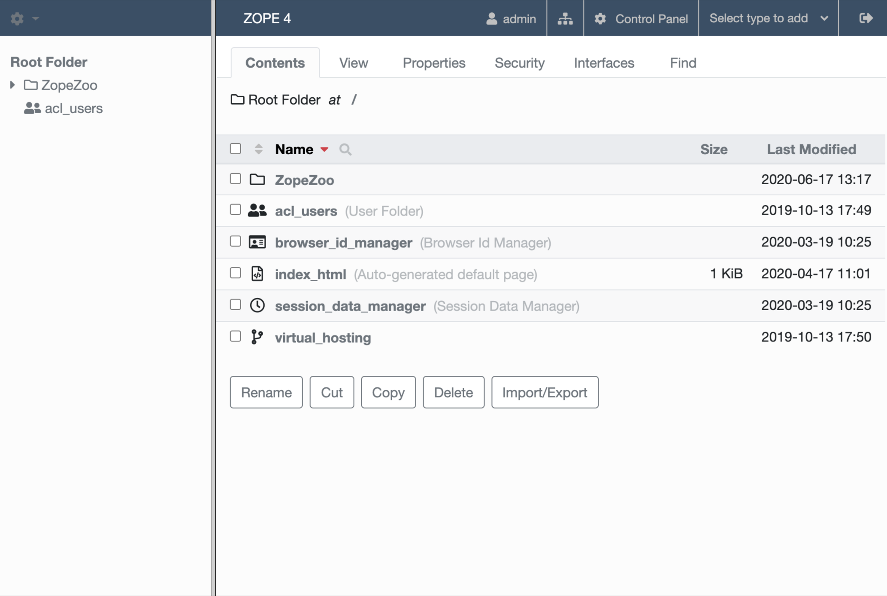

Creating Basic Zope Applications
================================

.. todo:
   
   - add new screen shots

.. note::

    In order to create objects of type `Script (Python)` make sure to also
    install the package ``Products.PythonScripts``.

This chapter will take you, step by step, through building a basic web
application in Zope.  As we go through the chapter, we will examine some of
Zope's main concepts at work.  Using Zope *Folder*, *Script (Python)*, and
*Page Template* objects, we'll create a simple website for an imaginary
zoo: the "Zope Zoo", of course!

We will develop the website as a Zope "instance-space" application.  A
discussion of instance space is at the end of this chapter, but for now it
is enough to know that instance-space applications are the easiest and
fastest kind to build, because we can do everything in our favorite web
browser.

Goals for the Zope Zoo Web Site
-------------------------------

As with any project, we first need to clarify our goals for the Zope Zoo
application.  The application's primary goal is to create a website for
the world-renowned Zope Zoo.  Furthermore, we want to make the website
easy to use and manage.  Here are some things we'll do:

- Enable web users to navigate the site easily, as if they were moving
  around a real zoo.

- Keep all our shared web layout tools, like a Cascading Style Sheet
  (CSS), in a single, easy-to-manage location.

- Design the website so that future site-wide changes are quick and easy
  to implement.

- Take advantage of Zope to create a dynamic website in which web pages
  build themselves "on the fly" when requested so that they are always up
  to date.

- Provide a simple file library of various documents that describe the
  animals.

Beginning with a Folder
-----------------------

Zope *Folder* objects provide natural containers and organizers for web
applications.  A good way to start building an application is to create a
new *Folder* to hold all the objects and subfolders related to the
application.

Consider, for example, a Zope folder named *Invoices* to hold an
application for managing invoices through the Web.  The *Invoices* folder
could contain both the logic objects - or "methods" - which allow you to
add and edit invoices, as well as the actual data of the invoices.  The
*Invoices* folder thus becomes a small Zope application.

We begin building our Zope Zoo website application by creating a Zope
*Folder* object to hold it all together in one place.

Step 1: Create *ZopeZoo* Folder
~~~~~~~~~~~~~~~~~~~~~~~~~~~~~~~

If you haven't already, start your Zope installation and log into the Zope
Management Interface (ZMI) using your favorite browser.  (If you are not
familiar with the ZMI, refer to the `Installing and Starting Zope
<InstallingZope.html>`_ chapter.)

1. Navigate to Zope's top-level *root* folder.

2. Use the *Select type to add* dropdown to create a new *Folder*. (We will
   refer to this dropdown as "*Add* list" from here on out)

3. Give the new folder the *Id* 'ZopeZoo'.

4. Click *Add*.

(For now, we will ignore the optional *Title* field.)

Designing a Navigable Zoo
-------------------------

One of our goals is to enable easy user movement around the website.  A key
to this easy movement is a navigation interface that is consistent among
the site's pages.  In other words, every web page in the site should
present a similar set of hyperlinks, in a similar place on the page, on
which users can rely to guide them through the site.

We also want to make sure the navigation links are always correct,
regardless of how the structure of the site changes.  The solution is to
design a meaningful site structure, and then create the Zope methods that
will dynamically present the current structure to web users in the form of
navigation links.

First, let's define the site structure.  If the Zope Zoo was real, we might
model the website's organization on the zoo's physical or logical design.
For our purposes, we will pretend that the zoo houses three classes of
animals.  We'll organize the website by adding folders inside our *ZopeZoo*
folder.

Step 2: Create Site Organization
~~~~~~~~~~~~~~~~~~~~~~~~~~~~~~~~

1. Enter the *ZopeZoo* folder and create three subfolders with *Ids*:
   'Reptiles', 'Mammals' and 'Fish'.

2. Inside the *Mammals* folder, add one folder named 'Whales'.

3. Navigate to the *Reptiles* folder and create two folders there:
   'Lizards' and 'Snakes'.

In Zope's Navigator frame on the left side, you should see an icon for the
*ZopeZoo* folder.  (If you don't see it, click on the cogwheel icon and then
click *Refresh* in the Navigator).
To view the *ZopeZoo* folder hierarchy - i.e. our nascent web site's
structure - expand the *ZopeZoo* folder by clicking the little triangle
next to the icon.  Similarly expand the zoo subfolders.  You'll see
something like the figure below.

   Zoo folder structure

Now we create the basic presentation objects:  The main template and the
style sheet *z_zoo.css*.  To get started, we ask a web designer to create a
HTML mockup and a CSS file that together represent the web page layout
shared throughout the site.

For the style sheet we create a simple *File* object in Zope.  No need to
make it dynamic.

Step 3: Create the Style Sheet
~~~~~~~~~~~~~~~~~~~~~~~~~~~~~~

1. Go to the top level of our zoo website, the *ZopeZoo* folder.

2. Select *File* from the *Add* list.

3. Give the file an *Id* of 'z_zoo.css'.

4. Click *Add*.

5. Select *z_zoo.css* to get its *Edit* view.

6. Copy and paste these style definitions into the *File Data* area::

    body, p, th, td {
      font-family: Verdana, Arial, Helvetica, sans-serif;
      font-size: 10pt;
    }
    h1 {
      color: #6699cc;
      font-family: Verdana, Arial, Helvetica, sans-serif;
      font-size: 18pt;
      font-weight: bold;
    }
    p {
      color: #660000;
    }
    .status_message{
      background: #ffffaa;
      border-style: solid;
      border-width: thin;
      font-weight: bold;
      padding: 4pt;
    }
    th {
      background: #dee7ec;
      text-align: left;
    }

At this stage, the HTML page the web designer created for us is valid XHTML
1.0 Strict and could also live in a static *File* object.  But in the next
steps we will convert the page into a dynamic template by adding TAL and
METAL statements, so we need a *Page Template* object:

1. Go back to the top level of our zoo website, the *ZopeZoo* folder.

2. Select *Page Template* from the *Add* list.

3. Give the Page Template an *Id* of 'index_html'.

4. Click *Add*.

Step 4: Create the Main Template
~~~~~~~~~~~~~~~~~~~~~~~~~~~~~~~~

1. Select *index_html* to get its *Edit* view.

2. Replace all of the stock template code with this::

    <!DOCTYPE html>
    <html>
    <head>

    <title>PAGE TITLE OR ID</title>
    <link rel="stylesheet" href="z_zoo.css" type="text/css" />

    </head>
    <body>

    
&gt; <a href="ABSOLUTE_URL">PARENT TITLE OR ID</a> 

    <ul>
      <li><a href="ABSOLUTE_URL">SUB-OBJECT TITLE OR ID</a></li>
    </ul>

    <h1>PAGE TITLE OR ID</h1>

    
STATUS MESSAGE

    
THIS IS WHERE THE PAGE'S CONTENT GOES.

    </body>
    </html>

Our web designer marked placeholders for dynamic elements with UPPERCASE
letters.  Using the *Test* tab of the new template, we can see the static
HTML page.  Don't blame the web designer for the spartan layout.  It's for
the sake of an easy example.  If you don't understand the XHTML and CSS
code you might want to learn more about HTML first.  This chapter shows you
how to make that code dynamic.

Step 5: Dynamic Title and Headline
~~~~~~~~~~~~~~~~~~~~~~~~~~~~~~~~~~

1. Go to the *Edit* tab of *index_html*.

2. Find these two lines::

    <title>PAGE TITLE OR ID</title>
    ...
    <h1>PAGE TITLE OR ID</h1>

3. Change them to look like that::

    <title tal:content="context/title_or_id">PAGE TITLE OR ID</title>
    ...
    <h1 tal:content="context/title_or_id">PAGE TITLE OR ID</h1>

The *path expression* 'context/title_or_id' returns the *title* of the
context object or - if that doesn't exist - its *id*.  We work in the
context of the *ZopeZoo* folder, which has no title.  So clicking again on
the *Test* tab you'll see that title and headline are replaced by the id
*ZopeZoo*.  (You might want to open the *Test* tab in a new window to see
the title of the browser window.)  After completing the next step you'll be
able to navigate to subfolders and see title and headline change depending
on the context.

Step 6: Generate Subfolder Menu Dynamically
~~~~~~~~~~~~~~~~~~~~~~~~~~~~~~~~~~~~~~~~~~~

1. Find the example menu item::

    <ul>
      <li><a href="ABSOLUTE_URL">SUB-OBJECT TITLE OR ID</a></li>
    </ul>

2. Extend it like this::

    <ul tal:condition="python: context.objectValues(['Folder'])">
      <li tal:repeat="item python: context.objectValues(['Folder'])">
        <a href="ABSOLUTE_URL"
           tal:attributes="href item/absolute_url"
           tal:content="item/title_or_id">SUB-OBJECT TITLE OR ID</a></li>
    </ul>

The *Python expression* 'context.objectValues(['Folder'])' returns all the
subfolders in our context.  The 'tal:condition' statement checks if any
subfolders exist.  If not, the complete 'ul' element is removed.  That
means we have reached a *leaf* of the navigation tree and don't need a
subfolder menu.
 
Otherwise, the same expression in the 'tal:repeat' statement of the 'li'
element will return a list of subfolders.  The 'li' element will be
repeated for each *item* of this list.  In step 3 we created three
subfolders in the *ZopeZoo* folder, so using again the *Test* tab we will
see three list items, each with the correct id and link URL.  For now there
are no links back, so use the back button of your browser if you can't wait
exploring the site.

Step 7: Generate Breadcrumbs Dynamically
~~~~~~~~~~~~~~~~~~~~~~~~~~~~~~~~~~~~~~~~

1. Look for this line::

    
&gt; <a href="ABSOLUTE_URL">PARENT TITLE OR ID</a> 

2. Replace it by::

    
<tal:loop tal:repeat="item python: request.PARENTS[-2::-1]">&gt;
      <a href="ABSOLUTE_URL"
         tal:attributes="href item/absolute_url"
         tal:content="item/title_or_id">PARENT TITLE OR
                                        ID</a> </tal:loop>

Using a trail of bread crumbs for navigation is quite an old idea, you
might remember Hansel and Gretel tried that to find their way home.  In our
days, breadcrumbs are used for site navigation and show the path back to
the root (or home) of the site.

The folder that contains the current object is also called its *parent*.
As long as we have not reached the root object, each folder has again a
*parent* folder.  'request.PARENTS' is a list of all these parents from the
current object down to the root object of the Zope application.
'request.PARENTS[-2::-1]' returns a copy of that list in reverse order,
starting with the second last element.  We don't need the last value
because 'ZopeZoo' is located in the second level of our Zope application
and we just want to navigate within the zoo.

We use again a 'tal:repeat' statement to display the list.  Because we
don't want to repeat the 'div' element, we add a dummy TAL element that
doesn't show up in the rendered HTML page.  Now our site navigation is
complete and you can explore the sections of the zoo.

Step 8: Dynamic Status Bar
~~~~~~~~~~~~~~~~~~~~~~~~~~

1. Go to this line::

    
STATUS MESSAGE

2. Extend it by two tal attributes::

    
STATUS MESSAGE

We need the status bar later in this chapter.  For now all we need is to
make it invisible.  'options/status_message' will later be used for some
messages.  But most pages don't have that variable at all and this path
expression would raise an error.  'options/status_message | nothing'
catches that error and falls back to the special  value *nothing*.  This is
a common pattern to test if a value exists **and** is true.

Step 9: Improve Style Sheet Link
~~~~~~~~~~~~~~~~~~~~~~~~~~~~~~~~

1. Find this line in the HTML head::

    <link rel="stylesheet" href="z_zoo.css" type="text/css" />

2. Replace it by::

    <link rel="stylesheet" href="z_zoo.css" type="text/css"
          tal:attributes="href context/z_zoo.css/absolute_url" />

While the relative URI of the *href* attribute works thanks to acquisition,
this isn't a good solution.  Using the *index_html* method for different
folders, the browser can't know that all the *z_zoo.css* files are in fact
one and the same.  Besides the CSS file the basic layout often contains a
logo and other images, so making sure they are requested only once makes
your site faster and you waste less bandwidth.  The *path expression*
'context/z_zoo.css/absolute_url' returns the absolute url of the CSS file.
Using it in the *href* attribute we have a unique URI independent of the
current context.

Step 10: Factor out Basic Look and Feel
~~~~~~~~~~~~~~~~~~~~~~~~~~~~~~~~~~~~~~~

1. Rename *index_html* to 'z_zoo.pt'.

2. Wrap a 'metal:define-macro' statement around the whole page and add
   two 'metal:define-slot' statements for headline and content.  After
   all these changes our main template - now called *z_zoo.pt* - looks
   like this::

    <metal:macro metal:define-macro="page"><!DOCTYPE html>
    <html>
    <head>

    <title tal:content="context/title_or_id">PAGE TITLE OR ID</title>
    <link rel="stylesheet" href="z_zoo.css" type="text/css"
          tal:attributes="href context/z_zoo.css/absolute_url" />

    </head>
    <body>

    
<tal:loop tal:repeat="item python: request.PARENTS[-2::-1]">&gt;
      <a href="ABSOLUTE_URL"
         tal:attributes="href item/absolute_url"
         tal:content="item/title_or_id">PARENT TITLE OR
                                        ID</a> </tal:loop>

    <ul tal:condition="python: context.objectValues(['Folder'])">
      <li tal:repeat="item python: context.objectValues(['Folder'])">
        <a href="ABSOLUTE_URL"
           tal:attributes="href item/absolute_url"
           tal:content="item/title_or_id">SUB-OBJECT TITLE OR ID</a></li>
    </ul>

    <metal:slot metal:define-slot="headline">

      <h1 tal:content="context/title_or_id">PAGE TITLE OR ID</h1>

    </metal:slot>

    
STATUS MESSAGE

    <metal:slot metal:define-slot="content">

      
THIS IS WHERE THE PAGE'S CONTENT GOES.

    </metal:slot>

    </body>
    </html>
    </metal:macro>

3. Add again a new *Page Template* with the *id* 'index_html'.

4. Replace the example code of *index_html* with these two lines::

    <metal:macro metal:use-macro="context/z_zoo.pt/macros/page">
    </metal:macro>

Transforming our main template into an external macro and including it
again using the 'metal:use-macro' statement doesn't change the resulting
HTML page in any way.  But in the next step we can add code we only want to
use in *index_html* without changing the main template.

The 'metal:define-macro' statement in *z_zoo.pt* marks the complete
template as reuseable macro, giving it the *id* *page*.  The expression
'context/z_zoo.pt/macros/page' in *index_html* points to that macro.

For later use we also added two 'metal:define-slot' statements within the
macro.  That allows to override *headline* and *body* while reusing the
rest of the macro.

Step 11: Add Special Front Page Code
~~~~~~~~~~~~~~~~~~~~~~~~~~~~~~~~~~~~

1. Go to the *Edit* tab of the new *index_html*.

2. Replace it by this code::

    <metal:macro metal:use-macro="context/z_zoo.pt/macros/page">
    <metal:slot metal:fill-slot="headline">

      <h1>Welcome to the Zope Zoo</h1>

    </metal:slot>
    <metal:slot metal:fill-slot="content">

      
Here you will find all kinds of cool animals. You are in the
        <b tal:content="context/title_or_id">TITLE OR ID</b> section.

    </metal:slot>
    </metal:macro>

The *index_html* should serve as the welcome screen for zoo visitors.  In
order to do so, we override the default slots.  Take a look at how your
site appears by clicking on the *View* tab of the *ZopeZoo* folder.

You can use the navigation links to travel through the various sections of
the Zoo.  Use this navigation interface to find the reptiles section.  Zope
builds this page to display a folder by looking for the default folder view
method, *index_html*.  It walks up the zoo site folder by folder until it
finds the *index_html* method in the *ZopeZoo* folder.  It then calls this
method on the *Reptiles* folder.

Modifying a Subsection of the Site
----------------------------------

What if you want the reptile page to display something besides the welcome
message?  You can replace the *index_html* method in the reptile section
with a more appropriate display method and still take advantage of the main
template including navigation.

Step 12: Create *index_html* for the Reptile House
~~~~~~~~~~~~~~~~~~~~~~~~~~~~~~~~~~~~~~~~~~~~~~~~~~

1. Go to the *Reptile* folder.

2. Add a new *Page Template* named 'index_html'.

3. Give it some content more appropriate to reptiles::

    <metal:macro metal:use-macro="context/z_zoo.pt/macros/page">
    <metal:slot metal:fill-slot="headline">

      <h1>The Reptile House</h1>

    </metal:slot>
    <metal:slot metal:fill-slot="content">

      
Welcome to the Reptile House.

      
We are open from 6pm to midnight Monday through Friday.

    </metal:slot>
    </metal:macro>

Now take a look at the reptile page by going to the *Reptile* folder and
clicking the *View* tab.

Since the *index_html* method in the *Reptile* folder uses the same macro
as the main *index_html*, the reptile page still includes your navigation
system.

Click on the *Snakes* link on the reptile page to see what the Snakes
section looks like.  The snakes page looks like the *Reptiles* page because
the *Snakes* folder acquires its *index_html* display method from the
*Reptiles* folder instead of from the *ZopeZoo* folder.

Creating a File Library
-----------------------

File libraries are common on websites since many sites distribute files of
some sort.  The old fashioned way to create a file library is to upload
your files, then create a web page that contains links to those files.
With Zope you can dynamically create links to files.  When you upload,
change or delete files, the file library's links can change automatically.

Step 13: Creating Library Folder and some Files
~~~~~~~~~~~~~~~~~~~~~~~~~~~~~~~~~~~~~~~~~~~~~~~

1. Add a new *Folder* to *ZopeZoo* with *Id* 'Files' and *Title* 'File
   Library'.

2. Within that folder, add two *File* objects called 'DogGrooming' and
   'HomeScienceExperiments'.

We don't need any content within the files to test the library.  Feel
free to add some more files and upload some content.

Step 14: Adding *index_html* Script and Template
~~~~~~~~~~~~~~~~~~~~~~~~~~~~~~~~~~~~~~~~~~~~~~~~

1. Within the *Files* folder, add this new *Script (Python)* with the
   *Id* 'index_html'::

    library_items = []
    items = context.objectValues(['File'])
    for item in items:
        library_items.append(
                { 'title': item.title_or_id(),
                  'url': item.absolute_url(),
                  'modified': container.last_modified(item),
                  } )

    options = { 'library_items': tuple(library_items) }

    return options

2. Also add a new *Page Template* named 'index_html.pt' with this
   content::

    <metal:macro metal:use-macro="context/z_zoo.pt/macros/page">
    <metal:slot metal:fill-slot="content">

      <table>
        <tr>
          <th width="300">File</th>
          <th>Last Modified</th>
        </tr>
        <tr>
          <td><a href="URL">TITLE</a></td>
          <td>MON DD, YYYY H:MM AM</td>
        </tr>
      </table>

    </metal:slot>
    </metal:macro>

This time the logic for our 'index_html' method will be more complex, so we
should separate logic from presentation.  We start with two unconnected
objects:  A *Script (Python)* to generate the results and a *Page Template*
to present them as HTML page.

The script loops over 'context.objectValues(['File'])', a list of all
*File* objects in our *Files* folder, and appends for each file the needed
values to the library_items list.  Again the dynamic values are UPPERCASE
in our mockup, so what we need are the file *title*, the *url* and the last
*modified* date in a format like this: Mar 1, 1997 1:45 pm.  Most Zope
objects have the *bobobase_modification_time* method that returns a
*DateTime* object.  Looking at the API of *DateTime*, you'll find that the
*aCommon* method returns the format we want.

Later we will have more return values, so we store them in the *options*
dictionary.  Using the *Test* tab of the script you will see the returned
dictionary contains all the dynamic content needed by our template.

The template uses again the *page* macro of *z_zoo.pt*.  Unlike before
there is only one 'metal:fill-slot' statement because we don't want to
override the *headline* slot.  Go to the *Test* tab of the template to see
how our file library will look like.

Step 15: Bringing Things Together
~~~~~~~~~~~~~~~~~~~~~~~~~~~~~~~~~

1. Replace the last line of the *index_html* script by this one::

    return getattr(context, 'index_html.pt')(**options)

2. Look for this example table row in *index_html.pt*::

      <tr>
        <td><a href="URL">TITLE</a></td>
        <td>MON DD, YYYY H:MM AM</td>
      </tr>

3. Replace it by that code::

      <tr tal:repeat="item options/library_items">
        <td><a href="URL"
               tal:attributes="href item/url"
               tal:content="item/title">TITLE</a></td>
        <td tal:content="item/modified">MON DD, YYYY H:MM AM</td>
      </tr>

Now our script calls the *index_html.pt* after doing all the computing and
passes the resulting *options* dictionary to the template, which creates
the HTML presentation of *options*.  The *Test* tab of the template no
longer works because it now depends on the script.  Go to the *Test* tab of
the script to see the result: The file library!

If you add another file, Zope will dynamically adjust the file library
page.  You may also want to try changing the titles of the files, uploading
new files, or deleting some of the files.

Step 16: Making the Library Sortable
~~~~~~~~~~~~~~~~~~~~~~~~~~~~~~~~~~~~

1. Find the table headers in *index_html.pt*::

        <th width="300">File</th>
        <th>Last Modified</th>

2. Replace them with these dynamic table headers::

        <th width="300"><a href="SORT_TITLE_URL"
               tal:omit-tag="not: options/sort_title_url"
               tal:attributes="href options/sort_title_url"
               >File</a></th>
        <th><a href="SORT_MODIFIED_URL"
               tal:omit-tag="not: options/sort_modified_url"
               tal:attributes="href options/sort_modified_url"
               >Last Modified</a></th>

3. Extend *index_html* to make it look like this::

    ## Script (Python) "index_html"
    ##parameters=sort='title'
    ##
    library_items = []
    items = context.objectValues(['File'])
    if sort == 'title':
        sort_on = ( ('title_or_id', 'cmp', 'asc'), )
        sort_title_url = ''
        sort_modified_url = '%s?sort=modified' % context.absolute_url()
    else:
        sort_on = ( ('_p_mtime', 'cmp', 'desc'), )
        sort_title_url = '%s?sort=title' % context.absolute_url()
        sort_modified_url = ''
    items = sequence.sort(items, sort_on)
    for item in items:
        library_items.append(
                { 'title': item.title_or_id(),
                  'url': item.absolute_url(),
                  'modified': container.last_modified(item),
                  } )

    options = { 'sort_title_url': sort_title_url,
                'sort_modified_url': sort_modified_url,
                'library_items': tuple(library_items) }

    return getattr(context, 'index_html.pt')(**options)

The changes in the template are quite simple.  If an url is provided, the
column header becomes a link.  If not, the 'not:' expression of the
'tal:omit-tag' statement is true and the 'a' tag is omitted.  The script
will always provide an url for the column that isn't currently sorted.

Basically we have to extend the logic, so most changes are in the script.
First of all we define an optional parameter *sort*.  By default it is
'title', so if no value is passed in we sort by title.  Sort criteria and
urls depend on the sort parameter.  We use the sort function of the built
in *sequence* module to apply the sort criteria to the *items* list.

Now view the file library and click on the *File* and *Last Modified* links
to sort the files.  If there is a *sort* variable and if it has a value of
*modified* then the files are sorted by modification time.  Otherwise the
files are sorted by *title*.

Building "Instance-Space" Applications
--------------------------------------

In Zope, there are a few ways to develop a web application.  The simplest
and fastest way, and the one we've been concentrating on thus far in this
book, is to build an application in *instance space*.  To understand the
term "instance space", we need to once again put on our "object orientation
hats".

When you create Zope objects by selecting them from the Zope "Add" list,
you are creating *instances* of a *class* defined by someone else (see the
`Object Orientation <ObjectOrientation.html>`_ chapter if you need to brush
up on these terms).  For example, when you add a Script (Python) object to
your Zope database, you are creating an instance of the Script (Python)
class.  The Script (Python) class was written by a Zope Corporation
engineer.  When you select "Script (Python)" from the Add list, and you
fill in the form to give an id and title and whatnot, and click the submit
button on the form, Zope creates an *instance* of that class in the Folder
of your choosing.  Instances such as these are inserted into your Zope
database and they live there until you delete them.

In the Zope application server, most object instances serve to perform
presentation duties, logic duties, or content duties.  You can "glue" these
instances together to create basic Zope applications.  Since these objects
are really instances of a class, the term "instance space" is commonly used
to describe the Zope root folder and all of its subfolders.  "Building an
application in instance space" is defined as the act of creating Zope
object instances in this space and modifying them to act a certain way when
they are executed.

Instance-space applications are typically created from common Zope objects.
Script (Python) objects, Folders, Page Templates, and other Zope services can
be glued together to build simple applications.

Instance-Space Applications vs. Python packages
-----------------------------------------------

In contrast to building applications in instance space, you may also build
applications in Zope by building them as Python packages.  Building an
application as a package differs from creating applications in instance
space inasmuch as the act of creating a package typically is more familiar to
developers and does not constrain them in any way.

Building a package also typically allows you to more easily distribute an
application to other people, and allows you to build objects that may more
closely resemble your "problem space".

Building a package is typically more complicated than building an
"instance-space" application, so we get started here by describing how to
build instance-space applications.  When you find that it becomes difficult
to maintain, extend, or distribute an instance-space application you've
written, it's probably time to reconsider rewriting it as a package.

The Next Step
-------------

This chapter shows how simple web applications can be made.  Zope has many
more features in addition to these, but these simple examples should get
you started on create well managed, complex websites.

In the next chapter, we'll see how the Zope security system lets Zope work
with many different users at the same time and allows them to collaborate
together on the same projects.
