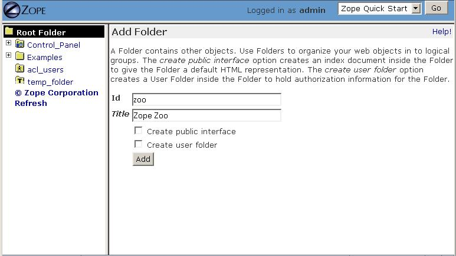

Using the Zope Management Interface
===================================

.. include:: includes/zope2_notice.rst

Introduction
------------

When you log in to Zope, you are presented with the Zope Management
Interface (ZMI).  The ZMI is a management and configuration environment that
allows you to control Zope, manipulate Zope objects, and configure web
applications.

The Zope Management Interface represents a view into the Zope *object
hierarchy*.  Almost every link or button in the ZMI represents an action
that is taken against an *object*.  When you build web applications with
Zope, you typically spend some of your time creating and managing objects.

Don't be frightened if you don't understand the word "object" just yet.
For the purposes of this chapter, the definition of an "object" is *any
discrete item that is manageable through the ZMI*.  In fact, for the
purposes of this chapter, you can safely replace the word "object" with the
word "thing" with no ill effects.  If you do find something confusing,
however, you may want to review the `Object
Orientation <ObjectOrientation.html>`_ chapter for more detail on objects.

How the Zope Management Interface Relates to Objects
----------------------------------------------------

Unlike web server applications like Apache or Microsoft IIS, Zope does not
"serve up" HTML files that it finds on your server's hard drive.
Similarly, the objects that Zope creates are not stored in ".html" files on
your server.  There is no file hierarchy on your server's computer that
contains all of your Zope objects.

Instead, the objects that Zope creates are stored in a database called the
"Zope Object DataBase", or the *ZODB*.  In default configurations, the ZODB
creates a file named "Data.fs" in which Zope stores its objects.  The ZMI
is the primary way by which you interact with Zope objects stored in this
database.  Note that there are other methods of interacting with objects
stored in the ZODB, including WebDAV, which are detailed in the
chapter in this book entitled `Managing Zope Using External
Tools <ExternalTools.stx>`_, but the ZMI is the primary management
tool.

ZMI Frames
----------

The ZMI uses three browser frames:

- The left frame is called the *Navigator Frame*, which can be used to
  expand or collapse a view into the Zope object hierarchy, much like you
  would expand and collapse a view of files using a file tree widget like
  the one in Windows Explorer.

- The right frame is called the *Workspace Frame*, which displays a
  particular view of the object you're currently managing.    

- The top frame is called the *Status Frame*, which displays your user name
  (when logged in), as well as a drop-down list that performs various
  actions.

The Navigator Frame
~~~~~~~~~~~~~~~~~~~

In the left-hand, or *Navigator*, frame, you have a view into the *root
folder* and all of its subfolders.  The *root folder* is in the upper-left
corner of the tree. The root folder is the "topmost" container of Zope
objects: almost everything meaningful in your Zope instance lives inside
the root folder.

  
   The Navigator Frame

Some of the folders in the Navigator are displayed with "plus mark" icons
to their left.  These icons let you expand the folders to see the
sub-folders inside them.

When you click on an object icon or name in the Navigator, the *Workspace*
frame will refresh with a view of that object.

The Workspace Frame
~~~~~~~~~~~~~~~~~~~

The right-hand frame of the management interface shows the object you are
currently managing.  When you first log into Zope, the root folder is
displayed as the current object.  The workspace gives you information about
the current object and lets you manage it.

   The Workspace Frame

A series of tabs is displayed across the top of the screen. The tab that is
currently active is highlighted in a lighter color.  Each tab takes you to
a different *view* of the current object, and each view lets you perform a
different management function on that object.

When you first log into Zope, you are looking at the *Contents* view of the
root folder object.

At the top of the workspace, just below the tabs, is a description of the
current object's type and URL. On the left is an icon representing the
current object's type, and to the right of that is the object's URL.

At the top of the page, 'Folder at /' tells you that the current object is
a folder and that its path is "/".  Note that this path is the object's
place relative to Zope's "root" folder. The root folder's path is expressed
as "/" , and since you are looking at the root when you first log in, the
path displayed at the the top of the workspace is simply "/".

Zope object paths are typically mirrored in the URLs that are used to
access a Zope object.  For instance, if the main URL of your Zope site was
http://mysite.example.com:8080, then the URL of the root folder would be
http://mysite.example.com:8080/ and the URL of 'Folder at /myFolder' would
be 'http://mysite.example.com:8080/myFolder'.

As you explore different Zope objects, you'll find that the links displayed
at the top of the workspace frame can be used to navigate between objects'
management views.  For example, if you are managing a folder at
*/Zoo/Reptiles/Snakes*, you can return to the folder at */Zoo* by clicking
on the word *Zoo* in the folder's URL.

The Status Frame
~~~~~~~~~~~~~~~~

The "status frame" at the top of the management interface displays your
current login name, along with a pull-down box that lets you select:

- *Preferences*: By selecting this menu item, you can set default
  preferences for your Zope management interface experience.  You can
  choose to turn off the status frame.  You can also choose whether you
  want the management interface to try to use style sheets.  Additionally,
  you can change the default height and width of text-area boxes displayed
  in the ZMI.  This information is associated with your browser via a
  cookie.  It is not associated in any way with your Zope user account.

- *Logout*: Selecting this menu item will log you out of Zope.
  Due to the way that the HTTP "basic authentication" protocol works, this
  may not behave properly with all browsers.  If you experience problems
  logging out using this method, try closing and reopening your browser to
  log out.

 
   The Status Frame

Creating Objects
----------------

The Zope Management Interface allows you to create new objects in your Zope
instance.  To add a new object, select an entry from the pull-down menu in
the Workspace labeled "Select type to add...".  This pull-down menu is
called the *add list*.

The first kind of object you'll want to add in order to "try out" Zope is a
"Folder".  To create a Zope Folder object, navigate to the root folder and
select *Folder* from the add list.  At this point, you'll be taken to an
add form that collects information about the new folder, as shown in the
figure below.

   Folder add form

Type "zoo" in the *Id* field, and "Zope Zoo" in the *Title* field.  Then
click the *Add* button.

Zope will create a new Folder object in the current folder named *zoo*. You
can verify this by noting that there is now a new folder named *zoo* inside
the root folder.

Click on *zoo* to "enter" it. The Workspace frame will switch to the
contents view of *zoo* (which is currently an "empty" folder, as it has no
sub-objects or contents).  Note that the URL of the *zoo* folder is based
on the folder's *id*.

You can create more folders inside your new folder if you wish. For
example, create a folder inside the *zoo* folder with an id of *arctic*.
Enter the *zoo* folder and choose *Folder* from the pull-down menu. Then
type in "arctic" for the folder id, and "Arctic Exhibit" for the title. Now
click the *Add* button.

When you use Zope, you create new objects by following these
steps:

1. Enter the folder where you want to add a new object.

2. Choose the type of object you want to add from the add list.

3. Fill out the resulting add form and submit it. As a result, Zope will
   create a new object in the folder.

Notice that every Zope object has an *id* that you need to specify in the
add form when you create the object. The id is how Zope names objects.
Objects also use their ids as a part of their *URL*.  The URL of any given
Zope object is typically a URL consisting of the folders in which the
object lives plus its name.  For example, we created a folder named "zoo"
in the root folder.  If our site were called "mysite.example.com", the new
folder's URL would be "http://mysite.example.com/zoo".

Moving and Renaming Objects
---------------------------

Most computer systems let you move files around in directories with cut,
copy, and paste actions. The ZMI uses a similar system that lets you move
objects around in folders by cutting or copying them, and then pasting them
to a new location.

.. Note:
   Zope move and rename options require that you have cookies enabled in
   your browser.

To experiment with copy and paste, create a new Folder object in the root
folder with an id of *bears*.  Then select *bears* by checking the check
box just to the left of the folder. Then click the *Cut* button. Cut
selects the selected objects from the folder and places them on Zope's
"clipboard".  The object will *not*, however, disappear from its location
until it is pasted somewhere else.

Now enter the *zoo* folder by clicking on it. Click the *Paste* button to
paste the cut object into the *zoo* folder. You should see the *bears*
folder appear in its new location. You can verify that the folder has been
moved by going to the root folder and confirming that *bears* is no longer
visible there.

Copy works similarly to cut, in that, when you paste copied objects, the
original objects are not removed.  Select the object(s) you want to copy
and click the *Copy* button. Then navigate to another folder and click the
*Paste* button.

You can cut and copy folders that contain other objects and move many
objects at one time with a single cut and paste.  For example, go to the
root folder, and copy the *zoo* folder. Now paste it into the root folder.
You will now have two folders inside the root folder: *zoo* and
*copy_of_zoo*. If you paste an object into the same folder where you copied
it, Zope will change the id of the pasted object. This is a necessary step,
as you cannot have two objects with the same id in the same folder.

To rename the *copy_of_zoo* folder, select the folder by checking the check
box to the left of the folder. Then click the *Rename* button.  This will
take you to the rename form.

   Renaming an Object

Type in the new id value "zoo2" and click *OK*. Zope ids can consist of
letters, numbers, spaces, dashes, underscores, and periods, and they are
case-sensitive. Here are some legal Zope ids: *index.html*, *42*,
*Lucky13*, and *Snake-Pit*.

Now your root folder contains *zoo* and *zoo2* folders. Each of these
folders contains a *bears* folder. This is because when we made a copy of
the *zoo* folder, we also copied the *bears* folder that it contained.
Copying an object also copies all of the objects it contains.

If you want to delete an object, select it and then click the *Delete*
button. Unlike cut objects, deleted objects are not placed on the clipboard
and cannot be pasted. In the next section, we'll see how we can retrieve
deleted objects using Undo.

Zope will not let you cut, delete, or rename a few particular objects in
the root folder. These objects include *Control_Panel*,
*browser_id_manager*, and *temp_folder*.  These objects are necessary for
Zope's operation.  It is possible to delete other root objects, such as
*index_html*, *session_data_manager* and *standard_error_message*,
but it is not recommended to do so unless you have a very good reason.

Transactions and Undoing Mistakes
---------------------------------

All objects you create in Zope are stored in Zope's "object database".
Unlike other web application servers, Zope doesn't store its objects in
files on a filesystem.  Instead, all Zope objects are stored by default in
a single special file on the filesystem named 'Data.fs'.  This file is
stored in the 'var' directory of your Zope instance.  Using an object
database rather than storing objects on the file system allows operations
to Zope objects to be *transactional*.

A transactional operation is one in which all changes to a set of objects
are committed as a single "batch".  In Zope, a single web request initiates
a transaction.  When the web request is finished, Zope commits the
transaction unless an error occurs during the processing of the request.
If there is an error, Zope refrains from committing the transaction. Each
transaction describes all of the changes that happen in the course of
performing a web request.

Most actions in Zope that causes a transaction can be undone via the *Undo*
tab.  You can recover from mistakes by undoing the transaction that
represents the mistake.  This includes undo actions themselves, which can
also be undone to restore an object to its state before the undo action.

Select the *zoo* folder that we created earlier and click *Delete*. The
folder disappears. You can get it back by undoing the delete action.

Click the *Undo* tab, as shown in the figure below.

   The Undo view

Transactions are named after the Zope action, or "method", that initiated
them.  In this case, the initiating method was one named
``/manage_delObjects``, which is the name of the Zope action that deletes
Zope objects.

Select the first transaction labeled */manage_delObjects*, and click the
*Undo* button at the bottom of the form.  Doing so instructs Zope to undo
the last transaction. You can verify that the task has been completed by
visiting the root folder to confirm that the *zoo* folder has returned.  If
you use the "Back" button to revisit the root folder, you may need to
refresh your browser to see the proper results.  To see the effect in the
*Navigator* pane, click the "Refresh" link within the pane.

You may "undo an undo" action, or "redo" the action, and you can undo and
redo actions as many times as you like.  When you perform a "redo", Zope
inserts a transaction into the undo log describing the redo action.

The Undo tab is available on most Zope objects.  When viewing the Undo tab
of a particular object, the list of undoable transactions is filtered down
to the transactions that have recently affected the current object and its
sub-objects.

Undo Details and Gotchas
------------------------

You cannot undo a transaction upon which a later transaction depends.  For
example, if you paste an object into a folder, and then delete an object in
the same folder, pasting the first object cannot be undone, as both
transactions affect the contents of a single object: the folder. The
solution is to undo both transactions. You can undo more than one
transaction at a time by selecting multiple transactions on the *Undo* tab
and then clicking *Undo*.  

Only changes to objects stored in Zope's object database can be undone.  If
you have integrated data into a relational database server, such as Oracle
or MySQL (as discussed in the chapter entitled "Relational Database
Connectivity"), changes to data stored there cannot be undone.

Reviewing Change History
------------------------

The Undo tab will provide you with enough information to know that a change
has occurred.  However, it will not tell you much about the effect of the
transaction on the objects that were changed during the transaction.

Using Object Properties
-----------------------

*Properties* are ways of associating information with many objects in Zope,
including folders.  For example, many Zope content objects have a content
type property, and others contain metadata about the object, such as its
author, title, or status.

Properties can provide more complex data than strings, such as numbers,
lists, and other data structures.  All properties are managed via the
*Properties* view.  Click on the *Properties* tab of the "root" object, and
you will be taken to the properties management view, as seen in the figure
below.

   The Properties Management View

A property consists of a name, a value, and a type.  A property's type
defines what kind of value or values it can have.

In the figure above, you can see that the folder has a single string
property *title*, which has the value 'Zope'.  You may change any
predefined property by changing its value in the Value box, and then
clicking *Save Changes*.  You may add additional properties to an object by
entering a name, value, and type into the bottom-most field in the
Properties view.

Zope supports a number of property types and each type is suited to a
specific task.  This list gives a brief overview of the kinds of properties
you can create from the management interface:

string
  A string is a sequence of characters of arbitrary length.
  Strings are the most basic and useful type of property in Zope.

int
  An int property is an integer, which can be any positive or
  negative number that is not a fraction.  An int is guaranteed to be
  at least 32 bits long.

long
  A long is an integer that has no range limitation.

float
  A float holds a floating point, or decimal number.
  Monetary values, for example, often use floats.

lines
  A lines property is a sequence of strings.

tokens
  A tokens property is a list of words separated by spaces.

text
  A text property is just like a string property, except that
  Zope normalizes the line ending characters (different browsers use
  different line ending conventions).

selection
  A selection property is special, in that it is used to render
  an HTML single selection input widget.

multiple selection
  A multiple selection property is special, in that it
  is used to render an HTML multiple selection form input widget.

Properties are very useful tools for tagging your Zope objects with bits of
metadata.  Properties are supported by most Zope objects and are often
referenced by your application logic for purposes of data display.

Logging Out
-----------

You may choose *Logout* from the Status Frame drop-down box to attempt to
log out of Zope.  Doing so will cause your browser to "pop up" an
authentication dialog.  Due to the way most web browsers work, you may
actually need to click on the "OK" button with an *incorrect* user name and
password in the authentication dialog in order to effectively log out of
the ZMI.  If you do not do so, you may find even after selecting "Logout"
that you are still logged in.  This is an intrinsic limitation of the HTTP
Basic Authentication protocol, which Zope's stock user folder employs.
Alternately, you may close and reopen your browser to log out of Zope.
