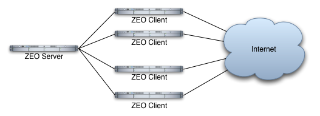
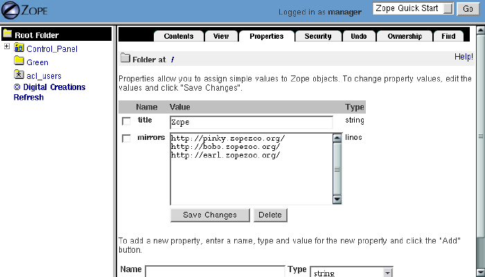
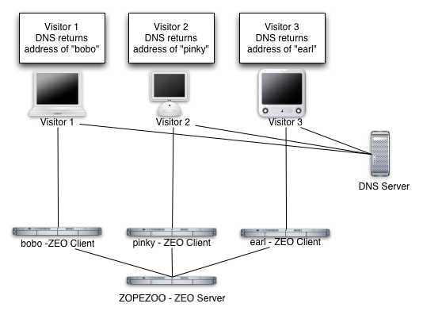
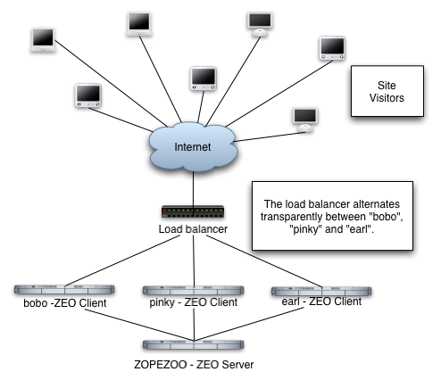
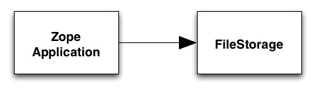
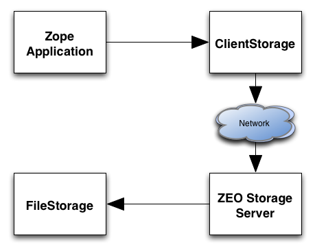

Scalability and ZEO
###################

.. include:: includes/zope2_notice.rst

When a web application receives more requests than it can handle over a short
period of time, it can become unresponsive. In the worst case, too many
concurrent requests to a web application can cause the software which services
the application to crash. This can be a problem for any kind of web-based app,
not just those which are served by Zope.

The obvious solution to this problem is to use more than one server. When one
server becomes overloaded, the others can then hopefully continue to
successfully serve requests. By adding additional servers to this kind of
configuration, you can "scale" your web application as necessary to meet
demand.

Using multiple servers has obvious benefits, but it also poses serious
challenges. For example, if you have five servers, then you must ensure that
all five server installations are populated with the same information. This is
not a very hard task if you have only a few static web pages, but for larger
applications with large bodies of rapidly changing information, manually
synchronizing the data which drives five separate server installations is
almost impossible, even with the "out of the box" features that Zope provides.

A "stock" Zope installation uses the Zope Object Database as its content store,
using a "storage" which is named a "FileStorage". This storage type (there are
others) keeps all of your Zope data in a single file on your computer's hard
drive, typically named `Data.fs`. This configuration works well until you need
to add an additional Zope server to your site to handle increased traffic to
your web application. Two Zope servers cannot share this file. The file is
"locked" by one Zope server and no other Zope server can access the file. Thus,
in a "stock" Zope configuration, it is impossible to add Zope servers which
read from the same database in order to "scale" your web application to meet
demand.

To solve this problem, Zope Corporation has created another kind of "storage",
which operates using a client/server architecture, allowing many Zopes to share
the same database information. This product is known as `Zope Enterprise
Objects` or ZEO. ZEO is built into Zope, no additional software install is
required.

This chapter gives you a brief overview on installing ZEO, but there are many
other options we don't cover. For more in-depth information, see the
documentation that comes with the ZEO package.

What is ZEO?
============

ZEO is a system that allows you to share a Zope Object Database between more
than one Zope process. By using ZEO, you may run multiple instances of Zope on
a single computer or on multiple computers. Thus, you may spread requests to
your web application between Zope servers. You may add more computers as the
number of requests grows, allowing your web application to scale. Furthermore,
if one Zope server fails or crashes, other servers can still service requests
while you fix the broken one. ZEO takes care of making sure each Zope
installation uses consistent information from the same Zope Object Database.

ZEO uses a client/server architecture. The Zope processes (shown on multiple
computers in the diagram below) are the *ZEO Clients*. All of the clients
connect to one, central *ZEO Storage Server*, as shown in the image below.

  Simple ZEO illustration

The terminology may be a bit confusing. Typically, you may think of Zope as a
server, not a client. But when using ZEO, your Zope processes act as both
servers (for web requests) and clients (for data from the ZEO server).

ZEO clients and servers communicate using standard Internet protocols, so they
can be in the same room or in different countries. ZEO, in fact, could
distribute a Zope site to disparate geographic locations, given good network
connectivity between the ZEO clients and the ZEO server. In this chapter we'll
explore some interesting ways you can distribute your ZEO clients.

When you should use ZEO
=======================

Using a ZEO-based installation is advantageous for almost all users. Here are
some of the reasons:

- Zope is a high-performance system, and one Zope can handle millions of hits
  per day, but there are upper bounds on the capacity of a single Zope server.
  ZEO allows you to scale your site by adding more hardware on which you may
  place extra Zope servers to handle excess demand.

- Your site is critical and requires 24/7 uptime. Using ZEO can help you add
  redundancy to your server configuration.

- You want to distribute your site to disparate geographic locations in order
  to increase response time to remote sites. ZEO allows you to place Zope
  servers which use the same ZODB in separate geographic locations.

- You want to "debug" an application which is currently served by a single Zope
  server from another Zope process. ZEO enables the developer to attach to a
  ZODB database while still continuing to serve requests from another ZEO
  client.

Installing, configuring, and maintaining a ZEO-enabled Zope requires some
system administration knowledge. Most Zope users will not need ZEO, or may not
have the expertise necessary to maintain a distributed server system like ZEO.
ZEO is fun, and can be very useful, but before jumping head-first and
installing ZEO in your system you should weigh the extra administrative burden
ZEO creates against the simplicity of running just a simple, stand-alone Zope.

Installing and Running ZEO
==========================

ZEO is part of Zope, all batteries are included. However, there are some
prerequisites before you will be successfully able to use ZEO:

- All of the Zope servers in a ZEO-enabled configuration must run the same
  version of Zope and ZEO. The easiest way to meet this prerequisite is to make
  sure all of your computers use the same Zope version.

- All of your ZEO clients must have the same third party Products installed and
  they must be the same version. This is necessary, or your third-party objects
  may behave abnormally or not work at all.

- If your Zope system requires access to external resources, like mail servers
  or relational databases, ensure that all of your ZEO clients have access to
  those resources.

- Slow or intermittent network connections between clients and server degrade
  the performance of your ZEO clients. Your ZEO clients should have a good
  connection to their server.

Installing ZEO is very easy. After you have gone through the steps necessary to
build the Zope software it takes nothing more than running two scripts and
tweaking the default configuration laid down in the ZEO client's `zope.conf`
configuration file.

First, you need to create a place where the ZEO server will live. It also
contains the database file, so make sure you have enough space to cover your
expected database size and at least double that so you can pack the ZODB::

  $ python /path/to/Zope/bin/mkzeoinstance.py /path/to/zeostorage

Make sure you use the same python interpreter that was used to build your Zope
software. `/path/to/zeostorage` represents the location where you want the ZEO
server to be. While the script runs you will see output telling you what it is
doing.

Once you have built the ZEO server's home this way you will notice that its
layout is very similar to a Zope instance home. It has a configuration file
named `zeo.conf` inside its etc-subdirectory which you should look at to get a
notion of what can be configured, and you will need it to look up where the
server will listen for ZEO requests when you configure your ZEO clients.

The ZEO storage home also contains prefabricated start/stop scripts that work
the same way as the Zope `zopectl` script, for ZEO it is called `zeoctl`.

You should now have ZEO properly installed. Try it out by first starting the
server. In a terminal window or DOS box type::

  $ /path/to/zeostorage/bin/zeoctl start

You can follow its log file by simply typing::

  $ /path/to/zeostorage/bin/zeoctl logtail

or by looking at the log file directly. Its location is configurable using the
previously mentioned zeo.conf configuration file.

After having set up the ZEO storage server that way you will want at least one
ZEO client. You can use an existing Zope server (provided it meets the
prerequisites mentioned earlier) or build a new instance home the same way you
would if you set up a new Zope server without ZEO::

  $ python /path/to/Zope/bin/mkzopeinstance

Now visit the instance home you created and look for the `zope.conf`
configuration file in its etc-directory. In order to use ZEO the client must be
told to access the ZODB not from the file system but talk to a ZEO server
instead. Look for the::

  zodb_db main

directive at the bottom. Underneath the default configuration you will notice
an example ZEO client configuration. Comment out the complete zodb_db main
stanza containing the

  `filestorage`

directive and uncomment the example zodb_db main configuration that contains
the::

  zeoclient

directive. If you have not tweaked your zeo.conf file all you need to do at
this moment is to ensure that the `server` argument in the `zeoclient`
directive shows the same value as the `address` argument in the `zeo` directive
inside your ZEO server's zeo.conf-file.

Now you are ready to test the ZEO client. Fire it up by running::

  $ /path/to/zeoclient/bin/zopectl start

and check the log file manually or by running::

  $ /path/to/zeoclient/bin/zopectl logtail

Now visit the Zope Managment Interface (ZMI) of your ZEO client in a web
browser and go to the *Control Panel*. Click on *Database Managment*. Here, you
see that Zope is connected to a *ZEO Storage* and that its state is
*connected*.

Running ZEO on one computer is a great way to familiarize yourself with ZEO and
how it works. Running a single ZEO client does not however, improve the speed
of your site, and in fact, it may slow it down just a little. To really get the
speed benefits that ZEO provides, you need to run multiple ZEO clients. This
can easily be achieved by creating more ZEO client instances as described
above. The instances can be on the same server machine or distributed over
several machines.

How to Distribute Load
======================

Imagine you have a ZEO server named *zooServer* and three ZEO clients named
*zeoclient1*, *zeoclient2*, and *zeoclient3*. The three ZEO clients are
connected to the ZEO server and each client is verified to work properly.

Now you have three computers that serve content to your users. The next problem
is how to actually spread the incoming web requests evenly among the three ZEO
clients. Your users only know about *www.zopezoo.org*, not *zeoclient1*,
*zeoclient2* or *zeoclient3*. It would be a hassle to tell only some users to
use *zeoclient1*, and others to use *zeoclient3*, and it wouldn't be very good
use of your computing resources. You want to automate, or at least make very
easy, the process of evenly distributing requests to your various ZEO clients.

There are a number of solutions to this problem, some easy, some advanced, and
some expensive. The next section goes over the more common ways of spreading
web requests around various computers using different kinds of technology, some
of them based on freely-available or commercial software, and some of them
based on special hardware.

User Chooses a Mirror
+++++++++++++++++++++

The easiest way to distribute requests across many web servers is to pick from
a list of *mirrored sites*, each of which is a ZEO client. Using this method
requires no extra software or hardware, it just requires the maintenance of a
list of mirror servers. By presenting your users with a menu of mirrors, they
can use to choose which server to use.

Note that this method of distributing requests is passive (you have no active
control over which clients are used) and voluntary (your users need to make a
voluntary choice to use another ZEO client). If your users do not use a mirror,
then the requests will go to your ZEO client that serves *www.zopezoo.org*.

If you do not have any administrative control over your mirrors, then this can
be a pretty easy solution. If your mirrors go off-line, your users can always
choose to come back to the master site which you *do* have administrative
control over and choose a different mirror.

On a global level, this method improves performance. Your users can choose to
use a server that is geographically closer to them, which probably results in
faster access. For example, if your main server was in Portland, Oregon on the
west coast of the USA and you had users in London, England, they could choose
your London mirror and their request would not have to go half-way across the
world and back.

To use this method, create a property in your root folder of type *lines* named
"mirror". On each line of this property, put the URL to your various ZEO
clients, as shown in the figure below.

  Figure of property with URLs to mirrors

Now, add some simple TAL code to your site to display a list of your mirrors::

  <h2>Please choose from the following mirrors:
  <ul>
    <li tal:repeat="mirror here/mirrors">
      <a href=""
         tal:attributes="href mirror"
         tal:content="mirror">
          my.mirror.site
      </a>
    </li>
  </ul>

Or, in a Script (Python):::

  ## Script (Python) "generate_mirror"
  ##bind container=container
  ##bind context=context
  ##bind namespace=
  ##bind script=script
  ##bind subpath=traverse_subpath
  ##parameters=a, b
  ##title=
  ##
  print "<h2>Please choose from the following mirrors: <ul>"
  for mirror in container.mirrors:
      print "<li><a href="%s">%s</a>" % (mirror, mirror)
  return printed

This TAL code (and Script (Python) equivalent) displays a list of all mirrors
your users can choose from. When using this model, it is good to name your
computers in ways that assist your users in their choice of mirror. For
example, if you spread the load geographically, then choose names of countries
for your computer names.

Alternately, if you do not want users voluntarily choosing a mirror, you can
have the *index_html* method of your www.zopezoo.org site issue HTTP redirects.
For example, use the following code in your *www.zopezoo.org* site's
*index_html* method::

  <tal:block define="mirror python: modules.random.choice(here.mirrors);
  dummy python: request.RESPONSE.redirect(mirror)" />

This code will redirect any visitors to *www.zopezoo.org* to a random mirror
server.

Using Round-robin DNS to Distribute Load
++++++++++++++++++++++++++++++++++++++++

The *Domain Name System*, or DNS, is the Internet mechanism that translates
computer names (like "www.zope.dev") into numeric addresses. This mechanism can
map one name to many addresses.

The simplest method for load-balancing is to use round-robin DNS, as
illustrated in the figure below.

  Load balancing with round-robin DNS

When *www.zopezoo.org* gets resolved, DNS answers with the address of either
*zeoclient1*, *zeoclient2*, or *zeoclient3* - but in a rotated order every
time. For example, one user may resolve *www.zopezoo.org* and get the address
for *zeoclient1*, and another user may resolve *www.zopezoo.org* and get the
address for *zeoclient2*. This way your users are spread over the various ZEO
clients.

This not a perfect load balancing scheme, because DNS information gets cached
by the other nameservers on the Internet. Once a user has resolved
*www.zopezoo.org* to a particular ZEO client, all subsequent requests for that
user also go to the same ZEO client. The final result is generally acceptable,
because the total sum of the requests are really spread over your various ZEO
clients.

One potential problem with this solution is that it can take hours or days for
name servers to refresh their cached copy of what they think the address of
*www.zopezoo.org* is. If you are not responsible for the maintenance of your
ZEO clients and one fails, then 1/Nth of your users (where N is the number of
ZEO clients) will not be able to reach your site until their name server cache
refreshes.

Configuring your DNS server to do round-robin name resolution is an advanced
technique that is not covered in this book. A good reference on how to do this
can be found in the `Apache Documentation
<https://httpd.apache.org/docs/current/rewrite/>`_.

Distributing the load with round-robin DNS is useful, and cheap, but not 100%
effective. DNS servers can have strange caching policies, and you are relying
on a particular quirk in the way DNS works to distribute the load. The next
section describes a more complex, but much more powerful way of distributing
load called *Layer 4 Switching*.

Using Layer 4 Switching to Distribute Load
++++++++++++++++++++++++++++++++++++++++++

Layer 4 switching lets one computer transparently hand requests to a farm of
computers. This is an advanced technique that is largely beyond the scope of
this book, but it is worth pointing out several products that do Layer 4
switching for you.

Layer 4 switching involves a *switch* that, according to your preferences,
chooses from a group of ZEO clients whenever a request comes in, as shown in
the figure below.

  Illustration of Layer 4 switching

There are hardware and software Layer 4 switches. There are a number of
software solutions, but one in general that stands out is the *Linux Virtual
Server* (LVS). This is an extension to the free Linux operating system that
lets you turn a Linux computer into a Layer 4 switch. More information on the
LVS can be found on `its website <http://linuxvirtualserver.org>`_.

There are also a number of hardware solutions that claim higher performance
than software based solutions like LVS. Cisco Systems has a hardware router
called LocalDirector that works as a Layer 4 switch, and Alteon also makes a
popular Layer 4 switch.

Other software-based solutions
++++++++++++++++++++++++++++++

If you are looking for a simple load balancer and proxy software to put in
front of your ZEO clients you can take a look at the `Pound load balancer
<https://www.apsis.ch/pound.html>`_ which can be set up quickly and offers
many convenient features.

Many administrators will want to cache content and load balance at the same
time. The `Squid cache server <http://www.squid-cache.org/>`_ is an excellent
choice. Toby Dickenson has written up a `HowTo
<https://old.zope.dev/Members/htrd/howto/squid>`_ describing a configuration in
which Squid caches and balances the load among several ZEO clients.

Dealing with the Storage Server as A Single Point of Failure
++++++++++++++++++++++++++++++++++++++++++++++++++++++++++++

Without ZEO, a single Zope system is a single point of failure. ZEO allows you
to spread that point of failure around to many different computers. If one of
your ZEO clients fails, other clients can answer requests on the failed clients
behalf.

However, in a typical ZEO setup there is still a single point of failure: the
ZEO server itself. Without using commercial software, this single point of
failure cannot be removed.

One popular method is to accept the single point of failure risk and mitigate
that risk as much as possible by using very high-end, reliable equipment for
your ZEO server, frequently backing up your data, and using inexpensive,
off-the-shelf hardware for your ZEO clients. By investing the bulk of your
infrastructure budget on making your ZEO server rock solid (redundant power
supplies, RAID, and other fail-safe methods) you can be pretty well assured
that your ZEO server will remain up, even if a handful of your inexpensive ZEO
clients fail.

Some applications, however, require absolute one-hundred-percent uptime. There
is still a chance, with the solution described above, that your ZEO server will
fail. If this happens, you want a backup ZEO server to jump in and take over
for the failed server right away.

Like Layer 4 switching, there are a number of products, software and hardware,
that may help you to create a backup storage server. One popular software
solution for linux is called `fake <https://projects.horms.net/projects/fake/>`_. Fake is
a Linux-based utility that can make a backup computer take over for a failed
primary computer by "faking out" network addresses. When used in conjunction
with monitoring utilities like `mon <https://sourceforge.net/projects/mon/>`_ or
`heartbeat <http://www.linux-ha.org/>`_, fake can guarantee almost 100% up-time
of your ZEO server and Layer 4 switches. Using `fake` in this way is beyond the
scope of this book.

ZEO also has a "multiple-server" configuration which provides for
redundancy at the storage level, see https://pypi.org/project/zc.zrs/,
that provides redundancy in storage server services. It allows a "secondary" storage
server to take over for a "primary" server when the primary fails.

ZEO Server Details
++++++++++++++++++

The final piece of the puzzle is where the ZEO server stores its information.
If your primary ZEO server fails, how can your backup ZEO server ensure it has
the most recent information that was contained in the primary server?

Before explaining the details of how the ZEO server works, it is worth
understanding some details about how Zope *storages* work in general.

Zope does not save any of its object or information directly to disk. Instead,
Zope uses a *storage* component that takes care of all the details of where
objects should be saved.

This is a very flexible model, because Zope no longer needs to be concerned
about opening files, or reading and writing from databases, or sending data
across a network (in the case of ZEO). Each particular storage takes care of
that task on Zope's behalf.

For example, a plain, stand-alone Zope system can be illustrated in the figure
below.

  Zope connected to a filestorage

You can see there is one Zope application which plugs into a *FileStorage*.
This storage, as its name implies, saves all of its information to a file on
the computer's filesystem.

When using ZEO, you simple replace the FileStorage with a *ClientStorage*, as
illustrated in the figure below.

  Zope with a Client Storage and Storage server

Instead of saving objects to a file, a ClientStorage sends objects over a
network connection to a *Storage Server*. As you can see in the illustration,
the Storage Server uses a FileStorage to save that information to a file on the
ZEO server's filesystem. In a "stock" ZEO setup, this storage file is in the
same place as it would be were you not running ZEO (within your Zope
directory's `var` directory named `Data.fs`).

Ongoing Maintenance
===================

A ZEO server does not need much in terms of care and feeding. You need to make
sure the ZODB does not grow too large and pack it once in a while, and you
should rotate the server logs.

Packing
+++++++

FileStorage, the most common ZODB database format, works by appending changes
at the file end. That means it will grow with time. To avoid running out of
space it can be *packed*, a process that will remove old object revisions and
shrink the ZODB. Zope comes with a handy utility script to do this task, and
you can run it in an automated fashion like out of `cron` . Look for a script
named `zeopack.py` underneath ZODBTools in the utilities directory of your Zope
installation.

Given a setup where the ZEO server is listening on port 8001 on localhost, you
pack it this way::

  $ python /path/to/Zope/utilities/ZODBTools/zeopack.py -h localhost -p 8001

Make sure you use the same version of Python that is used to run the ZEO
server.

Log Rotation
++++++++++++

ZEO by default keeps a single event log. It is located in the *log*
subdirectory of your ZEO server's home and can be configured using the
`zeo.conf` configuration file. Depending on the level of logging specified and
server traffic the file can grow quite quickly.

The `zeoctl` script in your ZEO storage home has a facility to effect the
closing and reopening of the log file. All you need to do is move the old log
aside and tell the server to start a new one::

  $ cd /path/to/zeostorage
  $ mv logs/zeo.log logs/zeo.log.1
  $ bin/zeoctl logreopen

These steps can be automated via `cron`, at on Windows or the handy `logrotate`
facility on Linux. Here is an example logrotate script that can be dropped into
'/etc/logrotate.d'::

  # Rotate ZEO logs weekly
  /path/to/zeostorage/log/zeo.log {
      weekly
      rotate 5
      compress
      notifempty
      missingok
      postrotate
      /path/to/zeostorage/bin/zeoctl logreopen
      endscript
  }

ZEO Caveats
===========

For the most part, running ZEO is exactly like running Zope by itself, but
there are a few issues to keep in mind.

First, it takes longer for information to be written to the Zope object
database. This does not slow down your ability to use Zope (because Zope does
not block you during this write operation) but it does increase your chances of
getting a *ConflictError*. Conflict errors happen when two ZEO clients try to
write to the same object at the same time. One of the ZEO clients wins the
conflict and continues on normally. The other ZEO client loses the conflict and
has to try again.

Conflict errors should be as infrequent as possible because they could slow
down your system. While it's normal to have a *few* conflict errors (due to the
concurrent nature of Zope) it is abnormal to have *many* conflict errors. The
pathological case is when more than one ZEO client tries to write to the same
object over and over again very quickly. In this case, there will be lots of
conflict errors, and therefore lots of retries. If a ZEO client tries to write
to the database three times and gets three conflict errors in a row, then the
request is aborted and the data is not written.

Because ZEO takes longer to write this information, the chances of getting a
ConflictError are higher than if you are not running ZEO. Because of this, ZEO
is more *write sensitive* than running Zope without ZEO. You may have to keep
this in mind when you are designing your network or application. As a rule of
thumb, more and more frequent writes to the database increase your chances of
getting a ConflictError. However, faster and more reliable network connections
and computers lower your chances of getting a ConflictError. By taking these
two factors into account, conflict errors can be mostly avoided.

ZEO servers do not have any in-memory cache for frequently or recently accessed
items. Every request for an object from a ZEO client will cause a read from
disk. While some of that read activity is served by operating system level disk
caches or hardware caches built into the drive itself it can still make the
server quite busy if multiple ZEO clients are in use. It is good practice to
ensure that a busy ZEO server has a fast disk.

To maximize serving speed for ZEO clients (which necessitates minimizing trips
to the ZEO server for retrieving content) it is advisable to keep a large ZEO
client cache. This cache keeps frequently accessed objects in memory on the ZEO
client. The cache size is set inside the `zeoclient` stanza in the `zodb_db
main` section of your ZEO client's `zope.conf` file. Using the key `cache-size`
you can specify an integer value for the number of bytes used as the ZEO cache.
By default this is set to a value of 20000000, which equates about 20 MB. Zope
allows you to use a simpler format such as *256MB* for the cache-size key.

Conclusion
==========

In this chapter we looked at ZEO, and how ZEO can substantially increase the
capacity of your website. In addition to running ZEO on one computer to get
familiarized, we looked at running ZEO on many computers, and various
techniques for spreading the load of your visitors among those many computers.

ZEO is not a "magic bullet" solution, and like other system designed to work
with many computers, it adds another level of complexity to your website. This
complexity pays off however when you need to serve up lots of dynamic content
to your audience.
