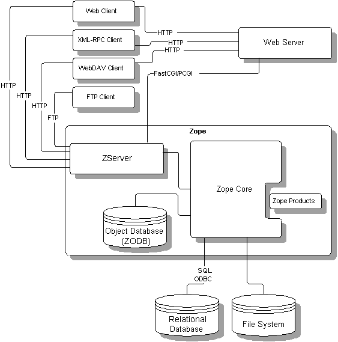

##############################
Zope Concepts and Architecture
##############################

.. include:: includes/zope2_notice.rst

Fundamental Zope Concepts
=========================

The Zope framework has several fundamental underlying concepts,
each of which should be understood in order to make the most of your Zope
experience.

Zope Is a Framework
-------------------

Zope relieves the developer of most of the onerous details of
Web application development, such as data persistence, data
integrity, and access control, allowing one to focus instead on the
problem at hand.  It allows you to utilize the services it
provides to build web applications more quickly than other
languages or frameworks, and to write web
application logic in the `Python <https://www.python.org/>`_
language.  Zope also comes with one solution that allow you 
to "template" text, XML, and HTML: *Zope Page Templates* (ZPT).

Object Orientation
------------------

Unlike common, file-based web template systems, such as ASP or
PHP, Zope is a highly "object-oriented" web development
platform.  Object orientation is a concept that is shared
between many different programming languages, including 
Python.  The concept of
object orientation may take a little "getting-used-to" if you're
an old hand at procedural languages used for
web scripting, such as Perl or PHP.  However, you will easily grasp its 
main concepts by reading the `Object Orientation <ObjectOrientation.html>`_
chapter, and by trying the hands-on examples in this book.

Object Publishing
------------------

The technology that would become Zope was founded on the
realization that the Web is fundamentally object-oriented. A URL
to a Web resource is really just a path to an object in a set of
containers, and the HTTP protocol provides a way to send
messages to that object and to request a response.

Zope's object structure is hierarchical, which means that a
typical Zope site is composed of objects that contain other
objects (which may contain other objects, ad infinitum).  URLs
map naturally to objects in the hierarchical Zope environment
based on their names. For example, the URL
"/Marketing/index.html" could be used to access the Document
object named "index.html" located in the Folder object named
"Marketing".

Zope's seminal duty is to *publish* the objects you create.  The
way it does this is conceptually straightforward:

1. Your web browser sends a request to the Zope server.  The
   request specifies a URL in the form
   'protocol://host:port/path?querystring"',
   e.g., 'http://www.example.org:8080/Resources?batch_start=100'.

2. Zope separates the URL into its component "host", "port" "path"
   and "query string" portions ('http://www.example.org', '8080',
   '/Resources' and '?batch_start=100', respectively).

3. Zope locates the object in its object database corresponding
   to the "path" ('/Resources').

4. Zope "executes" the object using the "query string" as a source
   of parameters that can modify the behavior of the object.  This
   means that the object may behave differently depending on the
   values passed in the query string.

5. If the act of executing the object returns a value, the value
   is sent back to your browser.  Typically a given Zope object
   returns HTML, file data, or image data.

6. The data is interpreted by the browser and shown to you.

Mapping URLs to objects isn't a new idea.  Web servers like Apache
and Microsoft's IIS do the same thing: they translate URLs into
files and directories on a file system.  Zope similarly maps URLs
to objects in its object database.

A Zope object's URL is based on its *path*, which is composed of the
'ids' of its containing Folders and the object's 'id', separated
by slash characters.  For example, if you have a Zope "Folder"
object in the root folder called *Bob*, then its path would be
'/Bob'.  If *Bob* is in a sub-folder called *Uncles*, then its URL
would be '/Uncles/Bob'.

There could also be other Folders in the Uncles folder called
*Rick*, *Danny*, and *Louis*.  You would access them through the web
similarly::

  /Uncles/Rick
  /Uncles/Danny 
  /Uncles/Louis

The URL of an object is most simply composed of its 'host',
'port', and 'path'.  For the Zope object with the path '/Bob'
on the Zope server at ``http://localhost:8080/``, the URL would be
``http://localhost:8080/Bob``.  Visting a URL of a Zope object
directly is termed *calling the object through the web*.  This
causes the object to be evaluated and the result of the
evaluation to be returned to your web browser.

For a more detailed explanation of how Zope performs object
publishing, see the `Object Publishing chapter
<https://zope.readthedocs.io/en/latest/zdgbook/ObjectPublishing.html>`_
of the *Zope Developer's Guide*.

Through-The-Web Management
--------------------------

To create and work with Zope objects, you can use your Web browser to access
the *Zope management interface* (ZMI). Basic management and application
configuration tasks can be done completely through the Web using only a
browser. The ZMI provides a familiar, Windows Explorer-like view of the Zope
object system.

Any object in the object hierarchy can be configured. Site managers can work
with their objects by clicking on tabs that represent different "views" of an
object. These views vary depending on the type of object. For example a
"Database Connection" Zope object provides views that let you modify its
connection string or caching parameters. All objects also have a "Security"
view that allows you to manage their individual access control settings.

Zope had a much larger focus on Through-The-Web activities in its beginning.
In recent years the Through-The-Web model has been discouraged for any kind of
development and reduced to configuration tasks.

Security and Safe Delegation
----------------------------

One of the things that sets Zope apart from other application
servers, is that it was designed from the start to be tightly
coupled with not only the Web object model, but also the Web
development model. Today's successful web applications require
the participation of many people across an organization with
different areas of expertise. Zope is specifically designed to
accommodate this model, allowing site managers to safely
delegate control to design experts, database experts, and content
managers.

A successful Web site requires the collaboration of many people
people in an organization: application developers, SQL experts,
content managers, and often even the end users of the
application. On a conventional Web site, maintenance and
security can quickly become problematic: how much control do you
give to the content manager? How does giving the content manager
a user account affect your security? What about that SQL code embedded
in the ASP files he'll be working on -- code that probably
exposes your database login?

Objects in Zope provide a robust set of possible
permissions, richer than that of a conventional file-based system. Permissions
vary by object type, based on the capabilities of that
object, which enables the implementation of fine-grained access
control. For example, you can set access control so that content
managers can use "SQL Method" objects without being able to change them or
even view their source. You can also set restrictions so that a
user can only create certain kinds of objects, for instance,
"Folders" and "Page Templates," but not "SQL Methods" or other
objects.

Zope provides the capability to manage users through the web via
*User Folders*, which are special folders that contain user
information. Several Zope add-ons are available that provide
extended types of User Folders that get their user data from
external sources, such as relational databases or LDAP
directories.  The ability to add new User Folders can be
delegated to users within a sub-folder, essentially allowing you
to delegate the creation and user management of subsections of
your website to semi-trusted users, without having to worry about those
users changing the objects "above" their own folder.

Native Object Persistence and Transactions
------------------------------------------

By default, Zope objects are stored in a high-performance, transactional
object database known as the *Zope Object Database* (ZODB). Each
web request is treated as a separate transaction by the ZODB. 
If an error occurs in your application during a
request, any changes made during the request will be
automatically rolled back. The ZODB also provides
multi-level undo, allowing a site manager to "undo" changes to
the site with the click of a button.  The Zope framework makes
all of the details of persistence and transactions totally
transparent to the application developer.  Relational databases,
when used with Zope, can also play in Zope's transactional
framework.

Acquisition
-----------

One more prominent aspect of Zope is *acquisition*, whose core concepts are
simply that:

* Zope objects are contained inside other objects (such as Folders).

* Objects can "acquire" attributes and behavior from their containers.

The concept of acquisition works with all Zope objects and
provides an extremely powerful way to centralize common
resources. A commonly-used SQL query or snippet of HTML, for
example, can be defined in one Folder, and objects in sub-folders
can use it through acquisition. If the query needs
to be changed, you can change it in one place without worrying
about all of the sub-objects that use the same query.

If you are familiar with *Cascading Style Sheets* (CSS), you already
know how an element in an HTML document can inherit cascading properties
from its parent or ancestor elements. Containment acquisition
works in the same fashion: if a document X is contained in folder Y,
document X can access the attributes of folder Y through acquisition.
Note that some advanced aspects of acquisition may break
this analogy; these are discussed in the 
`Advanced Zope Scripting <ScriptingZope.html>`_ chapter.

Acquisition is explained in further detail in the chapter on
`Acquisition <Acquisition.html>`_ .

Zope Is Extensible
------------------

Zope is highly extensible, and component developers can create new
types of Zope objects by writing new Zope add-on in Python. The Zope
software provides a number of useful, built-in components to aid
extension authors in development, including a robust set of framework classes
that take care of most of the details of implementing new Zope
objects.

A number of Zope add-ons are available that provide
features like drop-in web discussion topics, desktop data
publishing, XML tools, and e-commerce integration. Many of these
add-ons have been written by highly active members of the
Zope community, and most are also open source.

Fundamental Zope Components
===========================

Zope consists of several different components that work together
to help you build web applications.  Zope's fundamental components
are shown in the following figure and explained below:

ZServer
-------

Zope comes with a built-in web server that serves content to you and your
users.  This web server also serves Zope content via WebDAV and
XML-RPC (a remote procedure call facility).

Web Server
----------

Of course, you may already have an existing web server, such as Apache or
Microsoft IIS, and you may not want to use Zope's web server.  Zope works
with these servers also, and any other web server that supports the
Common Gateway Interface (CGI).  In production environments, it can be
advantageous to run a server like Apache or Squid "in front of" Zope in
order to help sanitize incoming requests, augment its capabilities (e.g.,
terminate HTTPS connections), and cache Zope-provided content.

Zope Core
---------

This is the engine that coordinates Zope activity, driving its management
interface and object database.

Object Database
---------------

When you work with Zope, you are usually working with objects that are
stored in the ZODB.

Relational database
-------------------

You don't have to store your information in Zope's object database if you
don't want to.  Zope also works with other relational databases,
including *Oracle*, *PostgreSQL*, *Sybase*, and *MySQL*.

File System
-----------

Zope can, of course, work with documents and other files stored on your
server's file system.

Products
--------

Zope also allows site managers to add new, pre-built object types to Zope
by installing add-ons on the Zope server file system. These are referred to
as Products or Add-ons. Technically they are normal Python packages.

