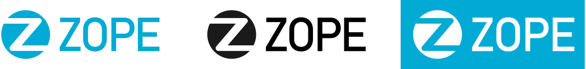

# The Zope Logo

Traditionally the Zope logo is a graphical combination of two parts
1. the Z-symbol, a letter "Z" placed on a circle
2. and the word "ZOPE" written in capital letters

The brand is usually communicated with the full logo. For special use cases, such as favicons, the Z-symbol can be used seperately.

The Zope logo with its color variants (blue, black, inverted) is placed as SVG files in the source folder:
`/Zope/src/zmi/styles/resources/logo/`

## Construction of the Z-symbol

1. starting with a square in a circle,
2. splitting the square nodes on the right botton
3. and the left top
4. archieving a symmetrical Z line, 
5. thickening the Z line and setting rounded corners, 
6. transforming line to outline, 
7. enhancing the vertical width and and extrude horizontals
8. finally cutting the circle by division 

## Logo Typography
The word "Zope" is rendered in capital letters using the technical standard font "Bahnschrift" in capital letters. In contrast to the usual use of the font its letter spacing is slightly reduced so that the letters are standing closer together. 

1. applying Bahnschrift Regular, https://en.wikipedia.org/wiki/DIN_1451 
2. narrowing the letter spacing by -6%
3. placing the type left to symbol about 3x the type line width
4. optical correction of inverted type: letter spacing +2%

## Logo Color 
The primary color is a vivid blue. If no color is avaliable (e.g. laser printer) or a coloured background (e.g. photo) could  compete visually with the standard blue, two further color variants are available:

1. RGB #00AAD4, CMYK: C100 M20 Y0 K0
2. black variant for b/w laser printer
3. white/inverted variant for dark/colorful backgrounds
