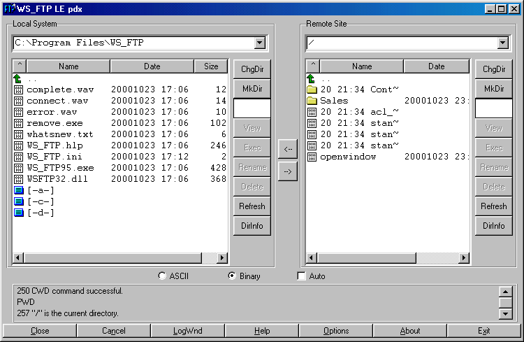
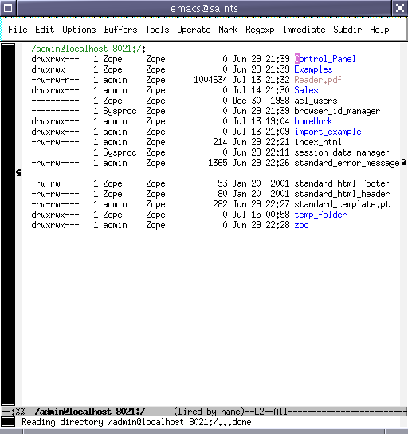

Managing Zope Objects Using External Tools
##########################################

So far, you've been working with Zope objects in your web browser via the Zope
Management Interface. This chapter details how to use common non-browser-based
common to access and modify your Zope content.

Editing Zope content and code in the Zope Management Interface is sometimes
painful, especially when dealing with Python code, DTML, ZPT, or even just
HTML. The standard TEXTAREA text manipulation widget provided by most browsers
has an extremely limited feature set: no syntax highlighting, no auto-indent, no
key re-bindings, no WYSIWYG HTML editing, and sometimes not even a search and
replace function!

In short, people want to use their own tools, or at least more feature-rich
tools, to work with Zope content.

It is possible under most operating systems to use the text "cut and paste"
facility (Ctrl-C, Ctrl-V under Windows, for example) to move text between
traditional text/HTML editors and your browser, copying data back and forth
between the Zope Management interface and your other tools. This is, at best,
cumbersome.

Luckily, Zope provides features that may allow you to interface Zope directly
with your existing tools. This chapter describes these features, as well as the
caveats for working with them.

General Caveats
===============

Most external tools expect to deal with "file-like" content. Zope objects are
not really files in the strict sense of the word so there are caveats to using
external tools with Zope:

- Zope data is not stored in files in the filesystem. Thus, tools which only
  work on files will not work with Zope without providing a "bridge" between
  the tool and Zope's file-like representation of its object database. This
  "bridge" is typically accomplished using Zope's FTP or WebDAV features.

- Zope doesn't enforce any file extension rules when creating objects. Some
  tools don't deal well with objects that don't have file extensions in their
  names (notably Macromedia Dreamweaver). To avoid this issue, you may name
  your objects with file extensions according to their type (e.g. name all of
  your ZPT objects with an `.html` file extension), or use a tool that
  understands extension-less "files". However, this approach has numerous
  drawbacks.

- Creating new objects can sometimes be problematic. Because Zope doesn't have
  a default object-type-to-file-extension policy, new content will often be
  created as the wrong "kind" of object. For example, if you upload an HTML
  file "foo.html" via FTP to a place where "foo.html" did not previously exist,
  it will be created (by default) as a DTML Document object, whereas you may
  want it to be created as a Zope Page Template. Zope provides a facility to
  specify the object type created on a per-folder and per-request basis
  (PUT_factory) that is detailed in this chapter.

- External tools don't know about Zope object properties. If you modify an
  object in an external tool, it may forget its property list.

- Some external tools have semantics that can drive Zope crazy. For instance,
  some like to create backup files with an id that is invalid for Zope. Also,
  some tools will do a move-then-copy when saving, which creates a new Zope
  object that is divorced from the history of the original object.

- There is nowhere to send meaningful error messages. These integration
  features expect a finite set of errors defined by the protocol. Thus, the
  actual problem reported by Zope, such as a syntax error in a page template,
  cannot be displayed to the user.

- The interactions between the tools and Zope can vary widely. On the client
  side, different versions of software have different bugs and features. For
  instance, using FTP under Emacs will sometimes work by default, but sometimes
  it needs to be configured. Also, Microsoft has many different implementations
  of DAV in Windows and Office, each with changes that make life difficult.

- Finally, the semantics of Zope can interfere with the experience. The same
  file on your hard drive, when copied into www.zope.org and your local copy of
  Zope, will have different results. In the case of the CMF, Zope will actually
  alter what you saved (to add metadata).

These caveats aside, you may use traditional file manipulation tools to manage
most kinds of Zope objects.

FTP and WebDAV
==============

Most Zope "file-like" objects like DTML Methods, DTML Documents, Zope Page
Templates, Script (Python) objects and others can be edited with FTP and
WebDAV. Many HTML and text editors support these protocols for editing
documents on remote servers. Each of these protocols has advantages and
disadvantages:

- FTP

  FTP is the File Transfer Protocol. FTP is used to transfer files from one
  computer to another. Many text editors and HTML editors support FTP.

  Some examples of editors and applications that support FTP are Homesite,
  KDE suite of applications (Kate, Quanta, Kwrite, Konqueror), Bluefish, and
  Dreamweaver.

- WebDAV

  `WebDAV <http://www.webdav.org/>`_ is a new Internet protocol based on the
  Web's underlying protocol, HTTP. DAV stands for Distributed Authoring and
  Versioning. Because DAV is new, it may not be supported by as many text and
  HTML editors as FTP.

Using FTP to Manage Zope Content
================================

There are many popular FTP clients, and many web browsers like Netscape and
Microsoft Internet Explorer come with FTP clients. Many text and HTML editors
also directly support FTP. You can make use of these clients to manipulate Zope
objects via FTP.

Determining Your Zope's FTP Port
++++++++++++++++++++++++++++++++

In the chapter entitled "Using the Zope Management Interface", you determined
the HTTP port of your Zope system by looking at Zope's start-up output. You can
find your Zope's FTP port by following the same process::

  ------
  2000-08-07T23:00:53 INFO(0) ZServer Medusa (V1.18) started at Mon Aug  7 
  16:00:53 2000
  Hostname: peanut
  Port:8080

  ------
  2000-08-07T23:00:53 INFO(0) ZServer FTP server started at Mon Aug  7   16:00:53 2000
  Authorizer:None
  Hostname: peanut
  Port: 8021
  ------
  2000-08-07T23:00:53 INFO(0) ZServer Monitor Server (V1.9) started on port 8099  

The startup log says that the Zope FTP server is listening to port 8021 on the
machine named *peanut*>. If Zope doesn't report an "FTP server started", it
likely means that you need to turn Zope's FTP server on by editing the
necessary incantation in your INSTANCE_HOME/etc/zope.conf as detailed in the
chapter entitled `Installing and Starting Zope <InstallingZope.stx>`_.

Transferring Files with WS_FTP
++++++++++++++++++++++++++++++

*WS_FTP* is a popular FTP client for Windows that you can use to transfer
documents and files between Zope and your local computer. WS_FTP can be
downloaded from the `Ipswitch Home Page <http://www.ipswitch.com/>`_.

Too transfer objects between your Zope server and local computer:

- start WS_FTP and enter the Zope IP address or machine name and port
  information.

- Click the "Connect" button.

- Enter your management username and password for the Zope management
  interface.

If you type in your username and password correctly, WS_FTP shows you what your
Zope site looks like through FTP. There are folders and documents that
correspond exactly to what your root Zope folder looks like through the web, as
shown in the figure below.

  Viewing the Zope object hierarchy through FTP

Transferring files to and from Zope is straightforward when using WS_FTP. On
the left-hand side of the WS_FTP window is a file selection box that represents
files on your local machine.

The file selection box on the right-hand side of the WS_FTP window represents
objects in your Zope system. Transferring files from your computer to Zope or
back again is a matter of selecting the file you want to transfer and clicking
either the left arrow (download) or the right arrow (upload).

You may transfer Zope objects to your local computer as files using WS_FTP. You
may then edit them and upload them to Zope again when you're finished.

Transferring files with KDE's Konqueror
+++++++++++++++++++++++++++++++++++++++

KDE is one of the many popular window manager for Unix. KDE comes with many
applications that is FTP enabled. One such application is Konqueror. Konqueror
is a file manager, and also works as a browser.

To use Konqueror to transfer files to your zope site:

- enter ftp://username@your.server.com:port

- Enter your username and password when prompted.

Once the correct password is presented, you can now transfer files to and from
your zope site.

With Konqueror, you can split the Konqueror view, and make it to mimic WS_FTP,
or Midnight Commander (a popular menu based file manager), as shown in the
figure below.

.. figure:: Figures/konq.png

  Viewing the Zope object hierarchy with Konqueror

We can also edit, create or delete some known Zope objects like folder or ZPT.
For instance, to edit a file-like object, right click > Open With > Choose
Application > Kate. You can start editing away. Kate will do the necessary when
you save your edits.

Transferring files with MS Internet Explorer 6+
+++++++++++++++++++++++++++++++++++++++++++++++

MS Internet Explorer version 6 and above can also do FTP. To use MS Internet
Explorer to move files between your desktop and Zope:

- enter ftp://your.server.com:port

- click "File" > "Login as".

- Enter your username and password when prompted.

You can then create new Folders and transfer files between Zope and your
desktop, as shown in the figure below.

.. figure:: Figures/ie.png

  Viewing the Zope object hierarchy with IE

Remote Editing with FTP/DAV-Aware Editors
+++++++++++++++++++++++++++++++++++++++++

Editing Zope Objects with Emacs FTP Modes
~~~~~~~~~~~~~~~~~~~~~~~~~~~~~~~~~~~~~~~~~

Emacs is a very popular text editor. Emacs comes in two major "flavors", GNU
Emacs and XEmacs. Both of these flavors of Emacs can work directly over FTP to
manipulate Zope documents and other textual content.

Emacs will let you treat any remote FTP system like any other local filesystem,
making remote management of Zope content a fairly straightforward matter. More
importantly, you need not leave Emacs in order to edit content that lives
inside your Zope.

To log into Zope, run Emacs. The file you visit to open an FTP connection
depends on which text editor you are running: XEmacs or Emacs:

Xemacs
  To visit a remote directory in XEmacs, press Ctrl-X D and enter a directory
  specification in the form: `/user@server#port:/` This will open a "dired"
  window to the / folder of the FTP server running on *server* and listening on
  port *port*.

Emacs
  To visit a remote directory in Emacs, press Ctrl-X D and enter a directory
  specification in the form: `/user@server port:/` The literal space is
  inserted by holding down the Control key and the Q key, and then pressing the
  space "C-Q".

For the typical Zope installation with XEmacs, the filename to open up an FTP
session with Zope is */user@localhost#8021:/*.

Emacs will ask you for a password before displaying the directory contents. The
directory contents of the root folder will look a little like the picture
below:

  Viewing the Zope Root Folder via ange-ftp

You can visit any of these "files" (which are really Zope objects) by selecting
them in the usual Emacs way: enter to select, modify the file, Ctrl-X S to
save, etc. You can even create new "files" by visiting a file via "Ctrl-X
Ctrl-F". New files will be created as DTML Document objects unless you have a
PUT_factory (described below) installed to specify a different kind of initial
object.

The ftp program that ships with Microsoft Windows is incompatible with NTEmacs
(the Windows NT version of GNU Emacs). To edit Zope objects via "ange-ftp"
under NTEmacs, it requires that you have a special FTP program. This program
ships with "Cygwin", a UNIX implementation for Windows. To use NTEmacs download
and install `Cygwin <http://www.cygwin.org>`_ and add the following to your
`.emacs` configuration file::

  (setq ange-ftp-ftp-program-name "/cygwin/bin/ftp.exe")
  (setq ange-ftp-try-passive-mode t)
  (setq ange-ftp-ftp-program-args '("-i" "-n" "-g" "-v" "--prompt" ""))

Caveats With FTP
~~~~~~~~~~~~~~~~

In addition to the general caveats listed above, using FTP with Zope has some
unique caveats:

- You need to be aware of passive mode for connecting to Zope.

- The "move-then-copy" problem is most apparent when using Emacs' ange-ftp.

Editing Zope objects with KDE Desktop
~~~~~~~~~~~~~~~~~~~~~~~~~~~~~~~~~~~~~

KDE comes with many applications that is FTP aware. For example, Kate, Kwrite,
Quanta, Konqueror, and many more.

To start editing objects with Kate:

- Click "File" > "Open".

- Enter the location "ftp://user@server:port/"

- Browse and select the zope object you want to edit.

Once selected, you can edit to your heart's content, and click "File" > "Save"
when done. Kate will save your edit to your zope server.

.. figure:: Figures/kateftp.png

  Viewing the Zope Root Folder via Kate/KDE desktop

With KDE, you can also mount zope onto your dialog box. To do that:

- click "File" > "Open".

- Right click on the listed locations in the "Open" dialog box

- Click "Add Entry".

- Fill in "Zope ftp" or any other description in the description field.

- Enter the URL "ftp://user@server:port/" in the location field.

- Select your icon.

Now, you can edit zope objects in a single click.

.. figure:: Figures/kdeopen.png

  Zope root exposed to KDE desktop

Editing Zope Objects with WebDAV
~~~~~~~~~~~~~~~~~~~~~~~~~~~~~~~~

WebDAV is an extension to the HTTP protocol that provides features that allow
users to concurrently author and edit content on websites. WebDAV offers
features like locking, revision control, and the tagging of objects with
properties. Because WebDAV's goals of through the web editing match some of the
goals of Zope, Zope has supported the WebDAV protocol for a fairly long time.

WebDAV is a newer Internet protocol compared to HTTP or FTP, so there are fewer
clients that support it. There is, however, growing momentum behind the WebDAV
movement and more clients are being developed rapidly.

The WebDAV protocol is evolving quickly, and new features are being added all
the time. You can use any WebDAV client to edit your Zope objects by simply
pointing the client at your object's URL and editing it. For most clients,
however, this will cause them to try to edit the *result* of rendering the
document, not the *source*>. For DTML or ZPT objects, this can be a problem.

Until clients catch up to the latest WebDAV standard and understand the
difference between the source of a document and its result, Zope offers a
special HTTP server you can enable. To enable Zope's WebDAV source server,
enter the following in zope.conf::

  <webdav-source-server>
    # valid keys are "address" and "force-connection-close"
    address 8022
    force-connection-close off
  </webdav-source-server>

This server listens on a different port than your normal HTTP server and
returns different, special source content for WebDAV requests that come in on
that port.

For more information about starting Zope with a WebDAV source port turned on,
see the chapter entitled `Installing and Starting Zope <InstallingZope.stx>`_.
The "standard" WebDAV source port number (according to IANA) is 9800.

Unfortunately, this entire discussion of source vs. rendered requests is too
esoteric for most users, who will try the regular port. Instead of breaking, it
will work in very unexpected ways, leading to confusion. Until DAV clients
support the standard's provision for discovering the source URL, this
distinction will have to be confronted.

Note
----

Zope has optional support for returning the source version of a resource on the
normal HTTP port. It does this by inspecting the user agent header of the HTTP
request. If the user agent matches a string you have configured into your
server settings, the source is returned.

This is quite useful, as there are few cases in which authoring tools such as
cadaver or Dreamweaver will want the rendered version. For more information on
this optional support, read the section "Environment Variables That Affect Zope
At Runtime" in `Installing and Starting Zope <InstallingZope.stx>`_.

Editing Zope objects with cadaver
~~~~~~~~~~~~~~~~~~~~~~~~~~~~~~~~~

One program that supports WebDAV is a command-line tool named `cadaver`. It is
available for most UNIX systems (and Cygwin under Windows) from `WebDAV.org
<http://www.webdav.org/cadaver/>`_.

It is typically invoked from a command-line using the command `cadaver` against
Zope's WebDAV "source port"::

  $ cadaver
  dav:!> open http://saints.homeunix.com:9800/
  Looking up hostname... Connecting to server... connected.
  Connecting to server... connected.
  dav:/> ls
  Listing collection `/': (reconnecting...done) succeeded.
  Coll:  Control_Panel                           0  Jun  14:03
  Coll:  ZopeBook                                0  Jul  22:57
  Coll:  temp_folder                             0  Jul  19:47
  Coll:  tutorial                                0  Jun  00:42
  acl_users                               0  Dec   2009
  browser_id_manager                      0  Jun  14:01
  index_html                             93  Jul  01:01
  session_data_manager                    0  Jun  14:01
  standard_error_message               1365  Jan   2009
  dav:/>

Cadaver allows you to invoke an editor against files while inside the
command-line facility::

  dav:/> edit index_html
  Connecting to server... connected.
  Locking `index_html': Authentication required for Zope on server `saints.homeunix.com':
  Username: admin
  Password:
  Retrying: succeeded.
  Downloading `/index_html' to /tmp/cadaver-edit-001320
  Progress: [=============================>] 100.0% of 93 bytes succeeded.
  Running editor: `vi /tmp/cadaver-edit-001320'...

In this case, the `index_html` object was pulled up for editing inside of the
`vi` text editor. You can specify your editor of choice on most UNIX-like
systems by changing the EDITOR environment variable.

You can also use cadaver to transfer files between your local directory and
remote Zope, as described above for WS_FTP. For more advanced synchronization
of data, the `sitecopy` program can inspect your local and remote data and only
transfer the changes, using FTP or DAV.

Editing Zope objects with KDE applications
~~~~~~~~~~~~~~~~~~~~~~~~~~~~~~~~~~~~~~~~~~

KDE applications are WebDAV aware. Therefore, we can actually edit Zope objects
from any of the KDE applications, such as konqueror, quanta, kate, et cetera.

Using konqueror:

- enter::

    webdav://your.server:port/ in the konqueror location.

- enter the username and password when prompted.

- start editing when konqueror presents the Zope workspace.

.. figure:: Figures/webdavkonq.png

  Viewing the Zope object hierarchy with konquerorWebDAV

Using Kate:

- Open Kate

- Click File > Open

- Enter::

    webdav://your.server:port/

  in "Open File dialog" "Location"

- Browse for your file or start editing.

.. figure:: Figures/webdavkate.png

  Kate Open File dialog box WebDAV

Other Integration Facilities
============================

This chapter focused on FTP and DAV. These are the most popular and mature
approaches for integration. However, other choices are available.

For instance, Zope has long supported the use of HTTP PUT, originally
implemented by Netscape as "Netscape Publishing". This allows Netscape
Composer, Mozilla Composer, and Amaya to edit and create new pages, along with
associated elements such as images and stylesheets.
