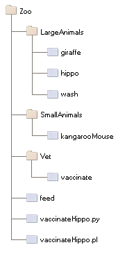
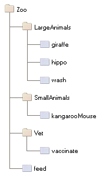

Advanced Zope Scripting
=======================

In the chapter entitled "Basic Zope Scripting", you have seen
how to manage Zope objects programmatically.  In this chapter,
we will explore this topic some more.  Subjects discussed
include additional scripting objects, script security, and
calling script objects from presentation objects like Page
Templates.  As we have mentioned before,
separation of logic and presentation is a key factor in
implementing maintainable web applications.

What is *logic* and how does it differ from presentation? Logic
provides those actions which change objects, send messages, test
conditions and respond to events, whereas presentation formats and
displays information and reports. Typically you will use
Page Templates to handle presentation, and Zope scripting to
handle logic.

Warning
-------

Zope *Script* objects are objects that encapsulate a small chunk of code
written in a programming language. They first appeared in Zope 2.3, and have
been the preferred way to write programming logic in Zope for many years. Today
it is discouraged to use Scripts for any but the most minimal logic. If you
want to create more than trivial logic, you should approach this by creating a
Python package and write your logic *on the file system*.

This book does not cover this development approach in its details. This
chapter is still useful to read, as it allows you to get an understanding on
some of the more advanced techniques and features of Zope.

Calling Scripts
---------------

In the "Basic Zope Scripting" chapter, you learned how to call scripts from the
web and, conversely, how to call Page Templates from Python-based Scripts. In
fact scripts can call scripts which call other scripts, and so on.

Calling Scripts from Other Objects
~~~~~~~~~~~~~~~~~~~~~~~~~~~~~~~~~~

You can call scripts from other objects, whether they are
Page Templates or Scripts (Python). The
semantics of each language differ slightly, but the same rules
of acquisition apply. You do not necessarily have to know what
language is used in the script you are calling; you only need to
pass it any parameters that it requires, if any.

Calling Scripts from Page Templates 
%%%%%%%%%%%%%%%%%%%%%%%%%%%%%%%%%%%

Calling scripts from Page Templates is much like calling them
by URL or from Python. Just use standard TALES path
expressions as described in the chapter entitled "Using Zope
Page Templates.":ZPT.html>`_  For example::

  

    Output of feed()
  

The inserted value will be HTML-quoted. You can disable
quoting by using the *structure* keyword, as described in
the chapter entitled `Advanced Page Templates <AdvZPT.html>`_

To call a script without inserting a value in the
page, you can use *define* and ignore the variable assigned::

  

In a page template, *context* refers to the current context.  It
behaves much like the *context* variable in a Python-based
Script.  In other words, *hippo* and *feed* will both be
looked up by acquisition.

If the script you call requires arguments, you must use a 
TALES python expression in your template, like so::

  

    Output of feed(food='spam')
  

Just as in Path Expressions, the 'context' variable refers to the
acquisition context the Page Template is called in.  

The python expression above is exactly like a line of
code you might write in a Script (Python).

One difference is the notation used for attribute access --
Script (Python) uses the standard Python period notation,
whereas in a TALES path expression, a forward slash is
used.

For further reading on using Scripts in Page Templates, refer
to the chapter entitled `Advanced Page Templates`_.

Calling scripts from Python
%%%%%%%%%%%%%%%%%%%%%%%%%%%

Calling scripts from other scripts works similar to calling
scripts from page templates, except that you must
*always* use explicit calling (by using
parentheses). For example, here is how you might call
the *updateInfo* script from Python::

  new_color='brown'
  context.updateInfo(color=new_color, 
                     pattern="spotted")

Note the use of the *context* variable to tell Zope to find
updateInfo by acquisition. 

Zope locates the scripts you call by using acquisition the
same way it does when calling scripts from the web.  Returning
to our hippo feeding example of the last section, let's see
how to vaccinate a hippo from Python. The figure
below shows a slightly updated object hierarchy that contains
a script named *vaccinateHippo.py*. 

   A collection of objects and scripts

Here is how you can call the *vaccinate* script on the
*hippo* obect from the *vaccinateHippo.py* script::

  context.Vet.LargeAnimals.hippo.vaccinate()

In other words, you simply access the object by using the same
acquisition path as you would use if you called it from the
web. The result is the same as if you visited the URL
*Zoo/Vet/LargeAnimals/hippo/vaccinate*. Note that in this Python
example, we do not bother to specify *Zoo* before *Vet*. We can
leave *Zoo* out because all of the objects involved, including
the script, are in the Zoo folder, so it is implicitly part
of the acquisition chain.

Calling Scripts: Summary and Comparison
%%%%%%%%%%%%%%%%%%%%%%%%%%%%%%%%%%%%%%%

Let's recap the ways to call a hypothetical *updateInfo* script on a *foo*
object, with argument passing: from your web browser, from Python and from Page
Templates.

- by URL::

   http://my-zope-server.com:8080/foo/updateInfo?amount=lots

- from a Script (Python)::

   context.foo.updateInfo(amount="lots")

- from a Page Template::

   

- from a Page Template, with arguments::

   

Regardless of the language used, this is a very common idiom
to find an object, be it a script or any other kind of object:
you ask the context for it, and if it exists in this context
or can be acquired from it, it will be used.

Zope will throw a *KeyError* exception if the script you are
calling cannot be acquired. If you are not certain that a
given script exists in the current context, or if you want to
compute the script name at run-time, you can use this Python
idiom::

  updateInfo = getattr(context, "updateInfo", None)
  if updateInfo is not None:
      updateInfo(color="brown", pattern="spotted")
  else:
      # complain about missing script
      return "error: updateInfo() not found"

The *getattr* function is a Python built-in. The first
argument specifies an object, the second an attribute
name.  The *getattr* function will return the named
attribute, or the third argument if the attribute cannot be
found. So in the next statement we just have to test whether
the *updateInfo* variable is None, and if not, we know we can
call it.

Advanced Acquisition 
--------------------

In the chapter entitled "Acquisition":Acquisition.html>`_ , we
introduced acquisition by containment, which we have been using
throughout this chapter. In acquisition by containment, Zope
looks for an object by going back up the containment hierarchy
until it finds an object with the right id. In Chapter 7 we also
mentioned *context acquisition*, and warned that it is a tricky
subject capable of causing your brain to explode. If you are
ready for exploding brains, read on.

The most important thing for you to understand in this chapter is
that context acquisition exists and can interfere with whatever
you are doing. Today it is seen as a fragile and complex topic and
rarely ever used in practice.

Recall our Zoo example introduced earlier in this chapter.

   Zope Zoo Example hierarchy

We have seen how Zope uses URL traversal and acquisition to find
objects  in  higher containers.  More  complex arrangements  are
possible. Suppose you want to call the *vaccinate* script on the
*hippo*  object. What  URL can  you use?  If you  visit  the URL
*Zoo/LargeAnimals/hippo/vaccinate* Zope will not be able to find
the  *vaccinate* script  since it  isn't in  any of  the *hippo*
object's containers.

The solution is to give the path to the script as part of the
URL. Zope allows you to combine two or more URLs into one in
order to provide more acquisition context! By using acquisition,
Zope will find the script as it backtracks along the URL. The
URL to vaccinate the hippo is
*Zoo/Vet/LargeAnimals/hippo/vaccinate*. Likewise, if you want to
call the *vaccinate* script on the *kargarooMouse* object you
should use the URL
*Zoo/Vet/SmallAnimals/kargarooMouse/vaccinate*.

Let's follow along as Zope traverses the URL
*Zoo/Vet/LargeAnimals/hippo/vaccinate*. Zope starts in the root
folder and looks for an object named *Zoo*. It moves to the
*Zoo* folder and looks for an object named *Vet*. It moves to
the *Vet* folder and looks for an object named
*LargeAnimals*. The *Vet* folder does not contain an object with
that name, but it can acquire the *LargeAnimals* folder from its
container, *Zoo* folder. So it moves to the *LargeAnimals*
folder and looks for an object named *hippo*.  It then moves to
the *hippo* object and looks for an object named
*vaccinate*. Since the *hippo* object does not contain a
*vaccinate* object and neither do any of its containers, Zope
backtracks along the URL path trying to find a *vaccinate*
object. First it backs up to the *LargeAnimals* folder where
*vaccinate* still cannot be found. Then it backs up to the *Vet*
folder.  Here it finds a *vaccinate* script in the *Vet*
folder. Since Zope has now come to the end of the URL, it calls
the *vaccinate* script in the context of the *hippo* object.

Note that we could also have organized the URL a bit
differently. *Zoo/LargeAnimals/Vet/hippo/vaccinate* would also
work. The difference is the order in which the context elements
are searched. In this example, we only need to get *vaccinate*
from *Vet*, so all that matters is that *Vet* appears in the URL
after *Zoo* and before *hippo*.

When Zope looks for a sub-object during URL traversal, it first
looks for the sub-object in the current object. If it cannot
find it in the current object it looks in the current object's
containers. If it still cannot find the sub-object, it backs up
along the URL path and searches again. It continues this process
until it either finds the object or raises an error if it cannot
be found. If several context folders are used in the URL, they
will be searched in order from *left to right*.

Context acquisition can be a very useful mechanism, and it
allows you to be quite expressive when you compose URLs. The
path you tell Zope to take on its way to an object will
determine how it uses acquisition to look up the object's
scripts.

Note that not all scripts will behave differently depending on
the traversed URL. For example, you might want your script to
acquire names only from its parent containers and not from the
URL context. To do so, simply use the *container* variable
instead of the *context* variable in the script, as described
above in the section "Using Python-based Scripts."

Context Acquisition Gotchas
~~~~~~~~~~~~~~~~~~~~~~~~~~~

Containment before context
%%%%%%%%%%%%%%%%%%%%%%%%%%

It is important to realize that context acquisition
*supplements* container acquisition. It does not *override*
container acquisition.

One at a time
%%%%%%%%%%%%%

Another point that often confuses new users is that each element
of a path "sticks" for the duration of the traversal, once it is
found. Think of it this way: objects are looked up one at a
time, and once an object is found, it will not be looked up
again.  For example, imagine this folder structure:

.. figure:: Figures/acquisition.png

   Acquisition example folder structure

Now suppose that the *about_penguins* page contains a link to
*Images/penguins.png*. Shouldn't this work? Won't
*/Images/penguins.png* succeed when
*/Content/Images/penguins.png* fails?  The answer is no. We
always traverse from left to right, one item at a time. 
First we find *Content*, then *Images* within it; *penguins.png* 
appears in neither of those, and we haved searched all 
parent containers of every element in the URL, so 
there is nothing more to search in this URL.
Zope stops there and raises an error. Zope never looks in */Images*
because it has already found */Content/Images*.

Readability
%%%%%%%%%%%

Context acquisition can make code more difficult to
understand. A person reading your script can no longer simply
look backwards up one containment hierarchy to see where an
acquired object might be; many more places might be searched,
all over the zope tree folder. And the order in which objects
are searched, though it is consistent, can be confusing.

Fragility
%%%%%%%%%

Over-use of context acquisition can also lead to fragility. In
object-oriented terms, context acquisition can lead to a site
with low cohesion and tight coupling. This is generally regarded
as a bad thing. More specifically, there are many simple actions
by which an unwitting developer could break scripts that rely on
context acquisition. These are more likely to occur than with
container acquisition, because potentially every part of your
site affects every other part, even in parallel folder branches.

For example, if you write a script that calls another script by
a long and torturous path, you are assuming that the folder tree
is not going to change. A maintenance decision to reorganize the
folder hierarchy could require an audit of scripts in *every*
part of the site to determine whether the reorganization will
break anything. 

Recall our Zoo example. There are several ways in which a zope
maintainer could break the feed() script:

Inserting another object with the name of the method
  This is a normal technique for customizing behavior in Zope, but context
  acquisition makes it more likely to happen by accident. Suppose that
  giraffe vaccination is controlled by a regularly scheduled script that
  calls *Zoo/Vet/LargeAnimals/giraffe/feed*. Suppose a content
  administrator doesn't know about this script and adds a DTML page called
  *vaccinate* in the giraffe folder, containing information about
  vaccinating giraffes. This new *vaccinate* object will be acquired before
  *Zoo/Vet/vaccinate*.  Hopefully you will notice the problem before your
  giraffes get sick.

Calling an inappropriate path
  if you visit *Zoo/LargeAnimals/hippo/buildings/visitor_reception/feed*,
  will the reception area be filled with hippo food?  One would hope not.
  This might even be possible for someone who has no permissions on the
  reception object. Such URLs are actually not difficult to construct. For
  example, using relative URLs in standard_html_header can lead to some
  quite long combinations of paths.

Thanks to Toby Dickenson for pointing out these fragility issues
on the zope-dev mailing list.

Passing Parameters to Scripts
-----------------------------

All scripts can be passed parameters. A parameter gives a script
more information about what to do. When you call a script from the
web, Zope will try to find the script's parameters in the web
request and pass them to your script. For example, if you have a
script with parameters *dolphin* and *REQUEST* Zope will
look for *dolphin* in the web request, and will pass the request
itself as the *REQUEST* parameter. In practical terms this means
that it is easy to do form processing in your script. For example,
here is a form::

  <form action="form_action">
    Name of Hippo <input type="text" name="name" /> 
    Age of Hippo <input type="text" name="age" /> 
    <input type="submit" />
  </form>

You can easily process this form with a script named
*form_action* that includes *name* and *age* in its parameter
list::

  ## Script (Python) "form_action"
  ##parameters=name, age
  ##
  "Process form"
  age=int(age)
  message= 'This hippo is called %s and is %d years old' % (name, age)
  if age < 18:
      message += '\n %s is not old enough to drive!' % name
  return message

There is no need to process the form manually to extract values
from it. Form elements are passed as strings, or lists of
strings in the case of checkboxes and multiple-select input.

In addition to form variables, you can specify any request
variables as script parameters. For example, to get access to the
request and response objects just include 'REQUEST' and 'RESPONSE'
in your list of parameters. Request variables are detailed more
fully in `Appendix B: API Reference <AppendixB.html>`_ .

In the Script (Python) given above, there is a subtle problem. You
are probably expecting an integer rather than a string for age,
but all form variables are passed as strings.  You could
manually convert the string to an integer using the Python *int*
built-in::

  age = int(age)

But this manual conversion may be inconvenient. Zope provides a
way for you to specify form input types in the form, rather than
in the processing script. Instead of converting the *age* variable
to an integer in the processing script, you can indicate that it
is an integer in the form itself::

  Age <input type="text" name="age:int" />

The ':int' appended to the form input name tells Zope to
automatically convert the form input to an integer. This
process is called *marshalling*. If the user of
your form types something that cannot be converted to an integer
(such as "22 going on 23") then Zope will raise an exception as
shown in the figure below.

.. figure:: Figures/8-3.png

   Parameter conversion error

It's handy to have Zope catch conversion errors, but you may not
like Zope's error messages. You should avoid using Zope's
converters if you want to provide your own error messages.

Zope can perform many parameter conversions. Here is a list of Zope's
basic parameter converters.

*boolean*
  Converts a variable to true or false. Variables
  that are 0, None, an empty string, or an empty sequence are
  false, all others are true.

*int*
  Converts a variable to an integer.

*long*
  Converts a variable to a long integer.

*float*
  Converts a variable to a floating point number.

*string*
  Converts a variable to a string. Most variables
  are strings already so this converter is seldom used.

*text*
  Converts a variable to a string with normalized line
  breaks.  Different browsers on various platforms encode line
  endings differently, so this script makes sure the line endings are
  consistent, regardless of how they were encoded by the browser.

*list*
  Converts a variable to a Python list.

*tuple*
  Converts a variable to a Python tuple. A tuple is
  like a list, but cannot be modified.

*tokens*
  Converts a string to a list by breaking it on white
  spaces.

*lines*
  Converts a string to a list by breaking it on new
  lines.

*date*
  Converts a string to a *DateTime* object. The formats
  accepted are fairly flexible, for example '10/16/2000',
  '12:01:13 pm'.

*required*
  Raises an exception if the variable is not present.

*ignore_empty*
  Excludes the variable from the request if
  the variable is an empty string.

These converters all work in more or less the same way to coerce
a form variable, which is a string, into another specific
type. You may recognize these converters from the chapter
entitled Using Basic Zope Objects , in which we
discussed properties. These converters are used by Zope's
property facility to convert properties to the right type.

The *list* and *tuple* converters can be used in combination with other
converters.  This allows you to apply additional converters to each
element of the list or tuple.  Consider this form::

  <form action="processTimes"> 

    
I would prefer not to be disturbed at the following
    times:

    <input type="checkbox" name="disturb_times:list:date"
    value="12:00 AM" /> Midnight 

    <input type="checkbox" name="disturb_times:list:date"
    value="01:00 AM" /> 1:00 AM 

    <input type="checkbox" name="disturb_times:list:date"
    value="02:00 AM" /> 2:00 AM 

    <input type="checkbox" name="disturb_times:list:date"
    value="03:00 AM" /> 3:00 AM 

    <input type="checkbox" name="disturb_times:list:date"
    value="04:00 AM" /> 4:00 AM 

    <input type="submit" />
  </form>

By using the *list* and *date* converters together, Zope will
convert each selected time to a date and then combine all selected
dates into a list named *disturb_times*.

A more complex type of form conversion is to convert a series of inputs
into *records.* Records are structures that have attributes. Using
records, you can combine a number of form inputs into one variable with
attributes.  The available record converters are:

*record*
  Converts a variable to a record attribute.

*records*
  Converts a variable to a record attribute in a list of
  records.

*default*
  Provides a default value for a record attribute if the
  variable is empty.

*ignore_empty*
  Skips a record attribute if the variable is empty.

Here are some examples of how these converters are used::

  <form action="processPerson">

    First Name <input type="text" name="person.fname:record" /> 
    Last Name <input type="text" name="person.lname:record" /> 
    Age <input type="text" name="person.age:record:int" /> 

    <input type="submit" />
  </form>

This form will call the *processPerson* script with one
parameter, *person*. The *person* variable will have the attributes
*fname*, *lname* and *age*. Here's an example of how you might
use the *person* variable in your *processPerson* script::

  ## Script (Python) "processPerson"
  ##parameters=person
  ##
  "Process a person record"
  full_name="%s %s" % (person.fname, person.lname)
  if person.age < 21:
      return "Sorry, %s. You are not old enough to adopt an aardvark." % full_name
  return "Thanks, %s. Your aardvark is on its way." % full_name

The *records* converter works like the *record* converter except
that it produces a list of records, rather than just one. Here is
an example form::

  <form action="processPeople">

    
Please, enter information about one or more of your next of
    kin.

    

      First Name <input type="text" name="people.fname:records" />
      Last Name <input type="text" name="people.lname:records" />
    

    

      First Name <input type="text" name="people.fname:records" />
      Last Name <input type="text" name="people.lname:records" />
    

    

      First Name <input type="text" name="people.fname:records" />
      Last Name <input type="text" name="people.lname:records" />
    

    <input type="submit" />
  </form>    

This form will call the *processPeople* script with a variable
called *people* that is a list of records. Each record will have
*fname* and *lname* attributes.  Note the difference between the
*records* converter and the *list:record* converter: the former
would create a list of records, whereas the latter would produce
a single record whose attributes *fname* and *lname* would each
be a list of values.

The order of combined modifiers does not matter; for example,
*int:list* is identical to *list:int*.

Another useful parameter conversion uses form variables to
rewrite the action of the form. This allows you to submit a form
to different scripts depending on how the form is filled
out. This is most useful in the case of a form with multiple
submit buttons. Zope's action converters are:

*action*
  Appends the attribute value to the original form
  action of the form. This is mostly useful for the case in
  which you have multiple submit buttons on one form.  Each
  button can be assigned to a script that gets called when that
  button is clicked to submit the form. A synonym for *action*
  is *method*.

*default_action*
  Appends the attribute value to the
  original action of the form when no other *action* converter
  is used.

Here's an example form that uses action converters::

  <form action="employeeHandlers">

    
Select one or more employees

    <input type="checkbox" name="employees:list" value="Larry" /> Larry 
    <input type="checkbox" name="employees:list" value="Simon" /> Simon 
    <input type="checkbox" name="employees:list" value="Rene" /> Rene 

    <input type="submit" name="fireEmployees:action" value="Fire!" /> 

    <input type="submit" name="promoteEmployees:action" value="Promote!" />

  </form>

We assume a folder 'employeeHandlers' containing two
scripts named 'fireEmployees' and 'promoteEmployees'.  The
form will call either the *fireEmployees* or the
*promoteEmployees* script, depending on which of the two
submit buttons is used.  Notice also how it builds a list
of employees with the *list* converter.  Form converters
can be very useful when designing Zope applications.

Script Security
---------------

All scripts that can be edited through the web are subject to
Zope's standard security policies. The only scripts that are not
subject to these security restrictions are scripts that must be
edited through the filesystem.

The chapter entitled `Users and Security <Security.html>`_ covers
security in more detail. You should consult the *Roles of
Executable Objects* and *Proxy Roles* sections for more
information on how scripts are restricted by Zope security
constraints.

Security Restrictions of Script (Python)
~~~~~~~~~~~~~~~~~~~~~~~~~~~~~~~~~~~~~~~~

Scripts are restricted in order to limit their ability
to do harm. What could be harmful? In general, scripts
keep you from accessing private Zope objects, making harmful
changes to Zope objects, hurting the Zope process itself, and
accessing the server Zope is running on. These restrictions
are implemented through a collection of limits on what your
scripts can do.

Loop limits
  Scripts cannot create infinite loops. If your script
  loops a very large number of times Zope will raise an error. This
  restriction covers all kinds of loops including *for* and *while*
  loops. The reason for this restriction is to limit your ability to
  hang Zope by creating an infinite loop.

Import limits
  Scripts cannot import arbitrary
  packages and modules. You are limited to importing the
  *Products.PythonScripts.standard* utility module, the
  *AccessControl* module, some helper modules
  (*string*, *random*, *math*, *sequence*), and modules
  which have been specifically made available to scripts
  by product authors.  See `Appendix B: API Reference`_
  for more information on these
  modules.

Access limits
  You are restricted by standard Zope
  security policies when accessing objects. In other words
  the user executing the script is checked for
  authorization when accessing objects. As with all
  executable objects, you can modify the effective roles a
  user has when calling a script using *Proxy Roles* (see
  the chapter entitled `Users and Security`_
  for more information). In addition, you cannot access
  objects whose names begin with an underscore, since Zope
  considers these objects to be private. Finally, you can
  define classes in scripts but it is not really practical
  to do so, because you are not allowed to access
  attributes of these classes! Even if you were allowed to
  do so, the restriction against using objects whose names
  begin with an underscore would prevent you from using
  your class's __init__ method.  If you need to define
  classes, use *packages* You may,
  however, define functions in scripts, although it is
  rarely useful or necessary to do so.  In practice, a
  Script in Zope is treated as if it were a single method
  of the object you wish to call it on.

Writing limits
  In general you cannot directly change Zope object
  attributes using scripts. You should call the appropriate
  methods from the Zope API instead.

Despite these limits, a determined user could use large amounts
of CPU time and memory using Python-based Scripts. So malicious
scripts could constitute a kind of denial of service attack by
using lots of resources. These are difficult problems to solve.
You probably should not grant access to scripts to
untrusted people.

Python versus Page Templates
----------------------------

Zope gives you multiple ways to script. For small scripting
tasks the choice of Python-based Scripts or Page Templates
probably doesn't make a big difference.  For larger,
logic-oriented tasks you should use Python-based Scripts or
write packages on the file-system.

For presentation, Python should *not* be used; instead you use ZPT.

Just for the sake of comparison, here is a simple presentational script 
suggested by Gisle Aas in ZPT and Python.

In ZPT::

  

In Python::

  for item in context.objectValues():
      print "%s: %s" % (item.getId(), item)
  print "done"
  return printed

Remote Scripting and Network Services
-------------------------------------

Web servers are used to serve content to software clients; usually
people using web browser software.  The software client can also be
another computer that is using your web server to access some kind of
service.

Because Zope exposes objects and scripts on the web, it can be used to
provide a powerful, well organized, secure web API to other remote
network application clients.

There are two common ways to remotely script Zope.  The first way
is using a simple remote procedure call protocol called
*XML-RPC*.  XML-RPC is used to execute a procedure on a remote
machine and get a result on the local machine.  XML-RPC is designed
to be language neutral, and in this chapter you'll see examples in
Python and Java.

The second common way to remotely script Zope is with any HTTP
client that can be automated with a script.  Many language
libraries come with simple scriptable HTTP clients and there are
many programs that let you you script HTTP from the command line.

Using XML-RPC
~~~~~~~~~~~~~

XML-RPC is a simple remote procedure call mechanism that works
over HTTP and uses XML to encode information. XML-RPC clients
have been implemented for many languages including Python,
Java and JavaScript.

In-depth information on XML-RPC can be found at the "XML-RPC
website":http://www.xmlrpc.com/. 

All Zope scripts that can be called from URLs can be called via
XML-RPC. Basically XML-RPC provides a system to marshal
arguments to scripts that can be called from the web. As you saw
earlier in the chapter Zope provides its own marshaling
controls that you can use from HTTP. XML-RPC and Zope's own
marshaling accomplish much the same thing. The advantage of
XML-RPC marshaling is that it is a reasonably supported
standard that also supports marshaling of return values as well
as argument values.

Here's a fanciful example that shows you how to remotely script
a mass firing of janitors using XML-RPC.

Here's the code in Python::

  import xmlrpclib

  server = xmlrpclib.Server('http://www.zopezoo.org/')
  for employee in server.JanitorialDepartment.personnel():
      server.fireEmployee(employee)

In Java::

  try {
      XmlRpcClient server = new XmlRpcClient("http://www.zopezoo.org/");
      Vector employees = (Vector) server.execute("JanitorialDepartment.personnel");

      int num = employees.size();
      for (int i = 0; i < num; i++) {
          Vector args = new Vector(employees.subList(i, i+1));
          server.execute("fireEmployee", args);
      }

  } catch (XmlRpcException ex) {
      ex.printStackTrace();
  } catch (IOException ioex) {
      ioex.printStackTrace();
  }

Actually the above example will probably not run correctly, since you
will most likely want to protect the *fireEmployee* script. This brings
up the issue of security with XML-RPC. XML-RPC does not have any
security provisions of its own; however, since it runs over HTTP it can
leverage existing HTTP security controls. In fact Zope treats an
XML-RPC request exactly like a normal HTTP request with respect to
security controls. This means that you must provide authentication in
your XML-RPC request for Zope to grant you access to protected
scripts.

Remote Scripting with HTTP
~~~~~~~~~~~~~~~~~~~~~~~~~~

Any HTTP client can be used for remotely scripting Zope.

On Unix systems you have a number of tools at your
disposal for remotely scripting Zope. One simple example
is to use *wget* to call Zope script URLs and use *cron*
to schedule the script calls. For example, suppose you
have a Zope script that feeds the lions and you would like
to call it every morning.  You can use *wget* to call the
script like so::

  $ wget --spider http://www.zopezope.org/Lions/feed

The *spider* option tells *wget* not to save the response as a
file. Suppose that your script is protected and requires
authorization. You can pass your user name and password with *wget* to
access protected scripts::

  $ wget --spider --http-user=ZooKeeper \
      --http-passwd=SecretPhrase \
      http://www.zopezope.org/Lions/feed

Now let's use *cron* to call this command every morning at 8am. Edit
your crontab file with the *crontab* command::

  $ crontab -e

Then add a line to call wget every day at 8 am::

  0 8 * * * wget -nv --spider --http_user=ZooKeeper \
    --http_pass=SecretPhrase http://www.zopezoo.org/Lions/feed

(Beware of the linebreak -- the above should be input as
one line, minus the backslash).

The only difference between using *cron* and calling *wget* manually is
that you should use the *nv* switch when using *cron* since you don't
care about output of the *wget* command.

For our final example let's get really perverse. Since networking is
built into so many different systems, it's easy to find an unlikely
candidate to script Zope. If you had an Internet-enabled toaster you
would probably be able to script Zope with it. Let's take Microsoft
Word as our example Zope client. All that's necessary is to get Word to
agree to tickle a URL.

The easiest way to script Zope with Word is to tell word to open a
document and then type a Zope script URL as the file name as shown in
[8-9].

.. figure:: Figures/8-9.png

   Calling a URL with Microsoft Word

Word will then load the URL and return the results of calling the Zope
script. Despite the fact that Word doesn't let you POST arguments this
way, you can pass GET arguments by entering them as part of the URL.

You can even control this behavior using Word's built-in Visual Basic
scripting. For example, here's a fragment of Visual Basic that tells
Word to open a new document using a Zope script URL::

  Documents.Open FileName:="http://www.zopezoo.org/LionCages/wash?use_soap=1&water_temp=hot" 

You could use Visual Basic to call Zope script URLs in many different
ways.

Zope's URL to script call translation is the key to remote
scripting. Since you can control Zope so easily with simple URLs you
can easy script Zope with almost any network-aware system.

Conclusion
----------

With scripts you can control Zope objects and glue together your
application's logic, data, and presentation. You can
programmatically manage objects in your Zope folder hierarchy by
using the Zope API.
